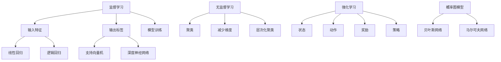

                 

关键词：机器学习，深度学习，神经网络，监督学习，无监督学习，强化学习，Python代码，算法原理，数学模型，实践应用

摘要：本文将深入探讨机器学习的原理与实战，从基础概念到高级算法，再到代码实例，全面解析机器学习的关键技术和应用场景。通过本文的阅读，读者将能够掌握机器学习的基本概念、核心算法，以及如何将算法应用于实际问题中。

## 1. 背景介绍

机器学习（Machine Learning，ML）作为人工智能（Artificial Intelligence，AI）的重要分支，是计算机科学和统计学领域中的一个重要研究方向。它通过算法从数据中学习规律，无需显式编程即可让计算机执行特定任务。近年来，随着计算能力的提升和数据量的爆炸式增长，机器学习在各个领域取得了显著的成果，从图像识别、语音识别到自然语言处理、推荐系统，都展现了其强大的应用潜力。

本文将分为以下几个部分：

1. 背景介绍：回顾机器学习的起源和发展历程。
2. 核心概念与联系：探讨机器学习中的核心概念及其相互关系。
3. 核心算法原理 & 具体操作步骤：详细介绍监督学习、无监督学习和强化学习等核心算法。
4. 数学模型和公式 & 详细讲解 & 举例说明：讲解机器学习中的数学模型和公式，并通过实例进行说明。
5. 项目实践：提供机器学习算法的代码实例和详细解释。
6. 实际应用场景：分析机器学习在各领域的应用案例。
7. 工具和资源推荐：推荐学习资源和开发工具。
8. 总结：总结未来发展趋势与面临的挑战。

## 2. 核心概念与联系

### 2.1 监督学习（Supervised Learning）

监督学习是一种机器学习范式，其中算法从标记数据中学习，以便对未知数据进行预测。它包括以下核心概念：

#### 2.1.1 输入特征（Input Features）

输入特征是算法从数据中提取的特征，用于训练模型。例如，图像识别中的像素值、文本分类中的单词频次等。

#### 2.1.2 输出标签（Output Labels）

输出标签是已知数据的正确答案或结果。例如，在图像识别中，标签可能是猫或狗；在文本分类中，标签可能是新闻类别。

#### 2.1.3 模型训练（Model Training）

模型训练是算法通过输入特征和输出标签学习数据分布的过程。常用的算法包括线性回归、逻辑回归、支持向量机（SVM）和深度神经网络等。

### 2.2 无监督学习（Unsupervised Learning）

无监督学习是一种不需要标签的训练方法，算法旨在发现数据中的内在结构或模式。主要概念包括：

#### 2.2.1 聚类（Clustering）

聚类是将数据划分为多个群组，使得同一个群组中的数据点彼此相似，而不同群组的数据点相互之间不相似。常用的聚类算法有K-means、层次聚类等。

#### 2.2.2 减少维度（Dimensionality Reduction）

减少维度是将高维数据映射到低维空间，以简化数据分析。主成分分析（PCA）和t-SNE是常用的降维方法。

#### 2.2.3 层次化聚类（Hierarchical Clustering）

层次化聚类是一种自底向上的方法，将数据点逐步合并成簇，形成树状结构。

### 2.3 强化学习（Reinforcement Learning）

强化学习是一种通过与环境的交互来学习策略的机器学习范式。核心概念包括：

#### 2.3.1 状态（State）

状态是环境的一个描述，通常用一个状态向量表示。

#### 2.3.2 动作（Action）

动作是代理（Agent）在某个状态下可以执行的操作。

#### 2.3.3 奖励（Reward）

奖励是代理执行动作后获得的即时反馈，用于评估动作的好坏。

#### 2.3.4 策略（Policy）

策略是代理在给定状态下选择动作的方法。

### 2.4 概率图模型（Probabilistic Graphical Models）

概率图模型是一种用于表示变量之间依赖关系的图形化工具，包括贝叶斯网络和马尔可夫网络。这些模型可以用于推理和预测，如图像识别、文本生成等。

### 2.5 Mermaid 流程图

## 3. 核心算法原理 & 具体操作步骤

### 3.1 监督学习算法原理概述

监督学习算法通过学习输入特征和输出标签之间的关系来进行预测。以下是几种常见的监督学习算法及其原理：

#### 3.1.1 线性回归（Linear Regression）

线性回归是一种简单的监督学习算法，假设输入特征和输出标签之间存在线性关系。其目标是找到最佳拟合直线，以最小化预测值和真实值之间的误差。

#### 3.1.2 逻辑回归（Logistic Regression）

逻辑回归是一种分类算法，通过将线性回归输出转化为概率值来进行分类。它假设输入特征和输出标签之间存在逻辑关系。

#### 3.1.3 支持向量机（Support Vector Machine，SVM）

支持向量机是一种二分类算法，通过找到最佳分隔超平面将不同类别的数据点分开。SVM能够处理非线性数据，通过核函数将数据映射到高维空间。

#### 3.1.4 深度神经网络（Deep Neural Network，DNN）

深度神经网络是一种多层神经网络，通过非线性激活函数和学习算法来拟合复杂数据分布。DNN在图像识别、语音识别等领域取得了显著成果。

### 3.2 算法步骤详解

#### 3.2.1 线性回归步骤

1. 确定线性模型：$$y = \beta_0 + \beta_1x$$
2. 计算参数：通过最小二乘法求解参数$$\beta_0$$和$$\beta_1$$
3. 预测：使用训练好的模型进行预测

#### 3.2.2 逻辑回归步骤

1. 确定逻辑模型：$$\sigma(x) = \frac{1}{1 + e^{-\beta^T x}}$$
2. 计算参数：通过最大似然估计求解参数$$\beta$$
3. 预测：计算$$\sigma(x)$$的值，判断是否为正类

#### 3.2.3 支持向量机步骤

1. 确定分隔超平面：$$w \cdot x + b = 0$$
2. 计算最优超平面：通过求解拉格朗日乘子法确定$$w$$和$$b$$
3. 预测：计算$$w \cdot x + b$$的值，判断是否大于0

#### 3.2.4 深度神经网络步骤

1. 构建网络结构：定义输入层、隐藏层和输出层的连接
2. 初始化参数：随机初始化权重和偏置
3. 前向传播：计算输入层到输出层的输出值
4. 反向传播：计算误差并更新参数
5. 预测：使用训练好的模型进行预测

### 3.3 算法优缺点

#### 3.3.1 线性回归

- 优点：简单、易于实现、适用于线性关系
- 缺点：只能处理线性数据、无法处理非线性问题

#### 3.3.2 逻辑回归

- 优点：简单、易于实现、适用于二分类问题
- 缺点：只能处理线性关系、无法处理非线性问题

#### 3.3.3 支持向量机

- 优点：强大的分类能力、适用于非线性数据
- 缺点：计算复杂度高、训练时间较长

#### 3.3.4 深度神经网络

- 优点：强大的拟合能力、适用于复杂数据
- 缺点：过拟合风险、训练时间较长

### 3.4 算法应用领域

监督学习算法广泛应用于图像识别、语音识别、自然语言处理、推荐系统等领域。以下是一些具体的应用场景：

- 图像识别：通过深度神经网络实现图像分类和物体检测。
- 语音识别：通过神经网络模型实现语音转文字。
- 自然语言处理：通过逻辑回归和神经网络实现文本分类和情感分析。
- 推荐系统：通过协同过滤和深度学习实现个性化推荐。

## 4. 数学模型和公式 & 详细讲解 & 举例说明

### 4.1 数学模型构建

机器学习中的数学模型主要包括线性模型、逻辑模型、支持向量机和深度神经网络等。以下分别介绍这些模型的数学模型构建。

#### 4.1.1 线性模型

线性模型是一种最简单的机器学习模型，它假设输入特征和输出标签之间存在线性关系。其数学模型表示为：

$$
y = \beta_0 + \beta_1x_1 + \beta_2x_2 + \ldots + \beta_nx_n
$$

其中，$y$是输出标签，$x_1, x_2, \ldots, x_n$是输入特征，$\beta_0, \beta_1, \beta_2, \ldots, \beta_n$是模型的参数。

#### 4.1.2 逻辑模型

逻辑模型是一种用于二分类问题的模型，它将线性模型输出转化为概率值。其数学模型表示为：

$$
\sigma(x) = \frac{1}{1 + e^{-\beta^T x}}
$$

其中，$\sigma(x)$是概率值，$\beta$是模型参数，$x$是输入特征。

#### 4.1.3 支持向量机

支持向量机是一种用于分类问题的模型，它通过最大化分类边界来提高分类性能。其数学模型表示为：

$$
\max_{\beta, b} \left\{ \frac{1}{2} \sum_{i=1}^{n} (\beta_i)^2 - C \sum_{i=1}^{n} y_i (\beta_i - \alpha_i + b) \right\}

其中，$\beta$是模型参数，$b$是偏置项，$C$是惩罚参数，$y_i$是标签，$\alpha_i$是拉格朗日乘子。

#### 4.1.4 深度神经网络

深度神经网络是一种由多个层组成的神经网络，其数学模型表示为：

$$
h_{\text{layer}} = \sigma(W_{\text{layer}} h_{\text{prev}} + b_{\text{layer}})
$$

其中，$h_{\text{layer}}$是当前层的输出，$\sigma$是激活函数，$W_{\text{layer}}$是当前层的权重，$b_{\text{layer}}$是当前层的偏置。

### 4.2 公式推导过程

以下是线性模型、逻辑模型和支持向量机的公式推导过程。

#### 4.2.1 线性模型推导

为了求解线性模型的参数，我们需要最小化预测值和真实值之间的误差。误差函数可以表示为：

$$
J(\beta) = \frac{1}{2} \sum_{i=1}^{n} (y_i - \beta_0 - \beta_1x_{i1} - \beta_2x_{i2} - \ldots - \beta_nx_{in})^2
$$

其中，$y_i$是第$i$个样本的标签，$x_{ij}$是第$i$个样本的第$j$个特征。

为了求解最小误差，我们对$J(\beta)$关于$\beta_0, \beta_1, \beta_2, \ldots, \beta_n$求导，并令导数等于0：

$$
\frac{\partial J(\beta)}{\partial \beta_j} = 0
$$

通过求导和化简，我们可以得到：

$$
\beta_j = \frac{1}{n} \sum_{i=1}^{n} (y_i - \beta_0 - \beta_1x_{i1} - \beta_2x_{i2} - \ldots - \beta_{j-1}x_{ij-1} - \beta_{j+1}x_{ij+1} - \ldots - \beta_nx_{in})
$$

其中，$j = 0, 1, 2, \ldots, n$。

#### 4.2.2 逻辑模型推导

为了求解逻辑模型的参数，我们使用最大似然估计。最大似然估计的目标是最大化训练数据的似然函数：

$$
L(\beta) = \prod_{i=1}^{n} \sigma(\beta^T x_i)^{y_i} (1 - \sigma(\beta^T x_i))^{1 - y_i}
$$

为了求解最小误差，我们对$

