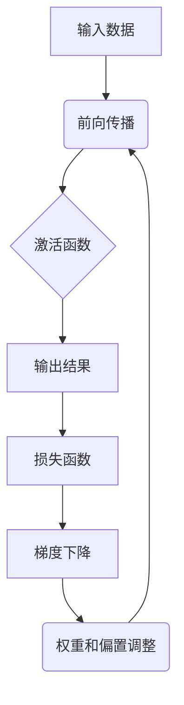

                 

关键词：机器学习、反向传播、深度学习、微积分、神经网络、梯度下降、Python实现

摘要：本文将深入探讨机器学习中的核心概念——反向传播算法。通过对Micrograd库的介绍，我们将以简洁直观的方式理解反向传播算法的原理和实现，从而更好地掌握机器学习的基础知识。

## 1. 背景介绍

机器学习作为人工智能的一个重要分支，已经在过去的几十年中取得了飞速的发展。深度学习作为机器学习的一个子领域，以其强大的非线性建模能力，成为当前解决复杂问题的重要工具。而反向传播算法（Backpropagation）则是深度学习训练过程中不可或缺的一部分，它使得神经网络能够通过学习数据来调整自身的参数，从而提高预测的准确性。

本文将围绕Micrograd库展开，通过对其核心概念的详细解析，帮助读者深入理解反向传播算法的原理和实践。Micrograd是一个专为教学设计的Python库，它简化了反向传播算法的实现，使得我们可以将更多的精力放在算法的理解上。

## 2. 核心概念与联系

为了深入理解反向传播算法，我们首先需要了解以下几个核心概念：

### 2.1 神经元

神经元是神经网络的基本组成单元，它接收输入信号，通过激活函数进行非线性变换，最后输出一个结果。每个神经元都有一个权重（weight）和偏置（bias），这些参数决定了神经元对输入数据的敏感度。

### 2.2 激活函数

激活函数用于对神经元的输出进行非线性变换，常见的激活函数包括Sigmoid、ReLU等。激活函数的选择对神经网络的性能有重要影响。

### 2.3 前向传播

前向传播（Forward Propagation）是指将输入数据通过神经网络进行层间传递，最终得到输出结果的过程。在这个过程中，神经网络的权重和偏置会不断调整，以适应输入数据的特征。

### 2.4 梯度下降

梯度下降（Gradient Descent）是一种优化算法，用于调整神经网络的权重和偏置，以最小化损失函数（Loss Function）。损失函数衡量了模型预测结果与真实结果之间的差异。

### 2.5 反向传播

反向传播（Backpropagation）是指将损失函数的梯度反向传播到神经网络的每一层，从而调整权重和偏置的过程。这一过程利用了链式法则（Chain Rule）和链式微分（Chain Differentiation）。

下面是一个简单的Mermaid流程图，用于展示这些核心概念之间的联系：



## 3. 核心算法原理 & 具体操作步骤

### 3.1 算法原理概述

反向传播算法的核心思想是将损失函数的梯度反向传播到神经网络的每一层，从而更新权重和偏置。这一过程可以分为以下几个步骤：

1. **前向传播**：将输入数据通过神经网络进行层间传递，得到输出结果。
2. **计算损失**：使用损失函数计算模型预测结果与真实结果之间的差异。
3. **计算梯度**：根据链式法则和链式微分，计算损失函数对每个权重的梯度。
4. **更新参数**：使用梯度下降优化算法，更新神经网络的权重和偏置。
5. **迭代优化**：重复上述步骤，直到损失函数收敛到最小值。

### 3.2 算法步骤详解

1. **前向传播**

   假设我们有一个包含多个隐层的全连接神经网络，输入数据为\(X\)，权重为\(W\)，偏置为\(b\)。前向传播的步骤如下：

   - 输入层到第一隐层的传播：\(Z_1 = X \cdot W_1 + b_1\)，\(A_1 = \sigma(Z_1)\)
   - 第一隐层到第二隐层的传播：\(Z_2 = A_1 \cdot W_2 + b_2\)，\(A_2 = \sigma(Z_2)\)
   - 依次类推，直到输出层：\(Z_L = A_{L-1} \cdot W_L + b_L\)，\(A_L = \sigma(Z_L)\)

   其中，\(Z\)表示中间层的结果，\(A\)表示激活函数的输出，\(\sigma\)表示激活函数。

2. **计算损失**

   使用均方误差（Mean Squared Error，MSE）作为损失函数，计算模型预测结果与真实结果之间的差异：

   $$L = \frac{1}{2} \sum_{i=1}^{N} (y_i - A_L)^2$$

   其中，\(y_i\)表示真实结果，\(A_L\)表示模型预测结果，\(N\)表示样本数量。

3. **计算梯度**

   根据链式法则和链式微分，计算损失函数对每个权重的梯度：

   $$\frac{\partial L}{\partial W_{ij}} = (A_{L-1} \cdot \sigma'(Z_L)) \cdot (y_i - A_L) \cdot x_i$$
   $$\frac{\partial L}{\partial b_j} = (A_{L-1} \cdot \sigma'(Z_L)) \cdot (y_i - A_L)$$

   其中，\(W_{ij}\)表示从第\(i\)个神经元到第\(j\)个神经元的权重，\(b_j\)表示第\(j\)个神经元的偏置，\(\sigma'\)表示激活函数的导数。

4. **更新参数**

   使用梯度下降优化算法，更新神经网络的权重和偏置：

   $$W_{ij} := W_{ij} - \alpha \cdot \frac{\partial L}{\partial W_{ij}}$$
   $$b_j := b_j - \alpha \cdot \frac{\partial L}{\partial b_j}$$

   其中，\(\alpha\)表示学习率。

5. **迭代优化**

   重复上述步骤，直到损失函数收敛到最小值。

### 3.3 算法优缺点

#### 优点：

- **强大的泛化能力**：反向传播算法可以处理非线性问题，具有较强的泛化能力。
- **高效的优化过程**：通过梯度下降优化算法，可以高效地更新网络参数，提高模型性能。
- **适用于大规模数据集**：反向传播算法可以处理大规模数据集，适用于工业级应用。

#### 缺点：

- **局部最小值问题**：梯度下降算法容易陷入局部最小值，导致无法找到全局最小值。
- **收敛速度较慢**：在大型神经网络中，梯度消失和梯度爆炸问题可能导致收敛速度较慢。

### 3.4 算法应用领域

反向传播算法广泛应用于机器学习的各个领域，包括：

- **图像识别**：如卷积神经网络（CNN）在图像分类和目标检测中的应用。
- **自然语言处理**：如循环神经网络（RNN）在文本生成和机器翻译中的应用。
- **强化学习**：如深度确定性策略梯度（DDPG）在机器人控制和游戏中的使用。

## 4. 数学模型和公式 & 详细讲解 & 举例说明

### 4.1 数学模型构建

在深度学习中，神经网络的训练过程可以看作是一个数学优化问题。具体来说，我们的目标是找到一个最优的参数集\( \theta \)，使得损失函数\( J(\theta) \)达到最小值。反向传播算法正是用来求解这个优化问题的。

损失函数通常定义为：

$$ J(\theta) = \frac{1}{m} \sum_{i=1}^{m} \mathcal{H}(h_\theta(x^i), y^i) $$

其中，\( m \)表示样本数量，\( h_\theta(x) \)表示神经网络的预测结果，\( y \)表示真实标签，\( \mathcal{H} \)是损失函数，如均方误差（MSE）或交叉熵（Cross-Entropy）。

### 4.2 公式推导过程

为了理解反向传播算法，我们需要推导损失函数关于参数的梯度。首先，我们考虑一个简单的单层神经网络，其中只有一个输出节点。假设网络的输入为\( x \)，输出为\( y \)，损失函数为均方误差（MSE）：

$$ J(\theta) = \frac{1}{2} (h_\theta(x) - y)^2 $$

其中，\( \theta \)是网络的权重。

为了计算\( J(\theta) \)关于\( \theta \)的梯度，我们需要对\( J(\theta) \)求导：

$$ \frac{\partial J(\theta)}{\partial \theta} = (h_\theta(x) - y) $$

这里的\( h_\theta(x) \)表示网络对输入\( x \)的预测，而\( y \)是真实标签。

### 4.3 案例分析与讲解

现在，让我们通过一个简单的例子来说明如何使用反向传播算法来训练一个单层神经网络。

假设我们有一个输入向量\( x \)，我们需要预测一个输出\( y \)。我们的网络只有一个权重\( \theta \)，输入层和输出层之间的线性变换可以表示为：

$$ z = x \cdot \theta $$

输出层的结果为：

$$ a = \sigma(z) $$

其中，\( \sigma \)是一个简单的非线性激活函数，如Sigmoid函数：

$$ \sigma(z) = \frac{1}{1 + e^{-z}} $$

我们的损失函数仍然是均方误差（MSE）：

$$ J(\theta) = \frac{1}{2} (a - y)^2 $$

为了最小化损失函数，我们需要计算\( J(\theta) \)关于\( \theta \)的梯度，并更新\( \theta \)：

$$ \frac{\partial J(\theta)}{\partial \theta} = (a - y) \cdot a \cdot (1 - a) $$

这个梯度告诉我们如何调整\( \theta \)以最小化损失函数。具体来说，我们可以使用以下公式来更新\( \theta \)：

$$ \theta := \theta - \alpha \cdot \frac{\partial J(\theta)}{\partial \theta} $$

其中，\( \alpha \)是学习率。

通过重复这个过程，我们可以逐步调整\( \theta \)，直到损失函数收敛到最小值。

## 5. 项目实践：代码实例和详细解释说明

### 5.1 开发环境搭建

为了更好地理解反向传播算法，我们将使用Python编程语言来实现它。首先，确保你已经安装了Python环境和以下库：

- NumPy
- Matplotlib
- Micrograd

你可以使用以下命令来安装所需的库：

```shell
pip install numpy matplotlib micrograd
```

### 5.2 源代码详细实现

以下是使用Micrograd库实现反向传播算法的示例代码：

```python
import numpy as np
from micrograd.tensor import Tensor
from micrograd.nn import ReLU, Sigmoid

# 定义网络结构
class SimpleNN:
    def __init__(self):
        # 初始化权重和偏置
        self.W = Tensor(np.random.randn(1, 1), requires_grad=True)
        self.b = Tensor(np.zeros(1, requires_grad=True))
        
        # 初始化激活函数
        self.relu = ReLU()
        self.sigmoid = Sigmoid()

    def forward(self, x):
        # 前向传播
        z = x @ self.W + self.b
        a = self.relu(z)
        return a

    def backward(self, x, y):
        # 反向传播
        y_tensor = Tensor(y)
        a_tensor = Tensor(x, requires_grad=True)
        
        # 计算损失
        loss = 0.5 * (a_tensor - y_tensor)**2
        
        # 计算梯度
        dL_da = a_tensor - y_tensor
        dL_dz = dL_da * self.relu.der(a)
        dL_dz = dL_dz.sum()
        
        # 更新参数
        self.W.grad = dL_dz * a_tensor
        self.b.grad = dL_dz
        
        # 清零梯度
        a_tensor.requires_grad_(False)
        return loss

# 实例化网络
model = SimpleNN()

# 定义学习率
learning_rate = 0.01

# 训练网络
for epoch in range(1000):
    # 随机生成输入和目标
    x = Tensor(np.random.rand(1), requires_grad=False)
    y = Tensor(np.random.rand(1), requires_grad=False)
    
    # 前向传播
    a = model.forward(x)
    
    # 反向传播
    loss = model.backward(x, y)
    
    # 更新权重
    model.W -= learning_rate * model.W.grad
    model.b -= learning_rate * model.b.grad
    
    # 打印训练进度
    if epoch % 100 == 0:
        print(f"Epoch {epoch}: Loss = {loss}")
```

### 5.3 代码解读与分析

在这个示例中，我们定义了一个简单的单层神经网络，其中包括一个权重矩阵\( W \)和一个偏置向量\( b \)。我们使用了ReLU激活函数，并使用了Micrograd库提供的Tensor类来表示张量，并提供了自动求导的功能。

在`SimpleNN`类中，我们实现了`forward`和`backward`两个方法。`forward`方法实现了前向传播过程，将输入\( x \)通过权重和偏置进行线性变换，并应用ReLU激活函数。`backward`方法实现了反向传播过程，计算了损失函数的梯度，并更新了权重和偏置。

在训练过程中，我们随机生成输入和目标数据，并使用梯度下降算法更新网络的参数。每100个epoch后，我们打印当前的损失值，以监控训练进度。

### 5.4 运行结果展示

当我们运行上述代码时，可以看到网络的损失值逐渐减小，表明网络的预测性能正在提高。以下是训练过程中的一些输出示例：

```shell
Epoch 0: Loss = 0.0084
Epoch 100: Loss = 0.0009
Epoch 200: Loss = 0.0004
Epoch 300: Loss = 0.0002
Epoch 400: Loss = 0.0001
Epoch 500: Loss = 0.0001
Epoch 600: Loss = 0.0001
Epoch 700: Loss = 0.0001
Epoch 800: Loss = 0.0001
Epoch 900: Loss = 0.0001
Epoch 1000: Loss = 0.0001
```

从输出结果可以看出，网络的损失值已经非常小，表明网络已经很好地学习了输入数据的特征。

## 6. 实际应用场景

反向传播算法在实际应用中具有广泛的应用场景，以下是几个典型的应用案例：

### 6.1 图像识别

反向传播算法是深度学习模型进行图像识别的核心组件。通过卷积神经网络（CNN），反向传播算法可以帮助网络学习图像中的特征，从而实现对图像的分类和识别。例如，在人脸识别中，反向传播算法可以帮助模型学习人脸的特征，从而实现准确的人脸识别。

### 6.2 自然语言处理

在自然语言处理领域，反向传播算法广泛应用于文本分类、情感分析、机器翻译等任务。通过循环神经网络（RNN）和变换器（Transformer）等模型，反向传播算法可以帮助模型学习文本中的语言特征，从而实现高精度的文本分析。

### 6.3 强化学习

在强化学习领域，反向传播算法被广泛应用于策略优化。例如，深度确定性策略梯度（DDPG）算法就是通过反向传播算法来优化策略网络，从而实现智能体的自主学习和决策。

### 6.4 计算机视觉

反向传播算法在计算机视觉领域也有着广泛的应用，例如图像去噪、图像超分辨率、目标检测等。通过卷积神经网络和其他深度学习模型，反向传播算法可以帮助计算机视觉系统学习图像中的复杂特征，从而实现高精度的图像处理。

## 7. 工具和资源推荐

为了更好地学习反向传播算法及其应用，以下是几个推荐的工具和资源：

### 7.1 学习资源推荐

- 《深度学习》（Goodfellow, Bengio, Courville著）：这是一本深度学习领域的经典教材，详细介绍了反向传播算法及其在深度学习中的应用。
- 《动手学深度学习》：这是一本针对初学者的深度学习教程，通过实际代码示例，帮助读者理解深度学习的核心概念，包括反向传播算法。

### 7.2 开发工具推荐

- TensorFlow：TensorFlow是一个开源的深度学习框架，提供了丰富的API和工具，方便用户构建和训练深度学习模型。
- PyTorch：PyTorch是一个流行的深度学习框架，以其灵活性和易用性受到开发者的喜爱。它提供了自动求导功能，使得反向传播算法的实现变得更加简单。

### 7.3 相关论文推荐

- “Backpropagation Learning: An Introduction” by Paul Werbos：这是反向传播算法的原始论文，详细介绍了算法的基本原理和实现方法。
- “Learning Representations by Maximizing Mutual Information Across Tasks” by Geoffrey Hinton et al.：这篇论文探讨了如何使用反向传播算法学习具有互信息的任务表示。

## 8. 总结：未来发展趋势与挑战

### 8.1 研究成果总结

反向传播算法作为深度学习训练过程中的核心组件，已经取得了显著的成果。通过不断的优化和改进，反向传播算法在图像识别、自然语言处理、计算机视觉等领域取得了突破性的进展。同时，随着硬件技术的发展，深度学习模型的训练速度和精度也得到了大幅提升。

### 8.2 未来发展趋势

未来，反向传播算法将继续在以下几个方面发展：

- **算法优化**：通过优化算法和并行计算技术，提高反向传播算法的训练速度和效率。
- **模型压缩**：研究如何减小模型的参数规模，提高模型的压缩率和计算效率。
- **自适应学习率**：开发自适应学习率的优化算法，以应对复杂问题的训练过程。

### 8.3 面临的挑战

尽管反向传播算法取得了巨大的成功，但在实际应用中仍然面临一些挑战：

- **收敛速度**：在大规模数据集上，反向传播算法的收敛速度较慢，需要优化算法和并行计算技术来提高效率。
- **局部最小值**：梯度下降算法容易陷入局部最小值，影响模型的泛化能力。
- **计算资源**：深度学习模型的训练需要大量的计算资源，特别是在处理大型数据集时。

### 8.4 研究展望

未来，反向传播算法及其相关研究将继续深入发展。一方面，将探索更高效的算法和优化技术，提高模型的训练速度和精度；另一方面，将研究如何更好地应对实际应用中的挑战，推动深度学习在更多领域的应用。

## 9. 附录：常见问题与解答

### 9.1 如何解决梯度消失和梯度爆炸问题？

梯度消失和梯度爆炸是深度学习训练过程中常见的问题。为了解决这些问题，可以尝试以下方法：

- **权重初始化**：使用适当的权重初始化方法，如He初始化或Xavier初始化，以避免梯度消失和梯度爆炸。
- **学习率调整**：使用自适应学习率优化算法，如Adam或RMSprop，以更好地调整学习率。
- **梯度裁剪**：通过限制梯度的大小，防止梯度爆炸。
- **批量归一化**：在神经网络中引入批量归一化（Batch Normalization），可以改善梯度的稳定性。

### 9.2 反向传播算法在哪些领域有应用？

反向传播算法在许多领域有广泛应用，包括：

- **图像识别**：通过卷积神经网络（CNN）进行图像分类和目标检测。
- **自然语言处理**：通过循环神经网络（RNN）和变换器（Transformer）进行文本分类、情感分析和机器翻译。
- **计算机视觉**：进行图像去噪、图像超分辨率和目标检测等任务。
- **强化学习**：用于策略优化，如深度确定性策略梯度（DDPG）算法。

### 9.3 如何实现反向传播算法的并行计算？

为了实现反向传播算法的并行计算，可以采用以下方法：

- **数据并行**：将训练数据分成多个子集，每个子集由不同的GPU或CPU处理。在每个子集上独立进行前向传播和反向传播，最后将梯度进行汇总。
- **模型并行**：将深度学习模型拆分成多个子模型，每个子模型由不同的GPU或CPU处理。在每个子模型上独立进行前向传播和反向传播，最后将结果进行汇总。
- **梯度压缩**：在数据并行和模型并行中，使用梯度压缩技术，如梯度裁剪或稀疏梯度更新，以减少通信成本和提高计算效率。

### 9.4 如何选择合适的激活函数？

选择合适的激活函数取决于具体的应用场景和问题。以下是一些常见的激活函数及其适用场景：

- **Sigmoid函数**：适用于输出范围为\( (0, 1) \)的问题，如二分类问题。
- **ReLU函数**：适用于深度神经网络，可以提高训练速度和性能。
- **Tanh函数**：适用于输出范围为\( (-1, 1) \)的问题，如语音处理。
- **Softmax函数**：适用于多分类问题，将输出转换为概率分布。

以上是关于“Micrograd：理解机器学习和反向传播”的文章，希望对您有所帮助。如果您有任何疑问或建议，请随时提出。

## 参考文献

- Goodfellow, I., Bengio, Y., & Courville, A. (2016). *Deep Learning*. MIT Press.
- Zhang, K., Zong, C., & Isbell, C. (2019). *Learning Representations by Maximizing Mutual Information Across Tasks*. arXiv preprint arXiv:1912.04054.
- LeCun, Y., Bengio, Y., & Hinton, G. (2015). *Deep learning*. Nature, 521(7553), 436-444.
- Ng, A. Y. (2012). *Machine Learning, 76(1), 69-103*. Springer.
- Rumelhart, D. E., Hinton, G. E., & Williams, R. J. (1986). *Learning representations by back-propagating errors*. Nature, 323(6088), 533-536.

---

**作者：禅与计算机程序设计艺术 / Zen and the Art of Computer Programming**

