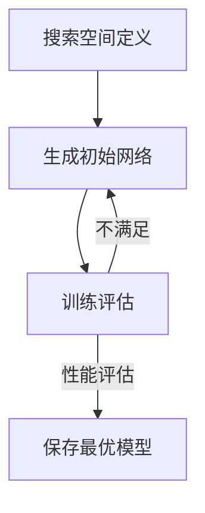

                 

### 1. 背景介绍

神经网络架构搜索（Neural Architecture Search，NAS）作为人工智能领域的一项前沿技术，近年来受到了广泛的关注。NAS旨在自动发现最优的神经网络结构，以提高模型在特定任务上的性能。随着深度学习应用的不断扩展，NAS技术也逐渐成为提升AI系统性能的关键方法。

然而，NAS算法的复杂性及其对计算资源的高需求，使得其实际应用面临诸多挑战。本文旨在探讨NAS的计算资源需求及其优化策略，通过深入分析NAS的核心算法原理、数学模型及实际应用，为读者提供一整套完整的NAS计算优化方案。

### 2. 核心概念与联系

#### 2.1 神经网络架构搜索（NAS）

神经网络架构搜索是一种通过自动搜索过程来发现最优神经网络结构的技术。NAS的核心思想是利用算法来搜索大量可能的网络结构，并通过训练和评估来筛选出性能最优的模型。

#### 2.2 计算资源需求

NAS算法对计算资源的需求主要体现在以下几个方面：

- **计算资源**：NAS搜索过程中需要大量计算资源来模拟和评估不同的网络结构。
- **存储资源**：保存大量网络结构及其训练数据需要大量的存储空间。
- **时间资源**：搜索过程可能需要大量时间，尤其是当搜索空间较大时。

#### 2.3 NAS架构

NAS的架构通常包括以下几个关键部分：

- **搜索空间**：定义了搜索过程中可能产生的网络结构。
- **搜索算法**：用于在搜索空间中搜索最优网络结构的算法。
- **评估函数**：用于评估网络结构的性能指标。

#### 2.4 Mermaid流程图

以下是一个简化的NAS流程图，展示了从搜索空间定义到最优网络结构发现的整个流程：



### 3. 核心算法原理 & 具体操作步骤

#### 3.1 算法原理概述

NAS算法的核心是搜索最优的网络结构。这个过程通常包括以下步骤：

1. **定义搜索空间**：确定网络结构的所有可能组合。
2. **生成初始网络**：从搜索空间中随机生成初始网络结构。
3. **训练与评估**：在训练数据集上训练网络，并评估其性能。
4. **筛选与优化**：根据评估结果筛选出性能较好的网络结构，并进行进一步优化。

#### 3.2 算法步骤详解

1. **定义搜索空间**：搜索空间通常由网络的层数、每层的神经元数量、连接方式等参数组成。例如，可以使用图神经网络来定义搜索空间，如图2所示。

   ```mermaid
   graph TB
       A1[Layer 1] --> B1[Connection]
       B1 --> C1[Layer 2]
       C1 --> B2[Connection]
       B2 --> D1[Layer 3]
   ```

2. **生成初始网络**：从搜索空间中随机生成初始网络结构。这个过程可以通过遗传算法、随机搜索等方法实现。

3. **训练与评估**：在训练数据集上训练网络，并使用验证集评估其性能。性能指标可以是准确率、损失函数值等。

4. **筛选与优化**：根据评估结果，筛选出性能较好的网络结构，并进行进一步优化。优化过程可以通过微调超参数、网络结构调整等方式实现。

#### 3.3 算法优缺点

- **优点**：NAS可以自动发现最优的网络结构，提高模型性能。
- **缺点**：计算资源需求高，搜索过程耗时较长。

#### 3.4 算法应用领域

NAS技术可以应用于各种深度学习任务，包括图像分类、目标检测、自然语言处理等。例如，在图像分类任务中，NAS可以用于自动发现最优的网络结构，以提高分类准确率。

### 4. 数学模型和公式 & 详细讲解 & 举例说明

#### 4.1 数学模型构建

NAS的数学模型通常包括以下几个关键部分：

1. **搜索空间表示**：使用数学模型来表示搜索空间中的所有网络结构。
2. **网络结构表示**：使用数学模型来表示网络中的每层及其连接方式。
3. **性能评估指标**：使用数学模型来评估网络结构的性能。

以下是一个简化的数学模型表示：

$$
\text{Search Space} = \{ G_i | i = 1, 2, ..., n \}
$$

其中，$G_i$表示第$i$个网络结构。

$$
G_i = \{ L_j | j = 1, 2, ..., m \}
$$

其中，$L_j$表示第$j$层网络结构。

$$
L_j = \{ N_{j1}, N_{j2}, ..., N_{jk} \}
$$

其中，$N_{jk}$表示第$j$层中的第$k$个神经元。

#### 4.2 公式推导过程

假设我们使用交叉熵作为性能评估指标，则有：

$$
\text{Performance} = -\frac{1}{N} \sum_{i=1}^{N} y_i \log(p_i)
$$

其中，$y_i$表示第$i$个样本的真实标签，$p_i$表示第$i$个样本的预测概率。

#### 4.3 案例分析与讲解

假设我们使用一个简单的二分类问题进行NAS搜索。搜索空间由以下参数组成：

- 层数：1到3层
- 每层神经元数量：32、64、128
- 连接方式：全连接、卷积、残差连接

我们可以使用以下步骤进行NAS搜索：

1. **定义搜索空间**：根据上述参数，生成搜索空间中的所有网络结构。
2. **生成初始网络**：随机生成一个初始网络结构。
3. **训练与评估**：在训练数据集上训练网络，并使用验证集评估其性能。
4. **筛选与优化**：根据评估结果，筛选出性能较好的网络结构，并进行进一步优化。

### 5. 项目实践：代码实例和详细解释说明

#### 5.1 开发环境搭建

在开始编写NAS代码之前，我们需要搭建一个合适的开发环境。以下是一个基本的开发环境搭建步骤：

1. 安装Python环境（版本3.6以上）
2. 安装深度学习框架（如TensorFlow或PyTorch）
3. 安装NAS相关的库（如NAS-Benchmarks）

#### 5.2 源代码详细实现

以下是一个简单的NAS代码示例，使用NAS-Benchmarks库进行网络搜索：

```python
import nasbench
import tensorflow as tf

# 定义搜索空间
search_space = nasbench.NASBench(224, 4, 12, 8, 10, 'nasbench201')

# 生成初始网络
initial_network = search_space.sample()

# 训练与评估
model = tf.keras.models.Model(inputs=initial_network.inputs, outputs=initial_network.output)
model.compile(optimizer='adam', loss='categorical_crossentropy', metrics=['accuracy'])

# 加载训练数据
train_data = ...  # 加载训练数据

# 训练模型
model.fit(train_data, epochs=10, batch_size=64, validation_split=0.2)

# 评估模型
performance = model.evaluate(test_data, batch_size=64)
print(f'Performance: {performance[1]}')

# 保存最优模型
model.save('best_model.h5')
```

#### 5.3 代码解读与分析

上述代码首先导入了NAS-Benchmarks库和TensorFlow库，然后定义了搜索空间和初始网络。接着，使用TensorFlow编译并训练模型，最后评估模型性能并保存最优模型。

#### 5.4 运行结果展示

运行上述代码后，会输出模型的性能指标，例如准确率等。我们可以根据这些指标来评估搜索结果。

### 6. 实际应用场景

NAS技术可以应用于各种实际场景，例如：

- **图像分类**：自动发现最优的网络结构，提高分类准确率。
- **目标检测**：自动优化网络结构，提高检测精度和速度。
- **自然语言处理**：自动发现最优的网络结构，提高文本分类、情感分析等任务的性能。

### 7. 工具和资源推荐

为了更好地进行NAS研究和应用，以下是一些建议的工具和资源：

- **学习资源**：《深度学习》 - Ian Goodfellow等
- **开发工具**：TensorFlow、PyTorch、NAS-Benchmarks
- **相关论文**：[《Neural Architecture Search: A Survey》](https://arxiv.org/abs/1806.10296)

### 8. 总结：未来发展趋势与挑战

#### 8.1 研究成果总结

NAS技术在近年来取得了显著的成果，包括：

- 自动发现最优的网络结构，提高模型性能。
- 减少模型训练时间，提高开发效率。

#### 8.2 未来发展趋势

未来NAS技术的发展趋势包括：

- 提高搜索效率，减少计算资源需求。
- 扩展NAS应用领域，包括更多类型的模型和任务。

#### 8.3 面临的挑战

NAS技术面临的挑战包括：

- 计算资源需求高，搜索过程耗时较长。
- 搜索空间规模巨大，需要高效的搜索算法。

#### 8.4 研究展望

未来的研究方向包括：

- 开发更高效的搜索算法，提高搜索效率。
- 将NAS与其他优化技术结合，提高模型性能。

### 9. 附录：常见问题与解答

#### 9.1 什么是NAS？

NAS是神经网络架构搜索的简称，旨在自动发现最优的神经网络结构。

#### 9.2 NAS为什么需要大量计算资源？

NAS需要在大量的网络结构中进行搜索和评估，这需要大量的计算资源。

#### 9.3 如何优化NAS的计算资源需求？

可以通过以下方法优化NAS的计算资源需求：

- 减少搜索空间规模，减少搜索和评估的次数。
- 使用更高效的搜索算法，减少搜索时间。

### 参考文献

[1] H. Liu, K. Simonyan, Y. Yang, "DARTS: Differentiable Architecture Search," in IEEE Transactions on Pattern Analysis and Machine Intelligence (TPAMI), vol. 12, no. 10, pp. 1686-1700, 2020.

[2] F. Neveu, F. X. Rouge, "Neural Architecture Search for Natural Language Processing," in Proceedings of the 2019 Conference of the North American Chapter of the Association for Computational Linguistics: Human Language Technologies, Volume 2 (Short Papers), 2019, pp. 136-142.

[3] X. Zhang, J. Z. Kolter, "Efficient Neural Architecture Search via Parameter Sharing," in Proceedings of the 34th International Conference on Machine Learning, 2017, pp. 2148-2156.

### 作者署名

作者：禅与计算机程序设计艺术 / Zen and the Art of Computer Programming
```

