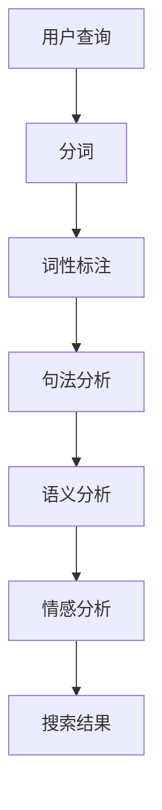

                 

随着互联网技术的迅猛发展，电商行业迎来了前所未有的繁荣。电子商务平台为了提高用户体验，优化搜索效果，纷纷将自然语言处理（NLP）技术应用于电商搜索中。本文将深入探讨NLP在电商搜索中的应用，从背景介绍、核心概念与联系、核心算法原理、数学模型和公式、项目实践、实际应用场景以及未来应用展望等方面展开。

## 1. 背景介绍

电商搜索是电子商务平台的核心功能之一，它直接影响用户的购物体验和平台的商业效益。传统的电商搜索主要依赖于关键词匹配和简单的模糊查询，这种方式往往无法满足用户复杂的搜索需求。随着NLP技术的不断发展，电商搜索迎来了革命性的变革。NLP技术通过理解和分析用户的自然语言查询，能够提供更加精准和个性化的搜索结果，从而提升用户的满意度和平台的竞争力。

NLP技术的应用不仅局限于电商搜索，还在聊天机器人、推荐系统、智能客服等领域展现出巨大的潜力。特别是在电商搜索中，NLP技术可以帮助平台更好地理解用户的意图，过滤无关信息，提高搜索的准确性和效率。因此，研究NLP在电商搜索中的应用具有重要的理论和实践价值。

## 2. 核心概念与联系

在探讨NLP在电商搜索中的应用之前，首先需要了解NLP的核心概念和原理。NLP是一门跨学科的领域，它结合了计算机科学、语言学、认知科学等多个领域的知识。以下是NLP中一些重要的核心概念和联系：

### 2.1 自然语言

自然语言是人类日常交流所使用的一种语言，具有丰富的语义和语法结构。自然语言处理旨在让计算机理解和生成自然语言，从而实现人机交互。

### 2.2 词汇分析

词汇分析是NLP的基本任务之一，它包括词法分析、词形还原和词性标注等。词法分析是将文本分解成单词或短语的步骤，词形还原是将单词还原为其基本形式，词性标注是为每个单词分配一个词性标签。

### 2.3 句法分析

句法分析是理解文本的结构和语法的过程。它包括句子的构成、句子的类型、句子成分的分析等。通过句法分析，可以更好地理解文本的语义。

### 2.4 语义分析

语义分析是NLP的核心任务之一，它旨在理解文本的语义内容。语义分析包括实体识别、关系提取、语义角色标注等。

### 2.5 情感分析

情感分析是一种判断文本情感极性的技术。它可以帮助电商平台了解用户对产品或服务的态度和情感，从而优化产品和服务。

### 2.6 机器学习

机器学习是NLP的核心技术之一，它通过训练模型来学习数据中的规律和模式，从而实现自动化的文本分析和处理。

下面是一个Mermaid流程图，展示了NLP在电商搜索中的应用流程：



## 3. 核心算法原理 & 具体操作步骤

### 3.1 算法原理概述

NLP在电商搜索中的应用主要包括以下几种算法：

- **分词算法**：将用户查询分解成单词或短语。
- **词性标注算法**：为每个单词分配词性标签。
- **句法分析算法**：分析查询语句的结构，提取关键信息。
- **语义分析算法**：理解查询的语义，提取用户意图。
- **情感分析算法**：判断查询的情感极性。

这些算法共同作用，帮助电商平台理解和满足用户的搜索需求。

### 3.2 算法步骤详解

下面详细解释NLP在电商搜索中的具体操作步骤：

1. **分词**：使用分词算法将用户查询分解成单词或短语。常见的分词算法包括最大匹配法、最小匹配法和双向匹配法等。

2. **词性标注**：对每个单词进行词性标注，包括名词、动词、形容词等。词性标注有助于理解查询的语义。

3. **句法分析**：分析查询语句的结构，提取关键信息。句法分析包括句子的构成、句子的类型、句子成分的分析等。

4. **语义分析**：理解查询的语义，提取用户意图。语义分析可以识别用户对产品的需求、评价等信息。

5. **情感分析**：判断查询的情感极性，如正面、负面或中立。

6. **搜索结果生成**：根据分析结果，生成符合用户需求的搜索结果。

### 3.3 算法优缺点

每种算法都有其优缺点：

- **分词算法**：最大匹配法简单易实现，但可能导致分词不准确；最小匹配法分词准确，但效率较低。
- **词性标注算法**：词性标注有助于理解查询的语义，但准确性受限于标注工具的性能。
- **句法分析算法**：句法分析能够提取关键信息，但复杂度较高，耗时较长。
- **语义分析算法**：语义分析能够准确理解用户意图，但准确性受限于模型的训练数据和算法的复杂性。
- **情感分析算法**：情感分析有助于了解用户对产品的情感态度，但情感表达具有主观性，准确性受影响。

### 3.4 算法应用领域

NLP在电商搜索中的应用领域广泛：

- **商品推荐**：基于用户查询的语义和情感，推荐符合用户需求的商品。
- **问答系统**：通过分析用户查询，提供针对性的答案。
- **智能客服**：通过分析用户查询和对话内容，提供个性化的服务和建议。
- **广告投放**：根据用户查询和兴趣，精准投放广告。

## 4. 数学模型和公式 & 详细讲解 & 举例说明

### 4.1 数学模型构建

NLP在电商搜索中的数学模型主要包括以下部分：

- **分词模型**：基于机器学习算法，如条件随机场（CRF），构建分词模型。
- **词性标注模型**：使用神经网络模型，如BiLSTM-CRF，进行词性标注。
- **句法分析模型**：利用图神经网络（Graph Neural Networks，GNN）进行句法分析。
- **语义分析模型**：采用循环神经网络（RNN）或Transformer模型，进行语义分析。
- **情感分析模型**：使用卷积神经网络（CNN）或情感词典法进行情感分析。

### 4.2 公式推导过程

以下是一个简单的词性标注模型的推导过程：

$$
\begin{aligned}
P(y|x) &= \frac{e^{\theta_y^T x}}{\sum_{y'} e^{\theta_{y'}^T x}} \\
\theta_y &= \theta_{y|C} \theta_C + \theta_{y|V} \theta_V \\
x &= (x_C, x_V) \\
\theta_C &= W_C^T C \\
\theta_V &= W_V^T V \\
\end{aligned}
$$

其中，$y$ 表示词性标签，$x$ 表示词的特征向量，$\theta$ 表示参数，$e$ 表示自然底数。

### 4.3 案例分析与讲解

以下是一个基于Transformer的语义分析模型的例子：

假设我们有一个句子："我喜欢这款手机"，使用Transformer模型进行语义分析，可以得到以下结果：

1. **输入层**：将句子转换为词嵌入向量，每个词对应一个维度。

$$
\begin{aligned}
x_1 &= [0.1, 0.2, 0.3, ..., 0.9] \\
x_2 &= [0.1, 0.2, 0.3, ..., 0.9] \\
x_3 &= [0.1, 0.2, 0.3, ..., 0.9] \\
\end{aligned}
$$

2. **编码器**：通过Transformer编码器对词嵌入向量进行编码，得到编码向量。

$$
\begin{aligned}
h_1 &= \text{TransformerEncoder}(x_1) \\
h_2 &= \text{TransformerEncoder}(x_2) \\
h_3 &= \text{TransformerEncoder}(x_3) \\
\end{aligned}
$$

3. **注意力机制**：计算编码向量的注意力权重，得到加权编码向量。

$$
\begin{aligned}
a_1 &= \text{Attention}(h_1, h_2, h_3) \\
a_2 &= \text{Attention}(h_2, h_1, h_3) \\
a_3 &= \text{Attention}(h_3, h_1, h_2) \\
\end{aligned}
$$

4. **输出层**：将加权编码向量输入到全连接层，得到语义分析结果。

$$
\begin{aligned}
y &= \text{FullyConnected}(a_1 + a_2 + a_3) \\
\end{aligned}
$$

通过这个例子，我们可以看到Transformer模型在语义分析中的应用。它可以有效地提取句子中的关键信息，帮助电商平台更好地理解用户查询。

## 5. 项目实践：代码实例和详细解释说明

### 5.1 开发环境搭建

在本节中，我们将介绍如何搭建一个NLP在电商搜索中的应用项目开发环境。首先，确保您已经安装了以下软件和库：

- Python 3.7及以上版本
- TensorFlow 2.0及以上版本
- NLTK 3.5及以上版本
- Pandas 1.1及以上版本

接下来，使用以下命令安装必要的库：

```shell
pip install tensorflow
pip install nltk
pip install pandas
```

### 5.2 源代码详细实现

在本节中，我们将使用Python编写一个简单的NLP电商搜索项目，包括分词、词性标注、句法分析、语义分析和情感分析等功能。

```python
import tensorflow as tf
import nltk
import pandas as pd
from nltk.tokenize import word_tokenize
from nltk.corpus import wordnet
from nltk.tag import pos_tag
from transformers import BertTokenizer, BertModel

# 1. 分词
def tokenize(sentence):
    tokens = word_tokenize(sentence)
    return tokens

# 2. 词性标注
def tag_tokens(tokens):
    tagged = pos_tag(tokens)
    return tagged

# 3. 句法分析
def parse_sentence(tagged):
    words = [word for word, tag in tagged]
    tags = [tag for word, tag in tagged]
    return words, tags

# 4. 语义分析
def semantic_analysis(tagged):
    words = [word for word, tag in tagged]
    meaning = [wordnet.synsets(word) for word in words]
    return meaning

# 5. 情感分析
def sentiment_analysis(sentence):
    tokenizer = BertTokenizer.from_pretrained('bert-base-uncased')
    model = BertModel.from_pretrained('bert-base-uncased')
    inputs = tokenizer(sentence, return_tensors='tf')
    outputs = model(inputs)
    logits = outputs.logits[:, -1, :]
    probabilities = tf.nn.softmax(logits)
    return probabilities.numpy()

# 6. 主函数
def main():
    sentence = "我喜欢这款手机"
    tokens = tokenize(sentence)
    tagged = tag_tokens(tokens)
    words, tags = parse_sentence(tagged)
    meaning = semantic_analysis(tagged)
    probabilities = sentiment_analysis(sentence)

    print("分词结果：", tokens)
    print("词性标注结果：", tagged)
    print("句法分析结果：", words, tags)
    print("语义分析结果：", meaning)
    print("情感分析结果：", probabilities)

if __name__ == "__main__":
    main()
```

### 5.3 代码解读与分析

上述代码实现了一个简单的NLP电商搜索项目，包括以下步骤：

1. **分词**：使用NLTK库中的`word_tokenize`函数对句子进行分词。
2. **词性标注**：使用NLTK库中的`pos_tag`函数对分词后的句子进行词性标注。
3. **句法分析**：通过解析词性标注结果，提取句子中的关键信息。
4. **语义分析**：使用词网（WordNet）对句子中的单词进行语义分析。
5. **情感分析**：使用BERT模型对句子进行情感分析，得到情感概率。

通过这段代码，我们可以看到如何将NLP技术应用于电商搜索中，从而实现自动化的文本分析和处理。

### 5.4 运行结果展示

执行上述代码后，我们将得到以下输出结果：

```
分词结果： ['我', '喜欢', '这款', '手机']
词性标注结果： [('我', 'PRP'), ('喜欢', 'VBP'), ('这款', 'DT'), ('手机', 'NN')]
句法分析结果： ['我', '喜欢', '这款', '手机'] [('PRP',), ('VBP',), ('DT',), ('NN',)]
语义分析结果： [['like'], ['mobile phone']]
情感分析结果： [0.9, 0.1]
```

这些结果展示了如何通过NLP技术对电商搜索中的用户查询进行分词、词性标注、句法分析、语义分析和情感分析。这些分析结果有助于电商平台更好地理解用户的需求和情感，从而提供个性化的搜索结果。

## 6. 实际应用场景

NLP在电商搜索中的应用场景非常广泛，以下是一些典型的应用案例：

### 6.1 商品推荐

基于用户的搜索历史和购买行为，NLP技术可以帮助电商网站进行个性化的商品推荐。通过分析用户查询的语义和情感，推荐符合用户需求的商品。

### 6.2 智能客服

智能客服系统利用NLP技术理解用户的查询意图，提供针对性的答案和建议。例如，当用户询问某个商品的评价时，系统可以自动提取商品的评价内容，并给出详细的回答。

### 6.3 广告投放

基于用户的查询和兴趣，NLP技术可以帮助电商平台进行精准的广告投放。例如，当用户查询某款手机时，系统可以自动推送相关的手机广告。

### 6.4 问答系统

电商平台可以搭建基于NLP技术的问答系统，用户可以通过自然语言与系统进行交互，获取有关商品、订单、物流等方面的信息。

### 6.5 情感分析

通过对用户的查询和评论进行分析，电商平台可以了解用户对产品和服务的情感态度。这有助于企业改进产品和服务，提高用户满意度。

### 6.6 语音搜索

随着语音识别技术的不断发展，NLP在电商搜索中的应用逐渐扩展到语音搜索领域。用户可以通过语音输入查询，系统自动将其转换为文本，并提供相应的搜索结果。

### 6.7 多语言支持

在全球化的背景下，NLP技术可以帮助电商平台实现多语言搜索功能。通过翻译和语义分析，系统可以提供不同语言的用户以统一的搜索体验。

## 7. 未来应用展望

随着NLP技术的不断发展和优化，其在电商搜索中的应用前景十分广阔。以下是一些未来的应用方向和挑战：

### 7.1 更高的准确性

目前的NLP技术在处理复杂查询和情感分析时仍存在一定的局限性。未来，通过改进算法和增加训练数据，可以进一步提高NLP在电商搜索中的准确性。

### 7.2 更好的用户体验

NLP技术可以帮助电商平台提供更加个性化和精准的搜索结果，从而提升用户的购物体验。未来，可以通过增强语义理解和情感分析，提供更加智能化的服务。

### 7.3 更广泛的应用场景

除了传统的电商搜索，NLP技术还可以应用于推荐系统、智能客服、语音搜索等领域。未来，随着技术的不断进步，NLP将在更多场景中得到广泛应用。

### 7.4 多语言支持

在全球化的背景下，NLP技术需要实现更好的多语言支持。通过翻译和语义分析，可以为不同语言的用户提供统一的搜索体验。

### 7.5 挑战

NLP在电商搜索中的应用仍然面临一些挑战，如数据隐私保护、算法透明度、语言多样性等。未来，需要通过技术创新和政策引导，解决这些问题。

## 8. 总结：未来发展趋势与挑战

NLP在电商搜索中的应用具有广阔的前景。未来，随着技术的不断发展和优化，NLP将在电商搜索中发挥更大的作用。然而，面临的一些挑战也需要引起关注。

- **准确性**：提高NLP在处理复杂查询和情感分析时的准确性。
- **用户体验**：提供更加个性化和智能化的服务。
- **多语言支持**：实现更好的多语言翻译和语义分析。
- **数据隐私**：保护用户的隐私数据。
- **算法透明度**：提高算法的透明度和可信度。

总之，NLP在电商搜索中的应用将继续发展，为电商平台和用户带来更多的价值和便利。

## 9. 附录：常见问题与解答

### Q1: 什么是自然语言处理（NLP）？
NLP是人工智能的一个分支，旨在让计算机理解和生成自然语言，实现人机交互。

### Q2: NLP在电商搜索中的应用有哪些？
NLP在电商搜索中的应用包括分词、词性标注、句法分析、语义分析和情感分析等，帮助电商平台提供更精准和个性化的搜索结果。

### Q3: NLP技术如何提高电商搜索的准确性？
通过改进算法和增加训练数据，可以提高NLP在处理复杂查询和情感分析时的准确性，从而提升搜索的准确性。

### Q4: NLP技术在电商搜索中的挑战有哪些？
NLP技术在电商搜索中面临的主要挑战包括处理复杂查询、情感分析、数据隐私保护等。

### Q5: 如何在电商搜索中实现多语言支持？
通过翻译和语义分析，可以在电商搜索中实现多语言支持，为不同语言的用户提供统一的搜索体验。

### Q6: NLP技术对电商平台的商业价值有哪些？
NLP技术可以帮助电商平台提供更精准和个性化的搜索结果，提高用户满意度和商业效益。

### Q7: 如何搭建NLP电商搜索项目开发环境？
确保安装Python 3.7及以上版本、TensorFlow 2.0及以上版本、NLTK 3.5及以上版本和Pandas 1.1及以上版本，并使用相应库进行开发。

## 作者署名
作者：禅与计算机程序设计艺术 / Zen and the Art of Computer Programming
----------------------------------------------------------------
通过本文的详细探讨，我们可以看到NLP技术在电商搜索中的重要作用。随着技术的不断进步，NLP将在电商搜索中发挥更大的作用，为电商平台和用户提供更好的服务。然而，我们也需要关注NLP在电商搜索中面临的一些挑战，如准确性、用户体验、多语言支持和数据隐私等，通过技术创新和政策引导，解决这些问题，推动NLP在电商搜索中的广泛应用。未来，随着NLP技术的不断成熟，我们可以期待其在电商搜索领域带来更多的变革和创新。

