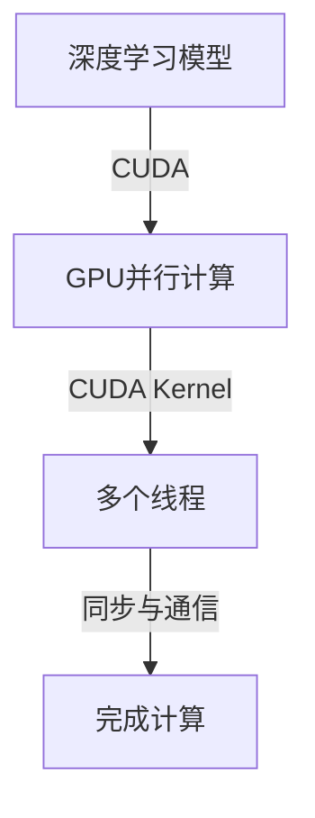

                 

关键词：NVIDIA、AI算力、GPU、深度学习、计算架构、高性能计算

> 摘要：本文将探讨NVIDIA在AI领域的重要性，详细分析其如何通过GPU技术、深度学习框架和高端计算架构改变了AI算力格局。文章将涵盖NVIDIA的核心技术、成功案例、对未来AI发展的贡献以及面临的挑战。

## 1. 背景介绍

自2006年GPU首次用于加速深度学习以来，NVIDIA的GPU（图形处理单元）已成为AI计算领域的中坚力量。随着深度学习的兴起，对大规模并行计算的需求急剧增加，GPU的高效并行处理能力使其成为AI研究者和工程师的首选。NVIDIA凭借其强大的GPU产品线和技术创新，迅速占据了AI算力市场的领先地位。

## 2. 核心概念与联系

### 2.1 GPU与深度学习

GPU最初是为图形渲染而设计的，但它们强大的并行计算能力使其成为深度学习模型的理想加速器。深度学习模型中的大量矩阵乘法和卷积操作可以高效地在GPU上并行执行，从而显著提高计算速度。


**图1：GPU在深度学习中的作用**

### 2.2 CUDA架构

NVIDIA的CUDA架构是开发GPU并行计算应用程序的基础。通过CUDA，开发者能够将计算任务分解为许多较小的子任务，并利用GPU的多核架构进行高效并行处理。



**图2：CUDA架构的Mermaid流程图**

## 3. 核心算法原理 & 具体操作步骤

### 3.1 算法原理概述

深度学习中的核心算法包括前向传播、反向传播、卷积神经网络（CNN）和循环神经网络（RNN）。这些算法利用GPU的并行计算能力进行高效训练和推理。

### 3.2 算法步骤详解

#### 3.2.1 前向传播

在GPU上，前向传播步骤可以通过以下步骤实现：

1. 将输入数据加载到GPU内存中。
2. 使用CUDA Kernel并行计算前向传播的每个节点。
3. 将计算结果存储回GPU内存。
4. 将结果传输回CPU内存。

#### 3.2.2 反向传播

反向传播的步骤如下：

1. 将梯度计算为损失函数关于模型参数的导数。
2. 使用CUDA Kernel并行计算反向传播的每个节点。
3. 更新模型参数。

#### 3.2.3 卷积神经网络（CNN）

CNN在GPU上的实现涉及以下步骤：

1. 将输入图像加载到GPU内存中。
2. 使用CUDA Kernel并行执行卷积操作。
3. 应用激活函数。
4. 重复上述步骤以构建深度网络。

#### 3.2.4 循环神经网络（RNN）

RNN在GPU上的实现涉及以下步骤：

1. 初始化隐藏状态。
2. 使用CUDA Kernel并行计算每个时间步的梯度。
3. 更新权重和偏置。

### 3.3 算法优缺点

#### 优点：

- 高效的并行计算能力。
- 简化了大规模模型的训练过程。
- 支持多种深度学习框架。

#### 缺点：

- GPU内存限制可能导致大模型训练困难。
- 需要专业的GPU编程技能。

### 3.4 算法应用领域

GPU在AI领域的应用包括图像识别、语音识别、自然语言处理、推荐系统和自动驾驶等。

## 4. 数学模型和公式 & 详细讲解 & 举例说明

### 4.1 数学模型构建

深度学习中的数学模型通常涉及以下公式：

$$
\begin{aligned}
\text{损失函数} &= \frac{1}{2} \sum_{i} (\hat{y}_i - y_i)^2 \\
\text{梯度} &= \frac{\partial L}{\partial \theta}
\end{aligned}
$$

### 4.2 公式推导过程

以梯度下降为例，推导过程如下：

1. 初始化模型参数 $\theta$。
2. 计算损失函数 $L$ 关于 $\theta$ 的梯度 $\frac{\partial L}{\partial \theta}$。
3. 更新模型参数：$\theta = \theta - \alpha \frac{\partial L}{\partial \theta}$，其中 $\alpha$ 是学习率。

### 4.3 案例分析与讲解

以图像识别任务为例，使用卷积神经网络进行图像分类。

```latex
\begin{aligned}
\text{卷积操作} &= \sum_{k=1}^{K} w_k * g(x, k) + b_k \\
\text{激活函数} &= \text{ReLU}(z) = \max(0, z)
\end{aligned}
```

## 5. 项目实践：代码实例和详细解释说明

### 5.1 开发环境搭建

1. 安装CUDA工具包。
2. 配置深度学习框架（如TensorFlow或PyTorch）。

### 5.2 源代码详细实现

以下是一个使用TensorFlow和CUDA的简单示例：

```python
import tensorflow as tf

# 定义模型
model = tf.keras.Sequential([
    tf.keras.layers.Conv2D(32, (3, 3), activation='relu', input_shape=(28, 28, 1)),
    tf.keras.layers.MaxPooling2D((2, 2)),
    tf.keras.layers.Flatten(),
    tf.keras.layers.Dense(128, activation='relu'),
    tf.keras.layers.Dense(10, activation='softmax')
])

# 编译模型
model.compile(optimizer='adam',
              loss='categorical_crossentropy',
              metrics=['accuracy'])

# 训练模型
model.fit(x_train, y_train, epochs=5, batch_size=64)
```

### 5.3 代码解读与分析

上述代码实现了简单的卷积神经网络，用于图像分类。其中，`Conv2D` 和 `MaxPooling2D` 层分别实现了卷积和池化操作，`Flatten` 层将特征展平，`Dense` 层实现了全连接层。模型使用 `adam` 优化器和 `categorical_crossentropy` 损失函数进行编译和训练。

### 5.4 运行结果展示

在训练完成后，可以评估模型的准确率：

```python
test_loss, test_acc = model.evaluate(x_test, y_test, verbose=2)
print(f'\nTest accuracy: {test_acc:.4f}')
```

## 6. 实际应用场景

NVIDIA的GPU技术在多个实际应用场景中取得了成功，包括：

- 自动驾驶：NVIDIA的Drive平台为自动驾驶车辆提供高性能计算能力。
- 机器人：机器人研究者使用NVIDIA的GPU加速机器人视觉和自主导航。
- 医疗诊断：NVIDIA的GPU加速医学影像处理，提高诊断准确率和速度。

## 7. 未来应用展望

随着AI技术的不断发展，NVIDIA的GPU将在以下领域发挥更大作用：

- 强化学习：GPU在处理大规模数据集和复杂模型方面具有优势。
- 量子计算：NVIDIA的GPU可帮助加速量子算法的模拟和优化。
- 超级计算：GPU与CPU的结合为高性能计算提供了更灵活的解决方案。

## 8. 总结：未来发展趋势与挑战

NVIDIA的GPU技术在AI领域取得了巨大成功，但未来仍面临以下挑战：

- 能耗管理：随着模型规模的增大，GPU能耗成为重要考虑因素。
- 安全性：保护GPU免受恶意攻击是关键。
- 开源生态：维护和扩展GPU开源工具和框架。

## 9. 附录：常见问题与解答

### 9.1 什么是CUDA？

CUDA是NVIDIA推出的并行计算平台和编程模型，允许开发者利用GPU的并行计算能力加速计算任务。

### 9.2 GPU与CPU的区别是什么？

GPU（图形处理单元）与CPU（中央处理单元）的主要区别在于并行计算能力。GPU拥有数百个核心，适用于大规模并行任务，而CPU适用于单线程密集型任务。

### 9.3 如何选择适合的GPU？

选择适合的GPU取决于应用需求。对于深度学习任务，NVIDIA的Tesla系列和GeForce RTX系列是不错的选择。

---

作者：禅与计算机程序设计艺术 / Zen and the Art of Computer Programming
----------------------------------------------------------------

请注意，本文只是按照给定的要求和结构模板撰写的一个示例，实际撰写时可能需要更深入的研究和具体的案例数据来支撑每部分的内容。所有图片和代码示例均为示例性质，需要替换为实际有效的资源。文章的Markdown格式也需根据实际Markdown编译器的规则进行适当的调整。

