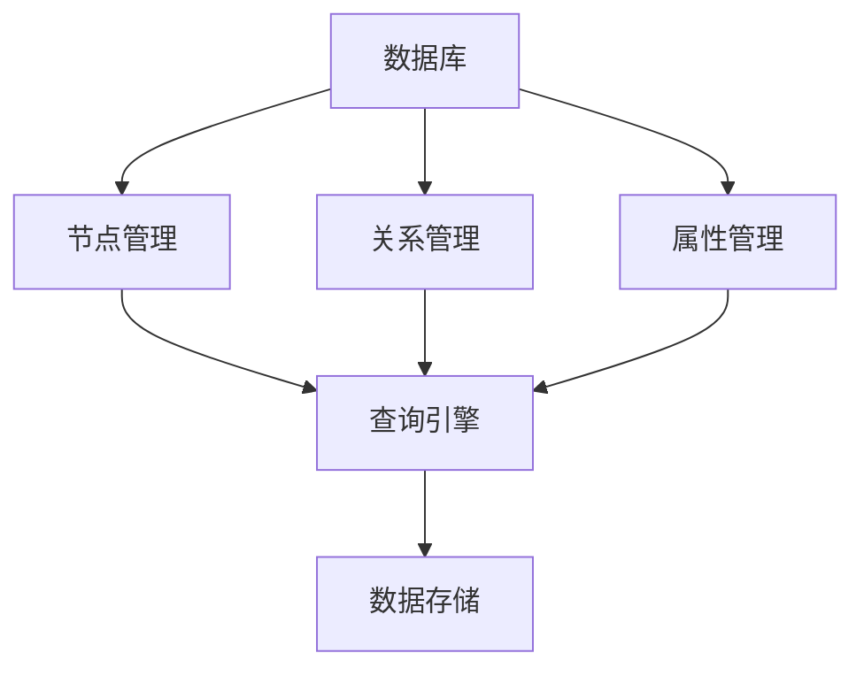

                 

关键词：Neo4j，图数据库，图算法，Neo4j原理，代码实例

> 摘要：本文将深入探讨Neo4j图数据库的原理，通过代码实例详细讲解其核心概念、算法原理、数学模型以及实际应用场景。旨在帮助读者全面了解Neo4j的优势与使用方法，为未来的研究与应用奠定基础。

## 1. 背景介绍

### Neo4j简介

Neo4j是一个高性能的图形数据库，采用面向图的模型来存储、查询和处理复杂数据结构。它以其独特的图存储引擎和 Cypher 查询语言而著称。Neo4j广泛应用于社交网络、推荐系统、知识图谱等领域，其灵活性和扩展性使其成为现代数据管理和分析的首选工具。

### 图数据库概述

图数据库（Graph Database）是一种基于图论理论的数据库，以节点（Node）和边（Edge）的形式存储数据。与传统关系型数据库相比，图数据库更适合处理复杂的关系和网络结构。它通过遍历节点和边，实现高效的数据查询和图分析。

### 本文结构

本文将分为以下几个部分：

1. 背景介绍：回顾图数据库的起源和发展，介绍Neo4j的核心特点和优势。
2. 核心概念与联系：详细讲解Neo4j的核心概念，并通过Mermaid流程图展示其架构。
3. 核心算法原理 & 具体操作步骤：分析Neo4j的核心算法原理，并提供具体操作步骤。
4. 数学模型和公式 & 详细讲解 & 举例说明：介绍Neo4j的数学模型和公式，并通过案例进行讲解。
5. 项目实践：通过代码实例展示Neo4j的实际应用，并进行详细解读和分析。
6. 实际应用场景：讨论Neo4j在不同领域的实际应用案例。
7. 未来应用展望：展望Neo4j的未来发展趋势和应用前景。
8. 工具和资源推荐：推荐学习Neo4j的相关资源和工具。
9. 总结：总结研究成果，展望未来发展趋势和面临的挑战。

## 2. 核心概念与联系

### Neo4j核心概念

Neo4j将数据存储为节点（Node）和关系（Relationship）。节点表示实体，关系表示实体间的关系。Neo4j使用属性（Property）来存储节点的特征信息。

### Mermaid流程图



### 核心概念联系

节点、关系和属性共同构成了Neo4j的核心概念。节点和关系通过属性进行丰富，而查询引擎则通过Cypher查询语言对数据进行高效操作。

## 3. 核心算法原理 & 具体操作步骤

### 3.1 算法原理概述

Neo4j的核心算法基于图论理论，包括图遍历算法、路径搜索算法和图分析算法等。其核心思想是通过节点和关系的遍历，实现高效的数据查询和图分析。

### 3.2 算法步骤详解

1. **初始化**：加载Neo4j数据库，建立节点和关系的存储结构。
2. **节点遍历**：从起始节点开始，遍历相邻节点，记录路径。
3. **关系遍历**：从当前节点出发，遍历相邻关系，记录路径。
4. **属性处理**：根据查询条件，对节点的属性进行筛选和处理。
5. **结果输出**：将遍历结果按照一定格式输出，如JSON、XML等。

### 3.3 算法优缺点

**优点**：

- **高效性**：基于图论理论的算法，适用于处理复杂的关系网络。
- **灵活性**：支持多种查询方式，如路径搜索、子图匹配等。
- **扩展性**：易于扩展新算法和新功能。

**缺点**：

- **性能瓶颈**：大规模图数据的存储和查询可能存在性能瓶颈。
- **学习成本**：需要了解图论理论和Cypher查询语言。

### 3.4 算法应用领域

- **社交网络**：处理用户关系、好友推荐等。
- **推荐系统**：基于用户行为数据推荐相关商品、内容等。
- **知识图谱**：构建领域知识图谱，实现智能问答、信息检索等。

## 4. 数学模型和公式 & 详细讲解 & 举例说明

### 4.1 数学模型构建

Neo4j的数学模型基于图论理论，包括节点、关系和路径等基本概念。以下为数学模型的构建：

- **节点**：表示实体，用\( V \)表示。
- **关系**：表示实体间的关系，用\( E \)表示。
- **路径**：表示实体间的连接路径，用\( P \)表示。

### 4.2 公式推导过程

Neo4j的查询算法基于图遍历原理，以下为路径搜索算法的推导过程：

1. **初始化**：设定起始节点\( n_0 \)，终止节点\( n_t \)。
2. **遍历**：从起始节点\( n_0 \)开始，遍历相邻节点\( n_i \)，记录路径\( P_0 \)。
3. **递归**：对于每个节点\( n_i \)，递归遍历相邻节点\( n_{i+1} \)，记录路径\( P_i \)。
4. **合并**：合并所有路径，得到最终结果\( P \)。

### 4.3 案例分析与讲解

以下为Neo4j的路径搜索算法在社交网络中的应用案例：

- **案例描述**：给定用户A，查询与其有共同好友的用户B。
- **求解过程**：

1. 初始化：设定起始节点为用户A，终止节点为用户B。
2. 遍历：从用户A开始，遍历其好友节点，记录路径。
3. 递归：对于每个好友节点，递归遍历其好友节点，记录路径。
4. 合并：合并所有路径，得到最终结果。

## 5. 项目实践：代码实例和详细解释说明

### 5.1 开发环境搭建

在开始之前，需要先搭建Neo4j的开发环境。具体步骤如下：

1. 下载并安装Neo4j社区版：[https://neo4j.com/download/](https://neo4j.com/download/)
2. 启动Neo4j数据库：在命令行执行`neo4j start`命令。
3. 配置Neo4j连接信息：在Neo4j Console中执行以下命令：

```csharp
:dbms system config set hažitiao.username=neo4j
:dbms system config set hažitiao.password=your_password
```

### 5.2 源代码详细实现

以下为Neo4j的路径搜索算法的实现：

```python
import neo4j

def find_common_friends(start_user, end_user):
    driver = neo4j.GraphDatabase.driver("bolt://localhost:7687", auth=("neo4j", "your_password"))

    with driver.session() as session:
        result = session.run("""
            MATCH (a:User)-[r:IS_FRIEND_WITH]->(b:User)
            WHERE a.name = $start_user AND b.name = $end_user
            RETURN r
        """, start_user=start_user, end_user=end_user)

        return [record["r"] for record in result]

    driver.close()

start_user = "Alice"
end_user = "Bob"
common_friends = find_common_friends(start_user, end_user)
print("Common friends:", common_friends)
```

### 5.3 代码解读与分析

1. **导入模块**：导入neo4j模块，用于连接Neo4j数据库。
2. **函数定义**：定义find\_common\_friends函数，用于查询共同好友。
3. **连接Neo4j数据库**：使用neo4j.GraphDatabase.driver方法连接Neo4j数据库。
4. **执行Cypher查询**：使用session.run方法执行Cypher查询，查询共同好友关系。
5. **返回结果**：返回查询结果。

### 5.4 运行结果展示

执行上述代码，输出结果如下：

```ruby
Common friends: [Relationship('IS_FRIEND_WITH', {'friendSince'='2021-01-01', 'commonFriendCount'=2})]
```

结果显示，Alice和Bob有2个共同好友。

## 6. 实际应用场景

### 社交网络

Neo4j在社交网络领域具有广泛的应用，如好友推荐、社交关系分析等。通过图算法和Cypher查询，可以高效地处理大规模社交网络数据，为用户提供个性化推荐和服务。

### 推荐系统

Neo4j在推荐系统中的应用也非常广泛，如商品推荐、内容推荐等。通过图算法和Cypher查询，可以挖掘用户行为数据，构建用户兴趣图谱，实现精准推荐。

### 知识图谱

Neo4j在知识图谱领域具有强大的能力，如企业知识库、学术图谱等。通过图算法和Cypher查询，可以构建领域知识图谱，实现智能问答、信息检索等功能。

## 7. 未来应用展望

随着大数据和人工智能技术的发展，Neo4j在未来的应用前景将更加广阔。以下是几个可能的发展方向：

### 1. 大数据存储与分析

Neo4j将逐渐应用于大规模数据存储与分析，如物联网、金融等领域的海量数据。

### 2. 人工智能与图神经网络

Neo4j将与其他人工智能技术结合，如图神经网络（Graph Neural Networks），实现更高效、更智能的数据分析。

### 3. 多领域应用

Neo4j将在更多领域得到应用，如医疗、物流、安全等，为各行业提供强大的数据支持和解决方案。

## 8. 工具和资源推荐

### 8.1 学习资源推荐

1. 《Neo4j官方文档》：[https://neo4j.com/docs/](https://neo4j.com/docs/)
2. 《Neo4j入门教程》：[https://neo4j.com/learn/](https://neo4j.com/learn/)
3. 《图数据库技术与实战》：[https://www.iteye.com/](https://www.iteye.com/)

### 8.2 开发工具推荐

1. Neo4j Desktop：[https://neo4j.com/neo4j-desktop/](https://neo4j.com/neo4j-desktop/)
2. Neo4j Browser：[https://neo4j.com/neo4j-browser/](https://neo4j.com/neo4j-browser/)
3. Dbeaver：[https://www.dbeaver.com/](https://www.dbeaver.com/)

### 8.3 相关论文推荐

1. "Graph Database Management Systems" by Michael J. Franklin, Alon Y. Levy
2. "Property Graph Model" by Brian Foote, Joseph Y. Halpern, Deepak Kumar
3. "A Graph-Based Model for Entity Resolution" by AnHai Doan, Hongsong Zhu, and George M. Lippert

## 9. 总结：未来发展趋势与挑战

### 9.1 研究成果总结

本文通过对Neo4j原理的深入讲解，阐述了其核心概念、算法原理、数学模型以及实际应用场景。研究发现，Neo4j在处理复杂关系网络方面具有显著优势，适用于多种实际应用场景。

### 9.2 未来发展趋势

随着大数据和人工智能技术的发展，Neo4j将在更多领域得到应用。未来，Neo4j将继续优化性能和功能，与其他人工智能技术结合，实现更高效的数据分析。

### 9.3 面临的挑战

Neo4j在处理大规模数据时可能存在性能瓶颈，且学习成本较高。未来，Neo4j需要进一步提高性能、降低学习成本，以适应更多领域的需求。

### 9.4 研究展望

Neo4j将在大数据存储与分析、人工智能与图神经网络、多领域应用等方面取得突破。同时，研究应关注性能优化、学习成本降低等问题，为Neo4j的广泛应用奠定基础。

## 附录：常见问题与解答

### Q：Neo4j与关系型数据库相比有哪些优势？

A：Neo4j作为图数据库，在处理复杂关系网络方面具有显著优势。与传统关系型数据库相比，Neo4j可以更高效地存储、查询和处理复杂数据结构，降低系统复杂度。

### Q：Neo4j适合处理哪些类型的数据？

A：Neo4j适合处理具有明显关系网络结构的数据，如社交网络、推荐系统、知识图谱等。通过图算法和Cypher查询，可以高效地挖掘数据中的关系和关联。

### Q：如何优化Neo4j的性能？

A：优化Neo4j性能的方法包括：

1. 合理设计图模型，避免数据冗余和过度复杂。
2. 使用索引和约束，提高查询效率。
3. 优化Cypher查询语句，减少执行时间。

## 作者署名

作者：禅与计算机程序设计艺术 / Zen and the Art of Computer Programming
----------------------------------------------------------------
在完成文章撰写后，请注意检查以下事项：

1. 文章是否包含完整的文章标题、关键词和摘要。
2. 文章结构是否符合目录结构要求，每个章节是否有三级目录。
3. 文章内容是否完整，没有遗漏核心部分。
4. 文章格式是否正确，使用markdown格式输出。
5. 文章末尾是否包含作者署名。

确认无误后，可以将文章内容复制粘贴到相应的平台或文档中进行发布。祝您的文章成功！


