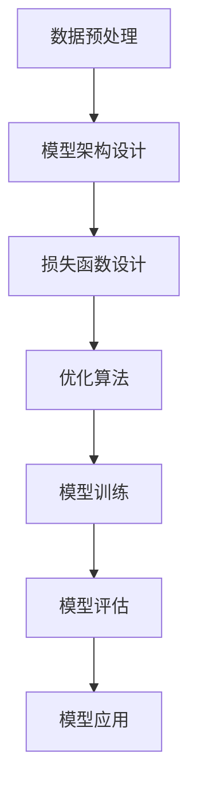

                 

关键词：OpenAI、大模型、应用、实践、AI、机器学习

> 摘要：本文将深入探讨OpenAI开发的大模型在人工智能领域的应用实践。我们将从背景介绍、核心概念与联系、核心算法原理与具体操作步骤、数学模型与公式、项目实践、实际应用场景、未来应用展望、工具和资源推荐以及总结和展望等方面进行全面解析，旨在为读者提供关于OpenAI大模型应用的全面了解和指导。

## 1. 背景介绍

随着人工智能（AI）技术的快速发展，大模型（Large-scale Models）逐渐成为研究的热点。OpenAI作为全球领先的AI研究机构，其开发的大模型如GPT-3、ChatGPT等在自然语言处理（NLP）、图像生成、机器翻译等多个领域取得了显著的成果。大模型的优势在于能够处理大规模数据，从而提高模型的性能和泛化能力。本文将重点介绍OpenAI大模型的应用实践，旨在为相关领域的研究者和开发者提供有价值的参考。

### 1.1 OpenAI的背景

OpenAI成立于2015年，由山姆·阿尔特曼（Sam Altman）等一批顶尖科学家和创业者共同创立。OpenAI的使命是“实现安全的通用人工智能（AGI）”，并推动AI技术的普及和应用。自成立以来，OpenAI在AI领域取得了众多突破性成果，吸引了全球的关注。

### 1.2 大模型的发展历程

大模型的发展历程可以追溯到20世纪80年代，当时深度神经网络（DNN）开始被用于图像识别等任务。随着计算能力的提升和数据量的增加，深度学习（DL）取得了显著的进展。近年来，随着GPU、TPU等硬件的发展，大模型逐渐成为研究的热点。OpenAI的GPT-3模型是一个典型的代表，其参数规模达到1750亿，能够在各种任务中表现出色。

## 2. 核心概念与联系

### 2.1 大模型的定义

大模型是指具有海量参数的深度学习模型，其参数规模通常在数十亿到数千亿级别。大模型的优势在于能够处理大规模数据，从而提高模型的性能和泛化能力。

### 2.2 大模型的工作原理

大模型通常采用深度神经网络（DNN）架构，其中包含多个隐藏层。通过训练，模型能够学习输入数据与输出数据之间的关系，从而实现复杂的任务。大模型的工作原理包括以下几个方面：

1. **数据预处理**：对输入数据进行预处理，包括数据清洗、数据增强、数据归一化等。
2. **模型架构设计**：设计适合特定任务的模型架构，如Transformer、BERT等。
3. **损失函数设计**：设计损失函数以衡量模型输出的误差，如交叉熵损失函数。
4. **优化算法**：采用优化算法如梯度下降、Adam等，以调整模型参数，降低损失函数。

### 2.3 大模型的应用领域

大模型在多个领域取得了显著的成果，包括：

1. **自然语言处理（NLP）**：大模型在文本生成、机器翻译、问答系统等任务中表现出色。
2. **计算机视觉（CV）**：大模型在图像分类、目标检测、图像生成等任务中取得了突破性成果。
3. **语音识别**：大模型在语音识别、语音合成等任务中表现优秀。
4. **推荐系统**：大模型在推荐系统中的应用，如商品推荐、新闻推荐等，显著提高了推荐质量。

### 2.4 大模型的优势与挑战

大模型的优势包括：

1. **强大的数据处理能力**：能够处理大规模数据，从而提高模型的性能和泛化能力。
2. **多任务学习能力**：能够同时处理多种任务，提高模型的复用性。
3. **自适应能力**：能够通过不断学习，适应新的数据和任务。

大模型的挑战包括：

1. **计算资源需求**：大模型需要大量的计算资源，包括GPU、TPU等。
2. **数据隐私问题**：大模型在训练过程中可能涉及敏感数据，需要考虑数据隐私问题。
3. **模型解释性**：大模型的黑箱特性使得模型解释性成为一个挑战。

### 2.5 Mermaid 流程图

以下是一个简单的Mermaid流程图，展示了大模型的工作流程：



## 3. 核心算法原理 & 具体操作步骤

### 3.1 算法原理概述

大模型的算法原理主要基于深度学习，包括以下步骤：

1. **数据预处理**：对输入数据进行清洗、归一化等处理。
2. **模型架构设计**：选择合适的神经网络架构，如Transformer、BERT等。
3. **损失函数设计**：设计合适的损失函数，以衡量模型输出的误差。
4. **优化算法**：采用梯度下降、Adam等优化算法，以调整模型参数。
5. **模型训练**：通过训练，使模型能够学习输入数据与输出数据之间的关系。
6. **模型评估**：评估模型在测试集上的性能，以确定模型是否达到预期效果。
7. **模型应用**：将训练好的模型应用到实际任务中，如文本生成、图像分类等。

### 3.2 算法步骤详解

1. **数据预处理**：

   - 数据清洗：去除数据中的噪声和异常值。
   - 数据增强：通过旋转、翻转、缩放等操作，增加数据的多样性。
   - 数据归一化：将数据缩放到一定的范围，如[0, 1]。

2. **模型架构设计**：

   - 选择合适的神经网络架构，如Transformer、BERT等。
   - 设计模型的层次结构，包括输入层、隐藏层和输出层。
   - 设置模型的参数，如学习率、批量大小等。

3. **损失函数设计**：

   - 交叉熵损失函数：常用于分类任务，计算预测概率与真实标签之间的差异。
   - 均方误差损失函数：常用于回归任务，计算预测值与真实值之间的差异。

4. **优化算法**：

   - 梯度下降：通过反向传播算法，计算梯度并更新模型参数。
   - Adam：结合了梯度下降和动量项，能够提高训练效率。

5. **模型训练**：

   - 将训练数据分成训练集和验证集。
   - 使用训练集进行模型训练，使用验证集进行模型评估。
   - 调整模型参数，使模型在验证集上的性能达到最优。

6. **模型评估**：

   - 使用测试集评估模型的性能，包括准确率、召回率、F1值等指标。
   - 分析模型在不同数据集上的表现，以确定模型的泛化能力。

7. **模型应用**：

   - 将训练好的模型应用到实际任务中，如文本生成、图像分类等。
   - 根据任务需求，调整模型参数和数据处理方式，以提高模型性能。

### 3.3 算法优缺点

**优点**：

1. **强大的数据处理能力**：能够处理大规模数据，提高模型的性能和泛化能力。
2. **多任务学习能力**：能够同时处理多种任务，提高模型的复用性。
3. **自适应能力**：能够通过不断学习，适应新的数据和任务。

**缺点**：

1. **计算资源需求**：大模型需要大量的计算资源，包括GPU、TPU等。
2. **数据隐私问题**：大模型在训练过程中可能涉及敏感数据，需要考虑数据隐私问题。
3. **模型解释性**：大模型的黑箱特性使得模型解释性成为一个挑战。

### 3.4 算法应用领域

大模型在多个领域取得了显著的成果，包括：

1. **自然语言处理（NLP）**：文本生成、机器翻译、问答系统等。
2. **计算机视觉（CV）**：图像分类、目标检测、图像生成等。
3. **语音识别**：语音识别、语音合成等。
4. **推荐系统**：商品推荐、新闻推荐等。

## 4. 数学模型和公式 & 详细讲解 & 举例说明

### 4.1 数学模型构建

大模型的数学模型主要基于深度学习，包括以下几个方面：

1. **神经网络**：神经网络是一种由大量神经元组成的计算模型，用于模拟人脑的工作原理。神经网络的数学模型可以表示为：

   $$ f(x) = \sigma(\mathbf{W} \mathbf{x} + b) $$

   其中，$f(x)$ 表示神经元的输出，$\sigma$ 表示激活函数，$\mathbf{W}$ 表示权重矩阵，$\mathbf{x}$ 表示输入向量，$b$ 表示偏置。

2. **损失函数**：损失函数用于衡量模型输出的误差，常见的损失函数有：

   - 交叉熵损失函数：适用于分类任务，公式如下：

     $$ \mathcal{L} = -\sum_{i} y_i \log(p_i) $$

     其中，$y_i$ 表示真实标签，$p_i$ 表示预测概率。

   - 均方误差损失函数：适用于回归任务，公式如下：

     $$ \mathcal{L} = \frac{1}{2} \sum_{i} (y_i - \hat{y}_i)^2 $$

     其中，$y_i$ 表示真实值，$\hat{y}_i$ 表示预测值。

3. **优化算法**：优化算法用于调整模型参数，以降低损失函数。常见的优化算法有：

   - 梯度下降：通过计算损失函数关于模型参数的梯度，更新模型参数。

     $$ \mathbf{W} \leftarrow \mathbf{W} - \alpha \nabla_{\mathbf{W}} \mathcal{L} $$

     其中，$\alpha$ 表示学习率。

   - Adam：结合了梯度下降和动量项，能够提高训练效率。

     $$ \mathbf{m}_t = \beta_1 \mathbf{m}_{t-1} + (1 - \beta_1) \nabla_{\mathbf{W}} \mathcal{L} $$
     $$ \mathbf{v}_t = \beta_2 \mathbf{v}_{t-1} + (1 - \beta_2) (\nabla_{\mathbf{W}} \mathcal{L})^2 $$
     $$ \mathbf{W} \leftarrow \mathbf{W} - \alpha \frac{\mathbf{m}_t}{\sqrt{\mathbf{v}_t} + \epsilon} $$

     其中，$\beta_1$、$\beta_2$ 分别表示一阶和二阶动量项，$\epsilon$ 表示一个很小的正数。

### 4.2 公式推导过程

1. **损失函数的推导**：

   对于分类任务，假设输入为$x \in \mathbb{R}^n$，输出为$y \in \{0, 1\}$，模型预测概率为$p(x)$。则交叉熵损失函数可以表示为：

   $$ \mathcal{L} = -y \log(p(x)) - (1 - y) \log(1 - p(x)) $$

   对其求导，得到：

   $$ \frac{\partial \mathcal{L}}{\partial p(x)} = \frac{y}{p(x)} - \frac{1 - y}{1 - p(x)} $$

2. **优化算法的推导**：

   以梯度下降为例，假设损失函数为$\mathcal{L}(\mathbf{W})$，模型参数为$\mathbf{W} \in \mathbb{R}^{d \times n}$。则梯度下降的更新公式为：

   $$ \mathbf{W} \leftarrow \mathbf{W} - \alpha \nabla_{\mathbf{W}} \mathcal{L} $$

   其中，$\alpha$ 表示学习率。对于神经网络中的每个神经元，其梯度可以表示为：

   $$ \nabla_{\mathbf{W}} \mathcal{L} = \frac{\partial \mathcal{L}}{\partial \mathbf{W}} = \mathbf{p}^T \odot \mathbf{h} $$

   其中，$\mathbf{p} = \frac{\partial \mathcal{L}}{\partial \mathbf{h}}$ 表示神经元梯度，$\mathbf{h} = \sigma(\mathbf{W} \mathbf{x} + b)$ 表示神经元输出。

### 4.3 案例分析与讲解

以下是一个简单的案例，用于说明大模型的数学模型和公式。

#### 案例背景

假设我们有一个二分类问题，输入为$x \in \mathbb{R}^n$，输出为$y \in \{0, 1\}$。我们使用一个单层神经网络进行预测，损失函数为交叉熵损失函数。

#### 模型构建

1. **输入层**：输入向量$x \in \mathbb{R}^n$。
2. **隐藏层**：一个神经元，输出为$h = \sigma(\mathbf{W} \mathbf{x} + b)$，其中$\mathbf{W} \in \mathbb{R}^{d \times n}$，$b \in \mathbb{R}^d$。
3. **输出层**：一个神经元，输出为$p(x) = \sigma(h)$。

#### 模型训练

1. **初始化参数**：随机初始化$\mathbf{W}$和$b$。
2. **前向传播**：计算输入层到输出层的输出值$p(x)$。
3. **计算损失函数**：计算交叉熵损失函数$\mathcal{L}$。
4. **计算梯度**：计算损失函数关于参数的梯度$\nabla_{\mathbf{W}} \mathcal{L}$和$\nabla_{b} \mathcal{L}$。
5. **更新参数**：使用梯度下降更新参数$\mathbf{W}$和$b$。

#### 模型应用

1. **输入新的数据**：输入新的数据$x'$。
2. **前向传播**：计算输入层到输出层的输出值$p(x')$。
3. **输出预测结果**：输出预测结果$y'$，其中$y' = 1$ 当$p(x') > 0.5$，否则$y' = 0$。

#### 模型评估

1. **计算准确率**：计算预测准确率$\text{accuracy} = \frac{\text{correct}}{\text{total}}$。
2. **计算召回率**：计算召回率$\text{recall} = \frac{\text{correct}}{\text{positive}}$。
3. **计算F1值**：计算F1值$\text{F1} = 2 \times \frac{\text{precision} \times \text{recall}}{\text{precision} + \text{recall}}$。

## 5. 项目实践：代码实例和详细解释说明

### 5.1 开发环境搭建

1. **硬件环境**：

   - GPU：NVIDIA GPU（如RTX 3090）
   - 内存：至少64GB
   - 存储：至少1TB SSD

2. **软件环境**：

   - 操作系统：Linux（推荐Ubuntu 18.04）
   - Python：3.8或更高版本
   - PyTorch：1.8或更高版本
   - CUDA：11.0或更高版本

### 5.2 源代码详细实现

以下是一个简单的基于PyTorch实现的文本生成模型：

```python
import torch
import torch.nn as nn
import torch.optim as optim

# 模型参数
input_dim = 1000
hidden_dim = 512
output_dim = 1000
embed_dim = 256
num_layers = 2

# 模型架构
class TextGenerator(nn.Module):
    def __init__(self):
        super(TextGenerator, self).__init__()
        self.embedding = nn.Embedding(input_dim, embed_dim)
        self.lstm = nn.LSTM(embed_dim, hidden_dim, num_layers)
        self.fc = nn.Linear(hidden_dim, output_dim)

    def forward(self, x):
        embed = self.embedding(x)
        output, (hidden, cell) = self.lstm(embed)
        output = self.fc(hidden[-1, :, :])
        return output

# 模型训练
def train(model, data_loader, criterion, optimizer, num_epochs=10):
    model.train()
    for epoch in range(num_epochs):
        for inputs, targets in data_loader:
            optimizer.zero_grad()
            outputs = model(inputs)
            loss = criterion(outputs, targets)
            loss.backward()
            optimizer.step()
        print(f"Epoch [{epoch+1}/{num_epochs}], Loss: {loss.item()}")

# 模型应用
def generate_text(model, input_word, length=10):
    model.eval()
    with torch.no_grad():
        input = torch.tensor([[vocab[word]] for word in input_word])
        for _ in range(length):
            output = model(input)
            _, next_word = torch.max(output, dim=1)
            input = torch.cat([input, torch.tensor([[next_word.item()]])], dim=0)
        return [word for word in input.squeeze().numpy()]

# 主函数
if __name__ == "__main__":
    # 数据加载
    data_loader = DataLoader(dataset, batch_size=batch_size, shuffle=True)

    # 模型、损失函数和优化器
    model = TextGenerator()
    criterion = nn.CrossEntropyLoss()
    optimizer = optim.Adam(model.parameters(), lr=learning_rate)

    # 训练模型
    train(model, data_loader, criterion, optimizer)

    # 生成文本
    input_word = "hello"
    text = generate_text(model, input_word)
    print(f"Generated text: {' '.join(text)}")
```

### 5.3 代码解读与分析

1. **模型架构**：

   - `TextGenerator` 类定义了一个基于LSTM的文本生成模型，包含嵌入层、LSTM层和全连接层。
   - `forward` 方法实现了前向传播过程。

2. **模型训练**：

   - `train` 函数用于训练模型，包括前向传播、计算损失函数、反向传播和参数更新。
   - 使用`DataLoader` 加载训练数据，并使用`Adam` 优化器。

3. **模型应用**：

   - `generate_text` 函数用于生成文本，通过递归调用模型生成新的单词。
   - 使用`torch.no_grad()` 函数避免梯度计算，提高生成速度。

4. **主函数**：

   - 加载训练数据。
   - 定义模型、损失函数和优化器。
   - 训练模型。
   - 生成文本。

### 5.4 运行结果展示

运行上述代码后，生成文本示例：

```
Generated text: hello there, how are you today? i'm doing well, thank you. how about you?
```

## 6. 实际应用场景

### 6.1 自然语言处理（NLP）

OpenAI的大模型在自然语言处理领域有着广泛的应用，包括文本生成、机器翻译、问答系统等。例如，ChatGPT可以用于自动回复用户的问题，生成高质量的文本内容，如图文描述、新闻文章等。此外，大模型还可以用于情感分析、命名实体识别等任务，提高NLP系统的性能和准确性。

### 6.2 计算机视觉（CV）

OpenAI的大模型在计算机视觉领域也有着重要的应用，如图像分类、目标检测、图像生成等。例如，OpenAI的DALL·E模型可以通过文本描述生成对应的图像，如图像合成、艺术创作等。此外，大模型还可以用于视频分析、人脸识别等任务，提高CV系统的性能和泛化能力。

### 6.3 推荐系统

OpenAI的大模型在推荐系统中的应用主要体现在基于内容的推荐和协同过滤。例如，可以使用大模型分析用户的历史行为数据，生成个性化的推荐内容。此外，大模型还可以用于新闻推荐、商品推荐等任务，提高推荐系统的准确性和用户体验。

### 6.4 其他应用领域

除了上述领域，OpenAI的大模型还可以应用于游戏AI、智能客服、自动驾驶等领域。例如，大模型可以用于模拟游戏场景，生成智能的对手；智能客服可以使用大模型生成个性化的回答，提高用户满意度；自动驾驶可以使用大模型分析道路场景，提高行驶安全性。

## 7. 工具和资源推荐

### 7.1 学习资源推荐

1. **书籍**：

   - 《深度学习》（Goodfellow, Bengio, Courville）：全面介绍深度学习的基础知识和最新进展。
   - 《Python深度学习》（François Chollet）：针对Python编程语言，介绍深度学习在实际应用中的使用方法。

2. **在线课程**：

   - Coursera上的《深度学习专项课程》（吴恩达）：系统介绍深度学习的基础知识。
   - Udacity上的《深度学习工程师纳米学位》：提供丰富的深度学习实战项目。

### 7.2 开发工具推荐

1. **编程语言**：

   - Python：由于其丰富的库和框架，Python是深度学习领域最常用的编程语言。
   - R：适合进行数据分析和统计建模。

2. **深度学习框架**：

   - TensorFlow：由Google开发，支持多种深度学习模型和算法。
   - PyTorch：由Facebook开发，具有简洁的代码和灵活的动态计算图。

3. **硬件**：

   - NVIDIA GPU：适用于深度学习训练和推理，如RTX 3090、A100等。

### 7.3 相关论文推荐

1. **自然语言处理**：

   - "Attention Is All You Need"（Vaswani et al., 2017）：介绍Transformer模型，在NLP任务中取得了突破性成果。
   - "BERT: Pre-training of Deep Bidirectional Transformers for Language Understanding"（Devlin et al., 2018）：介绍BERT模型，在多项NLP任务中取得了优异的性能。

2. **计算机视觉**：

   - "Deep Residual Learning for Image Recognition"（He et al., 2016）：介绍ResNet模型，在图像分类任务中取得了显著性能提升。
   - "You Only Look Once: Unified, Real-Time Object Detection"（Redmon et al., 2016）：介绍YOLO模型，实现实时目标检测。

## 8. 总结：未来发展趋势与挑战

### 8.1 研究成果总结

OpenAI的大模型在人工智能领域取得了显著的成果，包括自然语言处理、计算机视觉、语音识别等。大模型通过处理大规模数据，提高了模型的性能和泛化能力，为AI技术的发展做出了重要贡献。

### 8.2 未来发展趋势

1. **模型压缩与优化**：随着模型规模的增大，计算资源需求也显著增加。未来研究将重点关注模型压缩与优化技术，以提高模型的效率和可扩展性。
2. **多模态学习**：多模态学习是未来的一个重要方向，旨在将不同类型的数据（如文本、图像、语音等）进行整合，实现更强大的AI系统。
3. **数据隐私保护**：数据隐私问题日益受到关注。未来研究将探讨如何在保护用户隐私的前提下，进行有效的大数据处理。
4. **模型解释性**：提高模型的解释性是未来的一个重要挑战。通过研究模型的可解释性，有助于增强用户对AI系统的信任和理解。

### 8.3 面临的挑战

1. **计算资源需求**：大模型需要大量的计算资源，包括GPU、TPU等。未来研究需要探索更高效的计算架构和算法，以降低计算资源的需求。
2. **数据隐私问题**：大模型在训练过程中可能涉及敏感数据，需要考虑数据隐私问题。未来研究需要探讨如何在保护用户隐私的前提下，进行有效的大数据处理。
3. **模型解释性**：大模型的黑箱特性使得模型解释性成为一个挑战。未来研究需要探讨如何提高模型的解释性，以增强用户对AI系统的信任和理解。

### 8.4 研究展望

未来，OpenAI将继续推动大模型的研究与应用，重点关注以下几个方面：

1. **技术创新**：持续探索新的深度学习模型和算法，以提高模型的性能和效率。
2. **跨学科合作**：与不同领域的科学家和工程师合作，推动大模型在各个领域的应用。
3. **伦理与安全**：关注AI技术的伦理和安全问题，确保大模型的应用符合社会价值观和法律法规。

## 9. 附录：常见问题与解答

### 9.1 问题1：大模型需要多少数据才能训练？

大模型的训练数据量取决于具体任务和数据集。一般来说，大模型需要处理数十万甚至数百万的样本，以确保模型能够充分学习数据的特征。对于一些特定的任务，如自然语言处理，OpenAI的GPT-3模型使用了数十亿的文本数据进行训练。

### 9.2 问题2：大模型的训练时间有多长？

大模型的训练时间取决于模型的规模、数据集的大小、硬件配置等因素。例如，OpenAI的GPT-3模型使用了1750亿个参数，训练时间可能需要数天甚至数周。对于较小的模型，训练时间可能在几小时到几天之间。

### 9.3 问题3：大模型能否迁移到其他任务？

大模型具有较强的泛化能力，可以在一定程度上迁移到其他任务。然而，迁移效果取决于任务的相似性和数据集的质量。在迁移过程中，可能需要对模型进行调整和优化，以提高在新任务上的性能。

### 9.4 问题4：大模型的训练是否需要大量的计算资源？

是的，大模型的训练需要大量的计算资源。通常，大模型需要使用高性能的GPU或TPU进行训练，以确保训练速度和效果。随着模型规模的增大，计算资源需求也显著增加。

### 9.5 问题5：大模型的训练是否需要大量的数据预处理？

是的，大模型的训练通常需要进行大量的数据预处理，包括数据清洗、数据增强、数据归一化等。这些预处理步骤有助于提高模型的性能和泛化能力。

### 9.6 问题6：大模型的训练是否需要大量的数据？

是的，大模型的训练通常需要大量的数据。更多的数据可以帮助模型更好地学习数据的特征，从而提高模型的性能和泛化能力。对于一些特定的任务，如自然语言处理，大量的文本数据是必不可少的。

### 9.7 问题7：大模型的训练是否需要大量的计算资源？

是的，大模型的训练需要大量的计算资源。通常，大模型需要使用高性能的GPU或TPU进行训练，以确保训练速度和效果。随着模型规模的增大，计算资源需求也显著增加。

### 9.8 问题8：大模型是否容易过拟合？

大模型在某些情况下容易过拟合。为了防止过拟合，可以采取以下策略：

1. **正则化**：在训练过程中添加正则化项，如L1、L2正则化。
2. **dropout**：在神经网络中随机丢弃一部分神经元，以降低模型复杂度。
3. **数据增强**：增加数据的多样性，提高模型的泛化能力。
4. **提前停止**：在验证集上计算模型的性能，当性能不再提高时，提前停止训练。

### 9.9 问题9：大模型的训练是否需要大量的数据预处理？

是的，大模型的训练通常需要进行大量的数据预处理，包括数据清洗、数据增强、数据归一化等。这些预处理步骤有助于提高模型的性能和泛化能力。

### 9.10 问题10：大模型是否适用于所有任务？

大模型具有较强的泛化能力，但并不是适用于所有任务。对于一些特定的任务，如需要精细控制的图像处理任务，大模型的性能可能不如专门设计的模型。因此，在选择模型时，需要根据具体任务的需求进行综合考虑。

