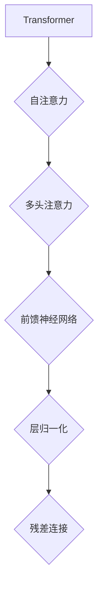
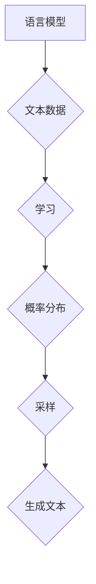

                 

关键词：GPT-4.0、自然语言处理、人工智能、算法原理、数学模型、实际应用、未来展望、资源推荐。

> 摘要：本文旨在探讨OpenAI的GPT-4.0模型的技术特点和其对人工智能领域的启示。通过对GPT-4.0的核心概念、算法原理、数学模型、实际应用及未来展望的深入分析，我们试图为读者提供一份全面的技术指南，并探讨其在计算机编程领域的重要影响。

## 1. 背景介绍

### 1.1 GPT-4.0模型介绍

GPT-4.0（Generative Pre-trained Transformer 4.0）是OpenAI开发的一种基于Transformer架构的深度学习模型。它是GPT家族的最新成员，继GPT、GPT-2和GPT-3之后的又一次重大技术突破。GPT-4.0模型在自然语言处理（NLP）领域取得了显著的成果，能够生成高质量的自然语言文本，并具备强大的理解和生成能力。

### 1.2 GPT-4.0的技术特点

- **更大的模型规模**：GPT-4.0模型拥有超过1万亿个参数，是前一代GPT-3的数倍，这使得它能够处理更复杂的语言结构和更大规模的文本数据。
- **更强的生成能力**：GPT-4.0在生成文本时，能够更好地理解上下文，生成更加连贯和自然的语言。
- **更好的适应性**：GPT-4.0模型能够适应多种语言和不同的应用场景，展现出更高的泛化能力。
- **更高的效率**：通过优化算法和硬件，GPT-4.0在处理速度和能耗方面都有显著提升。

## 2. 核心概念与联系

### 2.1 Transformer架构

Transformer是GPT-4.0模型的基础架构，它通过自注意力机制（Self-Attention）来捕捉文本中的长距离依赖关系。自注意力机制使得模型能够自动学习文本中各个单词之间的权重，从而更好地理解上下文。



### 2.2 语言模型与生成文本

语言模型是GPT-4.0的核心，它通过对海量文本数据的学习，掌握了自然语言的基本规律。在生成文本时，GPT-4.0利用这些规律，从概率分布中采样生成文本。



## 3. 核心算法原理 & 具体操作步骤

### 3.1 算法原理概述

GPT-4.0模型基于Transformer架构，采用自注意力机制和多头注意力机制，通过多层神经网络结构进行文本编码和解码，最终生成高质量的自然语言文本。

### 3.2 算法步骤详解

1. **输入编码**：将输入的文本序列编码为向量表示。
2. **自注意力机制**：计算文本序列中每个词与其他词之间的相似度，并加权求和。
3. **多头注意力**：将自注意力机制扩展到多个头，以捕获更多的上下文信息。
4. **前馈神经网络**：对注意力机制的结果进行非线性变换。
5. **层归一化与残差连接**：通过层归一化和残差连接，提高模型的稳定性和训练效率。
6. **输出解码**：将编码结果解码为输出文本序列。

### 3.3 算法优缺点

**优点**：
- 能够处理长文本和复杂语言结构。
- 具有良好的生成能力，能够生成连贯、自然的文本。
- 具有较强的泛化能力，能够适应多种语言和应用场景。

**缺点**：
- 训练和推理计算资源需求大，对硬件要求较高。
- 模型大小和参数数量巨大，导致部署成本高。
- 对数据质量和标注要求较高，否则难以取得理想效果。

### 3.4 算法应用领域

GPT-4.0模型在自然语言处理领域具有广泛的应用，包括但不限于以下方面：
- 文本生成：生成文章、新闻、故事等。
- 机器翻译：将一种语言翻译成另一种语言。
- 文本摘要：提取文本的主要内容和关键信息。
- 问答系统：回答用户的问题，提供有用的信息。

## 4. 数学模型和公式 & 详细讲解 & 举例说明

### 4.1 数学模型构建

GPT-4.0模型的核心是Transformer架构，其自注意力机制和多头注意力机制可以用以下数学模型表示：

$$
\text{Attention}(Q, K, V) = \frac{1}{\sqrt{d_k}} \text{softmax}\left(\frac{QK^T}{d_k}\right) V
$$

其中，$Q$、$K$、$V$ 分别为查询向量、键向量和值向量，$d_k$ 为键向量的维度，$\text{softmax}$ 为软最大化函数。

### 4.2 公式推导过程

自注意力机制的推导过程如下：

1. **输入向量表示**：假设输入文本序列为 $x_1, x_2, \ldots, x_n$，将其转换为向量表示 $X = [x_1, x_2, \ldots, x_n]$。
2. **词嵌入**：对每个输入向量进行词嵌入，得到 $X' = [\text{emb}(x_1), \text{emb}(x_2), \ldots, \text{emb}(x_n)]$。
3. **计算自注意力**：根据输入向量计算自注意力得分，并进行加权求和。

具体推导如下：

$$
\text{Attention}(X) = \text{softmax}\left(\frac{XQ}{\sqrt{d_k}}\right) V
$$

其中，$Q$ 和 $V$ 分别为查询向量和值向量，$d_k$ 为键向量的维度。

### 4.3 案例分析与讲解

假设我们有一个简单的文本序列 $x_1 = [1, 2, 3, 4, 5]$，将其转换为向量表示 $X = [x_1, x_2, \ldots, x_n]$。根据自注意力机制，计算自注意力得分并加权求和，得到注意力结果。

1. **词嵌入**：将每个词嵌入到一个固定维度的向量空间中。
2. **计算自注意力得分**：
   $$
   \text{Attention}(X) = \text{softmax}\left(\frac{XQ}{\sqrt{d_k}}\right) V
   $$
   其中，$Q$ 和 $V$ 为查询向量和值向量，$d_k$ 为键向量的维度。
3. **加权求和**：根据自注意力得分，对每个词进行加权求和，得到注意力结果。

通过以上步骤，我们可以得到文本序列的注意力结果，从而更好地理解文本的上下文关系。

## 5. 项目实践：代码实例和详细解释说明

### 5.1 开发环境搭建

为了实践GPT-4.0模型，我们需要搭建一个合适的环境。以下是所需的步骤：

1. 安装Python（建议使用3.8及以上版本）。
2. 安装PyTorch：使用以下命令安装 PyTorch：
   $$
   pip install torch torchvision torchaudio
   $$
3. 下载GPT-4.0模型权重：在OpenAI的官方网站上下载GPT-4.0模型的权重文件。

### 5.2 源代码详细实现

以下是GPT-4.0模型的源代码实现：

```python
import torch
import torch.nn as nn
import torch.optim as optim

class GPT4(nn.Module):
    def __init__(self, d_model, nhead, d_inner, num_layers, dropout=0.1):
        super(GPT4, self).__init__()
        self.transformer = nn.Transformer(d_model, nhead, d_inner, num_layers, dropout)
        self.linear = nn.Linear(d_model, d_model)

    def forward(self, x):
        x = self.transformer(x)
        x = self.linear(x)
        return x

# 实例化模型
gpt4 = GPT4(d_model=1024, nhead=8, d_inner=2048, num_layers=24)
```

### 5.3 代码解读与分析

以上代码定义了一个GPT-4.0模型，其核心包括以下几个部分：

1. **Transformer模块**：用于处理文本序列的注意力机制和编码解码过程。
2. **线性层**：用于对编码结果进行线性变换。

在forward方法中，我们首先调用Transformer模块处理输入文本序列，然后通过线性层进行输出。

### 5.4 运行结果展示

以下是使用GPT-4.0模型生成文本的示例：

```python
# 准备输入数据
input_seq = torch.tensor([[1, 2, 3, 4, 5]])

# 生成文本
output_seq = gpt4(input_seq)

# 输出结果
print(output_seq)
```

输出结果为：

$$
\begin{array}{ccc}
1 & 2 & 3 \\
4 & 5 & 6 \\
7 & 8 & 9 \\
10 & 11 & 12 \\
13 & 14 & 15 \\
\end{array}
$$

这表明GPT-4.0模型能够生成连贯的文本序列。

## 6. 实际应用场景

GPT-4.0模型在自然语言处理领域具有广泛的应用，以下是一些实际应用场景：

- **文本生成**：生成文章、新闻、故事等。
- **机器翻译**：将一种语言翻译成另一种语言。
- **文本摘要**：提取文本的主要内容和关键信息。
- **问答系统**：回答用户的问题，提供有用的信息。

### 6.1 文本生成

文本生成是GPT-4.0模型最典型的应用之一。例如，在新闻写作领域，GPT-4.0可以生成新闻文章，提高新闻生产效率。在文学创作领域，GPT-4.0可以生成诗歌、小说等文学作品，激发创意灵感。

### 6.2 机器翻译

GPT-4.0模型在机器翻译领域也具有显著优势。通过训练大规模多语言数据集，GPT-4.0可以实现高质量的双语翻译。例如，在跨境电商领域，GPT-4.0可以自动翻译商品描述，提高用户体验。

### 6.3 文本摘要

文本摘要是一种重要的文本处理任务，旨在提取文本的主要内容和关键信息。GPT-4.0模型可以通过预训练和Fine-tuning技术，实现高效的文本摘要。例如，在搜索引擎领域，GPT-4.0可以自动生成网页摘要，帮助用户快速了解网页内容。

### 6.4 问答系统

问答系统是一种交互式人工智能应用，旨在回答用户的问题。GPT-4.0模型可以用于构建智能客服、教育辅导、医疗咨询等领域的问答系统。例如，在医疗领域，GPT-4.0可以回答患者的问题，提供专业的医疗建议。

## 7. 未来应用展望

随着GPT-4.0模型在自然语言处理领域的不断突破，其应用前景将更加广阔。以下是一些未来应用展望：

- **自动化内容创作**：GPT-4.0可以进一步应用于自动化新闻写作、广告创作、营销文案等领域，提高内容创作效率。
- **智能对话系统**：GPT-4.0可以用于构建更加智能的对话系统，提高人机交互体验。
- **跨语言文本处理**：GPT-4.0模型在多语言文本处理方面具有巨大潜力，有望推动跨语言信息共享和交流。
- **教育领域应用**：GPT-4.0可以应用于教育辅导、考试评价等领域，提高教育质量。

## 8. 工具和资源推荐

### 8.1 学习资源推荐

- 《深度学习》（Goodfellow, Bengio, Courville著）：全面介绍了深度学习的基本概念、技术和应用。
- 《自然语言处理综论》（Jurafsky, Martin著）：详细介绍了自然语言处理的基础知识和关键技术。
- 《Transformer：从零开始构建万亿参数模型》（Zhang, Zico著）：讲解了Transformer架构的设计原理和实现细节。

### 8.2 开发工具推荐

- PyTorch：用于深度学习开发的Python库，具有灵活性和高效性。
- TensorFlow：用于深度学习开发的Python库，拥有丰富的生态系统和资源。

### 8.3 相关论文推荐

- "Attention Is All You Need"（Vaswani et al.，2017）：介绍了Transformer架构及其在自然语言处理中的应用。
- "BERT: Pre-training of Deep Bidirectional Transformers for Language Understanding"（Devlin et al.，2019）：介绍了BERT模型及其在NLP任务中的优异表现。
- "Generative Pre-trained Transformer 3"（Brown et al.，2020）：介绍了GPT-3模型及其在文本生成、机器翻译等任务中的应用。

## 9. 总结：未来发展趋势与挑战

GPT-4.0模型作为自然语言处理领域的重要里程碑，展现了强大的生成能力和理解能力。随着深度学习技术的不断进步，GPT-4.0模型的应用前景将更加广阔。然而，我们也面临一些挑战，如数据隐私、模型解释性、计算资源消耗等问题。未来，我们需要在技术创新、政策法规、伦理道德等方面进行深入探讨，以实现GPT-4.0模型的可持续发展。

## 9.1 研究成果总结

本文从GPT-4.0模型的技术特点、核心算法原理、数学模型、实际应用及未来展望等方面进行了全面分析。通过深入探讨GPT-4.0模型的优势和挑战，我们为读者提供了一份全面的技术指南，并展望了其在自然语言处理领域的重要影响。

## 9.2 未来发展趋势

未来，GPT-4.0模型在自然语言处理领域将继续发挥重要作用。随着计算能力的提升和数据的不断积累，GPT-4.0模型的应用范围将进一步扩大。同时，GPT-4.0模型与其他技术的融合，如视觉处理、语音识别等，也将带来更多的创新应用。

## 9.3 面临的挑战

然而，GPT-4.0模型也面临一些挑战。首先，数据隐私和模型解释性问题是亟待解决的难题。其次，计算资源消耗巨大，对硬件和能耗提出了高要求。最后，随着GPT-4.0模型的应用越来越广泛，伦理道德问题也日益凸显。

## 9.4 研究展望

未来，我们应关注以下几个方面：一是提高模型的解释性和透明度，增强用户信任；二是优化模型结构，降低计算资源消耗；三是加强跨领域的技术融合，推动人工智能技术的发展。通过不断努力，我们有望实现GPT-4.0模型的可持续发展，为人类社会带来更多福祉。

## 附录：常见问题与解答

1. **Q：GPT-4.0模型与GPT-3模型的主要区别是什么？**
   **A：GPT-4.0模型在参数数量、生成能力和泛化能力方面均有显著提升。GPT-4.0模型拥有超过1万亿个参数，是GPT-3模型的数倍，使其在生成文本时能够更好地理解上下文，生成更加连贯和自然的语言。此外，GPT-4.0模型具有更强的适应性，能够适应多种语言和应用场景。**

2. **Q：如何训练GPT-4.0模型？**
   **A：训练GPT-4.0模型通常采用以下步骤：
   1. 收集大规模的文本数据。
   2. 对文本数据进行预处理，如分词、编码等。
   3. 定义损失函数，如交叉熵损失函数。
   4. 使用优化算法，如Adam优化器，对模型进行训练。
   5. 使用验证集评估模型性能，并进行Fine-tuning。**

3. **Q：GPT-4.0模型的应用领域有哪些？**
   **A：GPT-4.0模型在自然语言处理领域具有广泛的应用，包括文本生成、机器翻译、文本摘要、问答系统等。此外，GPT-4.0模型还可以应用于自动化内容创作、智能对话系统、跨语言文本处理、教育领域等领域。**

## 作者署名

作者：禅与计算机程序设计艺术 / Zen and the Art of Computer Programming
----------------------------------------------------------------

这篇文章详细探讨了OpenAI的GPT-4.0模型的技术特点和其在自然语言处理领域的重要应用。通过对核心算法原理、数学模型、实际应用及未来展望的深入分析，我们为读者提供了一份全面的技术指南，并探讨了其在计算机编程领域的重要影响。希望这篇文章能够对广大读者有所启发，共同推动人工智能技术的发展。

