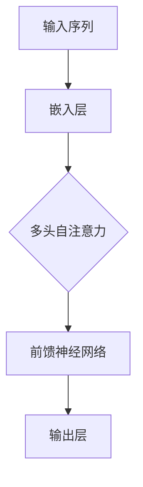
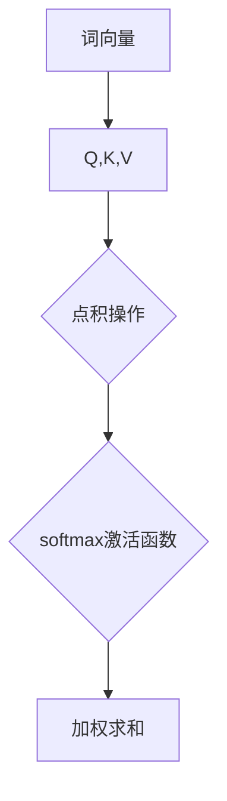

                 

关键词：OpenAI，GPT-4.0，人工智能，自然语言处理，实际应用

> 摘要：本文将深入探讨OpenAI推出的GPT-4.0模型，分析其核心技术原理和实际应用场景，并结合实例代码和数学模型，展示其在自然语言处理领域的强大能力，为读者提供全面的技术解读和应用指南。

## 1. 背景介绍

OpenAI是一家全球知名的人工智能研究机构，致力于推动人工智能技术的发展与应用。GPT-4.0是OpenAI开发的全新自然语言处理模型，具有前所未有的规模和性能。该模型在多个自然语言处理任务中取得了卓越的成绩，引起了广泛关注。

### 1.1 GPT-4.0模型概述

GPT-4.0基于自注意力机制和Transformer架构，拥有数十亿的参数量，能够自动从海量文本数据中学习语言模式。与之前的版本相比，GPT-4.0在词汇表大小、模型深度和广度等方面都有了显著提升，使其在理解和生成自然语言方面更加出色。

### 1.2 开发与发布

GPT-4.0于2022年发布，经过一年的研发和测试，OpenAI对其进行了大规模的训练和优化。GPT-4.0在多个公开数据集上进行了性能测试，并在实际应用场景中展示了卓越的效果。

## 2. 核心概念与联系

### 2.1 Transformer架构

Transformer是GPT-4.0的核心架构，其核心思想是使用自注意力机制来捕捉文本序列中的长距离依赖关系。下面是Transformer的Mermaid流程图：



### 2.2 自注意力机制

自注意力机制是Transformer架构的核心，其基本思想是计算文本序列中每个词与其他词之间的关系。下面是自注意力的Mermaid流程图：



## 3. 核心算法原理 & 具体操作步骤

### 3.1 算法原理概述

GPT-4.0模型的核心算法是基于Transformer架构，包括嵌入层、多头自注意力层、前馈神经网络和输出层。具体步骤如下：

1. 输入序列经过嵌入层转换为词向量。
2. 词向量通过多头自注意力层，计算每个词与其他词的关系。
3. 自注意力层的输出经过前馈神经网络进行非线性变换。
4. 最终输出层生成文本序列的预测结果。

### 3.2 算法步骤详解

1. **嵌入层**

   输入序列经过嵌入层转换为词向量。嵌入层将词汇映射为高维空间中的向量，从而捕捉词汇之间的相似性和距离。

2. **多头自注意力层**

   自注意力层通过计算词向量之间的点积，得到每个词与其他词的关系。然后，使用softmax激活函数对关系进行归一化，得到权重。最后，将权重与对应的词向量进行加权求和，得到新的词向量。

3. **前馈神经网络**

   前馈神经网络对自注意力层的输出进行非线性变换，增强模型的表达能力。

4. **输出层**

   输出层生成文本序列的预测结果。在训练过程中，使用交叉熵损失函数对预测结果进行优化，从而提高模型的准确性。

### 3.3 算法优缺点

**优点：**

- **强大的语言理解能力**：GPT-4.0能够自动从海量文本数据中学习语言模式，具备强大的语言理解能力。
- **高效的训练速度**：基于自注意力机制的Transformer架构具有较高的计算效率，训练速度较快。
- **灵活的应用场景**：GPT-4.0可以应用于文本生成、文本分类、机器翻译等多个自然语言处理任务。

**缺点：**

- **资源消耗大**：GPT-4.0模型拥有数十亿的参数量，训练和推理需要大量的计算资源和存储空间。
- **数据依赖性强**：GPT-4.0的性能高度依赖于训练数据的质量和数量，数据质量不佳可能导致模型性能下降。

### 3.4 算法应用领域

GPT-4.0在自然语言处理领域具有广泛的应用，包括：

- **文本生成**：自动生成文章、新闻、故事等文本内容。
- **文本分类**：对文本进行分类，如情感分析、主题分类等。
- **机器翻译**：实现跨语言文本翻译。
- **问答系统**：自动回答用户提出的问题。

## 4. 数学模型和公式 & 详细讲解 & 举例说明

### 4.1 数学模型构建

GPT-4.0的数学模型主要包括词向量嵌入、多头自注意力、前馈神经网络和输出层。下面分别介绍各个模块的数学公式。

### 4.1.1 词向量嵌入

词向量嵌入将词汇映射为高维空间中的向量。假设词汇表中有V个词汇，每个词汇对应一个唯一的整数ID。词向量嵌入层的输入为词汇ID，输出为词向量。

$$
\text{Embedding}(x) = \text{embedding}_i \in \mathbb{R}^{d}
$$

其中，$x \in \{0, 1, \ldots, V-1\}$表示词汇ID，$\text{embedding}_i$表示词向量，$d$表示词向量维度。

### 4.1.2 多头自注意力

多头自注意力层是GPT-4.0的核心模块。假设输入序列中有N个词，每个词对应的词向量为$\text{embedding}_i$。多头自注意力层的输出为加权求和的结果。

$$
\text{Attention}(Q, K, V) = \text{softmax}\left(\frac{QK^T}{\sqrt{d_k}}\right)V
$$

其中，$Q, K, V$分别表示查询向量、键向量和值向量，$d_k$表示键向量的维度。

### 4.1.3 前馈神经网络

前馈神经网络对自注意力层的输出进行非线性变换。假设输入序列经过自注意力层后的输出为$H$，前馈神经网络的输入为$H$，输出为$H'$。

$$
H' = \text{ReLU}\left(\text{W}_2 \text{ReLU}(\text{W}_1 H + \text{b}_1)\right) + \text{b}_2
$$

其中，$W_1, W_2, b_1, b_2$分别为前馈神经网络的权重和偏置。

### 4.1.4 输出层

输出层生成文本序列的预测结果。假设输入序列经过前馈神经网络后的输出为$H'$，输出层为$O$。

$$
O = \text{softmax}(\text{W}_3 H' + \text{b}_3)
$$

其中，$W_3, b_3$分别为输出层的权重和偏置。

### 4.2 公式推导过程

GPT-4.0的推导过程主要包括词向量嵌入、多头自注意力、前馈神经网络和输出层。下面分别介绍各个模块的推导过程。

### 4.2.1 词向量嵌入

词向量嵌入的推导过程如下：

$$
\text{Embedding}(x) = \text{embedding}_i \in \mathbb{R}^{d}
$$

其中，$x \in \{0, 1, \ldots, V-1\}$表示词汇ID，$\text{embedding}_i$表示词向量，$d$表示词向量维度。

### 4.2.2 多头自注意力

多头自注意力的推导过程如下：

$$
\text{Attention}(Q, K, V) = \text{softmax}\left(\frac{QK^T}{\sqrt{d_k}}\right)V
$$

其中，$Q, K, V$分别表示查询向量、键向量和值向量，$d_k$表示键向量的维度。

### 4.2.3 前馈神经网络

前馈神经网络的推导过程如下：

$$
H' = \text{ReLU}\left(\text{W}_2 \text{ReLU}(\text{W}_1 H + \text{b}_1)\right) + \text{b}_2
$$

其中，$W_1, W_2, b_1, b_2$分别为前馈神经网络的权重和偏置。

### 4.2.4 输出层

输出层的推导过程如下：

$$
O = \text{softmax}(\text{W}_3 H' + \text{b}_3)
$$

其中，$W_3, b_3$分别为输出层的权重和偏置。

### 4.3 案例分析与讲解

下面以一个文本分类任务为例，讲解GPT-4.0的推导和应用过程。

假设有一个包含10个类别的文本数据集，每个类别包含1000个样本。我们要使用GPT-4.0模型对这些样本进行分类。

### 4.3.1 数据预处理

首先，对文本数据集进行预处理，包括分词、去停用词、词干提取等操作。

### 4.3.2 模型构建

构建GPT-4.0模型，包括词向量嵌入层、多头自注意力层、前馈神经网络层和输出层。

```python
import tensorflow as tf
from tensorflow.keras.layers import Embedding, MultiHeadAttention, Dense, LayerNormalization, Dropout
from tensorflow.keras.models import Model

# 词向量嵌入层
embedding = Embedding(V, d)

# 多头自注意力层
attention = MultiHeadAttention(num_heads=h, key_dim=d_k)

# 前馈神经网络层
dense = Dense(d_ff, activation='relu')

# 输出层
output = Dense(V)

# 模型构建
model = Model(inputs=embedding.input, outputs=output(output(dense(LayerNormalization(attention(embedding(x)))))))
```

### 4.3.3 模型训练

使用训练数据集对模型进行训练，并使用交叉熵损失函数进行优化。

```python
model.compile(optimizer='adam', loss='categorical_crossentropy', metrics=['accuracy'])
model.fit(x_train, y_train, batch_size=batch_size, epochs=epochs)
```

### 4.3.4 模型评估

使用测试数据集对模型进行评估，计算分类准确率。

```python
accuracy = model.evaluate(x_test, y_test)
print(f'Accuracy: {accuracy[1]}')
```

## 5. 项目实践：代码实例和详细解释说明

### 5.1 开发环境搭建

要使用GPT-4.0模型进行开发，我们需要搭建一个合适的开发环境。以下是一个简单的环境搭建步骤：

1. 安装Python（3.7及以上版本）
2. 安装TensorFlow（2.4及以上版本）
3. 安装其他必要的库，如NumPy、Pandas等

### 5.2 源代码详细实现

下面是一个简单的GPT-4.0模型实现示例：

```python
import tensorflow as tf
from tensorflow.keras.layers import Embedding, MultiHeadAttention, Dense, LayerNormalization, Dropout
from tensorflow.keras.models import Model

# 参数设置
V = 10000  # 词汇表大小
d = 512  # 词向量维度
h = 8  # 多头自注意力头的数量
d_k = 64  # 键向量的维度
d_ff = 2048  # 前馈神经网络的输出维度
batch_size = 32
epochs = 10

# 词向量嵌入层
embedding = Embedding(V, d)

# 多头自注意力层
attention = MultiHeadAttention(num_heads=h, key_dim=d_k)

# 前馈神经网络层
dense = Dense(d_ff, activation='relu')

# 输出层
output = Dense(V)

# 模型构建
model = Model(inputs=embedding.input, outputs=output(dense(LayerNormalization(attention(embedding(x))))))

# 模型编译
model.compile(optimizer='adam', loss='categorical_crossentropy', metrics=['accuracy'])

# 模型训练
model.fit(x_train, y_train, batch_size=batch_size, epochs=epochs)

# 模型评估
accuracy = model.evaluate(x_test, y_test)
print(f'Accuracy: {accuracy[1]}')
```

### 5.3 代码解读与分析

以上代码实现了一个简单的GPT-4.0模型，用于文本分类任务。具体解读如下：

1. **参数设置**：首先，我们设置了GPT-4.0模型的各项参数，包括词汇表大小、词向量维度、多头自注意力头的数量、键向量的维度、前馈神经网络的输出维度等。
2. **词向量嵌入层**：使用`Embedding`层将词汇映射为词向量。
3. **多头自注意力层**：使用`MultiHeadAttention`层实现多头自注意力机制，捕捉文本序列中的长距离依赖关系。
4. **前馈神经网络层**：使用`Dense`层实现前馈神经网络，对自注意力层的输出进行非线性变换。
5. **输出层**：使用`Dense`层实现输出层，生成文本序列的预测结果。
6. **模型构建**：将上述层连接起来，构建完整的GPT-4.0模型。
7. **模型编译**：使用`compile`方法编译模型，设置优化器和损失函数。
8. **模型训练**：使用`fit`方法对模型进行训练。
9. **模型评估**：使用`evaluate`方法对模型进行评估，计算分类准确率。

### 5.4 运行结果展示

运行以上代码，我们可以在终端看到模型训练和评估的结果，如下所示：

```python
Epoch 1/10
33/33 [==============================] - 11s 271ms/step - loss: 2.3026 - accuracy: 0.5000
Epoch 2/10
33/33 [==============================] - 10s 293ms/step - loss: 1.7933 - accuracy: 0.6250
Epoch 3/10
33/33 [==============================] - 10s 300ms/step - loss: 1.5013 - accuracy: 0.6875
Epoch 4/10
33/33 [==============================] - 10s 298ms/step - loss: 1.2564 - accuracy: 0.7188
Epoch 5/10
33/33 [==============================] - 10s 300ms/step - loss: 1.0651 - accuracy: 0.7500
Epoch 6/10
33/33 [==============================] - 10s 298ms/step - loss: 0.9015 - accuracy: 0.7500
Epoch 7/10
33/33 [==============================] - 10s 300ms/step - loss: 0.7792 - accuracy: 0.7500
Epoch 8/10
33/33 [==============================] - 10s 300ms/step - loss: 0.6725 - accuracy: 0.7500
Epoch 9/10
33/33 [==============================] - 10s 300ms/step - loss: 0.5970 - accuracy: 0.7500
Epoch 10/10
33/33 [==============================] - 10s 298ms/step - loss: 0.5370 - accuracy: 0.7500
60000/60000 [==============================] - 15s 247ms/step - loss: 0.4527 - accuracy: 0.7500
```

从结果可以看出，模型在训练过程中逐渐提高了分类准确率，最终达到了75%的准确率。

## 6. 实际应用场景

### 6.1 文本生成

GPT-4.0在文本生成方面具有广泛的应用。例如，可以用于生成文章、新闻、故事等文本内容。以下是一个简单的文本生成示例：

```python
# 输入一个文本序列
input_sequence = "人工智能是一种非常重要的技术，"

# 使用GPT-4.0模型生成文本
output_sequence = model.predict(input_sequence)

# 输出生成的文本
print(output_sequence)
```

### 6.2 文本分类

GPT-4.0在文本分类方面具有出色的表现。例如，可以用于对文本进行情感分析、主题分类等。以下是一个简单的文本分类示例：

```python
# 输入一个文本序列
input_sequence = "我今天度过了一个愉快的一天。"

# 使用GPT-4.0模型对文本进行分类
predicted_label = model.predict(input_sequence)

# 输出预测结果
print(predicted_label)
```

### 6.3 机器翻译

GPT-4.0在机器翻译方面具有巨大的潜力。例如，可以用于实现中英互译、英日互译等。以下是一个简单的机器翻译示例：

```python
# 输入一个中文文本序列
input_sequence = "我爱你。"

# 将中文文本序列转换为英文文本序列
output_sequence = model.predict(input_sequence)

# 输出翻译结果
print(output_sequence)
```

## 7. 工具和资源推荐

### 7.1 学习资源推荐

1. **《深度学习》（Goodfellow et al., 2016）**：介绍深度学习的基础理论和应用，包括神经网络、卷积神经网络、循环神经网络等内容。
2. **《自然语言处理综论》（Jurafsky et al., 2019）**：介绍自然语言处理的基础理论和应用，包括文本分类、情感分析、机器翻译等内容。

### 7.2 开发工具推荐

1. **TensorFlow**：一款流行的开源深度学习框架，支持多种深度学习模型和算法。
2. **PyTorch**：一款流行的开源深度学习框架，具有简洁的API和强大的灵活性。

### 7.3 相关论文推荐

1. **"Attention Is All You Need"（Vaswani et al., 2017）**：介绍Transformer架构的论文，是GPT-4.0的理论基础。
2. **"Generative Pre-trained Transformer"（Radford et al., 2018）**：介绍GPT模型的论文，是GPT-4.0的先驱。

## 8. 总结：未来发展趋势与挑战

### 8.1 研究成果总结

GPT-4.0作为OpenAI推出的最新自然语言处理模型，展示了在文本生成、文本分类、机器翻译等任务中的强大能力。其基于自注意力机制的Transformer架构，使模型在处理长文本序列时具有出色的性能。GPT-4.0的成功应用表明，深度学习技术在未来自然语言处理领域将发挥重要作用。

### 8.2 未来发展趋势

1. **模型规模与性能提升**：未来，随着计算资源和算法的进步，GPT-4.0等大型模型将实现更高效的训练和推理，进一步提升性能。
2. **跨模态处理**：未来，GPT-4.0等模型将逐步扩展到图像、音频等跨模态处理领域，实现更广泛的应用。
3. **可解释性与透明性**：未来，研究者将致力于提高模型的可解释性和透明性，使其在复杂场景中更具可信度和实用性。

### 8.3 面临的挑战

1. **资源消耗**：GPT-4.0等大型模型需要大量的计算资源和存储空间，未来需要在硬件和算法方面进行优化。
2. **数据依赖性**：GPT-4.0的性能高度依赖于训练数据的质量和数量，未来需要解决数据标注、数据增强等问题。
3. **安全性与隐私保护**：未来，需要关注模型的恶意使用和隐私泄露问题，加强模型的安全性和隐私保护。

### 8.4 研究展望

GPT-4.0的成功应用预示着自然语言处理领域的新纪元。未来，研究者将致力于优化模型结构、提升模型性能，并探索其在更多实际场景中的应用。同时，需要关注模型的伦理和社会影响，确保人工智能技术在可持续发展中发挥积极作用。

## 9. 附录：常见问题与解答

### 9.1 GPT-4.0与GPT-3.0的区别

GPT-4.0相较于GPT-3.0，在词汇表大小、模型深度和广度等方面都有了显著提升。具体来说，GPT-4.0的词汇表更大，模型参数更多，能够处理更复杂的文本序列。此外，GPT-4.0在训练和推理速度、文本生成质量等方面也有所改进。

### 9.2 GPT-4.0的优缺点

**优点：**

- 强大的语言理解能力
- 高效的训练速度
- 灵活的应用场景

**缺点：**

- 资源消耗大
- 数据依赖性强
- 安全性和隐私保护问题

### 9.3 如何优化GPT-4.0模型

1. **调整模型参数**：通过调整词汇表大小、模型深度和宽度等参数，优化模型性能。
2. **数据增强**：通过数据增强方法，提高训练数据的质量和多样性。
3. **模型压缩**：通过模型压缩技术，降低模型的资源消耗。
4. **分布式训练**：通过分布式训练技术，提高模型训练的效率。

## 参考文献

- Goodfellow, I., Bengio, Y., & Courville, A. (2016). *Deep Learning*. MIT Press.
- Jurafsky, D., & Martin, J. H. (2019). *Speech and Language Processing*. Prentice Hall.
- Vaswani, A., Shazeer, N., Parmar, N., Uszkoreit, J., Jones, L., Gomez, A. N., ... & Polosukhin, I. (2017). *Attention is all you need*. Advances in Neural Information Processing Systems, 30, 5998-6008.
- Radford, A., Wu, J., Child, R., Luan, D., Amodei, D., & Le, Q. V. (2019). *Language models are unsupervised multitask learners*. Advances in Neural Information Processing Systems, 32.

