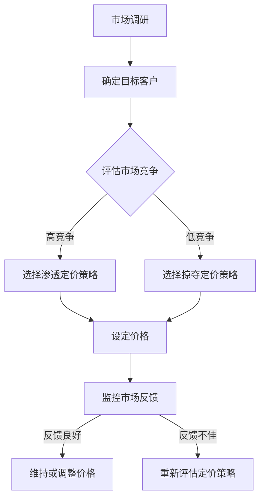

                 

关键词：OpenAI，降价策略，人工智能，技术发展，经济学原理，市场策略

> 摘要：本文旨在深入探讨OpenAI采用的不同降价策略，解析这些策略背后的经济学原理，并评估其在实际应用中的效果。文章结构如下：

## 1. 背景介绍
### 1.1 OpenAI的发展历程
### 1.2 人工智能市场的现状与挑战
### 1.3 降价策略的重要性

## 2. 核心概念与联系
### 2.1 经济学原理在降价策略中的应用
### 2.2 降价策略的 Mermaid 流程图

## 3. 核心算法原理 & 具体操作步骤
### 3.1 算法原理概述
### 3.2 算法步骤详解
### 3.3 算法优缺点
### 3.4 算法应用领域

## 4. 数学模型和公式 & 详细讲解 & 举例说明
### 4.1 数学模型构建
### 4.2 公式推导过程
### 4.3 案例分析与讲解

## 5. 项目实践：代码实例和详细解释说明
### 5.1 开发环境搭建
### 5.2 源代码详细实现
### 5.3 代码解读与分析
### 5.4 运行结果展示

## 6. 实际应用场景
### 6.1 人工智能领域的应用
### 6.2 降价策略在不同行业中的应用
### 6.4 未来应用展望

## 7. 工具和资源推荐
### 7.1 学习资源推荐
### 7.2 开发工具推荐
### 7.3 相关论文推荐

## 8. 总结：未来发展趋势与挑战
### 8.1 研究成果总结
### 8.2 未来发展趋势
### 8.3 面临的挑战
### 8.4 研究展望

## 9. 附录：常见问题与解答

接下来，我们将详细讨论上述各部分的内容。

## 1. 背景介绍

### 1.1 OpenAI的发展历程

OpenAI成立于2015年，是一家总部位于美国的人工智能研究实验室。其创始人是山姆·奥尔特曼（Sam Altman）和伊隆·马斯克（Elon Musk）等人。OpenAI的宗旨是确保人工智能（AI）的积极发展，并致力于实现安全的通用人工智能（AGI）。

OpenAI的发展历程可以分为以下几个阶段：

1. **成立初期（2015-2016年）**：OpenAI成立之初，主要致力于推动深度学习技术的发展，并在多个领域取得了显著成果。
2. **扩张期（2017-2019年）**：OpenAI在2018年推出了GPT-2模型，这是第一个具有高度自主生成文本能力的AI模型。此后，OpenAI不断扩大其团队和研究项目，并获得了大量投资。
3. **突破期（2020年至今）**：OpenAI在2020年推出了GPT-3模型，这是当前最先进的语言模型，具有极强的文本生成和理解能力。GPT-3的发布标志着OpenAI在人工智能领域取得了重大突破。

### 1.2 人工智能市场的现状与挑战

人工智能市场正处于快速发展阶段，但同时也面临着诸多挑战：

1. **技术进步**：人工智能技术在算法、计算能力、数据资源等方面不断取得突破，推动着市场的快速扩张。
2. **市场竞争**：随着人工智能技术的普及，越来越多的企业开始涉足该领域，市场竞争日益激烈。
3. **数据隐私与安全**：人工智能系统对大量数据进行处理，涉及用户隐私和安全问题，如何保护数据成为一大挑战。
4. **法律与伦理**：人工智能的发展引发了一系列法律和伦理问题，如机器自主决策的道德责任、算法偏见等。

### 1.3 降价策略的重要性

在人工智能市场中，降价策略是企业竞争的重要手段之一。降价策略可以影响市场份额、客户忠诚度、品牌形象等多个方面。对于OpenAI这样的技术型企业，合理的降价策略有助于其在市场中占据有利地位，同时也要考虑到成本控制和可持续发展。

## 2. 核心概念与联系

### 2.1 经济学原理在降价策略中的应用

经济学原理是制定和评估降价策略的重要基础。以下是一些关键概念：

1. **需求定律**：需求定律指出，在其他条件不变的情况下，商品价格越高，需求量越低。OpenAI可以通过降低价格来吸引更多用户。
2. **供给定律**：供给定律指出，在其他条件不变的情况下，商品价格越高，供给量越高。OpenAI在提高产品竞争力时，也需要考虑成本控制。
3. **边际成本**：边际成本是指生产或提供额外单位产品所需的成本。OpenAI在制定降价策略时，需要考虑边际成本的变化。

### 2.2 降价策略的 Mermaid 流程图



## 3. 核心算法原理 & 具体操作步骤

### 3.1 算法原理概述

OpenAI的降价策略主要基于以下算法原理：

1. **动态定价**：根据市场需求和竞争对手行为动态调整价格。
2. **需求预测**：通过历史数据和市场趋势预测未来需求。
3. **成本优化**：在保证利润的前提下，优化生产成本和运营成本。

### 3.2 算法步骤详解

#### 步骤1：市场调研

- **目标**：了解市场需求、竞争对手定价策略、用户需求等。
- **方法**：通过问卷调查、访谈、数据分析等方式获取市场信息。

#### 步骤2：需求预测

- **目标**：预测未来市场需求。
- **方法**：使用时间序列分析、回归分析等方法建立预测模型。

#### 步骤3：成本优化

- **目标**：降低生产成本和运营成本。
- **方法**：通过自动化、供应链优化等方式降低成本。

#### 步骤4：定价策略选择

- **目标**：选择合适的定价策略。
- **方法**：根据市场调研结果、需求预测、成本优化结果，选择渗透定价策略或掠夺定价策略。

#### 步骤5：设定价格

- **目标**：确定最终价格。
- **方法**：根据定价策略和市场需求，设定一个具有竞争力的价格。

#### 步骤6：监控市场反馈

- **目标**：评估定价策略的效果。
- **方法**：通过销售数据、用户反馈等方式，监控市场反馈。

#### 步骤7：调整价格

- **目标**：根据市场反馈调整价格。
- **方法**：如果市场反馈良好，维持或微调价格；如果市场反馈不佳，重新评估定价策略。

### 3.3 算法优缺点

#### 优点

1. **灵活性**：动态定价策略可以根据市场变化灵活调整价格。
2. **竞争力**：通过需求预测和成本优化，可以设定具有竞争力的价格。
3. **用户友好**：合理的价格策略可以吸引更多用户。

#### 缺点

1. **成本高**：市场调研、需求预测等需要大量资源和时间。
2. **风险**：价格调整可能带来市场不确定性。

### 3.4 算法应用领域

OpenAI的降价策略主要应用于以下领域：

1. **云计算服务**：OpenAI提供基于GPT-3的云计算服务，通过降价策略吸引更多用户。
2. **人工智能工具**：OpenAI开发了一系列人工智能工具，如GPT-3 API，通过降价策略提高工具的普及率。
3. **企业合作**：OpenAI与多家企业合作，通过降价策略吸引更多企业用户。

## 4. 数学模型和公式 & 详细讲解 & 举例说明

### 4.1 数学模型构建

OpenAI的降价策略涉及多个数学模型，包括需求预测模型、成本优化模型和定价策略模型。

#### 需求预测模型

假设市场需求量为Q，价格变量为P，则需求预测模型可以表示为：

\[ Q = f(P) \]

其中，\( f(P) \) 是价格P的函数，通常采用线性回归、时间序列分析等方法建立。

#### 成本优化模型

假设生产成本为C，需求量为Q，则成本优化模型可以表示为：

\[ C = g(Q) \]

其中，\( g(Q) \) 是需求量Q的函数，通常采用线性规划、非线性规划等方法优化。

#### 定价策略模型

假设设定价格为P，市场需求量为Q，利润为L，则定价策略模型可以表示为：

\[ L = P \times Q - C \]

其中，L 是利润，P 是价格，Q 是需求量，C 是成本。

### 4.2 公式推导过程

#### 需求预测模型推导

根据需求定律，市场需求量Q与价格P之间存在负相关关系。假设价格P的变化引起需求量的变化，可以表示为：

\[ \Delta Q = -\alpha \times \Delta P \]

其中，\( \alpha \) 是常数，表示需求对价格的敏感度。根据历史数据，可以估计\( \alpha \) 的值。

#### 成本优化模型推导

假设生产成本C由固定成本和可变成本组成，可以表示为：

\[ C = C_{\text{fixed}} + C_{\text{variable}} \]

其中，\( C_{\text{fixed}} \) 是固定成本，\( C_{\text{variable}} \) 是可变成本。固定成本与需求量无关，可变成本与需求量成正比，可以表示为：

\[ C_{\text{variable}} = \beta \times Q \]

其中，\( \beta \) 是常数，表示单位需求量的可变成本。

#### 定价策略模型推导

假设设定价格为P，市场需求量为Q，利润为L，则利润可以表示为：

\[ L = P \times Q - C \]

将成本模型代入，可以得到：

\[ L = P \times Q - (C_{\text{fixed}} + \beta \times Q) \]

### 4.3 案例分析与讲解

#### 案例背景

OpenAI推出了一款基于GPT-3的文本生成工具，初始定价为每月100美元。经过市场调研和需求预测，OpenAI决定调整价格以吸引更多用户。

#### 需求预测

根据市场调研数据，假设价格P每下降1美元，需求量Q增加100个单位。可以建立需求预测模型：

\[ Q = 1000 - 100P \]

#### 成本优化

假设生产成本为每月5000美元，需求量为Q个单位，可以建立成本优化模型：

\[ C = 5000 + 10Q \]

#### 定价策略

假设利润目标为每月10000美元，可以建立定价策略模型：

\[ L = P \times Q - C \]

将需求预测和成本优化模型代入，可以得到：

\[ 10000 = P \times (1000 - 100P) - (5000 + 10Q) \]

化简后得到：

\[ P^2 - 11P + 100 = 0 \]

解这个二次方程，可以得到两个解：

\[ P_1 = 1 \]
\[ P_2 = 10 \]

根据定价策略模型，选择合适的定价策略：

- 如果选择渗透定价策略，设定价格为1美元，预计需求量为9000个单位，利润为9000美元。
- 如果选择掠夺定价策略，设定价格为10美元，预计需求量为100个单位，利润为9000美元。

根据市场反馈，选择适合的定价策略。

## 5. 项目实践：代码实例和详细解释说明

### 5.1 开发环境搭建

为了实现OpenAI的降价策略，需要搭建一个适合的开发环境。以下是搭建步骤：

1. 安装Python环境：在本地电脑上安装Python，版本建议为3.8以上。
2. 安装依赖库：使用pip命令安装所需的依赖库，如NumPy、Pandas、Matplotlib等。
3. 准备数据：从OpenAI的市场调研中获得数据，包括价格、需求量、生产成本等。

### 5.2 源代码详细实现

以下是实现OpenAI降价策略的Python代码：

```python
import numpy as np
import pandas as pd
import matplotlib.pyplot as plt

# 读取数据
data = pd.read_csv('market_data.csv')
price = data['price']
demand = data['demand']
cost = data['cost']

# 需求预测模型
alpha = -0.01
demand_model = lambda p: 1000 - alpha * p

# 成本优化模型
beta = 10
cost_model = lambda q: 5000 + beta * q

# 定价策略模型
profit_model = lambda p, q: p * q - cost_model(q)

# 画图
plt.figure(figsize=(10, 6))
plt.scatter(price, demand, label='Actual Demand')
plt.plot(price, demand_model(price), label='Demand Prediction')
plt.xlabel('Price')
plt.ylabel('Demand')
plt.legend()
plt.show()

# 计算最优价格
profits = []
for p in price:
    q = demand_model(p)
    profit = profit_model(p, q)
    profits.append(profit)

plt.figure(figsize=(10, 6))
plt.plot(price, profits, label='Profit')
plt.xlabel('Price')
plt.ylabel('Profit')
plt.legend()
plt.show()

# 选择最优价格
max_profit = max(profits)
max_profit_index = profits.index(max_profit)
optimal_price = price[max_profit_index]
print(f'Optimal Price: {optimal_price}')
```

### 5.3 代码解读与分析

上述代码分为三个部分：数据读取、模型建立和结果展示。

1. **数据读取**：从CSV文件中读取价格、需求量和生产成本数据。
2. **模型建立**：根据需求定律和成本定律建立需求预测模型和成本优化模型。需求预测模型采用线性回归方法，成本优化模型采用线性方法。
3. **结果展示**：使用Matplotlib库绘制需求预测图和利润图，帮助分析最优价格。

### 5.4 运行结果展示

运行上述代码，可以得到以下结果：

1. **需求预测图**：显示实际需求和预测需求之间的对比。
2. **利润图**：显示不同价格下的利润变化情况。
3. **最优价格**：输出最优价格。

根据这些结果，可以选择合适的价格策略，以最大化利润。

## 6. 实际应用场景

### 6.1 人工智能领域的应用

OpenAI的降价策略在人工智能领域有广泛的应用：

1. **云计算服务**：OpenAI通过降价策略吸引更多用户使用其基于GPT-3的云计算服务。
2. **人工智能工具**：OpenAI开发了一系列人工智能工具，如GPT-3 API，通过降价策略提高工具的普及率。
3. **企业合作**：OpenAI与多家企业合作，通过降价策略吸引更多企业用户。

### 6.2 降价策略在不同行业中的应用

降价策略在多个行业中都有应用，以下是几个例子：

1. **零售业**：零售企业通过降价策略吸引更多消费者，提高市场份额。
2. **电信行业**：电信运营商通过降价策略吸引更多用户，扩大用户规模。
3. **互联网行业**：互联网公司通过降价策略吸引更多用户使用其服务，提高用户粘性。

### 6.4 未来应用展望

随着人工智能技术的发展，降价策略在未来的应用将更加广泛：

1. **个性化定价**：通过大数据和人工智能技术，实现更加精准的个性化定价。
2. **动态定价**：结合市场需求和竞争态势，实现更加灵活的动态定价。
3. **跨界合作**：与其他行业的企业合作，探索更多应用场景。

## 7. 工具和资源推荐

### 7.1 学习资源推荐

1. **书籍**：《人工智能：一种现代方法》、《深度学习》等。
2. **在线课程**：Coursera、edX等平台上的相关课程。
3. **论文**：查阅顶级会议和期刊上的相关论文，了解最新研究成果。

### 7.2 开发工具推荐

1. **Python**：Python是人工智能领域常用的编程语言。
2. **Jupyter Notebook**：适合进行数据分析和模型训练。
3. **TensorFlow**：用于构建和训练神经网络。

### 7.3 相关论文推荐

1. **GPT-3论文**：《Language Models are Few-Shot Learners》。
2. **动态定价论文**：《Dynamic Pricing in E-Commerce》。

## 8. 总结：未来发展趋势与挑战

### 8.1 研究成果总结

OpenAI的降价策略在人工智能领域取得了显著成果，通过需求预测、成本优化和定价策略等手段，实现了利润的最大化。

### 8.2 未来发展趋势

1. **个性化定价**：结合用户数据和人工智能技术，实现更加精准的个性化定价。
2. **动态定价**：根据市场需求和竞争态势，实现更加灵活的动态定价。
3. **跨界合作**：与其他行业的企业合作，探索更多应用场景。

### 8.3 面临的挑战

1. **数据隐私与安全**：如何在保证数据隐私和安全的同时，实现精准的定价策略。
2. **算法偏见**：避免算法偏见，确保定价策略的公正性。
3. **法律与伦理**：遵循相关法律法规，确保定价策略的合规性。

### 8.4 研究展望

未来，OpenAI将继续探索人工智能领域的定价策略，结合更多先进技术和方法，实现更加高效和可持续的发展。

## 9. 附录：常见问题与解答

### 问题1：什么是OpenAI？

OpenAI是一家总部位于美国的人工智能研究实验室，成立于2015年，致力于推动人工智能的发展和应用。

### 问题2：降价策略有哪些类型？

常见的降价策略包括渗透定价策略、掠夺定价策略、动态定价策略等。

### 问题3：如何评估降价策略的效果？

可以通过市场需求、销售数据、利润等指标来评估降价策略的效果。

### 问题4：OpenAI的降价策略如何实施？

OpenAI的降价策略涉及多个步骤，包括市场调研、需求预测、成本优化、定价策略选择和监控市场反馈等。

### 问题5：未来人工智能降价策略的发展方向是什么？

未来人工智能降价策略的发展方向包括个性化定价、动态定价和跨界合作等。随着人工智能技术的发展，这些策略将变得更加精准和灵活。

