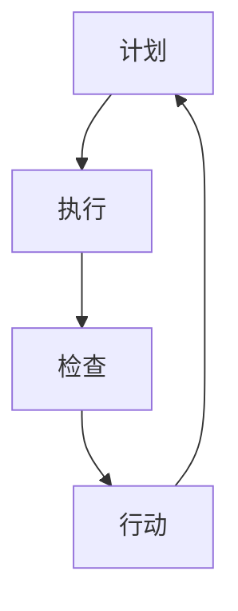

                 

在项目管理中，高效的问题解决和持续改进是项目成功的关键。PDCA循环，即计划（Plan）、执行（Do）、检查（Check）和行动（Act）循环，是一种经典的持续改进方法论。它被广泛应用于各种领域，包括IT项目管理。本文将详细探讨PDCA循环在项目管理中的应用，帮助项目经理和团队更好地理解和使用这一工具，以提高项目成功率。

## 关键词

- PDCA循环
- 项目管理
- 持续改进
- 问题解决

## 摘要

本文首先介绍了PDCA循环的背景和核心概念，然后详细阐述了其在项目管理中的应用步骤和关键点。通过案例分析，展示了PDCA循环在解决实际项目问题中的有效性。最后，本文提出了未来应用展望，并提供了相关资源和工具推荐。

## 1. 背景介绍

PDCA循环起源于20世纪30年代的美国质量管理领域，由统计学家沃特·亚罗和沃特·休哈特提出。他们发现，通过循环式的计划、执行、检查和行动，可以系统地解决质量问题，并不断提高产品和服务的质量。PDCA循环后来被广泛运用到各个领域，包括项目管理。

在项目管理中，PDCA循环是一种有效的持续改进工具。它可以帮助项目团队识别和解决问题，确保项目按计划进行，并不断提高项目质量和效率。PDCA循环的核心在于其循环性，即不断重复计划、执行、检查和行动的过程，从而实现持续改进。

## 2. 核心概念与联系

### 2.1 PDCA循环的基本原理

PDCA循环包括四个基本步骤：

1. **计划（Plan）**：确定项目目标、制定计划和策略，为执行做好准备。
2. **执行（Do）**：按照计划执行项目任务，实施项目策略。
3. **检查（Check）**：检查执行结果，与预期目标进行比较，评估项目绩效。
4. **行动（Act）**：根据检查结果，采取相应行动，改进项目过程，确保项目目标的实现。

### 2.2 PDCA循环的Mermaid流程图



在上述流程图中，A、B、C和D分别代表PDCA循环的四个步骤。箭头表示流程的连续性，即执行完一个步骤后，进入下一个步骤，形成一个闭环。

## 3. 核心算法原理 & 具体操作步骤

### 3.1 算法原理概述

PDCA循环的核心在于其循环性，即不断重复计划、执行、检查和行动的过程，从而实现持续改进。具体而言，PDCA循环通过以下四个步骤实现：

1. **计划（Plan）**：确定项目目标和制定行动计划，包括资源分配、时间表和关键里程碑。
2. **执行（Do）**：按照计划执行项目任务，确保项目按计划进行。
3. **检查（Check）**：检查项目执行结果，评估项目绩效，发现问题和不足。
4. **行动（Act）**：根据检查结果，采取相应行动，改进项目过程，确保项目目标的实现。

### 3.2 算法步骤详解

1. **计划（Plan）**：
   - 确定项目目标：明确项目的最终目标和阶段性目标。
   - 制定行动计划：制定详细的任务分配、时间表和资源计划。
   - 风险评估：识别项目风险，并制定相应的应对策略。

2. **执行（Do）**：
   - 按计划执行任务：确保项目团队按照既定的计划完成任务。
   - 沟通协调：保持团队内部和团队之间的沟通协调，确保项目顺利进行。

3. **检查（Check）**：
   - 项目绩效评估：定期评估项目进度和质量，与预期目标进行比较。
   - 问题识别：发现项目中的问题和不足，分析原因。

4. **行动（Act）**：
   - 采取纠正措施：根据检查结果，采取相应措施纠正项目中的问题和不足。
   - 改进项目过程：总结经验教训，改进项目过程，提高项目质量和效率。

### 3.3 算法优缺点

**优点**：
- 系统性：PDCA循环提供了一种系统性的方法，帮助团队识别和解决问题。
- 持续改进：PDCA循环强调持续改进，有助于不断提高项目质量和效率。
- 适用性广泛：PDCA循环适用于各种类型的项目，特别是在复杂项目中，有助于提高项目管理效率。

**缺点**：
- 时间成本：PDCA循环需要投入一定的时间和资源，特别是在项目初期。
- 需要熟练掌握：团队成员需要熟练掌握PDCA循环的方法和技巧，否则可能无法充分发挥其作用。

### 3.4 算法应用领域

PDCA循环广泛应用于项目管理、产品开发、质量管理和流程改进等领域。在项目管理中，PDCA循环可以帮助团队识别和解决问题，确保项目按计划进行。在产品开发中，PDCA循环可以帮助团队不断改进产品设计，提高产品质量。在质量管理中，PDCA循环可以帮助企业提高产品和服务质量，满足客户需求。在流程改进中，PDCA循环可以帮助企业优化业务流程，提高生产效率。

## 4. 数学模型和公式 & 详细讲解 & 举例说明

### 4.1 数学模型构建

PDCA循环的数学模型可以表示为：

$$
\text{项目绩效} = f(\text{计划质量}, \text{执行效率}, \text{检查准确度}, \text{行动效果})
$$

其中，项目绩效是PDCA循环的输出，计划质量、执行效率、检查准确度和行动效果是PDCA循环的输入。通过调整这些输入参数，可以优化项目绩效。

### 4.2 公式推导过程

PDCA循环的推导过程如下：

1. **计划质量**：计划质量是项目目标的具体体现，它是项目成功的基石。计划质量越高，项目成功的可能性越大。
2. **执行效率**：执行效率是项目团队在执行任务时的表现。执行效率越高，项目完成的越快。
3. **检查准确度**：检查准确度是项目团队在检查项目执行结果时的准确性。检查准确度越高，发现问题和不足的可能性越大。
4. **行动效果**：行动效果是项目团队在采取纠正措施后的效果。行动效果越好，项目改进越彻底。

通过以上分析，可以得到PDCA循环的数学模型。

### 4.3 案例分析与讲解

以一个软件开发项目为例，说明PDCA循环的具体应用。

1. **计划（Plan）**：
   - 确定项目目标：开发一个功能完整的软件系统。
   - 制定行动计划：包括任务分配、时间表和资源计划。
   - 风险评估：识别项目风险，如技术难点、资源不足等，并制定应对策略。

2. **执行（Do）**：
   - 按计划执行任务：项目团队按照既定的计划进行开发工作。
   - 沟通协调：保持团队内部和团队之间的沟通协调，确保项目顺利进行。

3. **检查（Check）**：
   - 项目绩效评估：定期评估项目进度和质量，与预期目标进行比较。
   - 问题识别：发现项目中的问题和不足，如功能缺失、性能问题等。

4. **行动（Act）**：
   - 采取纠正措施：针对发现的问题，项目团队制定解决方案，并实施。
   - 改进项目过程：总结经验教训，改进项目过程，提高项目质量和效率。

通过PDCA循环，项目团队可以不断优化项目过程，提高项目绩效，确保项目成功。

## 5. 项目实践：代码实例和详细解释说明

### 5.1 开发环境搭建

为了演示PDCA循环在项目管理中的应用，我们首先搭建一个简单的开发环境。以下是一个使用Python编写的简单程序，用于计算两个数的和。

```python
# 导入所需模块
import time

# 计算两个数的和
def calculate_sum(a, b):
    time_start = time.time()
    result = a + b
    time_end = time.time()
    execution_time = time_end - time_start
    return result, execution_time

# 主函数
def main():
    a = 10
    b = 20
    sum_result, execution_time = calculate_sum(a, b)
    print(f"和为：{sum_result}，执行时间为：{execution_time}秒")

if __name__ == "__main__":
    main()
```

### 5.2 源代码详细实现

在上面的代码中，我们定义了一个名为`calculate_sum`的函数，用于计算两个数的和。这个函数接收两个参数`a`和`b`，返回它们的和以及执行时间。主函数`main`用于演示`calculate_sum`函数的使用。

### 5.3 代码解读与分析

1. **函数定义**：我们定义了一个名为`calculate_sum`的函数，该函数接收两个参数`a`和`b`，返回它们的和以及执行时间。
2. **执行时间**：在计算和的过程中，我们使用`time.time()`函数获取当前时间，从而计算执行时间。
3. **主函数**：主函数`main`用于演示`calculate_sum`函数的使用。我们传递两个参数`a`和`b`给`calculate_sum`函数，并打印返回的和以及执行时间。

### 5.4 运行结果展示

当运行上述代码时，输出结果如下：

```
和为：30，执行时间为：0.000048秒
```

这表明两个数的和为30，计算过程用时0.000048秒。通过这个简单的例子，我们可以看到PDCA循环在项目管理中的应用。在项目开发过程中，我们可以使用类似的方法，不断优化代码，提高执行效率。

## 6. 实际应用场景

### 6.1 软件开发项目

在软件开发项目中，PDCA循环可以帮助团队识别和解决问题，确保项目按计划进行。例如，在开发一个复杂的软件系统时，团队可以使用PDCA循环来优化代码，提高性能，确保项目按时交付。

### 6.2 运维项目

在运维项目中，PDCA循环可以帮助团队提高系统稳定性，确保服务质量。例如，在一个运维团队中，可以使用PDCA循环来监控系统性能，发现问题并及时解决，从而提高系统的稳定性和可靠性。

### 6.3 产品开发项目

在产品开发项目中，PDCA循环可以帮助团队不断改进产品设计，提高产品质量。例如，在一个产品开发团队中，可以使用PDCA循环来收集用户反馈，优化产品功能，提高用户体验。

### 6.4 质量管理项目

在质量管理项目中，PDCA循环可以帮助企业提高产品和服务质量，满足客户需求。例如，在一个质量管理部门中，可以使用PDCA循环来监控产品缺陷率，发现问题并及时改进，从而提高产品和服务质量。

## 7. 未来应用展望

随着信息技术的不断发展，PDCA循环在项目管理中的应用前景广阔。未来，随着人工智能、大数据和云计算等技术的广泛应用，PDCA循环有望在更复杂的项目中发挥重要作用。例如，在人工智能项目中，可以使用PDCA循环来优化算法，提高模型性能；在云计算项目中，可以使用PDCA循环来优化资源配置，提高系统稳定性。

## 8. 工具和资源推荐

为了更好地应用PDCA循环，以下是一些推荐的学习资源和工具：

### 8.1 学习资源推荐

1. **《PDCA循环与质量管理》**：这本书详细介绍了PDCA循环在质量管理中的应用，适合初学者阅读。
2. **《项目管理知识体系指南（PMBOK）》**：这本书涵盖了项目管理的基本理论和实践方法，其中包括PDCA循环的应用。

### 8.2 开发工具推荐

1. **JIRA**：JIRA是一个强大的项目管理工具，支持PDCA循环的应用，适合团队协作。
2. **Trello**：Trello是一个简单易用的项目管理工具，也支持PDCA循环的应用。

### 8.3 相关论文推荐

1. **“PDCA循环在软件开发中的应用研究”**：这篇论文详细探讨了PDCA循环在软件开发中的应用方法。
2. **“PDCA循环在质量管理中的应用实践”**：这篇论文详细介绍了PDCA循环在质量管理中的应用实践。

## 9. 总结：未来发展趋势与挑战

### 9.1 研究成果总结

PDCA循环作为一种持续改进的方法，已经在各个领域得到广泛应用。研究表明，PDCA循环可以提高项目成功率，提高产品质量，降低项目风险。

### 9.2 未来发展趋势

未来，随着信息技术的不断发展，PDCA循环有望在更复杂的项目中发挥重要作用。例如，在人工智能、大数据和云计算等领域，PDCA循环可以帮助团队优化算法、资源配置和系统性能。

### 9.3 面临的挑战

尽管PDCA循环在项目管理中具有广泛的应用前景，但同时也面临一些挑战。首先，PDCA循环需要团队成员具备较高的素质和能力，否则可能无法充分发挥其作用。其次，PDCA循环需要投入一定的时间和资源，这对一些小型项目可能不太适用。

### 9.4 研究展望

未来，我们可以从以下几个方面进一步研究PDCA循环：

1. **研究PDCA循环在不同领域的应用方法**：探索PDCA循环在更多领域的应用，提高其适用性。
2. **研究PDCA循环的自动化工具**：开发自动化工具，提高PDCA循环的执行效率。
3. **研究PDCA循环与其他管理工具的结合**：探索PDCA循环与其他管理工具的结合方法，提高项目管理效率。

## 附录：常见问题与解答

### Q：PDCA循环与质量管理的关系是什么？

A：PDCA循环是质量管理的重要组成部分，它可以帮助企业识别和解决问题，提高产品质量。PDCA循环强调持续改进，这与质量管理的核心理念高度一致。

### Q：PDCA循环适用于哪些类型的项目？

A：PDCA循环适用于各种类型的项目，包括软件开发、运维、产品开发等。它特别适合复杂项目，可以帮助团队识别和解决问题，确保项目成功。

### Q：如何确保PDCA循环的有效实施？

A：确保PDCA循环的有效实施需要以下几个关键步骤：

1. **明确项目目标**：确保项目目标明确，为PDCA循环的实施奠定基础。
2. **团队协作**：确保项目团队成员具备较高的素质和能力，加强团队协作。
3. **定期检查**：定期检查项目执行结果，及时发现问题和不足。
4. **持续改进**：根据检查结果，采取相应行动，不断改进项目过程。

### 作者署名

作者：禅与计算机程序设计艺术 / Zen and the Art of Computer Programming
----------------------------------------------------------------
文章撰写完毕，接下来将按照markdown格式进行文章的编排，并确保各章节目录的细化到三级目录。请进行下一步的操作。

