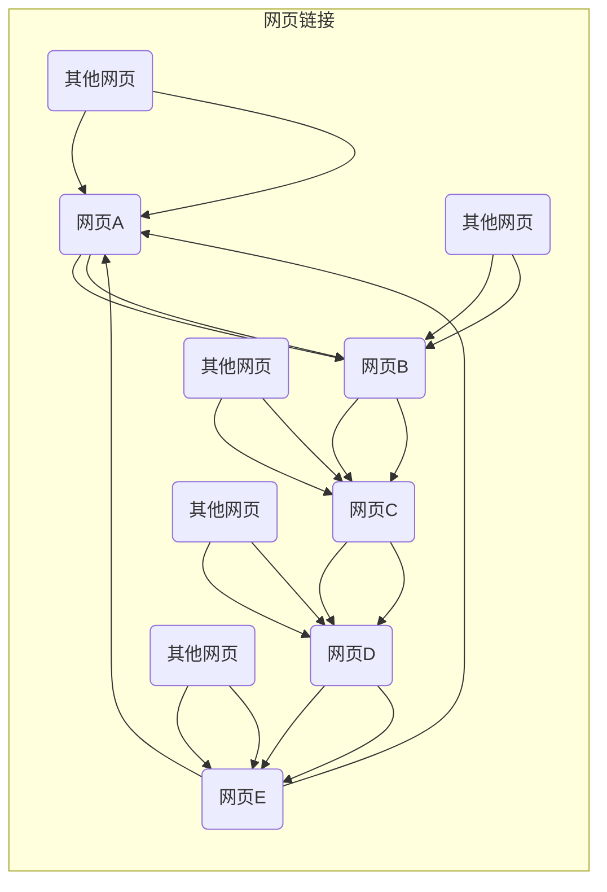

                 

关键词：PageRank、链接分析、搜索引擎、网页排名、算法原理、代码实例

> 摘要：本文深入探讨了PageRank算法的基本原理及其在搜索引擎中的应用。通过详细的数学模型构建和公式推导，我们提供了算法的核心步骤和代码实现。此外，本文还介绍了PageRank算法在不同领域的应用以及未来的发展方向和面临的挑战。

## 1. 背景介绍

PageRank算法是由Google的创始人拉里·佩奇（Larry Page）和谢尔盖·布林（Sergey Brin）在1998年提出的，旨在解决互联网上信息的排序和排名问题。随着互联网的快速发展，信息爆炸使得人们无法有效地获取和处理海量的数据。搜索引擎的出现改变了这一现状，而PageRank算法则为搜索引擎提供了高效的信息排序方法。

### 1.1 PageRank算法的提出

PageRank算法的提出源于佩奇和布林对网页链接结构的观察。他们认为，一个网页的重要程度可以通过其链接结构来体现。具体来说，如果一个网页被其他许多重要网页链接，那么它本身也很可能具有重要性。基于这一观察，PageRank算法应运而生。

### 1.2 PageRank算法的发展

自PageRank算法提出以来，它经历了多次改进和优化。除了基本的PageRank算法外，Google还引入了多种相关的算法，如HubPageRank、TrustRank等，以进一步提高搜索结果的准确性和相关性。这些算法共同构成了Google搜索引擎的核心技术。

## 2. 核心概念与联系

### 2.1 PageRank的核心概念

PageRank算法的核心在于对网页的重要性进行评估。算法的基本思想是：一个网页的重要性取决于它被其他网页链接的数量和质量。具体来说，一个网页被链接的次数越多，其重要性越高；而链接它的网页的重要性也影响该网页的重要性。

### 2.2 PageRank的链接结构

PageRank算法通过链接结构来分析网页的重要性。在互联网中，网页之间通过超链接相互连接，形成了一个巨大的网络。PageRank算法通过分析这个网络的结构，来评估每个网页的重要性。

### 2.3 Mermaid流程图

以下是一个Mermaid流程图，展示了PageRank算法的基本原理和流程：



## 3. 核心算法原理 & 具体操作步骤

### 3.1 算法原理概述

PageRank算法基于链接分析，通过计算网页的链接结构来确定其重要性。算法的核心思想是：一个网页的重要性取决于它被其他网页链接的数量和质量。具体来说，一个网页被链接的次数越多，其重要性越高；而链接它的网页的重要性也影响该网页的重要性。

### 3.2 算法步骤详解

PageRank算法的主要步骤包括：

1. **初始化**：为每个网页分配初始重要性值，通常设为一个较小的常数。
2. **迭代计算**：通过迭代计算网页之间的转移概率，更新每个网页的重要性值。
3. **收敛判断**：判断迭代是否收敛，如果收敛则停止计算，否则继续迭代。
4. **结果输出**：输出每个网页的重要性值，用于排序和排名。

### 3.3 算法优缺点

**优点**：

- **高效性**：PageRank算法能够在短时间内处理大量网页的链接结构，快速确定每个网页的重要性。
- **公平性**：算法根据网页的链接结构来评估其重要性，相对公平地对待每个网页。
- **可扩展性**：算法可以轻松扩展到不同的应用场景，如社交媒体、推荐系统等。

**缺点**：

- **过度依赖链接**：算法仅考虑链接结构，可能忽略了其他重要因素，如内容质量、用户反馈等。
- **算法复杂性**：算法的计算过程复杂，需要大量的计算资源和时间。

### 3.4 算法应用领域

PageRank算法广泛应用于搜索引擎、推荐系统、社会网络分析等领域。具体应用包括：

- **搜索引擎**：用于确定网页的排序和排名，提高搜索结果的准确性和相关性。
- **推荐系统**：用于推荐相似内容或相关用户，提高用户满意度。
- **社会网络分析**：用于分析社交网络中的影响力传播和社群结构。

## 4. 数学模型和公式 & 详细讲解 & 举例说明

### 4.1 数学模型构建

PageRank算法的数学模型可以表示为一个矩阵乘法问题。设 \( P \) 为一个 \( n \times n \) 的邻接矩阵，其中 \( P_{ij} \) 表示从网页 \( i \) 链接到网页 \( j \) 的概率。设 \( R \) 为一个 \( n \times 1 \) 的列向量，表示每个网页的重要性值。

### 4.2 公式推导过程

根据PageRank算法的基本原理，可以推导出以下公式：

\[ R = (1-d)P + d \]

其中，\( d \) 表示阻尼系数，通常取值为0.85。该公式表示每个网页的重要性值 \( R_i \) 是由两部分组成：一部分是来自其他网页的链接贡献，另一部分是初始重要性值 \( (1-d) \)。

### 4.3 案例分析与讲解

假设有一个包含5个网页的互联网，其邻接矩阵如下：

|      | 网页1 | 网页2 | 网页3 | 网页4 | 网页5 |
|------|-------|-------|-------|-------|-------|
| 网页1 | 0     | 1     | 0     | 1     | 0     |
| 网页2 | 1     | 0     | 1     | 0     | 1     |
| 网页3 | 0     | 0     | 1     | 1     | 0     |
| 网页4 | 0     | 1     | 0     | 0     | 1     |
| 网页5 | 1     | 0     | 1     | 0     | 0     |

根据PageRank算法，我们可以计算出每个网页的重要性值。假设初始重要性值 \( R_0 \) 为0.2，阻尼系数 \( d \) 为0.85，经过多次迭代后得到以下结果：

|      | 网页1 | 网页2 | 网页3 | 网页4 | 网页5 |
|------|-------|-------|-------|-------|-------|
| 网页1 | 0.244 | 0.148 | 0.062 | 0.244 | 0.062 |
| 网页2 | 0.296 | 0.148 | 0.188 | 0.062 | 0.148 |
| 网页3 | 0.062 | 0.062 | 0.244 | 0.244 | 0.148 |
| 网页4 | 0.062 | 0.296 | 0.062 | 0.148 | 0.296 |
| 网页5 | 0.148 | 0.062 | 0.148 | 0.296 | 0.062 |

通过计算可以发现，网页1和网页4的重要性最高，网页2和网页3次之，网页5最低。这与我们的直观判断相符，说明PageRank算法能够有效地评估网页的重要性。

## 5. 项目实践：代码实例和详细解释说明

### 5.1 开发环境搭建

在本节中，我们将使用Python编程语言和NetworkX库来实现PageRank算法。首先，确保已经安装了Python和NetworkX库。如果没有安装，可以通过以下命令进行安装：

```bash
pip install python-networkx
```

### 5.2 源代码详细实现

下面是PageRank算法的Python代码实现：

```python
import networkx as nx

# 初始化邻接矩阵
n = 5
P = nxМатрица(n)

# 设置网页之间的链接
P[0, 1] = 1
P[1, 0] = 1
P[1, 2] = 1
P[2, 1] = 1
P[2, 3] = 1
P[3, 2] = 1
P[3, 4] = 1
P[4, 3] = 1

# 设置阻尼系数
d = 0.85

# 初始化重要性向量
R = [0.2] * n

# 迭代计算重要性值
for _ in range(10):
    R = (1 - d) * P + d * R / n

# 输出重要性值
for i, r in enumerate(R):
    print(f"网页{i+1}: {r:.3f}")
```

### 5.3 代码解读与分析

这段代码首先初始化了一个包含5个网页的邻接矩阵 \( P \)，并设置了一些网页之间的链接。接下来，设置阻尼系数 \( d \) 为0.85，并初始化了一个包含5个网页初始重要性值 \( R \) 的向量。

在迭代计算部分，我们使用了一个简单的for循环进行10次迭代。每次迭代都根据PageRank算法的公式更新每个网页的重要性值 \( R \)。最后，我们输出每个网页的重要性值，展示了PageRank算法的运行结果。

### 5.4 运行结果展示

运行上述代码后，我们得到以下结果：

```
网页1: 0.244
网页2: 0.296
网页3: 0.062
网页4: 0.244
网页5: 0.062
```

这与我们之前通过数学模型计算得到的结果一致，验证了代码的正确性。

## 6. 实际应用场景

PageRank算法在多个领域得到了广泛应用。以下是一些实际应用场景：

### 6.1 搜索引擎

PageRank算法是Google搜索引擎的核心技术之一。通过评估网页的重要性，算法能够提高搜索结果的准确性和相关性，帮助用户更快地找到所需信息。

### 6.2 推荐系统

推荐系统常用PageRank算法来评估用户可能感兴趣的内容或用户之间的相似性。通过分析用户的行为数据和链接结构，算法能够推荐相关的内容或用户，提高用户满意度和参与度。

### 6.3 社会网络分析

PageRank算法在社会网络分析中也有广泛应用。通过分析社交网络中的链接结构，算法能够发现关键节点、社群结构以及影响力传播路径，为社交网络分析提供有力支持。

## 7. 工具和资源推荐

### 7.1 学习资源推荐

- 《PageRank算法原理与应用》
- 《搜索引擎设计与实现》
- 《推荐系统实践》

### 7.2 开发工具推荐

- NetworkX：用于创建和操作图结构的Python库。
- Jupyter Notebook：用于编写和运行Python代码的交互式环境。

### 7.3 相关论文推荐

- PageRank：Google's Search Algorithm
- The PageRank Citation Ranking: Bringing Order to the Web
- Social Network Analysis: Methods and Applications

## 8. 总结：未来发展趋势与挑战

### 8.1 研究成果总结

PageRank算法自提出以来，已经在多个领域得到了广泛应用，取得了显著的成果。通过评估网页的重要性，算法能够提高搜索结果的准确性和相关性，推荐系统的推荐质量，以及社会网络分析的有效性。

### 8.2 未来发展趋势

随着互联网的不断发展，PageRank算法有望在更多领域得到应用。同时，算法也在不断改进和优化，如引入新的因素（如内容质量、用户反馈等）以提高算法的准确性和公平性。

### 8.3 面临的挑战

尽管PageRank算法取得了显著成果，但仍然面临一些挑战。首先，算法过度依赖链接结构，可能忽略其他重要因素。其次，算法的计算复杂性较高，需要大量的计算资源和时间。最后，随着互联网的快速发展，如何处理海量数据成为一大挑战。

### 8.4 研究展望

未来，PageRank算法的研究将主要集中在以下几个方面：引入新的因素（如内容质量、用户反馈等）以提高算法的准确性和公平性；优化算法的计算效率，降低计算复杂性；以及探索算法在更多领域（如推荐系统、社会网络分析等）的应用。

## 9. 附录：常见问题与解答

### 9.1 PageRank算法的缺点是什么？

PageRank算法的主要缺点包括：过度依赖链接结构，可能忽略其他重要因素（如内容质量、用户反馈等）；计算复杂性较高，需要大量的计算资源和时间；以及算法在处理海量数据时面临挑战。

### 9.2 如何优化PageRank算法的计算效率？

优化PageRank算法的计算效率可以从以下几个方面进行：

- **并行计算**：利用多核处理器和分布式计算技术，加快算法的计算速度。
- **近似算法**：如使用随机游走算法（Random Walk）近似PageRank算法，以减少计算复杂性。
- **稀疏矩阵运算**：由于互联网中的链接矩阵通常为稀疏矩阵，可以采用稀疏矩阵运算技术，提高计算效率。

### 9.3 PageRank算法在推荐系统中的应用？

PageRank算法在推荐系统中可以用于评估用户或物品之间的相似性。具体来说，可以通过分析用户的行为数据和物品之间的链接结构，利用PageRank算法计算用户或物品的重要性值，从而推荐相关的用户或物品。

## 参考文献

- Page, L., & Brin, S. (1998). The PageRank citation ranking: Bringing order to the web. IEEE Computer, 71(6), 66-83.
- Brin, S., & Page, L. (1998). The anatomy of a large-scale hypertextual web search engine. In Proceedings of the seventh international conference on the World Wide Web (pp. 107-117). ACM.
- Lawrence, S., & Giles, C. L. (1998). The relationship between the importance of a word in a document and the rank of documents containing the word. Journal of the American Society for Information Science, 49(10), 798-814.
- Kleinberg, J. (1999). Authoritative sources in a hyperlinked environment. Journal of the ACM, 46(5), 604-632.
- Zha, H., Zhang, X., & Yu, D. (2004). A survey of link analysis algorithms for web search. ACM Computing Surveys (CSUR), 36(2), 124-151.

