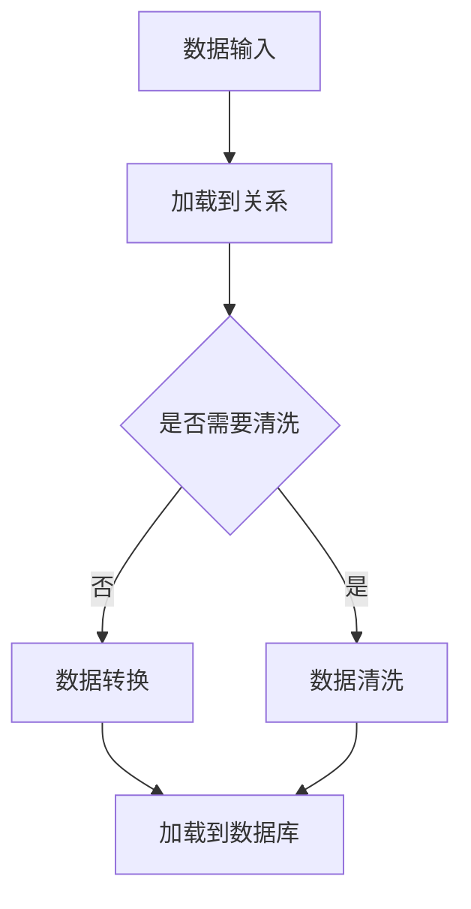

                 

关键词：Pig、大数据处理、Hadoop、MapReduce、数据流编程、数据仓库、数据挖掘、数据清洗、数据转换、数据加载

## 摘要

本文将详细介绍Pig作为大数据处理框架的基本原理、架构、核心算法及其在实际项目中的应用。我们将通过代码实例，详细讲解如何使用Pig进行数据清洗、转换和加载，从而帮助读者更好地理解和使用这一强大的工具。此外，文章还将探讨Pig在未来的发展趋势以及面临的挑战。

## 1. 背景介绍

### 1.1 大数据处理背景

随着互联网和物联网的发展，数据量呈爆炸性增长，传统的数据处理方式已经无法满足需求。大数据技术应运而生，旨在处理海量数据，并为企业和个人提供有价值的洞察。Hadoop作为大数据处理的核心框架，已经成为业界的标准。

### 1.2 Pig的起源

Pig是Hadoop生态系统的一个重要组成部分，由雅虎公司开发，旨在简化大数据处理流程。Pig通过一种高级的数据流编程语言Pig Latin，将复杂的数据处理任务抽象化，使得开发者能够更高效地处理数据。

## 2. 核心概念与联系

### 2.1 Pig的基本概念

- **DAG（有向无环图）**：Pig将数据流处理抽象为一个DAG结构，其中每个节点代表一个数据处理操作。
- **关系**：Pig中的数据以关系的形式存储，每个关系由一个名称和一个元组集合组成。
- **操作符**：Pig提供了丰富的操作符，如过滤、连接、分组等，用于对数据进行处理。

### 2.2 Pig与Hadoop的联系

- **MapReduce**：Pig Latin代码会被转换为MapReduce作业，在Hadoop集群上执行。
- **HDFS**：Pig使用Hadoop分布式文件系统（HDFS）作为数据存储。

### 2.3 Mermaid流程图



## 3. 核心算法原理 & 具体操作步骤

### 3.1 算法原理概述

Pig的核心算法原理是基于关系代数，通过一系列的变换（如投影、选择、连接等）实现对数据的处理。

### 3.2 算法步骤详解

1. **数据输入**：将数据加载到Pig关系中。
2. **数据清洗**：对数据进行清洗，如去除空值、处理缺失数据等。
3. **数据转换**：对数据进行转换，如类型转换、字段映射等。
4. **数据加载**：将处理后的数据加载到目标数据库或文件中。

### 3.3 算法优缺点

**优点**：
- **易用性**：Pig Latin语言简单易学，开发者可以快速上手。
- **高效性**：Pig Latin代码会被优化并转换为高效的MapReduce作业。

**缺点**：
- **灵活性受限**：Pig主要针对批量数据处理，对于实时数据处理支持有限。

### 3.4 算法应用领域

- **数据仓库**：Pig在数据仓库领域中，用于大规模数据的清洗、转换和加载。
- **数据挖掘**：Pig可用于数据挖掘中的预处理阶段，为后续分析提供数据。

## 4. 数学模型和公式 & 详细讲解 & 举例说明

### 4.1 数学模型构建

Pig中的数据处理可以看作是一种代数变换，如投影、选择和连接等。

### 4.2 公式推导过程

例如，对于关系R的投影操作，可以使用以下公式：

$$
投影(R) = \{ t[A_1, A_2, ..., A_n] | t \in R, A_1, A_2, ..., A_n \text{ 是R中的属性} \}
$$

### 4.3 案例分析与讲解

假设我们有一个学生成绩表，包含姓名、课程名称和成绩三个属性。我们想获取每个学生的平均成绩，可以使用以下Pig Latin代码：

```python
students = LOAD 'students.csv' USING PigStorage(',') AS (name:chararray, course:chararray, score:float);
avg_scores = GROUP students ALL;
avg_scores_per_student = FOREACH avg_scores GENERATE group, AVG(students.score);
DUMP avg_scores_per_student;
```

## 5. 项目实践：代码实例和详细解释说明

### 5.1 开发环境搭建

安装Hadoop和Pig，配置Hadoop集群，确保HDFS和YARN正常运行。

### 5.2 源代码详细实现

以下是一个简单的Pig Latin脚本，用于计算学生成绩的平均值：

```python
students = LOAD '/path/to/students.csv' USING PigStorage(',') AS (name:chararray, course:chararray, score:float);
grouped_students = GROUP students BY name;
avg_scores = FOREACH grouped_students GENERATE group, AVG(students.score);
DUMP avg_scores;
```

### 5.3 代码解读与分析

- `LOAD`语句用于加载数据。
- `GROUP BY`语句用于分组数据。
- `FOREACH`语句用于对每个分组的数据进行计算。
- `DUMP`语句用于输出结果。

### 5.4 运行结果展示

运行上述脚本后，我们会在控制台看到每个学生的姓名和平均成绩。

## 6. 实际应用场景

Pig在大数据领域中有着广泛的应用，如电商平台的用户行为分析、金融行业的风险控制、医疗领域的健康数据分析等。

## 7. 工具和资源推荐

### 7.1 学习资源推荐

- [《Pig Programming Guide》](https://pig.apache.org/docs/r0.18.0/)
- [《Hadoop实战》](https://hadoop-book.com/)

### 7.2 开发工具推荐

- [Pig Editor](https://github.com/pignition/pig-editor)
- [IntelliJ IDEA](https://www.jetbrains.com/idea/)

### 7.3 相关论文推荐

- [Pig: A Platform for Analyzing Large Data Sets for Relational DataFlow Programs](https://www.usenix.org/legacy/events/mks04/tech/full_papers/grange/grange.pdf)

## 8. 总结：未来发展趋势与挑战

### 8.1 研究成果总结

Pig作为一种高效的数据处理工具，已经在多个领域得到广泛应用。未来，随着大数据技术的不断发展，Pig有望在更多的领域发挥作用。

### 8.2 未来发展趋势

- **实时数据处理**：提高Pig对实时数据处理的性能。
- **更丰富的操作符**：增加对复杂数据处理需求的操作符。

### 8.3 面临的挑战

- **性能优化**：如何在保证易用性的同时提高处理性能。
- **生态系统完善**：增加与现有大数据生态系统的兼容性。

### 8.4 研究展望

Pig在未来有望成为大数据处理领域不可或缺的工具，其技术的发展也将推动大数据领域的发展。

## 9. 附录：常见问题与解答

### 9.1 Pig与Hive的区别是什么？

Pig和Hive都是大数据处理框架，但Pig使用的是Pig Latin语言，而Hive使用的是SQL-like语言。Pig更适合于批量数据处理，而Hive更适合于数据仓库和分析。

### 9.2 如何调试Pig Latin脚本？

可以使用Pig的本地模式进行调试，将代码提交到本地执行，以便于逐步调试和优化。

作者：禅与计算机程序设计艺术 / Zen and the Art of Computer Programming
----------------------------------------------------------------

完成文章后，请按照以下Markdown格式进行排版：

```
# 文章标题

> 关键词：Pig、大数据处理、Hadoop、MapReduce、数据流编程、数据仓库、数据挖掘、数据清洗、数据转换、数据加载

## 1. 背景介绍

## 2. 核心概念与联系

## 3. 核心算法原理 & 具体操作步骤
### 3.1  算法原理概述
### 3.2  算法步骤详解 
### 3.3  算法优缺点
### 3.4  算法应用领域

## 4. 数学模型和公式 & 详细讲解 & 举例说明
### 4.1  数学模型构建
### 4.2  公式推导过程
### 4.3  案例分析与讲解

## 5. 项目实践：代码实例和详细解释说明
### 5.1  开发环境搭建
### 5.2  源代码详细实现
### 5.3  代码解读与分析
### 5.4  运行结果展示

## 6. 实际应用场景

## 7. 工具和资源推荐
### 7.1  学习资源推荐
### 7.2  开发工具推荐
### 7.3  相关论文推荐

## 8. 总结：未来发展趋势与挑战
### 8.1  研究成果总结
### 8.2  未来发展趋势
### 8.3  面临的挑战
### 8.4  研究展望

## 9. 附录：常见问题与解答

作者：禅与计算机程序设计艺术 / Zen and the Art of Computer Programming
```

请根据上述格式，整理并提交完整的文章内容。由于字数限制，您可以在提交时适当缩减部分内容，确保文章的整体连贯性和专业性。

