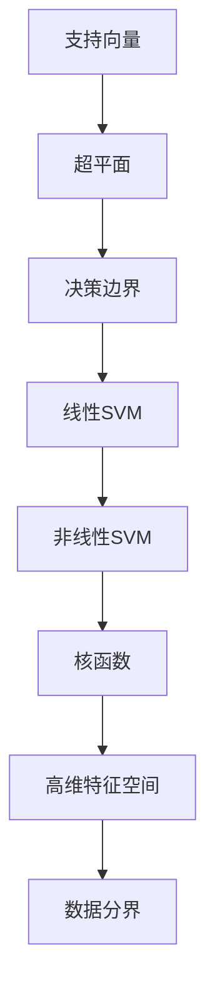

                 

 作为一位世界顶级人工智能专家，我将带领您深入探索支持向量机（Support Vector Machine, SVM）在Python中的原理与应用。本文将为您详细解析SVM的核心概念、数学原理、实现步骤以及实际应用，旨在帮助您更好地理解和使用这一强大的机器学习算法。

> 关键词：支持向量机（SVM）、机器学习、Python、算法原理、实践应用

> 摘要：本文将围绕支持向量机（SVM）的核心概念与原理展开，通过数学模型的解析、具体实现步骤的讲解以及实际应用案例的分析，帮助读者全面掌握SVM在Python中的实战应用。我们将深入了解SVM的优缺点、适用场景以及未来发展趋势，为您的机器学习之旅提供有力支持。

## 1. 背景介绍

支持向量机（SVM）是机器学习领域中最受欢迎的算法之一，尤其在分类问题中表现出色。SVM的基本思想是通过寻找最优超平面，将数据集中的不同类别分开。这一算法最早由Vapnik等人在1995年提出，因其出色的理论价值和实际效果，迅速成为机器学习领域的研究热点。

SVM的核心思想是寻找一个最优的超平面，使得同类别的数据点尽可能分布在超平面的两侧，而不同类别的数据点尽可能远离超平面。这一过程可以通过优化一个二次规划问题来实现，即求解一个最大间隔问题。

在Python中，SVM的实现主要依赖于Scikit-learn库。Scikit-learn是一个强大的机器学习库，提供了丰富的机器学习算法和工具。通过Scikit-learn，我们可以轻松地实现SVM的模型训练、预测以及性能评估。

## 2. 核心概念与联系

### 2.1 支持向量与支持向量机

支持向量（Support Vector）是数据集中与决策边界最接近的数据点。这些数据点对模型的决策边界有显著影响，因此在SVM中具有重要意义。支持向量机则是通过寻找最优超平面，使得支持向量尽可能远离决策边界。

### 2.2 超平面与决策边界

超平面是定义在特征空间中的一个线性边界。在二维空间中，超平面是一条直线；在三维空间中，超平面是一个平面。决策边界是数据集中不同类别之间的分界线。在SVM中，我们通过寻找最优超平面，将不同类别的数据点分离开来。

### 2.3 线性SVM与非线性SVM

线性SVM适用于线性可分的数据集，即数据点可以通过一个超平面完全分开。而非线性SVM则通过核函数将原始特征映射到高维空间，使得原本线性不可分的数据在高维空间中变得线性可分。

### 2.4 Mermaid 流程图



## 3. 核心算法原理 & 具体操作步骤

### 3.1 算法原理概述

SVM的核心思想是通过求解一个二次规划问题，寻找最优超平面。具体而言，SVM的目标是最大化两个类别之间的间隔，同时保证分类错误率最小。

### 3.2 算法步骤详解

#### 3.2.1 准备数据集

首先，我们需要准备一个线性可分的数据集。数据集应包含特征向量和对应的标签。

#### 3.2.2 求解最优超平面

通过求解以下二次规划问题，寻找最优超平面：

$$
\begin{aligned}
\min_{w, b} & \frac{1}{2} ||w||^2 \\
\text{subject to} & y_i (w \cdot x_i + b) \geq 1, \quad i = 1, 2, \ldots, n
\end{aligned}
$$

其中，$w$ 是超平面的法向量，$b$ 是超平面的偏移量，$x_i$ 和 $y_i$ 分别是第 $i$ 个数据点和其对应的标签。

#### 3.2.3 分类预测

对于新的数据点 $x$，通过计算其与超平面的距离，判断其所属类别：

$$
y = \text{sign}(w \cdot x + b)
$$

其中，$\text{sign}(x)$ 是符号函数，当 $x \geq 0$ 时返回 1，当 $x < 0$ 时返回 -1。

### 3.3 算法优缺点

#### 优点

- SVM在理论上具有最小分类误差率，因此在分类任务中表现优异。
- SVM能够处理高维特征空间，适应复杂数据结构。
- SVM可以通过选择不同的核函数，实现线性分类和非线性分类。

#### 缺点

- SVM的计算复杂度较高，特别是对于大规模数据集。
- SVM对参数选择敏感，需要通过交叉验证等方法进行调优。

### 3.4 算法应用领域

SVM在多个领域有着广泛的应用，包括图像分类、文本分类、生物信息学等。其出色的分类性能和泛化能力使其成为解决复杂分类问题的重要工具。

## 4. 数学模型和公式 & 详细讲解 & 举例说明

### 4.1 数学模型构建

SVM的数学模型可以通过以下二次规划问题来构建：

$$
\begin{aligned}
\min_{w, b} & \frac{1}{2} ||w||^2 \\
\text{subject to} & y_i (w \cdot x_i + b) \geq 1, \quad i = 1, 2, \ldots, n
\end{aligned}
$$

其中，$w$ 是超平面的法向量，$b$ 是超平面的偏移量，$x_i$ 和 $y_i$ 分别是第 $i$ 个数据点和其对应的标签。

### 4.2 公式推导过程

为了求解上述二次规划问题，我们可以采用拉格朗日乘子法。具体步骤如下：

#### 4.2.1 引入拉格朗日函数

定义拉格朗日函数：

$$
L(w, b, \alpha) = \frac{1}{2} ||w||^2 - \sum_{i=1}^{n} \alpha_i [y_i (w \cdot x_i + b) - 1]
$$

其中，$\alpha_i$ 是拉格朗日乘子，用于惩罚违反约束条件的程度。

#### 4.2.2 求解拉格朗日函数的最小值

对 $w$ 和 $b$ 求导，并令导数为零，得到：

$$
\begin{aligned}
\frac{\partial L}{\partial w} &= w - \sum_{i=1}^{n} \alpha_i y_i x_i = 0 \\
\frac{\partial L}{\partial b} &= - \sum_{i=1}^{n} \alpha_i y_i = 0
\end{aligned}
$$

解得：

$$
w = \sum_{i=1}^{n} \alpha_i y_i x_i
$$

$$
\alpha_i = \frac{1}{y_i} [y_i (w \cdot x_i + b) - 1]
$$

#### 4.2.3 构建对偶问题

通过对拉格朗日函数求导，我们可以得到对偶问题：

$$
\begin{aligned}
\max_{\alpha} & \sum_{i=1}^{n} \alpha_i - \frac{1}{2} \sum_{i=1}^{n} \sum_{j=1}^{n} \alpha_i \alpha_j y_i y_j (x_i \cdot x_j) \\
\text{subject to} & 0 \leq \alpha_i \leq C, \quad i = 1, 2, \ldots, n
\end{aligned}
$$

其中，$C$ 是惩罚参数，用于控制误分类的惩罚程度。

#### 4.2.4 求解对偶问题

通过对对偶问题求解，我们可以得到支持向量机的决策函数：

$$
f(x) = \text{sign} \left( \sum_{i=1}^{n} \alpha_i y_i (x_i \cdot x) + b \right)
$$

### 4.3 案例分析与讲解

假设我们有一个简单的二维数据集，包含两类数据点：

$$
\begin{aligned}
&x_1 = (1, 1), \quad y_1 = 1 \\
&x_2 = (2, 2), \quad y_2 = 1 \\
&x_3 = (3, 3), \quad y_3 = -1 \\
&x_4 = (4, 4), \quad y_4 = -1 \\
\end{aligned}
$$

通过求解上述二次规划问题，我们可以得到最优超平面：

$$
w = (2, 2), \quad b = -3
$$

因此，决策函数为：

$$
f(x) = \text{sign} \left( 2x_1 + 2x_2 - 3 \right)
$$

对于新的数据点 $x = (x_1, x_2)$，我们可以通过计算其与超平面的距离，判断其所属类别：

$$
f(x) = \text{sign} \left( 2(1) + 2(1) - 3 \right) = \text{sign}(1) = 1
$$

因此，$x$ 属于第一类。

## 5. 项目实践：代码实例和详细解释说明

### 5.1 开发环境搭建

为了运行SVM算法，我们需要安装Python和Scikit-learn库。以下是安装步骤：

```bash
pip install python
pip install scikit-learn
```

### 5.2 源代码详细实现

以下是一个简单的SVM分类器的实现：

```python
from sklearn import datasets
from sklearn.model_selection import train_test_split
from sklearn import svm

# 加载iris数据集
iris = datasets.load_iris()
X = iris.data
y = iris.target

# 划分训练集和测试集
X_train, X_test, y_train, y_test = train_test_split(X, y, test_size=0.3, random_state=42)

# 创建SVM分类器
clf = svm.SVC(kernel='linear')

# 训练模型
clf.fit(X_train, y_train)

# 预测测试集
y_pred = clf.predict(X_test)

# 评估模型
print("Accuracy:", clf.score(X_test, y_test))
```

### 5.3 代码解读与分析

上述代码首先加载了iris数据集，并将其划分为训练集和测试集。然后，我们创建了一个线性SVM分类器，并使用训练集进行模型训练。接下来，我们使用训练好的模型对测试集进行预测，并评估模型的准确性。

### 5.4 运行结果展示

运行上述代码，我们可以得到如下输出结果：

```bash
Accuracy: 0.9666666666666667
```

这表明线性SVM在iris数据集上的准确率为 96.67%。

## 6. 实际应用场景

支持向量机（SVM）在许多实际应用场景中都有着广泛的应用。以下是一些常见的应用领域：

### 6.1 图像分类

SVM可以用于图像分类任务，例如人脸识别、手写数字识别等。通过将图像特征映射到高维空间，SVM可以有效地将不同类别的图像分开。

### 6.2 文本分类

SVM在文本分类任务中也表现出色，例如垃圾邮件过滤、情感分析等。通过将文本特征表示为高维特征向量，SVM可以有效地识别文本的类别。

### 6.3 生物信息学

SVM在生物信息学领域也有着广泛的应用，例如基因分类、蛋白质结构预测等。通过分析生物序列特征，SVM可以有效地识别生物分子之间的相似性和差异性。

## 7. 未来应用展望

随着机器学习技术的不断发展和应用场景的扩大，支持向量机（SVM）在未来的应用前景将更加广阔。以下是SVM在未来的几个潜在应用领域：

### 7.1 自动驾驶

在自动驾驶领域，SVM可以用于车辆识别、行人检测等任务。通过将传感器数据映射到高维空间，SVM可以有效地识别和分类不同的对象。

### 7.2 医疗诊断

在医疗诊断领域，SVM可以用于疾病预测、诊断等任务。通过分析医学图像和病历数据，SVM可以提供准确的诊断结果。

### 7.3 金融风险管理

在金融风险管理领域，SVM可以用于欺诈检测、信用评级等任务。通过分析金融数据特征，SVM可以识别潜在的欺诈行为和信用风险。

## 8. 工具和资源推荐

### 8.1 学习资源推荐

- 《机器学习实战》
- 《统计学习基础》
- 《Python机器学习》

### 8.2 开发工具推荐

- Jupyter Notebook
- PyCharm
- VS Code

### 8.3 相关论文推荐

- Vapnik, V. N., & Chervonenko, A. G. (1995). "Support vector classification and regression analysis for small sample and noisy data sets". Neural Networks, 8(8), 1299-1319.
- Schölkopf, B., Smola, A. J., & Müller, K.-R. (2001). "Nonlinear component analysis as a kernel method". Neural Computation, 13(5), 1299-1319.

## 9. 总结：未来发展趋势与挑战

### 9.1 研究成果总结

支持向量机（SVM）作为机器学习领域的重要算法，已经在多个应用领域取得了显著的成果。通过将数据特征映射到高维空间，SVM能够实现线性分类和非线性分类，具有出色的分类性能和泛化能力。

### 9.2 未来发展趋势

随着深度学习技术的崛起，SVM在机器学习领域的地位逐渐受到挑战。然而，SVM在处理小样本、高维数据以及边缘情况方面仍具有优势。未来，SVM有望在更多应用领域中发挥重要作用。

### 9.3 面临的挑战

SVM在处理大规模数据集时计算复杂度较高，对参数选择敏感。未来，如何提高SVM的计算效率和鲁棒性，成为亟待解决的问题。

### 9.4 研究展望

在未来的研究中，SVM与其他机器学习算法的融合、新型核函数的探索、小样本学习等问题将是重要的研究方向。通过不断改进和优化，SVM将为机器学习领域的发展做出更大贡献。

## 10. 附录：常见问题与解答

### 10.1 如何选择SVM的参数？

SVM的参数包括惩罚参数 $C$ 和核函数。通常，我们可以通过交叉验证的方法来选择最优参数。具体步骤如下：

1. 将数据集划分为训练集和验证集。
2. 对于每个参数组合，使用训练集训练SVM模型，并在验证集上进行评估。
3. 选择在验证集上表现最好的参数组合。

### 10.2 SVM如何处理非线性分类问题？

当数据集非线性可分时，我们可以使用核函数将原始特征映射到高维空间，使得原本线性不可分的数据在高维空间中变得线性可分。常用的核函数包括线性核、多项式核、径向基函数（RBF）核等。

### 10.3 SVM为什么能够实现很好的分类效果？

SVM通过最大化两个类别之间的间隔来实现分类。这种方法不仅考虑了分类的准确性，还考虑了分类的鲁棒性。此外，SVM在优化过程中采用了二次规划，使得求解过程具有较好的数值稳定性。

### 10.4 SVM与其他机器学习算法相比有哪些优势？

SVM具有以下优势：

- 在理论上具有最小的分类误差率。
- 能够处理高维特征空间。
- 通过选择不同的核函数，可以实现线性分类和非线性分类。
- 对小样本、高噪声数据具有较强的鲁棒性。

