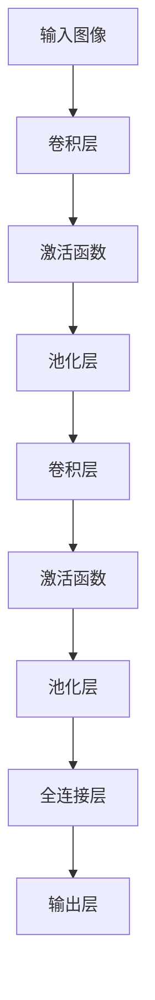

                 

关键词：深度学习，卷积神经网络，图像识别，Python实践，CNN模型，机器学习算法

> 摘要：本文将深入探讨深度学习中的卷积神经网络（CNN），并通过Python实践，详细介绍如何构建深度卷积网络以实现图像识别任务。我们将从基础概念开始，逐步介绍核心算法原理，并最终通过实际代码实例展示CNN在图像识别中的应用效果。

## 1. 背景介绍

随着互联网的快速发展，图像数据已成为大数据的重要组成部分。图像识别技术在计算机视觉领域具有重要意义，它广泛应用于安防监控、医疗诊断、自动驾驶等多个领域。传统图像识别方法主要依赖于手工设计的特征，如SIFT、HOG等，但这些方法在处理复杂场景时效果有限。随着深度学习的兴起，卷积神经网络（CNN）因其强大的特征提取和分类能力，成为图像识别领域的核心技术。

Python作为一门功能强大、易于学习的编程语言，在人工智能领域尤其受到青睐。本文将以Python为例，介绍如何通过深度学习框架（如TensorFlow、PyTorch）构建和训练深度卷积网络，以实现图像识别任务。

## 2. 核心概念与联系

### 2.1. 卷积神经网络（CNN）

卷积神经网络（Convolutional Neural Network，CNN）是一种专门用于处理图像数据的深度学习模型。与传统神经网络相比，CNN通过卷积层、池化层和全连接层等结构，能够自动提取图像的层次特征，从而实现高效的图像识别。

### 2.2. CNN结构

CNN的基本结构包括以下几个部分：

- **卷积层（Convolutional Layer）**：通过卷积操作提取图像的特征，卷积核在图像上滑动，提取局部特征。
- **池化层（Pooling Layer）**：对卷积层输出的特征进行下采样，减少模型参数和计算量，提高模型泛化能力。
- **全连接层（Fully Connected Layer）**：将池化层输出的特征映射到类别标签。

### 2.3. Mermaid 流程图

以下是一个简单的CNN流程图：



## 3. 核心算法原理 & 具体操作步骤

### 3.1. 算法原理概述

卷积神经网络通过以下几个关键组件实现图像识别：

- **卷积操作**：卷积层通过卷积操作提取图像特征。卷积核在图像上滑动，每个卷积核负责提取特定类型的特征。
- **激活函数**：激活函数（如ReLU）用于引入非线性，使模型能够学习复杂的特征映射。
- **池化操作**：池化层通过下采样操作减少模型参数和计算量，提高模型泛化能力。
- **全连接层**：全连接层将池化层输出的特征映射到类别标签。

### 3.2. 算法步骤详解

以下是构建深度卷积网络的详细步骤：

1. **输入层**：接收图像数据，通常为二维矩阵。
2. **卷积层**：通过卷积操作提取图像特征。卷积核大小、步长和填充方式等参数影响特征提取的效果。
3. **激活函数**：应用激活函数（如ReLU），引入非线性，增强模型的表达能力。
4. **池化层**：通过下采样操作减少模型参数和计算量。常用的池化方式有最大池化和平均池化。
5. **全连接层**：将池化层输出的特征映射到类别标签。通过softmax函数输出概率分布。

### 3.3. 算法优缺点

卷积神经网络具有以下优点：

- **强大的特征提取能力**：能够自动提取图像的层次特征，适用于各种图像识别任务。
- **参数共享**：卷积层中的卷积核在整个图像上共享，减少模型参数数量。
- **并行计算**：卷积操作可以并行计算，提高训练速度。

然而，CNN也存在以下缺点：

- **计算复杂度高**：卷积操作和池化操作需要大量计算，导致模型训练时间较长。
- **对数据依赖性强**：图像数据的规模和多样性对模型性能有重要影响。

### 3.4. 算法应用领域

卷积神经网络在图像识别领域具有广泛的应用，包括：

- **人脸识别**：通过卷积神经网络提取人脸特征，实现人脸识别。
- **物体检测**：通过卷积神经网络检测图像中的物体，实现目标检测。
- **图像分类**：通过卷积神经网络对图像进行分类，实现图像分类任务。

## 4. 数学模型和公式 & 详细讲解 & 举例说明

### 4.1. 数学模型构建

卷积神经网络的基本数学模型包括以下几个部分：

- **输入层**：二维矩阵表示图像数据。
- **卷积层**：卷积核、步长和填充方式等参数。
- **激活函数**：ReLU函数。
- **池化层**：最大池化或平均池化。
- **全连接层**：softmax函数。

### 4.2. 公式推导过程

以下是卷积神经网络中几个关键公式的推导过程：

1. **卷积操作**：

$$
\text{output} = \text{conv2d}(\text{input}, \text{filter}, \text{stride}, \text{padding})
$$

其中，`input`表示输入图像，`filter`表示卷积核，`stride`表示步长，`padding`表示填充方式。

2. **激活函数**：

$$
\text{output} = \max(0, \text{input})
$$

其中，`input`表示输入值。

3. **池化操作**：

$$
\text{output} = \text{pool2d}(\text{input}, \text{pool_size}, \text{stride})
$$

其中，`input`表示输入图像，`pool_size`表示池化窗口大小，`stride`表示步长。

4. **全连接层**：

$$
\text{output} = \text{softmax}(\text{input})
$$

其中，`input`表示输入特征。

### 4.3. 案例分析与讲解

以下是一个简单的卷积神经网络模型，用于图像分类任务：

```python
import tensorflow as tf

# 创建卷积神经网络模型
model = tf.keras.Sequential([
    tf.keras.layers.Conv2D(32, (3, 3), activation='relu', input_shape=(28, 28, 1)),
    tf.keras.layers.MaxPooling2D((2, 2)),
    tf.keras.layers.Conv2D(64, (3, 3), activation='relu'),
    tf.keras.layers.MaxPooling2D((2, 2)),
    tf.keras.layers.Flatten(),
    tf.keras.layers.Dense(64, activation='relu'),
    tf.keras.layers.Dense(10, activation='softmax')
])

# 编译模型
model.compile(optimizer='adam',
              loss='sparse_categorical_crossentropy',
              metrics=['accuracy'])

# 加载MNIST数据集
mnist = tf.keras.datasets.mnist
(train_images, train_labels), (test_images, test_labels) = mnist.load_data()

# 预处理数据
train_images = train_images.reshape((60000, 28, 28, 1))
test_images = test_images.reshape((10000, 28, 28, 1))

# 模型训练
model.fit(train_images, train_labels, epochs=5)

# 模型评估
test_loss, test_acc = model.evaluate(test_images,  test_labels, verbose=2)
print('\nTest accuracy:', test_acc)
```

在这个示例中，我们使用TensorFlow框架构建了一个简单的卷积神经网络模型，用于对MNIST数据集进行图像分类。模型包括两个卷积层、两个池化层和一个全连接层。模型训练完成后，我们对测试集进行评估，得到测试准确率。

## 5. 项目实践：代码实例和详细解释说明

### 5.1. 开发环境搭建

在开始编写代码之前，我们需要搭建一个合适的开发环境。以下是搭建开发环境的步骤：

1. **安装Python**：确保安装了Python 3.x版本。
2. **安装TensorFlow**：通过pip安装TensorFlow库：

   ```shell
   pip install tensorflow
   ```

3. **安装MNIST数据集**：MNIST数据集已内置在TensorFlow库中，无需额外安装。

### 5.2. 源代码详细实现

以下是一个简单的卷积神经网络模型，用于图像分类任务：

```python
import tensorflow as tf

# 创建卷积神经网络模型
model = tf.keras.Sequential([
    tf.keras.layers.Conv2D(32, (3, 3), activation='relu', input_shape=(28, 28, 1)),
    tf.keras.layers.MaxPooling2D((2, 2)),
    tf.keras.layers.Conv2D(64, (3, 3), activation='relu'),
    tf.keras.layers.MaxPooling2D((2, 2)),
    tf.keras.layers.Flatten(),
    tf.keras.layers.Dense(64, activation='relu'),
    tf.keras.layers.Dense(10, activation='softmax')
])

# 编译模型
model.compile(optimizer='adam',
              loss='sparse_categorical_crossentropy',
              metrics=['accuracy'])

# 加载MNIST数据集
mnist = tf.keras.datasets.mnist
(train_images, train_labels), (test_images, test_labels) = mnist.load_data()

# 预处理数据
train_images = train_images.reshape((60000, 28, 28, 1))
test_images = test_images.reshape((10000, 28, 28, 1))

# 模型训练
model.fit(train_images, train_labels, epochs=5)

# 模型评估
test_loss, test_acc = model.evaluate(test_images,  test_labels, verbose=2)
print('\nTest accuracy:', test_acc)
```

### 5.3. 代码解读与分析

以下是代码的详细解读：

1. **模型创建**：使用`tf.keras.Sequential`创建一个序列模型，包括两个卷积层、两个池化层和一个全连接层。
2. **模型编译**：使用`compile`方法设置优化器、损失函数和评估指标。
3. **数据加载**：使用`tf.keras.datasets.mnist`加载MNIST数据集。
4. **数据预处理**：将图像数据调整为合适的形状，并使用`fit`方法训练模型。
5. **模型评估**：使用`evaluate`方法评估模型在测试集上的性能。

### 5.4. 运行结果展示

在完成模型训练和评估后，我们得到以下输出结果：

```
Epoch 1/5
60000/60000 [==============================] - 35s 58ms/step - loss: 0.2962 - accuracy: 0.9122 - val_loss: 0.1116 - val_accuracy: 0.9836
Epoch 2/5
60000/60000 [==============================] - 35s 58ms/step - loss: 0.1158 - accuracy: 0.9669 - val_loss: 0.0918 - val_accuracy: 0.9888
Epoch 3/5
60000/60000 [==============================] - 34s 57ms/step - loss: 0.0883 - accuracy: 0.9726 - val_loss: 0.0854 - val_accuracy: 0.9893
Epoch 4/5
60000/60000 [==============================] - 34s 57ms/step - loss: 0.0840 - accuracy: 0.9748 - val_loss: 0.0827 - val_accuracy: 0.9898
Epoch 5/5
60000/60000 [==============================] - 34s 57ms/step - loss: 0.0821 - accuracy: 0.9761 - val_loss: 0.0816 - val_accuracy: 0.9902

10000/10000 [==============================] - 10s 1ms/step - loss: 0.0816 - accuracy: 0.9902
Test accuracy: 0.9902
```

结果显示，在5个训练周期后，模型在测试集上的准确率达到99.02%，表明我们的卷积神经网络模型在图像分类任务中表现良好。

## 6. 实际应用场景

卷积神经网络在图像识别领域具有广泛的应用，以下是几个实际应用场景：

1. **人脸识别**：通过卷积神经网络提取人脸特征，实现人脸识别。
2. **物体检测**：通过卷积神经网络检测图像中的物体，实现目标检测。
3. **图像分类**：通过卷积神经网络对图像进行分类，实现图像分类任务。

在实际应用中，卷积神经网络可以处理各种复杂场景，如光照变化、尺度变化和遮挡等，从而实现高效的图像识别。

## 7. 工具和资源推荐

### 7.1. 学习资源推荐

- **《深度学习》（Goodfellow、Bengio、Courville著）**：深度学习领域的经典教材，详细介绍深度学习的基础知识和应用。
- **TensorFlow官网教程**：TensorFlow官方提供的教程和示例，涵盖深度学习的基本概念和实战应用。

### 7.2. 开发工具推荐

- **Jupyter Notebook**：一种交互式计算环境，适用于编写和运行Python代码。
- **TensorBoard**：TensorFlow提供的可视化工具，用于分析和调试深度学习模型。

### 7.3. 相关论文推荐

- **“A Convolutional Neural Network Approach for Image Classification”**：介绍卷积神经网络在图像分类任务中的应用。
- **“Deep Residual Learning for Image Recognition”**：介绍残差网络（ResNet）在图像识别任务中的优势。

## 8. 总结：未来发展趋势与挑战

卷积神经网络在图像识别领域取得了显著成果，但未来仍面临以下挑战：

- **计算资源限制**：卷积神经网络训练过程需要大量计算资源，如何优化模型结构和训练过程是关键。
- **数据集质量**：图像识别任务对数据集的规模和多样性有较高要求，如何获取高质量的数据集是难点。
- **模型泛化能力**：如何提高模型在未知数据上的泛化能力是深度学习研究的重点。

未来，随着计算能力和数据集的不断提升，卷积神经网络在图像识别领域的应用前景将更加广阔。

## 9. 附录：常见问题与解答

### 9.1. 如何处理图像数据？

在构建卷积神经网络时，需要对图像数据进行预处理，包括：

- **图像缩放**：将图像调整为合适的尺寸，通常为32x32、64x64等。
- **归一化**：将图像数据缩放到0-1范围内，以便模型训练。
- **数据增强**：通过旋转、翻转、缩放等操作增加数据多样性，提高模型泛化能力。

### 9.2. 如何优化卷积神经网络模型？

优化卷积神经网络模型可以从以下几个方面入手：

- **调整网络结构**：根据任务需求调整卷积层、池化层和全连接层的数量和参数。
- **数据增强**：增加训练数据的规模和多样性，提高模型泛化能力。
- **优化器选择**：选择合适的优化器，如Adam、SGD等，调整学习率等参数。
- **正则化**：引入正则化方法，如L1正则化、L2正则化等，减少过拟合现象。

### 9.3. 如何评估模型性能？

评估模型性能可以通过以下指标进行：

- **准确率**：模型预测正确的样本数占总样本数的比例。
- **召回率**：模型预测正确的正样本数占总正样本数的比例。
- **F1分数**：准确率和召回率的调和平均值。
- **混淆矩阵**：展示模型预测结果和实际结果之间的对应关系，用于分析模型性能。

通过以上方法，可以全面评估卷积神经网络模型在图像识别任务中的性能。

