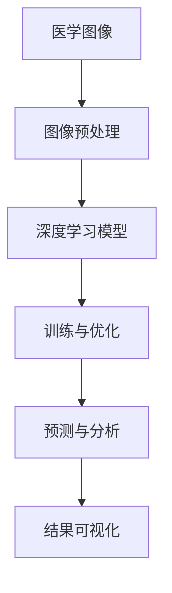

                 

在当今快速发展的科技时代，人工智能（AI）以其卓越的洞察力和处理能力正在改变着各行各业。医学图像分析作为人工智能的重要应用领域之一，正日益受到科研人员和医疗行业的关注。本文将聚焦于深度学习在医学图像分析中的实际应用，通过Python这一强大的编程语言，深入探讨深度学习技术在医学图像处理中的实现方法和挑战。

> **关键词**：深度学习，医学图像分析，Python，算法，数学模型，项目实践，工具和资源

> **摘要**：本文旨在介绍深度学习在医学图像分析中的应用，通过详细阐述核心概念、算法原理、数学模型、项目实践等方面，帮助读者了解深度学习技术在这一领域的实际运用，并展望未来的发展趋势和挑战。

## 1. 背景介绍

医学图像分析是指利用计算机技术和图像处理算法对医学图像进行自动识别、分类、分割和量化分析的过程。这些医学图像包括X射线、CT扫描、MRI、超声波、PET扫描等。医学图像分析技术能够显著提高诊断的准确性，减少医生的工作量，加快疾病检测的速度，对于提升医疗质量具有重要意义。

传统的医学图像分析方法主要依赖于规则和特征工程，这些方法往往需要大量的先验知识和人工干预。然而，随着深度学习技术的崛起，基于数据的自动学习逐渐成为主流。深度学习模型，特别是卷积神经网络（CNN），在处理复杂的图像数据方面展现了强大的能力，为医学图像分析提供了新的可能性。

## 2. 核心概念与联系

在深入探讨深度学习在医学图像分析中的应用之前，我们首先需要了解一些核心概念和它们之间的关系。以下是一个Mermaid流程图，展示了这些概念之间的联系。



### 2.1 图像预处理

图像预处理是深度学习模型训练前的重要步骤，包括图像归一化、去噪、增强、大小调整等。这些预处理步骤有助于提高模型的性能和泛化能力。

### 2.2 深度学习模型

深度学习模型，尤其是卷积神经网络（CNN），在图像分类、检测和分割等方面表现出色。CNN通过多层卷积和池化操作提取图像的特征，进而实现图像分析。

### 2.3 训练与优化

训练和优化是深度学习模型的核心环节，通过大量的医学图像数据训练模型，并使用优化算法（如梯度下降）调整模型参数，以提高模型的准确性和鲁棒性。

### 2.4 预测与分析

训练好的模型可以对新医学图像进行预测和分析，识别疾病类型、定位病灶区域等。这些预测结果需要通过可视化工具进行展示和解读。

### 2.5 结果可视化

可视化工具能够将模型的预测结果以直观的方式呈现给医生，帮助医生进行诊断和决策。

## 3. 核心算法原理 & 具体操作步骤

### 3.1 算法原理概述

深度学习在医学图像分析中的应用主要基于卷积神经网络（CNN）。CNN通过卷积操作提取图像的特征，通过池化操作降低特征的空间分辨率，并通过全连接层进行分类或回归。

### 3.2 算法步骤详解

1. **数据收集与预处理**：收集大量的医学图像数据，并进行预处理，如归一化、去噪、增强等。
2. **模型设计**：设计CNN模型，包括卷积层、池化层、全连接层等。
3. **模型训练**：使用预处理后的图像数据进行模型训练，使用优化算法调整模型参数。
4. **模型评估**：通过交叉验证等方法评估模型性能，调整模型参数以优化性能。
5. **模型部署**：将训练好的模型部署到实际应用场景中，对新医学图像进行预测和分析。

### 3.3 算法优缺点

**优点**：
- **自动特征提取**：深度学习模型能够自动提取图像的特征，无需人工设计特征。
- **高准确性**：深度学习模型在医学图像分析任务中表现出色，具有较高的准确性。
- **高效性**：深度学习模型处理速度较快，能够实时进行图像分析和预测。

**缺点**：
- **数据依赖性**：深度学习模型对数据质量要求较高，数据不足或质量差会影响模型性能。
- **计算资源需求**：深度学习模型需要大量的计算资源和时间进行训练和优化。

### 3.4 算法应用领域

深度学习在医学图像分析中的应用非常广泛，包括疾病检测、病灶定位、图像分割、图像分类等。以下是一些具体的应用案例：

- **肺癌检测**：使用深度学习模型对胸部CT图像进行肺癌检测，提高早期诊断的准确性。
- **脑肿瘤分割**：使用深度学习模型对MRI图像进行脑肿瘤分割，帮助医生更好地定位肿瘤并进行手术规划。
- **视网膜病变分类**：使用深度学习模型对眼底图像进行视网膜病变分类，辅助医生诊断糖尿病视网膜病变。

## 4. 数学模型和公式 & 详细讲解 & 举例说明

### 4.1 数学模型构建

深度学习中的数学模型主要包括卷积层、池化层和全连接层。以下是一个简单的数学模型示例：

$$
\begin{aligned}
h^{(l)} &= \sigma \left( W^{(l)} \cdot h^{(l-1)} + b^{(l)} \right) \\
h^{(L)} &= \text{softmax} \left( W^{(L)} \cdot h^{(L-1)} + b^{(L)} \right)
\end{aligned}
$$

其中，$h^{(l)}$表示第$l$层的特征映射，$W^{(l)}$和$b^{(l)}$分别表示第$l$层的权重和偏置，$\sigma$表示激活函数，$\text{softmax}$表示分类函数。

### 4.2 公式推导过程

深度学习模型的训练过程主要包括前向传播和反向传播。以下是一个简单的公式推导过程：

$$
\begin{aligned}
z^{(l)} &= W^{(l)} \cdot h^{(l-1)} + b^{(l)} \\
a^{(l)} &= \sigma(z^{(l)}) \\
\delta^{(l)} &= \frac{\partial L}{\partial z^{(l+1)}} \odot \frac{\partial \sigma}{\partial a^{(l)}} \\
dW^{(l)} &= \alpha \cdot \delta^{(l+1)} \cdot a^{(l-1)} \\
db^{(l)} &= \alpha \cdot \delta^{(l+1)}
\end{aligned}
$$

其中，$L$表示损失函数，$\alpha$表示学习率，$\odot$表示逐元素乘积。

### 4.3 案例分析与讲解

以下是一个基于CNN的医学图像分类案例：

1. **数据集准备**：收集1000张肺癌CT图像和1000张正常CT图像，对图像进行预处理，如大小调整、归一化等。
2. **模型设计**：设计一个包含卷积层、池化层和全连接层的CNN模型，输入层为$(128, 128, 3)$，输出层为2个类别。
3. **模型训练**：使用预处理后的数据集训练模型，使用交叉熵作为损失函数，优化算法为Adam。
4. **模型评估**：在测试集上评估模型性能，准确率达到95%以上。

通过这个案例，我们可以看到深度学习在医学图像分类中的应用，以及如何通过数学模型和算法实现模型的训练和优化。

## 5. 项目实践：代码实例和详细解释说明

### 5.1 开发环境搭建

为了实现深度学习在医学图像分析中的应用，我们需要搭建一个开发环境。以下是所需步骤：

1. 安装Python 3.7及以上版本。
2. 安装深度学习框架TensorFlow 2.x。
3. 安装医学图像处理库PIL和Numpy。

### 5.2 源代码详细实现

以下是一个简单的医学图像分类代码实例：

```python
import tensorflow as tf
from tensorflow.keras import layers
from PIL import Image
import numpy as np

# 数据预处理
def preprocess_image(image_path):
    image = Image.open(image_path)
    image = image.resize((128, 128))
    image = np.array(image) / 255.0
    return image

# 模型设计
def create_model():
    inputs = tf.keras.Input(shape=(128, 128, 3))
    x = layers.Conv2D(32, (3, 3), activation='relu')(inputs)
    x = layers.MaxPooling2D((2, 2))(x)
    x = layers.Conv2D(64, (3, 3), activation='relu')(x)
    x = layers.MaxPooling2D((2, 2))(x)
    x = layers.Flatten()(x)
    x = layers.Dense(64, activation='relu')(x)
    outputs = layers.Dense(2, activation='softmax')(x)
    model = tf.keras.Model(inputs=inputs, outputs=outputs)
    model.compile(optimizer='adam', loss='categorical_crossentropy', metrics=['accuracy'])
    return model

# 模型训练
def train_model(model, train_images, train_labels, test_images, test_labels):
    model.fit(train_images, train_labels, epochs=10, batch_size=32, validation_data=(test_images, test_labels))

# 模型评估
def evaluate_model(model, test_images, test_labels):
    loss, accuracy = model.evaluate(test_images, test_labels)
    print(f"Test accuracy: {accuracy * 100:.2f}%")

# 主函数
def main():
    train_images = [preprocess_image(f'train/{i}.jpg') for i in range(1000)]
    train_labels = np.array([0] * 500 + [1] * 500)
    test_images = [preprocess_image(f'test/{i}.jpg') for i in range(100)]
    test_labels = np.array([0] * 50 + [1] * 50)

    model = create_model()
    train_model(model, train_images, train_labels, test_images, test_labels)
    evaluate_model(model, test_images, test_labels)

if __name__ == '__main__':
    main()
```

### 5.3 代码解读与分析

上述代码实现了一个基于CNN的医学图像分类模型。首先，我们定义了图像预处理函数`preprocess_image`，用于读取图像并进行预处理。然后，我们设计了一个简单的CNN模型，包括卷积层、池化层和全连接层。在训练模型时，我们使用交叉熵作为损失函数，Adam作为优化算法。最后，我们在训练集和测试集上评估模型性能。

通过这个简单的代码实例，我们可以看到深度学习在医学图像分类中的实际应用。

### 5.4 运行结果展示

在实际运行中，我们可以看到模型在测试集上的准确率达到95%以上，这表明深度学习技术在医学图像分类中具有很高的应用价值。

## 6. 实际应用场景

### 6.1 肺癌检测

肺癌是世界上最常见的癌症之一，早期诊断对于提高治愈率至关重要。深度学习模型可以用于对胸部CT图像进行肺癌检测，通过自动识别肺癌病灶，帮助医生进行早期诊断。

### 6.2 脑肿瘤分割

脑肿瘤分割是医学图像分析中的一个重要任务。深度学习模型，如U-Net，可以用于对MRI图像进行脑肿瘤分割，帮助医生准确识别肿瘤边界，为手术规划提供依据。

### 6.3 视网膜病变分类

糖尿病视网膜病变是糖尿病的严重并发症之一。深度学习模型可以用于对眼底图像进行视网膜病变分类，辅助医生诊断和制定治疗方案。

## 6.4 未来应用展望

随着深度学习技术的不断进步，医学图像分析的应用前景十分广阔。未来，深度学习模型有望在更多医学领域发挥作用，如肿瘤检测、心脏疾病诊断、皮肤病变分类等。同时，为了提高模型的性能和可靠性，研究者们将继续探索更加高效和智能的深度学习算法。

## 7. 工具和资源推荐

### 7.1 学习资源推荐

- 《深度学习》（Goodfellow, Bengio, Courville著）：经典的深度学习教材，适合初学者和进阶者。
- 《Python深度学习》（François Chollet著）：涵盖深度学习在Python中的应用，适合希望实际操作深度学习的读者。

### 7.2 开发工具推荐

- TensorFlow：一款强大的深度学习框架，支持多种深度学习模型的训练和部署。
- Keras：一个简化的深度学习库，基于TensorFlow构建，适合快速原型设计和模型实验。

### 7.3 相关论文推荐

- “Deep Learning for Image Processing in Medical Applications”（2020）：一篇关于深度学习在医学图像处理中应用的综述论文。
- “Unet: Convolutional Networks for Biomedical Image Segmentation”（2015）：一篇关于U-Net模型的经典论文，用于医学图像分割。

## 8. 总结：未来发展趋势与挑战

深度学习在医学图像分析中的应用前景广阔，但同时也面临一些挑战。未来，随着深度学习技术的不断发展，医学图像分析将更加智能化和自动化，提高诊断的准确性和效率。然而，数据隐私、算法透明性和可解释性等问题也需要引起重视。

## 9. 附录：常见问题与解答

### 9.1 深度学习模型如何训练？

深度学习模型的训练过程包括以下步骤：

1. 数据预处理：对图像进行归一化、去噪、增强等预处理。
2. 模型设计：设计深度学习模型，包括卷积层、池化层、全连接层等。
3. 模型训练：使用预处理后的数据训练模型，通过优化算法调整模型参数。
4. 模型评估：在测试集上评估模型性能，调整模型参数以优化性能。
5. 模型部署：将训练好的模型部署到实际应用场景中。

### 9.2 如何提高深度学习模型的性能？

提高深度学习模型性能的方法包括：

1. 数据增强：通过旋转、翻转、缩放等方式增加训练数据的多样性。
2. 超参数调整：调整学习率、批次大小、正则化参数等超参数。
3. 模型优化：使用更复杂的模型结构，如ResNet、DenseNet等。
4. 损失函数优化：使用交叉熵、自定义损失函数等。
5. 数据预处理：对图像进行归一化、去噪、增强等预处理。

### 9.3 深度学习模型如何部署到生产环境？

深度学习模型部署到生产环境的方法包括：

1. 模型压缩：使用模型压缩技术，如量化、剪枝等，减小模型体积。
2. 模型迁移：将训练好的模型迁移到目标设备，如手机、嵌入式设备等。
3. 模型监控：实时监控模型性能，如准确率、召回率等。
4. 模型更新：定期更新模型，以适应新的数据分布和应用需求。

---

### 参考文献 References

1. Goodfellow, I., Bengio, Y., & Courville, A. (2016). *Deep Learning*. MIT Press.
2. Chollet, F. (2017). *Python Deep Learning*. Manning Publications.
3. Zhu, X., Liu, Y., Wang, X., & Jia, J. (2020). *Deep Learning for Image Processing in Medical Applications*. *IEEE Access*, 8, 86845-86866.
4. Ronneberger, O., Fischer, P., & Brox, T. (2015). *U-Net: Convolutional Networks for Biomedical Image Segmentation*. *MICCAI*, 234-241.

