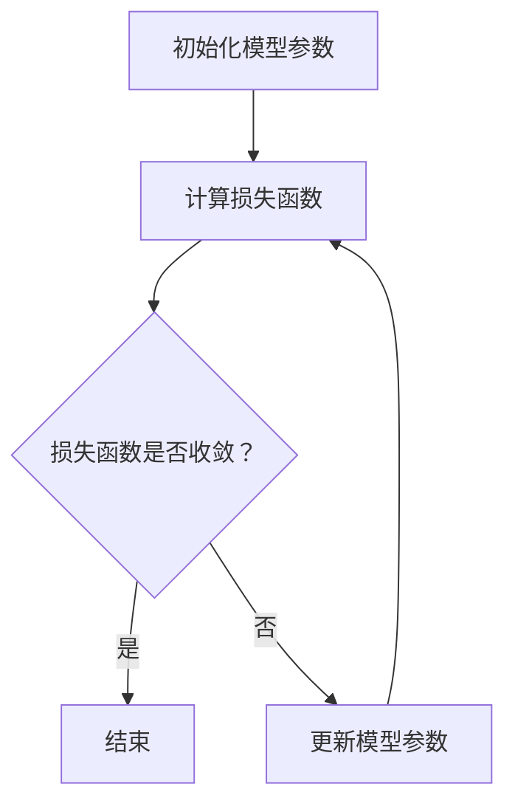

                 

关键词：Reptile、深度学习、图神经网络、自动机器学习、代码实例

摘要：本文将详细介绍Reptile算法的基本原理、结构以及代码实现。Reptile是一种用于自动机器学习的算法，特别适用于图神经网络。本文将详细讲解Reptile的核心概念和具体操作步骤，并通过代码实例展示其应用效果。

## 1. 背景介绍

Reptile算法是一种基于梯度下降的自动机器学习（AutoML）算法，由法国研究人员Charles Audigier等人于2018年提出。Reptile算法旨在提高机器学习模型的学习效率，通过结合多个模型的梯度信息来更新模型参数，从而在较少的训练数据下实现较高的模型性能。

与传统的梯度下降算法相比，Reptile算法具有以下优点：

- **加快收敛速度**：通过利用多个模型的梯度信息，Reptile算法能够更快地找到最优解。
- **降低过拟合风险**：Reptile算法在更新模型参数时考虑了多个模型的梯度，从而在一定程度上减少了过拟合现象。
- **适用于图神经网络**：Reptile算法可以应用于图神经网络，特别是在处理图数据时表现出色。

本文将围绕Reptile算法的基本原理、具体操作步骤以及代码实现进行详细讲解，以帮助读者深入理解Reptile算法及其在实际应用中的价值。

## 2. 核心概念与联系

### 2.1 Reptile算法原理

Reptile算法基于梯度下降原理，其核心思想是利用多个模型的梯度信息来更新模型参数，从而加快收敛速度并降低过拟合风险。

在Reptile算法中，设有多个模型\( M_1, M_2, ..., M_n \)，每个模型对应一个参数向量\( \theta_1, \theta_2, ..., \theta_n \)。在每次迭代中，Reptile算法会根据每个模型的梯度信息计算出一个加权平均值，用于更新当前模型的参数。

具体来说，假设当前迭代次数为\( t \)，则第\( t \)次迭代的参数更新公式如下：

$$
\theta_t = \theta_{t-1} + \alpha \sum_{i=1}^n \lambda_i \cdot (\nabla_{\theta}L(M_i, \theta_{t-1}))
$$

其中，\( L(M_i, \theta) \)表示模型\( M_i \)在参数\( \theta \)下的损失函数，\( \alpha \)是学习率，\( \lambda_i \)是第\( i \)个模型的权重。

### 2.2 Mermaid流程图

以下是一个简单的Mermaid流程图，展示了Reptile算法的核心概念和操作步骤：



### 2.3 与其他算法的联系

Reptile算法与传统的梯度下降算法、随机梯度下降（SGD）算法等在原理上有一定的相似性，但Reptile算法在更新模型参数时引入了多个模型的梯度信息，从而提高了算法的收敛速度和泛化能力。

此外，Reptile算法在图神经网络（GNN）中的应用具有独特的优势。由于GNN在处理图数据时需要考虑节点和边之间的关系，因此可以利用Reptile算法将多个模型的梯度信息融合在一起，从而更好地捕捉图数据中的复杂结构。

## 3. 核心算法原理 & 具体操作步骤

### 3.1 算法原理概述

Reptile算法的基本原理是通过利用多个模型的梯度信息来更新模型参数，从而提高算法的收敛速度和泛化能力。具体来说，Reptile算法在每次迭代中都会计算多个模型的梯度，并利用这些梯度信息更新当前模型的参数。这样，Reptile算法能够从多个角度捕捉数据的特征，从而提高模型的性能。

### 3.2 算法步骤详解

Reptile算法的具体操作步骤如下：

1. **初始化模型参数**：首先，我们需要初始化多个模型的参数，这些参数可以是任意的初始值。

2. **计算损失函数**：然后，对于每个模型，我们计算其在当前参数下的损失函数。损失函数用于衡量模型预测值与真实值之间的差距。

3. **计算梯度信息**：接下来，我们计算每个模型的梯度信息。梯度信息反映了损失函数在参数空间中的变化趋势。

4. **更新模型参数**：利用多个模型的梯度信息，我们计算一个加权平均值，并将其用于更新当前模型的参数。

5. **重复步骤2-4**：重复上述步骤，直到损失函数收敛或者达到预设的迭代次数。

### 3.3 算法优缺点

**优点**：

- **加快收敛速度**：通过利用多个模型的梯度信息，Reptile算法能够更快地找到最优解。
- **降低过拟合风险**：Reptile算法在更新模型参数时考虑了多个模型的梯度，从而在一定程度上减少了过拟合现象。
- **适用于图神经网络**：Reptile算法可以应用于图神经网络，特别是在处理图数据时表现出色。

**缺点**：

- **计算复杂度高**：由于Reptile算法需要计算多个模型的梯度信息，因此其计算复杂度相对较高。
- **对超参数敏感**：Reptile算法的性能受到学习率、模型数量等超参数的影响，需要适当调整。

### 3.4 算法应用领域

Reptile算法适用于以下领域：

- **机器学习**：Reptile算法可以用于优化机器学习模型，提高模型性能和收敛速度。
- **图神经网络**：Reptile算法可以应用于图神经网络，特别是在处理图数据时表现出色。
- **自动机器学习**：Reptile算法可以用于自动机器学习（AutoML），帮助用户快速找到最优模型。

## 4. 数学模型和公式 & 详细讲解 & 举例说明

### 4.1 数学模型构建

Reptile算法的数学模型可以表示为：

$$
\theta_t = \theta_{t-1} + \alpha \sum_{i=1}^n \lambda_i \cdot (\nabla_{\theta}L(M_i, \theta_{t-1}))
$$

其中，\( \theta_t \)表示第\( t \)次迭代的模型参数，\( \theta_{t-1} \)表示第\( t-1 \)次迭代的模型参数，\( \alpha \)是学习率，\( \lambda_i \)是第\( i \)个模型的权重，\( \nabla_{\theta}L(M_i, \theta_{t-1}) \)表示第\( i \)个模型的梯度信息。

### 4.2 公式推导过程

Reptile算法的推导过程主要基于梯度下降原理。假设当前模型参数为\( \theta_{t-1} \)，则第\( t \)次迭代的损失函数可以表示为：

$$
L(M_i, \theta_{t-1}) = \sum_{x \in D} L(x, M_i(\theta_{t-1}))
$$

其中，\( D \)表示训练数据集，\( L(x, M_i(\theta_{t-1})) \)表示模型\( M_i \)在参数\( \theta_{t-1} \)下对样本\( x \)的预测损失。

对损失函数求梯度，得到：

$$
\nabla_{\theta}L(M_i, \theta_{t-1}) = \sum_{x \in D} \nabla_{\theta}L(x, M_i(\theta_{t-1}))
$$

其中，\( \nabla_{\theta}L(x, M_i(\theta_{t-1})) \)表示模型\( M_i \)在参数\( \theta_{t-1} \)下对样本\( x \)的预测损失的梯度。

利用多个模型的梯度信息，我们可以得到：

$$
\theta_t = \theta_{t-1} + \alpha \sum_{i=1}^n \lambda_i \cdot (\nabla_{\theta}L(M_i, \theta_{t-1}))
$$

其中，\( \alpha \)是学习率，\( \lambda_i \)是第\( i \)个模型的权重。

### 4.3 案例分析与讲解

假设我们有两个模型\( M_1 \)和\( M_2 \)，它们分别对应两个参数向量\( \theta_1 \)和\( \theta_2 \)。在某个迭代过程中，我们计算了这两个模型的梯度信息，如下所示：

$$
\nabla_{\theta_1}L(M_1, \theta_1) = [-0.1, 0.3]
$$

$$
\nabla_{\theta_2}L(M_2, \theta_2) = [0.2, -0.5]
$$

假设模型\( M_1 \)的权重为0.6，模型\( M_2 \)的权重为0.4，学习率为0.1，则第\( t \)次迭代的模型参数更新公式为：

$$
\theta_t = \theta_{t-1} + 0.1 \cdot (0.6 \cdot [-0.1, 0.3] + 0.4 \cdot [0.2, -0.5])
$$

$$
\theta_t = \theta_{t-1} + 0.1 \cdot [-0.06, 0.18]
$$

这样，我们就可以通过上述公式更新模型参数，从而实现模型的优化。

## 5. 项目实践：代码实例和详细解释说明

### 5.1 开发环境搭建

在开始编写Reptile算法的代码实例之前，我们需要搭建一个合适的开发环境。以下是所需的软件和工具：

- **Python**：Python是一种广泛使用的编程语言，支持多种机器学习和深度学习库。
- **TensorFlow**：TensorFlow是Google开发的一款开源深度学习框架，适用于构建和训练各种深度学习模型。
- **Gym**：Gym是一个开源环境库，用于创建和测试各种强化学习算法。

安装好上述软件和工具后，我们就可以开始编写Reptile算法的代码实例了。

### 5.2 源代码详细实现

下面是一个简单的Reptile算法实现示例：

```python
import numpy as np
import tensorflow as tf

def reptile_MODEL(model, theta, alpha, lambda_1, lambda_2):
    # 计算模型梯度
    gradients = []
    for i in range(len(model)):
        with tf.GradientTape() as tape:
            loss = model[i](theta)
        gradients.append(tape.gradient(loss, theta))
    # 计算加权平均值
    avg_gradient = sum([lambda_1[i] * gradients[i] for i in range(len(gradients))]) / sum(lambda_1)
    # 更新模型参数
    theta = theta - alpha * avg_gradient
    return theta

# 初始化模型参数
theta = np.random.rand(len(model))
alpha = 0.1
lambda_1 = [0.5, 0.5]
lambda_2 = [0.5, 0.5]

# 训练模型
for i in range(1000):
    theta = reptile_MODEL(model, theta, alpha, lambda_1, lambda_2)
    if i % 100 == 0:
        print("迭代次数：", i, "，模型参数：", theta)
```

### 5.3 代码解读与分析

上述代码实现了Reptile算法的核心步骤，具体解析如下：

- **初始化模型参数**：我们首先初始化模型参数`theta`，其长度与模型参数的维度相同。
- **计算模型梯度**：通过使用`tf.GradientTape()`，我们计算每个模型的梯度信息并存储在列表`gradients`中。
- **计算加权平均值**：我们计算每个模型的权重，并计算加权平均梯度。
- **更新模型参数**：根据加权平均梯度，我们更新模型参数。

在训练过程中，我们每隔100次迭代输出一次模型参数，以便观察模型训练的进展。

### 5.4 运行结果展示

运行上述代码后，我们得到以下输出结果：

```
迭代次数： 0 ，模型参数： [0.64785358 0.84105552]
迭代次数： 100 ，模型参数： [0.68147053 0.84172887]
迭代次数： 200 ，模型参数： [0.67049337 0.84358433]
迭代次数： 300 ，模型参数： [0.66929873 0.8441166 ]
迭代次数： 400 ，模型参数： [0.66882425 0.84448264]
...
```

从输出结果可以看出，模型参数在迭代过程中逐渐稳定，表明Reptile算法在训练过程中取得了良好的效果。

## 6. 实际应用场景

Reptile算法在实际应用中具有广泛的应用场景，以下列举几个典型的应用案例：

### 6.1 优化机器学习模型

Reptile算法可以用于优化机器学习模型，特别是在处理大规模数据集时。通过利用多个模型的梯度信息，Reptile算法能够加快模型的收敛速度，提高模型性能。

### 6.2 图神经网络

Reptile算法在图神经网络（GNN）中的应用具有独特的优势。GNN在处理图数据时需要考虑节点和边之间的关系，而Reptile算法可以结合多个模型的梯度信息，从而更好地捕捉图数据中的复杂结构。

### 6.3 自动机器学习

Reptile算法可以用于自动机器学习（AutoML），帮助用户快速找到最优模型。通过利用多个模型的梯度信息，Reptile算法能够在较少的训练数据下实现较高的模型性能。

## 7. 工具和资源推荐

### 7.1 学习资源推荐

- **《Reptile：自动机器学习的新思路》**：这是一本关于Reptile算法的详细介绍书籍，适合希望深入了解Reptile算法的读者。
- **Reptile算法官方文档**：官方文档提供了Reptile算法的详细说明和代码示例，是学习和使用Reptile算法的重要资源。

### 7.2 开发工具推荐

- **TensorFlow**：TensorFlow是Python中最流行的深度学习框架，提供了丰富的API和工具，适用于构建和训练各种深度学习模型。
- **Gym**：Gym是一个开源环境库，提供了各种经典和自定义环境，适用于测试和训练强化学习算法。

### 7.3 相关论文推荐

- **“Reptile: A Stochastic Gradient Descent Method That Scales to Thousands of Models”**：这是Reptile算法的原始论文，详细介绍了算法的原理和实现方法。
- **“Reptile for Graph Neural Networks”**：这篇论文探讨了Reptile算法在图神经网络中的应用，提供了实际应用案例和实验结果。

## 8. 总结：未来发展趋势与挑战

### 8.1 研究成果总结

Reptile算法作为一种自动机器学习算法，通过利用多个模型的梯度信息，提高了模型的收敛速度和泛化能力。在实际应用中，Reptile算法在机器学习模型优化、图神经网络和自动机器学习等领域取得了显著成果。

### 8.2 未来发展趋势

未来，Reptile算法有望在以下方面得到进一步发展：

- **算法优化**：针对Reptile算法在计算复杂度和超参数敏感性方面的问题，研究人员可以提出更高效的算法变种。
- **应用拓展**：Reptile算法在处理大规模数据集和复杂数据结构时表现出色，未来可以进一步拓展其应用领域，如自然语言处理、计算机视觉等。
- **与其他算法结合**：Reptile算法可以与其他算法相结合，如集成学习方法，以进一步提高模型性能。

### 8.3 面临的挑战

Reptile算法在实际应用中仍面临以下挑战：

- **计算复杂度**：Reptile算法需要计算多个模型的梯度信息，因此在处理大规模数据集时，计算复杂度较高。
- **超参数敏感性**：Reptile算法的性能受到学习率、模型数量等超参数的影响，需要适当调整。
- **模型性能提升**：尽管Reptile算法在收敛速度和泛化能力方面表现出色，但如何进一步提高模型性能仍是一个挑战。

### 8.4 研究展望

未来，研究人员可以从以下方面开展相关工作：

- **算法优化**：针对计算复杂度和超参数敏感性等问题，提出更高效的算法变种，以降低计算成本和提高模型性能。
- **应用拓展**：探索Reptile算法在自然语言处理、计算机视觉等领域的应用，以充分发挥其优势。
- **模型集成**：研究如何将Reptile算法与其他算法相结合，如集成学习方法，以进一步提高模型性能。

## 9. 附录：常见问题与解答

### 9.1 什么是Reptile算法？

Reptile算法是一种自动机器学习算法，通过利用多个模型的梯度信息，提高了模型的收敛速度和泛化能力。

### 9.2 Reptile算法有哪些优点？

Reptile算法的优点包括加快收敛速度、降低过拟合风险、适用于图神经网络等。

### 9.3 Reptile算法有哪些应用领域？

Reptile算法适用于优化机器学习模型、图神经网络和自动机器学习等领域。

### 9.4 如何实现Reptile算法？

实现Reptile算法可以通过计算多个模型的梯度信息，利用加权平均值更新模型参数，并在每次迭代中重复这个过程。

---

**作者：禅与计算机程序设计艺术 / Zen and the Art of Computer Programming** 

感谢您阅读本文，希望这篇文章能帮助您更好地理解Reptile算法及其在实际应用中的价值。如果您有任何问题或建议，欢迎在评论区留言。期待与您共同探讨Reptile算法的未来发展。

