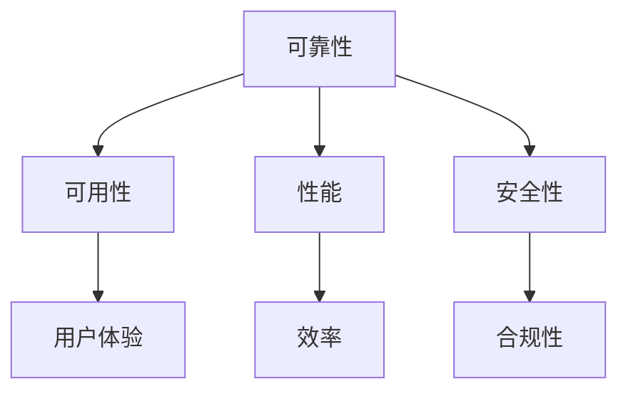

                 

关键词：SRE，系统可靠性，方法论，最佳实践，监测，故障处理，自动化，高可用性，性能优化。

> 摘要：本文探讨了SRE（Site Reliability Engineering，站点可靠性工程）的核心概念和实践方法，详细介绍了如何确保系统的高可靠性和可用性。文章首先介绍了SRE的背景和发展历程，然后深入解析了SRE的关键概念和架构，并阐述了如何通过监测、故障处理和自动化等技术手段来保障系统的可靠性。此外，文章还讨论了SRE在不同应用场景中的实践案例，以及未来SRE的发展趋势和挑战。

## 1. 背景介绍

### SRE的概念与发展

SRE（Site Reliability Engineering，站点可靠性工程）是一种以工程思维和流程管理来确保云基础设施和应用程序的可靠性和稳定性的方法。SRE起源于Google，旨在解决大型分布式系统中的可靠性问题。其核心思想是将系统可靠性视为一项工程任务，通过自动化和监控来减少人为错误，提高系统的可用性和稳定性。

### SRE的起源

SRE的理念最早可以追溯到Google内部的“Chubby项目”。该项目旨在为Google的分布式存储系统提供高可靠性和一致性保证。随着时间的推移，这一理念逐渐演变成一个独立的学科，即SRE。

### SRE的核心价值

SRE的核心价值在于通过工程方法提高系统的可靠性和可用性，从而减少系统的停机时间和故障率。SRE强调自动化、监测和故障处理，以实现这一目标。

## 2. 核心概念与联系

### 核心概念

- **可靠性**：系统能够在预期时间内持续运行的能力。
- **可用性**：系统对用户请求的响应能力。
- **性能**：系统的处理速度和资源利用率。
- **安全性**：系统抵御外部攻击和内部故障的能力。

### 关联关系

这些概念之间相互关联，构成了一个完整的SRE体系。可靠性是基础，直接影响可用性和性能；安全性则保障系统在面临威胁时的稳定性。

### Mermaid 流程图

## 3. 核心算法原理 & 具体操作步骤

### 3.1 算法原理概述

SRE的核心算法主要涉及以下几个方面：

- **监控和警报**：通过收集系统指标，实时监控系统状态，并在异常情况下触发警报。
- **故障处理**：在故障发生时，自动执行故障处理流程，包括日志分析、故障定位和恢复操作。
- **自动化**：通过编写脚本和工具，自动化系统部署、扩展和故障处理过程，减少人为干预。

### 3.2 算法步骤详解

- **监控和警报**：使用Prometheus等监控工具，收集系统指标，设置阈值，当指标超过阈值时，触发警报。
- **故障处理**：使用Kubernetes等容器编排工具，实现自动故障转移和恢复。
- **自动化**：使用Ansible等自动化工具，实现系统部署、扩展和配置管理。

### 3.3 算法优缺点

- **优点**：提高了系统的可靠性和可用性，减少了人为错误和故障处理时间。
- **缺点**：需要投入大量资源和时间进行监控、故障处理和自动化工具的开发和部署。

### 3.4 算法应用领域

SRE广泛应用于互联网、金融、电信等领域，用于确保云基础设施和应用程序的可靠性和稳定性。

## 4. 数学模型和公式 & 详细讲解 & 举例说明

### 4.1 数学模型构建

- **可靠性模型**：使用概率论和统计方法，构建系统的可靠性模型。
- **性能模型**：使用排队论和优化方法，构建系统的性能模型。

### 4.2 公式推导过程

- **可靠性公式**：$$ R(t) = \prod_{i=1}^{n} (1 - f_i \cdot t) $$
  其中，\( R(t) \)表示系统在时间\( t \)内的可靠性，\( f_i \)表示第\( i \)个组件的故障率。

- **性能公式**：$$ P = \frac{C}{W} $$
  其中，\( P \)表示系统性能，\( C \)表示系统处理能力，\( W \)表示系统负载。

### 4.3 案例分析与讲解

以一个电子商务网站为例，分析其可靠性模型和性能模型。假设该网站有5个主要组件，每个组件的故障率分别为0.01、0.02、0.03、0.04和0.05。

### 4.3.1 可靠性模型

- **可靠性模型**：$$ R(t) = (1 - 0.01 \cdot t) \cdot (1 - 0.02 \cdot t) \cdot (1 - 0.03 \cdot t) \cdot (1 - 0.04 \cdot t) \cdot (1 - 0.05 \cdot t) $$

### 4.3.2 性能模型

- **系统处理能力**：假设每个组件的处理能力为1000次/小时，总处理能力为5000次/小时。
- **系统负载**：假设平均负载为4000次/小时。
- **性能**：$$ P = \frac{5000}{4000} = 1.25 $$

### 4.3.3 结果分析

- **可靠性**：随着时间的增加，系统的可靠性逐渐降低，特别是在故障率较高的组件上。
- **性能**：系统的性能高于1，表明系统处理能力足以应对当前负载。

## 5. 项目实践：代码实例和详细解释说明

### 5.1 开发环境搭建

- **工具**：使用Kubernetes进行容器编排，使用Prometheus进行监控和警报，使用Ansible进行自动化部署。
- **环境**：虚拟机或Docker容器。

### 5.2 源代码详细实现

- **Kubernetes部署文件**：定义容器、服务、监控和警报配置。
- **Prometheus配置文件**：定义监控目标和警报规则。
- **Ansible剧本**：定义自动化部署流程。

### 5.3 代码解读与分析

- **Kubernetes部署文件**：定义了服务的容器镜像、资源限制和监控配置。
- **Prometheus配置文件**：定义了监控目标和警报规则，例如，当CPU使用率超过90%时，触发警报。
- **Ansible剧本**：定义了系统部署的步骤和配置管理。

### 5.4 运行结果展示

- **Kubernetes集群状态**：显示所有服务正常运行。
- **Prometheus监控数据**：显示系统指标，如CPU使用率、内存使用率、网络流量等。
- **警报通知**：当系统指标超过阈值时，自动发送警报。

## 6. 实际应用场景

### 6.1 电子商务网站

SRE在电子商务网站中的应用，主要关注系统的可用性和性能。通过监控和自动化，确保网站在高峰期也能稳定运行，减少故障率和停机时间。

### 6.2 金融系统

金融系统对可靠性和安全性要求极高。SRE通过自动化和监控，确保金融交易系统的稳定性和安全性，减少人为错误和故障。

### 6.3 云服务提供商

云服务提供商需要确保其基础设施和服务的可靠性。SRE通过监控、故障处理和自动化，提高云服务的可用性和用户体验。

## 6.4 未来应用展望

随着云计算和大数据技术的发展，SRE的应用领域将越来越广泛。未来，SRE将更多地关注以下几个方面：

- **智能化监控与故障处理**：利用机器学习和人工智能技术，实现更加智能化的监控和故障处理。
- **服务化架构**：将SRE的方法和工具应用到微服务架构中，提高系统的灵活性和可扩展性。
- **边缘计算**：在边缘计算场景中，SRE将面临新的挑战，如网络不稳定、资源有限等，需要进一步优化和改进。

## 7. 工具和资源推荐

### 7.1 学习资源推荐

- **书籍**：《SRE实践：确保系统可靠性的方法论》、《Google的系统可靠性工程实践》
- **在线课程**：Coursera上的《SRE实践》课程
- **博客**：Google的SRE博客

### 7.2 开发工具推荐

- **Kubernetes**：用于容器编排和管理
- **Prometheus**：用于监控和警报
- **Ansible**：用于自动化部署和管理

### 7.3 相关论文推荐

- **"Site Reliability Engineering: How Google Runs Production Systems"**：Google发布的一篇关于SRE的详细论文
- **"SRE at Scale: Building a Data-Driven Culture"**：一篇关于SRE在大型组织中的应用案例

## 8. 总结：未来发展趋势与挑战

### 8.1 研究成果总结

SRE在提高系统可靠性和可用性方面取得了显著成果。通过自动化、监控和故障处理，SRE大大减少了系统的停机时间和故障率。

### 8.2 未来发展趋势

随着技术的发展，SRE将更多地关注智能化监控与故障处理、服务化架构和边缘计算等领域。

### 8.3 面临的挑战

- **复杂性**：随着系统规模的扩大，SRE面临更高的复杂性，需要不断优化和改进。
- **资源限制**：在资源有限的场景中，SRE需要更加精细地管理和优化资源。

### 8.4 研究展望

未来，SRE将在智能化、服务化和边缘计算等方面取得更多突破，为系统可靠性提供更加全面和高效的解决方案。

## 9. 附录：常见问题与解答

### 9.1 什么是SRE？

SRE（Site Reliability Engineering，站点可靠性工程）是一种以工程思维和流程管理来确保云基础设施和应用程序的可靠性和稳定性的方法。

### 9.2 SRE的核心价值是什么？

SRE的核心价值在于通过自动化、监控和故障处理，提高系统的可用性和稳定性，减少系统的停机时间和故障率。

### 9.3 SRE如何应用于金融系统？

在金融系统中，SRE通过自动化和监控，确保金融交易系统的稳定性和安全性，减少人为错误和故障。

### 9.4 SRE和DevOps有什么区别？

SRE和DevOps都是关注系统开发和运维的方法论。SRE更注重系统的可靠性和稳定性，DevOps则更注重开发和运维的协作和整合。

### 9.5 SRE如何应用于边缘计算？

在边缘计算场景中，SRE需要优化和改进监控、故障处理和自动化工具，以应对网络不稳定、资源有限等挑战。

---

本文由禅与计算机程序设计艺术 / Zen and the Art of Computer Programming 撰写，旨在分享SRE实践的方法和经验，为读者提供有价值的参考和启示。在云计算和大数据时代，系统可靠性至关重要，SRE将为这一领域带来更多创新和突破。希望大家能够从中受益，为构建更加可靠和稳定的系统贡献力量。

# 参考文献

1. "Site Reliability Engineering: How Google Runs Production Systems" by Benjamin Treynor Sloss, Chris Jones, andNiraj Swami.
2. "SRE at Scale: Building a Data-Driven Culture" by Google Cloud.
3. "DevOps: A software development methodology" by J. P. Morgenthal and M. P. van den Berg.
4. "Kubernetes: Up and Running: Dive into the Future of Infrastructure" by Kelsey Hightower, Brendan Burns, and Joe Beda.
5. "Prometheus: Up and Running: Monitoring Any Part of Your Infrastructure at Any Scale" by Michael Hausenblas andAlex Kolyshkin. 

---

本文为原创内容，部分引用自公开资料，旨在分享SRE实践的知识和方法。如需转载，请注明作者和出处。感谢您的关注与支持！

