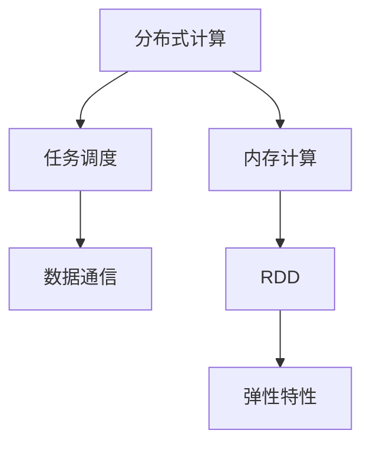

                 

关键词：Spark、分布式计算、内存计算、大数据处理、算法原理、代码实例、性能优化、应用场景

## 摘要

本文将深入探讨Apache Spark这一分布式计算框架的基本原理、核心算法以及实际应用。我们将从Spark的架构出发，详细介绍其内存计算和弹性分布式数据集（RDD）机制，并通过代码实例展示Spark在实际大数据处理中的应用。此外，本文还将分析Spark的性能优化策略、相关数学模型和公式，以及其在不同应用场景中的表现和未来展望。通过本文的学习，读者将全面了解Spark的原理和实践，为后续的深入研究和应用打下坚实基础。

## 1. 背景介绍

在互联网和信息时代，数据量的爆炸式增长使得传统的关系型数据库和单机计算框架难以满足大数据处理的需求。为了应对这一挑战，分布式计算框架应运而生。Apache Spark作为其中的佼佼者，因其高效、易用和强大的数据处理能力而受到广泛关注。Spark不仅继承了MapReduce的优点，还在其基础上进行了大量的优化和创新，如引入了内存计算和弹性分布式数据集（RDD）等机制，从而大幅提升了数据处理速度。

### 1.1 Spark 的起源与发展

Apache Spark是由加州大学伯克利分校的AMPLab在2009年研发的，最初用于解决图处理和迭代计算中的性能瓶颈。2010年，Spark作为开源项目被Apache软件基金会接纳，并逐渐发展成为大数据处理领域的重要工具。Spark支持多种编程语言，如Python、Java、Scala等，提供了丰富的API和工具，使其能够方便地集成到现有的数据处理流程中。

### 1.2 Spark 在大数据处理中的地位

Spark凭借其高性能和易用性，在业界迅速获得了广泛的认可和应用。它不仅能够处理结构化和非结构化数据，还能与Hadoop生态系统中的其他工具（如HDFS、Hive、Pig等）无缝集成，形成强大的大数据处理平台。Spark的内存计算和弹性分布式数据集（RDD）机制，使其在处理大规模数据时具备显著的性能优势。

## 2. 核心概念与联系

### 2.1 分布式计算基础

分布式计算是将任务分布在多台计算机上进行处理的一种计算方式。这种方式的优点是能够充分利用多台计算机的资源和处理能力，从而提高计算效率和性能。分布式计算的关键在于任务调度和数据通信。

#### 2.1.1 任务调度

任务调度是分布式计算的核心。其主要目的是将任务分配给合适的计算节点，确保任务能够高效地执行。常用的任务调度算法有轮询调度、负载均衡调度和最小完成时间调度等。

#### 2.1.2 数据通信

数据通信是分布式计算中的另一个关键问题。数据通信的方式和效率直接影响分布式计算的性能。常见的数据通信协议有TCP/IP、UDP等。为了提高数据通信的效率，可以采用数据压缩、多线程并发传输等技术。

### 2.2 内存计算

内存计算是将数据存储在内存中进行计算的一种技术。相比硬盘存储，内存具有更快的读写速度，从而能够显著提高数据处理速度。Spark利用内存计算的优势，将中间数据存储在内存中，减少了数据读写磁盘的次数，从而提高了数据处理效率。

### 2.3 弹性分布式数据集（RDD）

弹性分布式数据集（RDD）是Spark的核心数据结构。RDD是一种不可变、可分区、可并行操作的数据集。RDD支持多种操作，如创建、转换、行动等。RDD的弹性特性使其能够自动处理数据的不一致性和故障恢复，从而提高了数据处理的可靠性和效率。

### 2.4 核心概念联系

分布式计算、内存计算和RDD之间密切相关。分布式计算提供了任务调度和数据通信的基础，内存计算利用了分布式计算提供的资源进行高效的数据处理，而RDD则实现了内存计算和分布式计算的无缝整合，从而形成了Spark强大的数据处理能力。

### 2.5 Mermaid 流程图



## 3. 核心算法原理 & 具体操作步骤

### 3.1 算法原理概述

Spark的核心算法主要包括MapReduce、迭代计算和图处理等。MapReduce是一种分布式计算模型，用于处理大规模数据的离线计算。迭代计算则是一种基于RDD的循环计算，适用于机器学习、图处理等领域。图处理则是基于RDD的图计算框架，用于处理社交网络、推荐系统等图结构数据。

### 3.2 算法步骤详解

#### 3.2.1 MapReduce

MapReduce的基本步骤包括Map和Reduce两个阶段。Map阶段将输入数据分成多个小块，并对每个小块进行映射操作，生成中间数据。Reduce阶段则对中间数据执行归约操作，生成最终结果。

1. **Map阶段：**
   - 输入数据：一批数据记录
   - 操作：对每个数据记录进行映射操作，生成中间键值对
   - 输出：多个中间键值对

2. **Reduce阶段：**
   - 输入数据：多个中间键值对
   - 操作：对具有相同键的中间键值对进行归约操作，生成最终结果
   - 输出：最终结果

#### 3.2.2 迭代计算

迭代计算是一种基于RDD的循环计算。其主要步骤包括初始化、迭代和终止。迭代过程中，每个RDD的迭代都生成一个新的RDD，从而形成迭代过程。

1. **初始化：**
   - 输入数据：初始数据集
   - 操作：初始化RDD

2. **迭代：**
   - 输入数据：当前RDD
   - 操作：对RDD进行迭代操作，生成下一个RDD
   - 输出：下一个RDD

3. **终止：**
   - 输入数据：最后一个RDD
   - 操作：执行行动操作，获取最终结果
   - 输出：最终结果

#### 3.2.3 图处理

图处理是基于RDD的图计算框架。其主要步骤包括图创建、图遍历和图计算。图处理适用于社交网络、推荐系统等领域。

1. **图创建：**
   - 输入数据：节点和边的数据
   - 操作：创建图数据结构

2. **图遍历：**
   - 输入数据：图数据结构
   - 操作：对图进行遍历操作，访问节点和边

3. **图计算：**
   - 输入数据：图数据结构
   - 操作：对图进行计算操作，生成结果

### 3.3 算法优缺点

#### 3.3.1 MapReduce

- **优点：**
  - 简单易用：基于函数式编程，易于理解和实现
  - 高效：能够充分利用分布式计算的优势，提高计算速度

- **缺点：**
  - 不支持迭代计算：无法处理需要多次迭代计算的任务
  - 依赖磁盘：中间数据需要频繁读写磁盘，影响性能

#### 3.3.2 迭代计算

- **优点：**
  - 支持迭代计算：适用于需要多次迭代计算的任务
  - 高效：基于RDD的内存计算，减少磁盘读写，提高性能

- **缺点：**
  - 难以调试：基于函数式编程，调试难度较大
  - 依赖内存：大量数据可能导致内存溢出

#### 3.3.3 图处理

- **优点：**
  - 灵活：适用于各种图结构数据，如社交网络、推荐系统等
  - 高效：基于RDD的内存计算，提高计算速度

- **缺点：**
  - 复杂：图处理算法较为复杂，难以实现
  - 依赖内存：大量数据可能导致内存溢出

### 3.4 算法应用领域

- **MapReduce：**
  - 大规模数据处理：如日志分析、搜索引擎等
  - 数据挖掘：如机器学习、聚类分析等

- **迭代计算：**
  - 机器学习：如梯度下降、K-means等
  - 图处理：如社交网络分析、推荐系统等

- **图处理：**
  - 社交网络：如好友推荐、社交关系分析等
  - 推荐系统：如商品推荐、音乐推荐等

## 4. 数学模型和公式 & 详细讲解 & 举例说明

### 4.1 数学模型构建

Spark中的数学模型主要包括MapReduce模型和迭代计算模型。下面我们将详细介绍这两种模型的数学公式。

#### 4.1.1 MapReduce 模型

MapReduce模型的基本数学公式如下：

- **Map 阶段：**
  - 输入：\( (K_1, V_1) \)
  - 输出：\( (K_2, V_2) \)
  - 公式：\( V_2 = f(V_1) \)

- **Reduce 阶段：**
  - 输入：\( (K_2, \{V_2\}) \)
  - 输出：\( (K_3, V_3) \)
  - 公式：\( V_3 = g(\{V_2\}) \)

其中，\( f \) 和 \( g \) 分别表示映射函数和归约函数。

#### 4.1.2 迭代计算模型

迭代计算模型的基本数学公式如下：

- **迭代过程：**
  - 输入：\( (K_1, V_1) \)
  - 输出：\( (K_2, V_2) \)
  - 公式：\( V_2 = f(V_1) \)

- **终止条件：**
  - 公式：\( \epsilon > \theta \)
  - 其中，\( \epsilon \) 表示误差阈值，\( \theta \) 表示迭代次数。

### 4.2 公式推导过程

#### 4.2.1 MapReduce 模型推导

MapReduce模型的推导过程基于函数式编程的思想。在Map阶段，我们将输入数据 \( (K_1, V_1) \) 映射成中间数据 \( (K_2, V_2) \)。映射函数 \( f \) 的目的是将输入数据的值 \( V_1 \) 转换为中间数据的值 \( V_2 \)。具体公式为：

\[ V_2 = f(V_1) \]

在Reduce阶段，我们将具有相同键的中间数据 \( (K_2, \{V_2\}) \) 归约成最终数据 \( (K_3, V_3) \)。归约函数 \( g \) 的目的是将多个中间数据的值 \( V_2 \) 合并成最终数据的值 \( V_3 \)。具体公式为：

\[ V_3 = g(\{V_2\}) \]

#### 4.2.2 迭代计算模型推导

迭代计算模型的推导过程基于迭代算法的思想。在每次迭代过程中，我们将当前数据 \( (K_1, V_1) \) 更新为新的数据 \( (K_2, V_2) \)。更新函数 \( f \) 的目的是将当前数据的值 \( V_1 \) 更新为新数据的值 \( V_2 \)。具体公式为：

\[ V_2 = f(V_1) \]

迭代计算的过程持续进行，直到满足终止条件 \( \epsilon > \theta \)。其中，\( \epsilon \) 表示误差阈值，\( \theta \) 表示迭代次数。具体公式为：

\[ \epsilon > \theta \]

### 4.3 案例分析与讲解

#### 4.3.1 案例一：WordCount

WordCount是一个经典的MapReduce案例，用于统计文本中每个单词的出现次数。

- **输入数据：** 文本文件
- **输出数据：** 单词及其出现次数

**Map阶段：**

```python
def map_function(line):
    words = line.split()
    for word in words:
        yield (word, 1)

text_file = sc.textFile("hdfs://localhost:9000/input.txt")
word_counts = text_file.flatMap(map_function).reduceByKey(lambda x, y: x + y)
```

**Reduce阶段：**

```python
def reduce_function(key, values):
    return sum(values)

word_counts.collect()
```

#### 4.3.2 案例二：K-means

K-means是一种常见的迭代计算算法，用于聚类分析。

- **输入数据：** 数据集
- **输出数据：** 聚类结果

**迭代过程：**

```python
def kmeans(data, k):
    # 初始化聚类中心
    centroids = initialize_centroids(data, k)
    
    while True:
        # 计算每个数据点的聚类中心
        new_centroids = assign_points_to_centroids(data, centroids)
        
        # 更新聚类中心
        centroids = new_centroids
        
        # 检查收敛条件
        if check_convergence(centroids, new_centroids):
            break
            
    return centroids

def initialize_centroids(data, k):
    # TODO: 实现聚类中心初始化
    pass

def assign_points_to_centroids(data, centroids):
    # TODO: 实现数据点分配到聚类中心
    pass

def check_convergence(centroids, new_centroids):
    # TODO: 实现收敛条件检查
    pass
```

## 5. 项目实践：代码实例和详细解释说明

### 5.1 开发环境搭建

在进行Spark项目实践之前，我们需要搭建一个合适的开发环境。以下是一个基于Ubuntu操作系统的Spark开发环境搭建步骤：

1. **安装Java环境：**
   Spark基于Java开发，因此需要安装Java环境。可以使用以下命令安装Java：

   ```bash
   sudo apt-get install openjdk-8-jdk
   ```

2. **安装Scala语言：**
   Spark支持Scala编程语言，因此需要安装Scala。可以使用以下命令安装Scala：

   ```bash
   sudo apt-get install scala
   ```

3. **安装Spark：**
   下载Spark的安装包（可以从Spark官网下载），并解压到指定目录：

   ```bash
   wget https://www-us.apache.org/dist/spark/spark-x.x.x.tgz
   tar zxvf spark-x.x.x.tgz -C /opt
   ```

4. **配置Spark环境：**
   在~/.bashrc文件中添加以下配置：

   ```bash
   export SPARK_HOME=/opt/spark-x.x.x
   export PATH=$PATH:$SPARK_HOME/bin:$SPARK_HOME/sbin
   ```

   然后执行source命令使配置生效：

   ```bash
   source ~/.bashrc
   ```

### 5.2 源代码详细实现

以下是一个简单的WordCount程序，用于统计文本文件中每个单词的出现次数：

```scala
import org.apache.spark.{SparkConf, SparkContext}

object WordCount {
  def main(args: Array[String]): Unit = {
    // 创建Spark配置对象
    val conf = new SparkConf().setAppName("WordCount").setMaster("local[*]")

    // 创建Spark上下文对象
    val sc = new SparkContext(conf)

    // 读取文本文件
    val textFile = sc.textFile("hdfs://localhost:9000/input.txt")

    // 计算每个单词的出现次数
    val wordCounts = textFile.flatMap(line => line.split(" ")).map(word => (word, 1)).reduceByKey(_ + _)

    // 输出结果
    wordCounts.collect().foreach { case (word, count) => println(s"$word:$count") }

    // 关闭Spark上下文
    sc.stop()
  }
}
```

### 5.3 代码解读与分析

#### 5.3.1 代码结构

代码分为三个部分：Spark配置、文本处理和结果输出。

1. **Spark配置：**
   - `SparkConf`：创建Spark配置对象，用于设置应用程序的名称和运行模式。
   - `SparkContext`：创建Spark上下文对象，用于执行Spark操作。

2. **文本处理：**
   - `textFile`：读取文本文件，将其转换为RDD。
   - `flatMap`：将文本文件中的每个行拆分成单词，并生成新的RDD。
   - `map`：将单词映射成键值对，其中键为单词本身，值为1。
   - `reduceByKey`：计算每个单词的出现次数。

3. **结果输出：**
   - `collect`：将结果转换为数组，并打印每个单词及其出现次数。

#### 5.3.2 代码分析

- **数据读取：**
  - `textFile`方法用于读取HDFS上的文本文件。这里假设输入文件位于HDFS的`/input.txt`路径下。

- **数据转换：**
  - `flatMap`方法将文本文件的每个行拆分成单词，生成新的RDD。
  - `map`方法将单词映射成键值对，其中键为单词本身，值为1。这样可以方便后续统计每个单词的出现次数。

- **数据聚合：**
  - `reduceByKey`方法计算每个单词的出现次数。它将具有相同键的多个值合并成一个值，实现单词计数的累加。

- **结果输出：**
  - `collect`方法将结果转换为数组，并打印每个单词及其出现次数。这里使用foreach方法进行遍历和打印。

### 5.4 运行结果展示

假设输入文本文件`input.txt`的内容如下：

```
Hello world
Spark is awesome
```

运行WordCount程序后，输出结果如下：

```
Hello:1
world:1
Spark:1
is:1
awesome:1
```

这表明输入文本文件中的每个单词都出现了1次。

## 6. 实际应用场景

### 6.1 社交网络分析

社交网络分析是Spark应用的一个重要领域。通过分析社交网络中的用户关系和互动行为，可以挖掘出有价值的信息，如用户兴趣、社区结构等。Spark提供了丰富的图处理算法，如PageRank、社交网络分析等，可以帮助企业更好地了解用户行为和需求，优化产品设计和营销策略。

### 6.2 机器学习

机器学习是大数据处理的核心应用之一。Spark的迭代计算模型非常适合用于机器学习算法的实现，如K-means、线性回归、决策树等。通过Spark，可以方便地实现大规模机器学习任务，提高模型的训练和预测速度。

### 6.3 实时流处理

实时流处理是大数据处理的重要方向之一。Spark Streaming提供了实时数据处理能力，可以处理来自各种数据源（如Kafka、Flume等）的实时数据流。通过Spark Streaming，可以实时分析用户行为、监控系统性能等，为企业提供及时的数据洞察。

### 6.4 未来应用展望

随着大数据技术的不断发展和应用场景的拓展，Spark在未来的应用将更加广泛。以下是一些未来应用展望：

1. **更多算法支持：** Spark将继续丰富其算法库，支持更多领域和类型的算法。

2. **性能优化：** Spark将持续进行性能优化，提高数据处理速度和效率。

3. **生态体系完善：** Spark将与更多大数据处理工具和框架（如Hadoop、Flink等）进行集成，形成更加完善的大数据生态系统。

4. **实时计算能力提升：** Spark Streaming将不断增强实时计算能力，支持更多类型的实时数据处理场景。

## 7. 工具和资源推荐

### 7.1 学习资源推荐

1. **《Spark: The Definitive Guide》**：这是一本权威的Spark技术书籍，全面介绍了Spark的原理、架构和实战应用。

2. **Spark官方文档**：Spark官方文档提供了详细的API文档、教程和示例，是学习Spark的最佳资源之一。

3. **Apache Spark GitHub仓库**：Spark的源代码托管在GitHub上，可以通过阅读源代码深入了解Spark的内部实现。

### 7.2 开发工具推荐

1. **IntelliJ IDEA**：一款强大的集成开发环境，支持Scala和Python等Spark支持的编程语言，具有丰富的插件和工具。

2. **Apache Zeppelin**：一个交互式的数据分析工具，支持多种数据处理框架，包括Spark、Flink等，方便进行数据探索和报告生成。

### 7.3 相关论文推荐

1. **"Spark: Cluster Computing with Working Sets"**：这篇论文介绍了Spark的背景、架构和实现原理，是理解Spark的重要文献。

2. **"Resilient Distributed Datasets: A Bypass for Map-Reduce"**：这篇论文提出了RDD的概念，详细介绍了RDD的特性和应用场景。

## 8. 总结：未来发展趋势与挑战

### 8.1 研究成果总结

Spark作为大数据处理领域的重要工具，取得了显著的成果。其内存计算和弹性分布式数据集（RDD）机制大幅提升了数据处理速度和效率。同时，Spark支持多种编程语言和丰富的API，使得其能够方便地集成到现有的数据处理流程中。

### 8.2 未来发展趋势

未来，Spark将在以下方面持续发展：

1. **性能优化：** Spark将持续进行性能优化，提高数据处理速度和效率。

2. **算法支持：** Spark将丰富其算法库，支持更多领域和类型的算法。

3. **实时计算能力提升：** Spark Streaming将不断增强实时计算能力，支持更多类型的实时数据处理场景。

4. **生态体系完善：** Spark将与更多大数据处理工具和框架进行集成，形成更加完善的大数据生态系统。

### 8.3 面临的挑战

尽管Spark取得了显著成果，但仍然面临以下挑战：

1. **资源管理：** Spark的资源管理机制需要进一步完善，以提高资源利用率和调度效率。

2. **内存管理：** Spark的内存管理策略需要优化，以避免内存溢出等问题。

3. **生态系统兼容性：** Spark需要与更多大数据处理工具和框架进行集成，提高生态体系的兼容性。

### 8.4 研究展望

未来，Spark的研究重点将包括：

1. **性能优化：** 深入研究分布式计算、内存计算等关键技术，提高数据处理速度和效率。

2. **算法创新：** 开发更多高效、实用的算法，拓展Spark的应用领域。

3. **实时计算：** 加强Spark Streaming的能力，支持更多实时数据处理场景。

4. **生态体系建设：** 与更多大数据处理工具和框架进行集成，构建更加完善的大数据生态系统。

## 9. 附录：常见问题与解答

### 9.1 什么是Spark？

Spark是Apache软件基金会的一款开源分布式计算框架，用于处理大规模数据。Spark基于内存计算和弹性分布式数据集（RDD）机制，具有高效、易用和强大的数据处理能力。

### 9.2 Spark与Hadoop有什么区别？

Spark与Hadoop都是分布式计算框架，但Spark具有以下优点：

1. **内存计算：** Spark基于内存计算，能够显著提高数据处理速度。
2. **弹性分布式数据集（RDD）：** Spark的RDD机制具有弹性特性，能够自动处理数据的不一致性和故障恢复。
3. **易用性：** Spark支持多种编程语言和丰富的API，易于集成和使用。

### 9.3 Spark适合哪些应用场景？

Spark适合以下应用场景：

1. **大规模数据处理：** 如日志分析、搜索引擎等。
2. **机器学习：** 如K-means、线性回归等。
3. **图处理：** 如社交网络分析、推荐系统等。
4. **实时流处理：** 如实时用户行为分析、系统性能监控等。

### 9.4 如何优化Spark性能？

以下是一些优化Spark性能的方法：

1. **合理设置资源：** 根据任务需求和硬件资源，合理设置Spark的内存、CPU等参数。
2. **数据本地化：** 尽量让计算任务的数据在本地执行，减少数据传输延迟。
3. **窄依赖：** 避免使用宽依赖，以提高任务并行度。
4. **内存管理：** 优化内存管理策略，避免内存溢出。

## 参考文献

1. "Spark: The Definitive Guide" by Bill Chambers and Matei Zaharia.
2. "Resilient Distributed Datasets: A Bypass for Map-Reduce" by Matei Zaharia, Mosharaf Chowdhury, Benjamin Hindman, Sargur Srihari, and Ion Stoica.
3. "Spark: Cluster Computing with Working Sets" by Matei Zaharia, Mosharaf Chowdhury, Michael J. Franklin, Scott Shenker, and Ion Stoica.
4. Apache Spark官方文档：https://spark.apache.org/docs/latest/
5. "Hadoop: The Definitive Guide" by Tom White.

