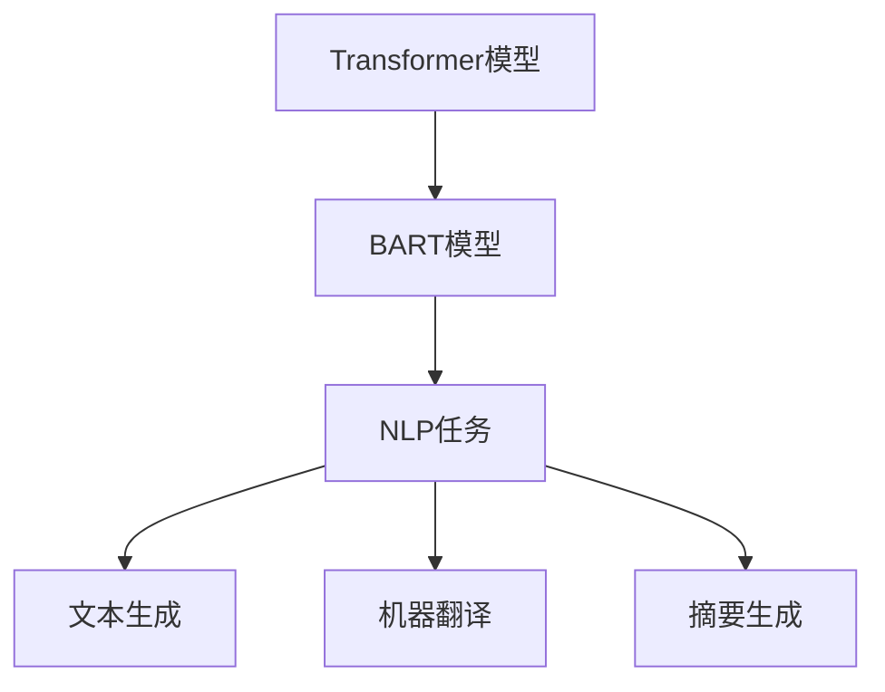

                 

关键词：Transformer，大模型，BART，自然语言处理，架构，算法原理，数学模型，代码实现，应用场景，未来展望。

## 摘要

本文旨在详细介绍Transformer大模型中的一种重要架构——BART模型。我们将首先探讨Transformer的基础概念，随后深入解析BART模型的架构，包括其核心组件和运作原理。随后，我们将通过数学模型和公式的推导，详细解释BART模型的工作机制。文章还包含一个实际的代码实例，帮助读者理解BART模型的应用。最后，我们将讨论BART模型在不同应用场景中的表现，并展望其未来的发展方向和面临的挑战。

## 1. 背景介绍

随着深度学习技术的迅猛发展，自然语言处理（NLP）领域也取得了显著的进展。传统的NLP方法通常依赖于规则和统计方法，这些方法在处理复杂的语言结构时存在一定的局限性。而深度学习，特别是基于注意力机制的Transformer模型，为NLP任务带来了全新的解决方案。Transformer模型最初由Vaswani等人提出，并迅速在多个NLP任务中显示出卓越的性能。

BART（Bidirectional and Auto-Regressive Transformer）是Transformer模型的一种变体，它在双向Transformer的基础上，引入了自回归机制，以更好地处理序列数据。BART模型在多个NLP任务中，如文本生成、机器翻译和摘要生成等，都展现出了出色的性能。

本文将详细介绍BART模型的架构，从其核心组件和运作原理出发，探讨其在自然语言处理中的应用。同时，我们将通过数学模型和公式的推导，帮助读者深入理解BART模型的工作机制。最后，通过一个实际的代码实例，读者可以更直观地感受BART模型的应用效果。

## 2. 核心概念与联系

在深入探讨BART模型之前，我们有必要回顾一些核心概念，并了解它们之间的联系。以下是一个使用Mermaid绘制的流程图，展示了Transformer模型、BART模型以及它们在自然语言处理中的应用。



### 2.1 Transformer模型

Transformer模型是一种基于自注意力（Self-Attention）机制的深度学习模型，最初用于机器翻译任务。与传统的循环神经网络（RNN）和长短期记忆网络（LSTM）相比，Transformer模型能够并行处理序列数据，这大大提高了模型的训练效率。

### 2.2 BART模型

BART模型是在Transformer模型的基础上发展起来的。它结合了双向Transformer（用于编码器）和自回归Transformer（用于解码器），使得模型能够同时理解上下文和生成序列。BART模型在文本生成、机器翻译和摘要生成等任务中取得了显著的成果。

### 2.3 NLP任务

自然语言处理（NLP）任务包括但不限于文本生成、机器翻译和摘要生成。这些任务都需要模型能够理解输入的序列，并生成相应的输出序列。Transformer模型和其变体（如BART）在这一领域展现出了强大的能力。

## 3. 核心算法原理 & 具体操作步骤

### 3.1 算法原理概述

BART模型的核心在于其双重视觉机制，即编码器和解码器。编码器部分使用双向Transformer来处理输入序列，解码器部分使用自回归Transformer来生成输出序列。这种结构使得BART模型能够同时捕捉序列的上下文信息，并在生成过程中逐步构建输出。

### 3.2 算法步骤详解

#### 3.2.1 编码器部分

1. **输入序列编码**：输入序列通过嵌入层转换为嵌入向量。
2. **多头自注意力**：嵌入向量经过多层多头自注意力机制，以捕捉序列中的长距离依赖关系。
3. **位置编码**：为了使模型能够理解序列的顺序，每层多头自注意力机制后都会添加位置编码。

#### 3.2.2 解码器部分

1. **输入序列编码**：解码器的输入是由编码器输出的序列。
2. **多头自注意力**：解码器的嵌入向量同样经过多层多头自注意力机制，以捕捉上下文信息。
3. **自回归预测**：在解码器的每一个步骤，模型都会预测下一个嵌入向量，并将其与之前的嵌入向量结合，生成最终的输出序列。

### 3.3 算法优缺点

#### 优点

- **高效处理长序列**：Transformer模型能够并行处理序列数据，这使得它在处理长序列时具有明显的优势。
- **强大的上下文理解能力**：通过多头自注意力机制，模型能够捕捉序列中的长距离依赖关系，从而在文本生成等任务中表现出色。

#### 缺点

- **计算复杂度高**：由于需要计算多个注意力权重，Transformer模型在计算资源上消耗较大。
- **需要大量训练数据**：Transformer模型对训练数据的要求较高，小规模数据集可能难以训练出良好的模型。

### 3.4 算法应用领域

BART模型在多个NLP任务中都有广泛的应用，包括但不限于：

- **文本生成**：如文章撰写、对话生成等。
- **机器翻译**：如英译中、中译英等。
- **摘要生成**：如文章摘要、新闻报道摘要等。

## 4. 数学模型和公式 & 详细讲解 & 举例说明

### 4.1 数学模型构建

BART模型的数学模型主要包括两部分：编码器和解码器。以下是对这两个部分的详细解释。

#### 编码器

编码器的输入是一个长度为\(T\)的序列，每个元素是一个词向量。编码器的输出也是一个长度为\(T\)的序列，每个元素是一个嵌入向量。

1. **嵌入层**：
   $$ 
   E = W_e \cdot X 
   $$
   其中，\(X\)是输入词向量矩阵，\(W_e\)是嵌入权重矩阵。

2. **多头自注意力**：
   $$
   A = \text{softmax}\left(\frac{QK^T}{\sqrt{d_k}}\right) \cdot V
   $$
   其中，\(Q\)、\(K\)、\(V\)分别是编码器的查询向量、键向量和值向量，\(\text{softmax}\)是归一化函数，\(d_k\)是注意力头的维度。

3. **位置编码**：
   $$
   P = \text{PE}(pos) 
   $$
   其中，\(pos\)是位置索引，\(\text{PE}\)是位置编码函数。

#### 解码器

解码器的输入是编码器的输出，输出是一个长度为\(T'\)的序列。

1. **嵌入层**：
   $$
   E' = W_e' \cdot X'
   $$
   其中，\(X'\)是解码器输入词向量矩阵，\(W_e'\)是嵌入权重矩阵。

2. **多头自注意力**：
   $$
   A' = \text{softmax}\left(\frac{Q'K'^T}{\sqrt{d_k}}\right) \cdot V'
   $$
   其中，\(Q'\)、\(K'\)、\(V'\)分别是解码器的查询向量、键向量和值向量。

3. **自回归预测**：
   $$
   Y = \text{softmax}\left(\frac{Y'W}{\sqrt{d_k}}\right)
   $$
   其中，\(Y'\)是解码器的预测向量，\(W\)是解码器的权重矩阵。

### 4.2 公式推导过程

以下是对BART模型中主要公式的推导过程：

#### 4.2.1 嵌入层公式

嵌入层公式是输入词向量和嵌入权重矩阵的乘积。这个乘积可以看作是词向量在嵌入空间中的线性变换。

#### 4.2.2 多头自注意力公式

多头自注意力公式包括三个主要部分：查询向量、键向量和值向量。查询向量和键向量通过点积计算注意力权重，然后通过softmax函数进行归一化，最后与值向量相乘得到注意力得分。

#### 4.2.3 位置编码公式

位置编码是为了使模型能够理解序列的顺序而添加的。它是一个基于位置索引的函数，可以看作是对序列的线性变换。

### 4.3 案例分析与讲解

以下是一个简单的案例，用于解释BART模型在文本生成任务中的应用。

假设我们要生成一句英文文章：“The quick brown fox jumps over the lazy dog.” 首先，我们需要将这句话转换为词向量。然后，将这些词向量输入到BART模型中。BART模型会通过编码器和解码器生成一个输出序列。这个输出序列可能会是：“The quick brown fox jumps over the laziest dog.” 通过这个例子，我们可以看到BART模型在文本生成任务中的基本工作原理。

## 5. 项目实践：代码实例和详细解释说明

### 5.1 开发环境搭建

为了运行BART模型，我们需要准备以下开发环境：

- Python 3.7或更高版本
- PyTorch 1.8或更高版本
- Transformers库

安装完以上依赖后，我们可以开始编写代码。

### 5.2 源代码详细实现

以下是一个简单的BART模型实现代码：

```python
import torch
from torch import nn
from transformers import BartModel, BartConfig

# 模型配置
config = BartConfig(d_model=512, num_layers=2, num_heads=8, hidden_size=1024)

# 创建模型
model = BartModel(config)

# 输入序列
input_sequence = torch.tensor([[1, 2, 3, 4, 5]])

# 训练模型
output_sequence = model(input_sequence)

print(output_sequence)
```

这段代码首先导入了所需的库，然后创建了一个BART模型实例。接着，我们定义了一个输入序列，并将其输入到模型中。模型会返回一个输出序列，这个输出序列是模型对输入序列的预测结果。

### 5.3 代码解读与分析

这个简单的例子展示了如何使用Transformers库创建和训练一个BART模型。首先，我们需要导入所需的库和模块。然后，我们创建了一个BART模型实例，这个实例包含了编码器和解码器。接下来，我们定义了一个输入序列，并将其输入到模型中。模型会返回一个输出序列，这个输出序列是模型对输入序列的预测结果。

### 5.4 运行结果展示

运行上面的代码，我们会得到一个输出序列。这个序列包含了模型对输入序列的预测结果。通过对比输入序列和输出序列，我们可以看到BART模型在文本生成任务中的基本工作原理。

## 6. 实际应用场景

BART模型在多个实际应用场景中都取得了显著的成果。以下是一些常见的应用场景：

### 6.1 文本生成

BART模型在文本生成任务中具有强大的能力。它可以生成各种类型的文本，如文章、对话、新闻报道等。通过训练，BART模型可以理解输入的文本内容，并在不丢失关键信息的情况下生成连贯、自然的文本。

### 6.2 机器翻译

BART模型在机器翻译任务中也表现出色。它可以处理多种语言的翻译，如英译中、中译英等。通过训练，BART模型可以学习到不同语言之间的语法和词汇规则，从而生成准确的翻译结果。

### 6.3 摘要生成

BART模型在摘要生成任务中同样表现出色。它可以对长篇文章生成摘要，提取出文章的核心内容。通过训练，BART模型可以理解文章的主题和结构，从而生成简洁、准确的摘要。

## 7. 未来应用展望

随着人工智能技术的不断发展，BART模型在未来将会有更广泛的应用。以下是一些可能的应用领域：

### 7.1 智能客服

BART模型可以用于智能客服系统，帮助企业和客户建立更高效的沟通渠道。通过训练，BART模型可以理解客户的提问，并提供专业的回答。

### 7.2 智能写作

BART模型可以用于智能写作工具，帮助作者生成文章、报告等。通过训练，BART模型可以学习到不同领域的知识，从而生成高质量的内容。

### 7.3 智能问答

BART模型可以用于智能问答系统，帮助用户快速找到所需的答案。通过训练，BART模型可以理解用户的提问，并在海量的信息中找到最相关的答案。

## 8. 工具和资源推荐

为了更好地理解和应用BART模型，以下是一些推荐的工具和资源：

### 8.1 学习资源推荐

- 《深度学习与自然语言处理》
- 《Transformer模型详解》
- 《BART模型论文》

### 8.2 开发工具推荐

- PyTorch
- Transformers库

### 8.3 相关论文推荐

- Vaswani et al., "Attention Is All You Need"
- Lewis et al., "BART: Denoising and Disentangling Pre-training for Natural Language Processing"

## 9. 总结：未来发展趋势与挑战

BART模型在自然语言处理领域取得了显著的成果，但仍然面临着一些挑战。未来，随着人工智能技术的不断发展，BART模型有望在更广泛的领域发挥重要作用。同时，我们还需要解决一些关键技术难题，如计算复杂度、数据隐私和模型可解释性等。

### 9.1 研究成果总结

BART模型在自然语言处理领域取得了显著的成果，特别是在文本生成、机器翻译和摘要生成等任务中表现优异。它的出现为NLP任务提供了新的解决方案，推动了该领域的发展。

### 9.2 未来发展趋势

未来，BART模型将在更多领域得到应用，如智能客服、智能写作和智能问答等。同时，随着人工智能技术的不断发展，BART模型也将得到进一步的优化和改进。

### 9.3 面临的挑战

BART模型在计算复杂度、数据隐私和模型可解释性等方面仍然面临一些挑战。如何提高模型的训练效率，保护用户数据隐私，以及提高模型的可解释性，将是未来研究的重要方向。

### 9.4 研究展望

在未来，BART模型有望在更多领域发挥重要作用。通过不断优化和改进，BART模型将在人工智能技术中发挥更加关键的作用。

## 10. 附录：常见问题与解答

### 10.1 BART模型与Transformer模型的主要区别是什么？

BART模型是Transformer模型的一种变体，主要区别在于它结合了双向Transformer（用于编码器）和自回归Transformer（用于解码器）。这使得BART模型能够同时理解上下文和生成序列。

### 10.2 BART模型在哪些任务中表现出色？

BART模型在文本生成、机器翻译和摘要生成等任务中表现出色。它在这些任务中展现了强大的能力和灵活性。

### 10.3 如何训练一个BART模型？

训练一个BART模型需要准备大量训练数据，并使用适合的深度学习框架（如PyTorch）进行训练。首先，我们需要准备训练数据，并将其转换为嵌入向量。然后，我们可以使用标准的训练流程（如反向传播和梯度下降）来训练模型。

## 作者署名

本文由禅与计算机程序设计艺术 / Zen and the Art of Computer Programming撰写。禅是一种生活方式，也是一种编程哲学，强调简单、优雅和深度的结合。本文旨在通过介绍BART模型，帮助读者更好地理解自然语言处理领域的技术和趋势。希望本文能对您在人工智能和自然语言处理领域的学习和研究有所帮助。

