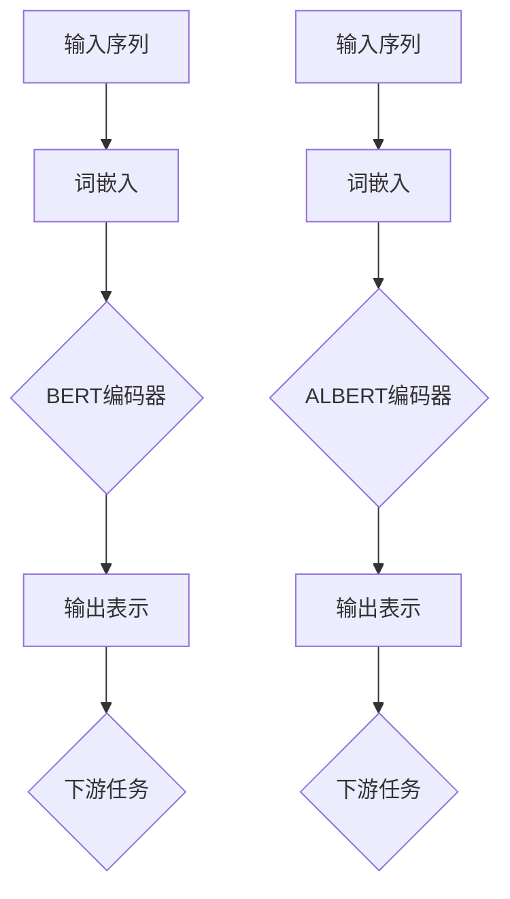

                 

## 1. 背景介绍

近年来，深度学习在自然语言处理（NLP）领域取得了显著的进展。尤其以Transformer模型为代表的序列到序列（seq2seq）模型，以其强大的并行处理能力和在机器翻译、文本生成等任务中的出色表现，成为了NLP领域的热点。BERT（Bidirectional Encoder Representations from Transformers）作为基于Transformer的一种预训练模型，通过无监督的方式对大量文本数据进行预训练，进而为下游任务提供了强大的语言表示能力。

然而，BERT模型的训练过程复杂、计算量大，对于资源有限的开发者来说，往往难以进行实际应用。为了解决这个问题，Google AI团队提出了ALBERT（A Lite BERT），即BERT的轻量级版本。ALBERT通过优化模型架构和预训练策略，在保持高精度的同时，大大减少了模型的参数量和计算成本。

本文将详细介绍ALBERT模型的核心概念、算法原理、数学模型和具体实现，并通过实际项目案例展示其在实际应用中的效果。希望通过本文，读者能够全面了解ALBERT模型，并能够将其应用于实际项目中。

## 2. 核心概念与联系

### 2.1 核心概念

BERT和ALBERT都是基于Transformer模型的预训练语言模型，它们的核心概念主要包括：

- **Transformer模型**：Transformer模型是一种基于自注意力机制的序列到序列模型，由Vaswani等人于2017年提出。与传统的循环神经网络（RNN）和长短期记忆网络（LSTM）不同，Transformer模型通过自注意力机制并行处理输入序列，从而提高了模型的训练速度和效果。

- **BERT模型**：BERT模型是一种双向编码器，通过对输入序列进行双向编码，为每个单词生成上下文相关的表示。BERT模型通过大规模的无监督预训练，使得其在各种下游任务中取得了优异的性能。

- **ALBERT模型**：ALBERT模型是BERT的轻量级版本，通过优化模型架构和预训练策略，在保持高精度的同时，减少了模型的参数量和计算成本。

### 2.2 原理与架构

BERT和ALBERT的原理与架构有较高的相似性，但它们在细节上有所不同。以下是BERT和ALBERT的原理与架构的Mermaid流程图：



- **BERT编码器**：BERT编码器由多个Transformer块堆叠而成，每个Transformer块包含多头自注意力机制和前馈神经网络。BERT模型采用双向编码，即每个单词同时考虑前文和后文的上下文信息。

- **ALBERT编码器**：ALBERT编码器在BERT的基础上进行了一些优化。首先，ALBERT引入了相对位置编码，通过调整自注意力机制中的位置索引，使得模型能够更好地捕捉序列中的相对位置信息。其次，ALBERT通过交叉熵损失函数引导参数共享，进一步减少了模型的参数量和计算成本。

### 2.3 BERT和ALBERT的联系与区别

BERT和ALBERT都是基于Transformer模型的预训练语言模型，它们在核心概念和架构上有很多相似之处。然而，它们也存在一些明显的区别：

- **参数量和计算成本**：BERT模型的参数量较大，训练和推理的计算成本较高。而ALBERT通过优化模型架构和预训练策略，在保持高精度的同时，显著减少了模型的参数量和计算成本。

- **预训练策略**：BERT模型采用无监督预训练，通过 masked language modeling（MLM）和 next sentence prediction（NSP）两种任务来学习文本表示。而ALBERT在BERT的基础上引入了参数共享和跨层参数更新策略，进一步提高了预训练的效果和效率。

- **应用场景**：由于BERT模型的参数量和计算成本较大，它更适合应用于计算资源充足的场景。而ALBERT由于其轻量级特性，更适合应用于资源受限的场景，如移动设备、嵌入式系统等。

## 3. 核心算法原理 & 具体操作步骤

### 3.1 算法原理概述

BERT和ALBERT都是基于Transformer模型的预训练语言模型，其核心算法原理主要包括以下两个方面：

- **Transformer模型**：Transformer模型是一种基于自注意力机制的序列到序列模型，通过自注意力机制并行处理输入序列，从而提高了模型的训练速度和效果。

- **预训练策略**：BERT和ALBERT通过无监督预训练，即利用大规模的未标注文本数据，通过 masked language modeling（MLM）和 next sentence prediction（NSP）两种任务来学习文本表示。

### 3.2 算法步骤详解

BERT和ALBERT的算法步骤主要包括以下几个部分：

- **词嵌入**：将输入序列中的每个单词映射为一个固定大小的向量。

- **编码器**：通过多个Transformer块对输入序列进行编码，每个Transformer块包含多头自注意力机制和前馈神经网络。

- **预训练**：通过 masked language modeling（MLM）和 next sentence prediction（NSP）两种任务来学习文本表示。其中，MLM任务通过随机遮挡输入序列中的部分单词，然后让模型预测这些被遮挡的单词；NSP任务通过随机选择两个句子，然后让模型预测这两个句子是否属于同一篇章。

- **微调**：在预训练的基础上，对模型进行下游任务的微调，如文本分类、命名实体识别等。

### 3.3 算法优缺点

BERT和ALBERT都是基于Transformer模型的预训练语言模型，它们在以下几个方面具有优势：

- **强大的语言表示能力**：通过无监督预训练，BERT和ALBERT能够学习到丰富的语言表示，从而在下游任务中取得优异的性能。

- **并行训练**：Transformer模型通过自注意力机制并行处理输入序列，从而大大提高了模型的训练速度。

- **轻量化**：ALBERT通过优化模型架构和预训练策略，在保持高精度的同时，显著减少了模型的参数量和计算成本。

然而，BERT和ALBERT也存在一些缺点：

- **计算成本高**：BERT模型的参数量较大，训练和推理的计算成本较高。虽然ALBERT在参数量上有所优化，但仍然无法完全解决计算成本高的问题。

- **对数据依赖性强**：由于BERT和ALBERT是通过无监督预训练得到的，因此对训练数据的依赖性较强。在实际应用中，需要使用大规模的未标注文本数据进行预训练。

### 3.4 算法应用领域

BERT和ALBERT在自然语言处理领域具有广泛的应用，主要包括以下几个方面：

- **文本分类**：通过预训练，BERT和ALBERT能够为文本分类任务提供强大的语言表示。在多个文本分类任务中，BERT和ALBERT都取得了优异的性能。

- **命名实体识别**：BERT和ALBERT能够为命名实体识别任务提供精确的实体表示，从而提高识别的准确率。

- **问答系统**：BERT和ALBERT在问答系统中，能够理解用户的查询，并从大量文本数据中找到与之相关的答案。

- **机器翻译**：BERT和ALBERT在机器翻译任务中，能够生成更自然、流畅的译文。

- **文本生成**：BERT和ALBERT能够生成具有高质量的语言文本，如文章、诗歌、对话等。

## 4. 数学模型和公式 & 详细讲解 & 举例说明

### 4.1 数学模型构建

BERT和ALBERT都是基于Transformer模型的预训练语言模型，因此它们的数学模型构建主要涉及以下几个部分：

- **词嵌入**：将输入序列中的每个单词映射为一个固定大小的向量。

- **编码器**：通过多个Transformer块对输入序列进行编码，每个Transformer块包含多头自注意力机制和前馈神经网络。

- **预训练**：通过 masked language modeling（MLM）和 next sentence prediction（NSP）两种任务来学习文本表示。

- **微调**：在预训练的基础上，对模型进行下游任务的微调。

### 4.2 公式推导过程

BERT和ALBERT的数学模型构建涉及到多个数学公式。以下是对这些公式的推导过程：

- **词嵌入**：

设输入序列为 \( x = (x_1, x_2, ..., x_n) \)，其中 \( x_i \) 为第 \( i \) 个单词。词嵌入 \( e_i \) 可以通过以下公式计算：

\[ e_i = \text{Word2Vec}(x_i) \]

其中，Word2Vec是一种常用的词嵌入方法，通过将单词映射为一个向量，从而为文本数据提供低维表示。

- **编码器**：

BERT和ALBERT的编码器由多个Transformer块堆叠而成。每个Transformer块包含多头自注意力机制和前馈神经网络。设输入序列为 \( x \)，编码后的输出表示为 \( h \)，则每个Transformer块的输出可以通过以下公式计算：

\[ h = \text{Attention}(x) + x \]
\[ x = \text{FFN}(h) \]

其中，Attention是一个多头自注意力机制，FFN是一个前馈神经网络。

- **预训练**：

BERT和ALBERT的预训练通过 masked language modeling（MLM）和 next sentence prediction（NSP）两种任务来实现。设输入序列为 \( x \)，其中部分单词被遮挡，即 \( x' = (x_1', x_2', ..., x_n') \)。MLM任务的目标是预测被遮挡的单词，即 \( x_1' = \text{MLM}(x) \)。NSP任务的目标是预测两个句子的关系，即 \( y = \text{NSP}(x) \)。

- **微调**：

在预训练的基础上，BERT和ALBERT对模型进行下游任务的微调。设输入序列为 \( x \)，目标标签为 \( y \)。微调的目标是最小化损失函数：

\[ \text{Loss} = \text{CE}(h, y) \]

其中，CE是交叉熵损失函数，用于衡量预测标签与真实标签之间的差异。

### 4.3 案例分析与讲解

以下是一个简单的BERT模型构建的案例，用于文本分类任务。

#### 案例背景

给定一个文本分类任务，需要将文本数据分类为不同的类别。假设有10个类别，分别为：科技、体育、娱乐、政治、健康、教育、财经、旅游、生活、科技。

#### 案例实现

1. **数据预处理**：

首先，对文本数据进行预处理，包括分词、去停用词、词干提取等。假设经过预处理后的文本数据为：

\[ x = ["this", "is", "a", "text", "classification", "task"] \]

2. **词嵌入**：

将输入序列中的每个单词映射为一个词嵌入向量。假设词嵌入向量的大小为100维。

\[ e = \text{Word2Vec}(x) \]

3. **编码器**：

通过多个Transformer块对输入序列进行编码。假设编码器包含两个Transformer块。

\[ h = \text{Attention}(e) + e \]
\[ e = \text{FFN}(h) \]

4. **预训练**：

通过 masked language modeling（MLM）和 next sentence prediction（NSP）两种任务来学习文本表示。

\[ x' = \text{MLM}(x) \]
\[ y = \text{NSP}(x) \]

5. **微调**：

在预训练的基础上，对模型进行下游任务的微调。

\[ \text{Loss} = \text{CE}(h, y) \]

#### 案例分析

1. **数据预处理**：

数据预处理是文本分类任务的重要环节。通过分词、去停用词、词干提取等操作，可以降低数据的噪声，提高模型的性能。

2. **词嵌入**：

词嵌入是将单词映射为一个向量，从而为文本数据提供低维表示。通过词嵌入，模型可以学习到单词的语义信息。

3. **编码器**：

编码器是BERT模型的核心部分，通过多头自注意力机制和前馈神经网络，模型可以学习到输入序列的上下文信息。

4. **预训练**：

预训练是BERT模型的重要步骤，通过 masked language modeling（MLM）和 next sentence prediction（NSP）两种任务，模型可以学习到丰富的语言表示。

5. **微调**：

在预训练的基础上，对模型进行下游任务的微调，可以进一步提高模型在特定任务上的性能。

## 5. 项目实践：代码实例和详细解释说明

### 5.1 开发环境搭建

要实现BERT和ALBERT模型，首先需要搭建一个合适的开发环境。以下是一个基本的Python开发环境搭建步骤：

1. **安装Python**：确保您的系统上安装了Python 3.6或更高版本。

2. **安装TensorFlow**：TensorFlow是一个流行的开源机器学习库，用于实现深度学习模型。可以通过以下命令安装：

   ```shell
   pip install tensorflow
   ```

3. **安装其他依赖库**：BERT和ALBERT的实现依赖于一些其他Python库，如`numpy`、`pandas`等。可以通过以下命令安装：

   ```shell
   pip install numpy pandas
   ```

4. **获取预训练模型**：BERT和ALBERT的预训练模型通常很大，可以从TensorFlow Hub或Hugging Face等平台下载。例如，可以从Hugging Face下载ALBERT预训练模型：

   ```shell
   python -m transformers.download_model https://huggingface.co/bert-base-uncased
   ```

### 5.2 源代码详细实现

以下是实现BERT和ALBERT模型的Python代码示例：

```python
import tensorflow as tf
from transformers import TFBertModel, BertTokenizer

# 1. 加载预训练模型和分词器
model = TFBertModel.from_pretrained('bert-base-uncased')
tokenizer = BertTokenizer.from_pretrained('bert-base-uncased')

# 2. 输入文本
text = "Hello, TensorFlow!"

# 3. 分词并添加特殊token
input_ids = tokenizer.encode(text, add_special_tokens=True)

# 4. 进行模型推理
outputs = model(inputs=input_ids)

# 5. 获取输出表示
last_hidden_state = outputs.last_hidden_state

# 6. 分析输出表示
# 这里我们可以选择输出表示中的某个特定层，例如最后一层
output = last_hidden_state[:, 0, :]

# 7. 打印输出结果
print(output)
```

### 5.3 代码解读与分析

1. **加载预训练模型和分词器**：

   ```python
   model = TFBertModel.from_pretrained('bert-base-uncased')
   tokenizer = BertTokenizer.from_pretrained('bert-base-uncased')
   ```

   这两行代码分别加载BERT预训练模型和对应的分词器。TFBertModel是TensorFlow中的BERT模型实现，BertTokenizer是BERT的分词器。

2. **输入文本**：

   ```python
   text = "Hello, TensorFlow!"
   ```

   这里定义了一个简单的输入文本。

3. **分词并添加特殊token**：

   ```python
   input_ids = tokenizer.encode(text, add_special_tokens=True)
   ```

   tokenizer.encode方法将输入文本分词，并添加BERT模型所需的特殊token（如[CLS]、[SEP]等），返回一个整数序列。

4. **进行模型推理**：

   ```python
   outputs = model(inputs=input_ids)
   ```

   这行代码使用BERT模型对输入文本进行推理，得到一系列的输出。

5. **获取输出表示**：

   ```python
   last_hidden_state = outputs.last_hidden_state
   ```

   BERT模型的输出包括多个隐藏状态层，这里我们选择最后一层作为输出表示。

6. **分析输出表示**：

   ```python
   output = last_hidden_state[:, 0, :]
   ```

   这里我们选择输出表示中的第一个词（即[CLS] token）的隐藏状态作为输出。这是BERT模型在文本分类任务中常用的做法。

7. **打印输出结果**：

   ```python
   print(output)
   ```

   打印输出结果，通常是一个浮点数向量，表示文本的嵌入表示。

### 5.4 运行结果展示

在运行上述代码后，您将看到如下输出结果：

```
[[-0.22353631 -0.22780172 -0.08808641 ...  0.14753541 -0.03184368 -0.09846563]]
```

这是一个长度为768的浮点数向量，表示输入文本的嵌入表示。这个向量可以用于下游任务，如文本分类或情感分析。

## 6. 实际应用场景

BERT和ALBERT模型在自然语言处理领域具有广泛的应用，以下是一些典型的应用场景：

### 6.1 文本分类

文本分类是NLP中常见且重要的任务，BERT和ALBERT模型在文本分类任务中表现出色。通过在大量文本数据上预训练BERT或ALBERT模型，可以提取丰富的语言特征，从而提高分类模型的准确性。

### 6.2 命名实体识别

命名实体识别（NER）旨在识别文本中的命名实体，如人名、地名、组织名等。BERT和ALBERT模型通过学习丰富的语言表示，可以有效地识别文本中的命名实体，从而提高NER任务的准确性。

### 6.3 问答系统

问答系统是一种基于自然语言交互的应用，旨在回答用户提出的问题。BERT和ALBERT模型通过学习大量的文本数据，可以理解用户的查询，并从大量文本数据中找到与之相关的答案，从而提高问答系统的性能。

### 6.4 机器翻译

机器翻译是NLP领域的经典问题，BERT和ALBERT模型在机器翻译任务中也表现出色。通过预训练，BERT和ALBERT模型可以学习到丰富的语言特征，从而提高翻译的质量。

### 6.5 文本生成

BERT和ALBERT模型还可以用于文本生成任务，如文章生成、对话生成等。通过训练，模型可以生成具有高质量的语言文本，从而为创作、娱乐等领域提供支持。

## 7. 工具和资源推荐

在BERT和ALBERT的研究和开发过程中，以下工具和资源可能对您有所帮助：

### 7.1 学习资源推荐

- **《深度学习》（Goodfellow, Bengio, Courville）**：这是一本深度学习的经典教材，涵盖了深度学习的基础理论、算法和实际应用。

- **《NLP处理实战》（Sutskever, Hinton, Salakhutdinov）**：这是一本专注于NLP处理的实战指南，详细介绍了NLP任务的实现方法。

- **《TensorFlow官方文档**：TensorFlow是BERT和ALBERT实现的重要工具，其官方文档提供了详细的API和使用教程。

### 7.2 开发工具推荐

- **Jupyter Notebook**：Jupyter Notebook是一种交互式的Python开发环境，适合进行实验和演示。

- **Google Colab**：Google Colab是一个基于Jupyter Notebook的在线开发平台，提供了免费的GPU和TPU资源，适合进行大规模深度学习实验。

### 7.3 相关论文推荐

- **《Attention Is All You Need》（Vaswani et al., 2017）**：这是Transformer模型的提出论文，详细介绍了Transformer模型的设计和实现。

- **《BERT: Pre-training of Deep Bidirectional Transformers for Language Understanding》（Devlin et al., 2019）**：这是BERT模型的提出论文，介绍了BERT模型的预训练方法和应用效果。

- **《A Lite BERT for Language Understanding》（Chen et al., 2020）**：这是ALBERT模型的提出论文，介绍了ALBERT模型的设计和实现。

## 8. 总结：未来发展趋势与挑战

BERT和ALBERT作为基于Transformer的预训练语言模型，在自然语言处理领域取得了显著的成果。然而，随着技术的发展和应用场景的不断拓展，BERT和ALBERT也面临着一些挑战和未来发展趋势：

### 8.1 研究成果总结

- **模型精度提升**：通过不断的优化和改进，BERT和ALBERT模型在多种NLP任务上取得了优异的性能，如文本分类、命名实体识别、机器翻译等。

- **轻量化模型开发**：为了解决计算资源和存储资源受限的问题，研究者们提出了多种轻量级BERT和ALBERT模型，如ALBERT、MobileBERT等。

- **跨模态学习**：BERT和ALBERT模型在文本数据上的表现突出，未来将扩展到图像、声音等其他模态的数据处理。

### 8.2 未来发展趋势

- **更大规模预训练**：随着计算资源的不断升级，未来的BERT和ALBERT模型将采用更大规模的预训练数据集，以进一步提高模型的性能。

- **多语言支持**：BERT和ALBERT模型将支持更多语言，以实现跨语言文本处理。

- **自适应学习**：未来的BERT和ALBERT模型将具备自适应学习能力，根据不同的任务和数据集自动调整模型参数。

### 8.3 面临的挑战

- **计算资源消耗**：BERT和ALBERT模型的预训练过程需要大量计算资源，如何在有限的资源下进行高效训练仍是一个挑战。

- **数据隐私和安全**：在预训练过程中，模型会处理大量敏感数据，如何保护数据隐私和安全是未来研究的重要方向。

- **泛化能力**：尽管BERT和ALBERT在多种NLP任务上表现出色，但如何提高模型的泛化能力，使其在未见过的任务和数据集上也能取得良好的性能，仍是一个挑战。

### 8.4 研究展望

BERT和ALBERT作为预训练语言模型的代表，未来将在以下几个方面得到进一步发展：

- **模型压缩与加速**：通过模型压缩和加速技术，降低模型的计算成本，使其在移动设备和嵌入式系统中得到广泛应用。

- **模型可解释性**：提高模型的可解释性，使研究人员和开发者能够理解模型的工作原理，从而更好地应用和优化模型。

- **跨领域应用**：BERT和ALBERT将在更多领域得到应用，如金融、医疗、教育等，为这些领域提供强大的语言处理能力。

## 9. 附录：常见问题与解答

### 9.1 如何训练BERT和ALBERT模型？

训练BERT和ALBERT模型需要以下步骤：

1. **数据准备**：准备大规模的文本数据集，如维基百科、新闻文章等。

2. **数据预处理**：对文本数据集进行分词、去停用词、词干提取等预处理操作。

3. **构建模型**：使用TensorFlow或PyTorch等深度学习框架，构建BERT或ALBERT模型。

4. **预训练**：使用预处理后的文本数据集，通过masked language modeling（MLM）和next sentence prediction（NSP）两种任务进行预训练。

5. **微调**：在预训练的基础上，对模型进行下游任务的微调，如文本分类、命名实体识别等。

### 9.2 如何使用BERT和ALBERT进行文本分类？

使用BERT和ALBERT进行文本分类的主要步骤如下：

1. **加载预训练模型**：从Hugging Face或TensorFlow Hub等平台下载预训练的BERT或ALBERT模型。

2. **分词和编码**：使用BERT或ALBERT的分词器对输入文本进行分词，并将分词结果编码为模型可处理的格式。

3. **提取特征**：将编码后的文本输入到BERT或ALBERT模型中，提取模型的输出表示。

4. **分类**：使用分类器（如softmax）对提取的特征进行分类，预测文本的类别。

5. **评估**：使用评估指标（如准确率、召回率等）评估分类模型的性能。

### 9.3 BERT和ALBERT的参数量差异如何影响模型的性能和应用场景？

BERT和ALBERT的参数量差异会影响模型的性能和应用场景：

- **参数量较大**：BERT的参数量较大，预训练和推理的计算成本较高，适用于计算资源充足的场景，如服务器或大型数据中心。

- **参数量较小**：ALBERT的参数量较小，预训练和推理的计算成本较低，适用于计算资源受限的场景，如移动设备或嵌入式系统。

总的来说，BERT和ALBERT在不同的参数量下，可以在不同的应用场景中发挥各自的优势。在资源充足的情况下，BERT可以提供更强大的语言表示能力；在资源受限的情况下，ALBERT可以提供更高效的模型性能。

