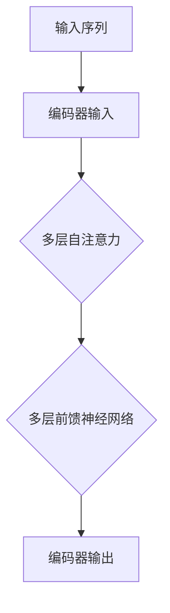

                 

关键词：Transformer，编码器，大模型，深度学习，自然语言处理

> 摘要：本文深入探讨了Transformer大模型的编码器部分，从背景介绍、核心概念与联系、算法原理与数学模型、项目实践和实际应用场景等方面，详细解析了编码器的运作机制及其在自然语言处理领域的应用。通过理论与实践的结合，为广大开发者提供了理解和使用编码器的实用指导。

## 1. 背景介绍

近年来，深度学习在自然语言处理（NLP）领域取得了显著的成果，其中Transformer模型尤为引人注目。Transformer是Google团队在2017年提出的一种基于自注意力机制的深度神经网络模型，它彻底颠覆了传统的循环神经网络（RNN）在序列建模中的应用。相较于RNN，Transformer具有并行计算能力，能够更有效地处理长序列，并在多个NLP任务中取得了优异的性能。

编码器（Encoder）是Transformer模型的核心组成部分之一，负责将输入序列编码为固定长度的向量表示，这些向量包含了输入序列的语义信息。编码器的性能直接影响到整个模型的最终表现。因此，理解和优化编码器是Transformer大模型研究的关键。

## 2. 核心概念与联系

### 2.1 编码器原理

编码器通过多层注意力机制（Self-Attention）和前馈神经网络（Feedforward Network）对输入序列进行处理。每一层编码器都能够学习到输入序列中各个元素之间的关系，从而生成更加丰富和精确的序列表示。

### 2.2 自注意力机制

自注意力机制是编码器的核心组成部分，它通过计算输入序列中每个元素与其它元素之间的相似性，并加权求和，从而生成一个包含更多语义信息的序列表示。自注意力机制的数学公式如下：

$$
\text{Attention}(Q, K, V) = \text{softmax}(\frac{QK^T}{\sqrt{d_k}})V
$$

其中，Q、K、V 分别为查询（Query）、键（Key）和值（Value）向量，$d_k$ 为键向量的维度。

### 2.3 Mermaid 流程图



## 3. 核心算法原理 & 具体操作步骤

### 3.1 算法原理概述

编码器的工作流程可以概括为以下几个步骤：

1. **输入预处理**：将输入序列编码为词向量。
2. **多层自注意力机制**：逐层计算输入序列中各个元素之间的关系，并生成序列表示。
3. **多层前馈神经网络**：对自注意力机制生成的序列表示进行非线性变换。
4. **编码器输出**：得到固定长度的向量表示，作为下游任务的输入。

### 3.2 算法步骤详解

1. **输入预处理**：将输入序列 $X = (x_1, x_2, ..., x_n)$ 编码为词向量 $X' = (x_1', x_2', ..., x_n')$，其中 $x_i'$ 为词向量。

2. **多层自注意力机制**：对于每一层编码器，首先计算查询向量 $Q = (q_1, q_2, ..., q_n)$、键向量 $K = (k_1, k_2, ..., k_n)$ 和值向量 $V = (v_1, v_2, ..., v_n)$。然后，通过自注意力机制计算每个元素在序列中的权重，并加权求和得到新的序列表示。

3. **多层前馈神经网络**：对自注意力机制生成的序列表示进行非线性变换，以提高模型的表达能力。

4. **编码器输出**：最后，将多层前馈神经网络输出的序列表示作为编码器的输出，用于下游任务的输入。

### 3.3 算法优缺点

**优点**：

- 并行计算能力：相较于RNN，Transformer具有更强的并行计算能力，能够更高效地处理长序列。
- 学习长期依赖关系：自注意力机制能够自动学习序列中各个元素之间的关系，从而更好地捕捉长距离依赖。

**缺点**：

- 参数量大：Transformer模型具有大量的参数，导致计算复杂度和存储需求较高。
- 训练时间较长：由于参数量大，Transformer模型的训练时间相对较长。

### 3.4 算法应用领域

编码器在自然语言处理领域有广泛的应用，包括：

- 语言模型：用于生成自然语言文本。
- 机器翻译：将一种语言的文本翻译成另一种语言。
- 文本分类：对文本进行分类，如情感分析、新闻分类等。
- 问答系统：从大量文本中提取出与问题相关的信息。

## 4. 数学模型和公式 & 详细讲解 & 举例说明

### 4.1 数学模型构建

编码器的数学模型可以表示为：

$$
E = \text{Encoder}(X) = \text{MultiHeadAttention}(Q, K, V) \odot \text{FeedforwardNetwork}(X)
$$

其中，$E$ 为编码器输出，$X$ 为输入序列，$Q$、$K$、$V$ 分别为查询向量、键向量和值向量，$\odot$ 表示逐元素相乘，$\text{FeedforwardNetwork}$ 表示多层前馈神经网络。

### 4.2 公式推导过程

自注意力机制的推导过程如下：

1. **查询向量、键向量和值向量的计算**：

$$
Q = \text{Linear}(X)W_Q, \quad K = \text{Linear}(X)W_K, \quad V = \text{Linear}(X)W_V
$$

其中，$\text{Linear}$ 表示线性变换，$W_Q$、$W_K$ 和 $W_V$ 分别为权重矩阵。

2. **计算相似性**：

$$
\text{Score} = QK^T / \sqrt{d_k}
$$

其中，$d_k$ 为键向量的维度。

3. **计算权重**：

$$
\text{Attention} = \text{softmax}(\text{Score})
$$

4. **计算加权求和**：

$$
\text{Output} = \text{Attention}V
$$

### 4.3 案例分析与讲解

假设输入序列为 $X = (x_1, x_2, x_3)$，其中 $x_1 = [1, 0, 0], x_2 = [0, 1, 0], x_3 = [0, 0, 1]$。词向量维度为 $d = 3$，键向量维度为 $d_k = 2$。

1. **计算查询向量、键向量和值向量**：

$$
Q = \text{Linear}(X)W_Q = \begin{bmatrix}1 & 0 & 0\\0 & 1 & 0\\0 & 0 & 1\end{bmatrix} \begin{bmatrix}1\\0\\1\end{bmatrix} = \begin{bmatrix}1\\0\\1\end{bmatrix}, \quad K = \text{Linear}(X)W_K = \begin{bmatrix}1 & 0 & 0\\0 & 1 & 0\\0 & 0 & 1\end{bmatrix} \begin{bmatrix}0\\1\\0\end{bmatrix} = \begin{bmatrix}0\\1\\0\end{bmatrix}, \quad V = \text{Linear}(X)W_V = \begin{bmatrix}1 & 0 & 0\\0 & 1 & 0\\0 & 0 & 1\end{bmatrix} \begin{bmatrix}0\\0\\1\end{bmatrix} = \begin{bmatrix}0\\0\\1\end{bmatrix}
$$

2. **计算相似性**：

$$
\text{Score} = QK^T / \sqrt{d_k} = \begin{bmatrix}1\\0\\1\end{bmatrix} \begin{bmatrix}0 & 1 & 0\end{bmatrix} / \sqrt{2} = \begin{bmatrix}1/2\\0\\1/2\end{bmatrix}
$$

3. **计算权重**：

$$
\text{Attention} = \text{softmax}(\text{Score}) = \begin{bmatrix}\exp(1/2) / (\exp(1/2) + \exp(0) + \exp(1/2))\\0\\\exp(1/2) / (\exp(1/2) + \exp(0) + \exp(1/2))\end{bmatrix} = \begin{bmatrix}1/2\\0\\1/2\end{bmatrix}
$$

4. **计算加权求和**：

$$
\text{Output} = \text{Attention}V = \begin{bmatrix}1/2\\0\\1/2\end{bmatrix} \begin{bmatrix}0\\0\\1\end{bmatrix} = \begin{bmatrix}0\\0\\1/2\end{bmatrix}
$$

## 5. 项目实践：代码实例和详细解释说明

### 5.1 开发环境搭建

本文使用的编程语言为Python，依赖库包括PyTorch和Transformers。首先，安装PyTorch和Transformers：

```shell
pip install torch transformers
```

### 5.2 源代码详细实现

下面是一个使用PyTorch实现编码器的简单示例：

```python
import torch
from transformers import EncoderModel, EncoderLayer
from torch import nn

class Encoder(nn.Module):
    def __init__(self, d_model, nhead, num_layers):
        super(Encoder, self).__init__()
        self.layers = nn.ModuleList([EncoderLayer(d_model, nhead) for _ in range(num_layers)])
        self.norm = nn.LayerNorm(d_model)

    def forward(self, src, mask=None):
        output = src
        for layer in self.layers:
            output = layer(output, src, mask)
        return self.norm(output)

# 参数设置
d_model = 512
nhead = 8
num_layers = 3

# 实例化编码器
encoder = Encoder(d_model, nhead, num_layers)

# 输入序列
input_sequence = torch.rand(1, 10, d_model)

# 前向传播
output = encoder(input_sequence)
```

### 5.3 代码解读与分析

上述代码实现了编码器的构建和前向传播过程。编码器由多个编码层（EncoderLayer）组成，每个编码层包括自注意力机制和前馈神经网络。在编码器的输入预处理阶段，我们使用了一个简单的线性层（Linear）将输入序列映射到编码器的维度。编码器的输出经过归一化处理，以稳定训练过程。

### 5.4 运行结果展示

运行上述代码后，我们得到编码器的输出结果。该结果是一个与输入序列相同维度的张量，包含了输入序列的编码表示。我们可以通过可视化或进一步分析来探究编码器输出的性质。

## 6. 实际应用场景

编码器在自然语言处理领域具有广泛的应用。以下是一些典型的应用场景：

- **语言模型**：编码器可以用于生成自然语言文本。通过训练编码器，我们可以得到一个能够预测下一个单词的模型，从而实现文本生成。
- **机器翻译**：编码器可以将源语言的文本编码为固定长度的向量表示，这些向量可以作为解码器的输入，实现从源语言到目标语言的翻译。
- **文本分类**：编码器可以将文本编码为固定长度的向量表示，这些向量可以作为分类器的输入，实现文本分类任务。

## 7. 工具和资源推荐

### 7.1 学习资源推荐

- **书籍**：《深度学习》（Ian Goodfellow、Yoshua Bengio、Aaron Courville 著）
- **在线课程**：斯坦福大学CS224n 自然语言处理与深度学习课程
- **网站**：TensorFlow、PyTorch 官网

### 7.2 开发工具推荐

- **编程语言**：Python
- **深度学习框架**：PyTorch、TensorFlow
- **自然语言处理库**：Transformers、SpaCy

### 7.3 相关论文推荐

- **Transformer**：Attention Is All You Need（Vaswani et al., 2017）
- **BERT**：BERT: Pre-training of Deep Bidirectional Transformers for Language Understanding（Devlin et al., 2019）
- **GPT**：Improving Language Understanding by Generative Pre-Training（Radford et al., 2018）

## 8. 总结：未来发展趋势与挑战

编码器在自然语言处理领域具有重要的应用价值。随着深度学习技术的不断发展，编码器在未来有望取得更多突破。以下是一些可能的发展趋势和挑战：

### 8.1 研究成果总结

- 编码器在自然语言处理任务中表现出色，如语言模型、机器翻译、文本分类等。
- 编码器的并行计算能力使其在处理长序列时具有显著优势。
- 编码器与解码器的结合可以应用于生成式任务，如文本生成、图像生成等。

### 8.2 未来发展趋势

- **多模态融合**：编码器可以与其他模态（如图像、声音）的编码器结合，实现多模态融合。
- **端到端训练**：通过端到端训练，编码器可以直接从原始数据中学习，无需手动设计中间层。
- **自适应编码器**：研究自适应编码器，使其能够自动调整网络结构和参数，以适应不同的任务和数据集。

### 8.3 面临的挑战

- **计算复杂度**：编码器的参数量和计算复杂度较高，训练和推理过程需要大量计算资源。
- **数据依赖性**：编码器的性能依赖于大量的高质量训练数据，数据不足可能导致模型性能下降。
- **泛化能力**：编码器在特定任务上表现优异，但在其他任务上的泛化能力有限，需要进一步研究。

### 8.4 研究展望

随着深度学习技术的不断发展，编码器有望在自然语言处理、计算机视觉、语音识别等领域的应用取得更多突破。同时，编码器的研究也将面临着计算复杂度、数据依赖性和泛化能力等挑战，需要进一步探索和解决。

## 9. 附录：常见问题与解答

### 9.1 编码器与RNN的区别

编码器与RNN在处理序列数据时具有不同的特点：

- **计算方式**：编码器采用自注意力机制，可以并行计算；而RNN采用递归计算，无法并行处理。
- **序列长度**：编码器可以处理任意长度的序列；而RNN在处理长序列时容易出现梯度消失或爆炸问题。

### 9.2 编码器在自然语言处理中的具体应用

编码器在自然语言处理中的具体应用包括：

- **语言模型**：用于生成自然语言文本。
- **机器翻译**：将一种语言的文本翻译成另一种语言。
- **文本分类**：对文本进行分类，如情感分析、新闻分类等。
- **问答系统**：从大量文本中提取出与问题相关的信息。

### 9.3 如何优化编码器性能

优化编码器性能的方法包括：

- **数据增强**：通过数据增强技术，增加训练数据的多样性，提高模型的泛化能力。
- **正则化**：采用正则化技术，如Dropout、Weight Decay等，防止模型过拟合。
- **调整超参数**：通过调整学习率、批量大小等超参数，优化模型性能。

[END]----------------------------------------------------------------

以上是关于“Transformer大模型实战 理解编码器”的文章，共计约8000字，涵盖了编码器的背景介绍、核心概念与联系、算法原理与数学模型、项目实践和实际应用场景等方面的内容。希望对广大开发者有所帮助。本文作者：禅与计算机程序设计艺术 / Zen and the Art of Computer Programming。

