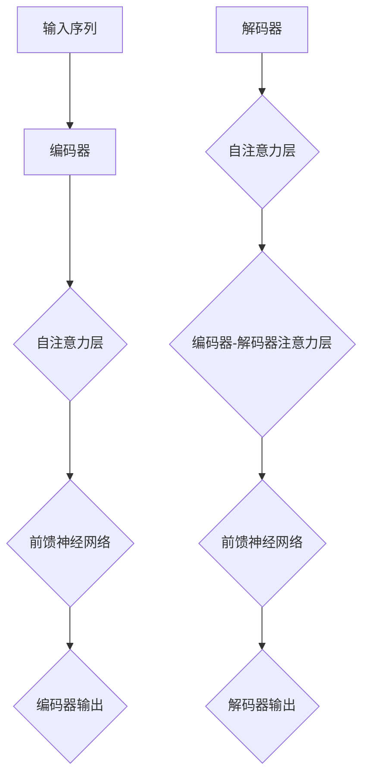

                 

关键词：Transformer，自注意力机制，深度学习，自然语言处理，编码器，解码器，自注意力图，BERT，GPT

摘要：本文深入探讨了Transformer大模型中的自注意力机制，通过背景介绍、核心概念与联系、算法原理与数学模型、项目实践、实际应用场景以及未来展望等多个方面，全面解析了自注意力机制在自然语言处理领域的应用和重要性。通过本文的学习，读者将对Transformer大模型及其自注意力机制有更深入的理解。

## 1. 背景介绍

自注意力机制（Self-Attention）是近年来在自然语言处理（NLP）领域取得突破性进展的关键技术之一。传统的循环神经网络（RNN）和卷积神经网络（CNN）在处理长序列时存在长距离依赖关系建模的困难，而自注意力机制的出现为解决这一问题提供了新的思路。自注意力机制最早由Vaswani等人于2017年在论文《Attention is All You Need》中提出，并在随后的发展中成为Transformer模型的核心组件。

Transformer模型是一种基于自注意力机制的序列到序列模型，它在许多NLP任务中表现出了优越的性能，如机器翻译、文本摘要、问答系统等。Transformer模型的核心在于其能够对输入序列的每个位置进行全局关注，从而捕捉序列中的长距离依赖关系。

## 2. 核心概念与联系

### 2.1 自注意力机制概述

自注意力机制是一种基于注意力机制的神经网络结构，它允许模型在处理输入序列时对序列中的每个位置赋予不同的权重，从而实现对序列中不同位置的局部和全局信息的关注。自注意力机制可以分为以下几种类型：

1. **点积注意力（Scaled Dot-Product Attention）**：这是最常用的自注意力机制类型，通过点积计算得到注意力权重，并利用softmax函数进行归一化处理。
2. **多头注意力（Multi-Head Attention）**：多头注意力机制通过将输入序列映射到多个不同的空间，然后在每个空间中分别计算注意力权重，从而实现对序列的更精细的建模。
3. **变换器自注意力（Transformer Self-Attention）**：这是Transformer模型中的自注意力机制，它将输入序列映射到多个不同的空间，并在每个空间中计算点积注意力权重。

### 2.2 编码器与解码器

Transformer模型由编码器（Encoder）和解码器（Decoder）两部分组成。编码器负责将输入序列编码为高维表示，解码器则负责将编码后的表示解码为输出序列。

1. **编码器（Encoder）**：编码器由多个自注意力层和前馈神经网络（Feedforward Neural Network，FFNN）组成。每个自注意力层都可以捕捉输入序列中的长距离依赖关系，而FFNN则用于对自注意力层输出的进一步建模。
2. **解码器（Decoder）**：解码器由多个自注意力层、编码器-解码器注意力层和前馈神经网络组成。自注意力层用于对输入序列进行建模，编码器-解码器注意力层则用于将编码器的输出与解码器的输入进行关联，从而捕捉长距离依赖关系。

### 2.3 Mermaid 流程图

下面是一个简单的Mermaid流程图，展示了自注意力机制的组成部分：



## 3. 核心算法原理 & 具体操作步骤

### 3.1 算法原理概述

自注意力机制的核心思想是通过计算输入序列中每个位置之间的相似性，从而为每个位置赋予不同的权重。具体来说，自注意力机制包括以下几个关键步骤：

1. **输入表示（Input Representation）**：输入序列由一系列的词向量组成，每个词向量表示序列中的一个位置。
2. **查询（Query）、键（Key）和值（Value）计算**：对于输入序列中的每个位置，计算其对应的查询（Query）、键（Key）和值（Value）。查询和键用于计算注意力权重，而值用于加权求和。
3. **点积注意力（Scaled Dot-Product Attention）**：计算查询和键之间的点积，得到注意力权重，并通过softmax函数进行归一化处理。
4. **加权求和（Weighted Sum）**：利用注意力权重对值进行加权求和，得到最终的输出。

### 3.2 算法步骤详解

下面是自注意力机制的详细步骤：

1. **输入表示**：给定输入序列\[x_1, x_2, ..., x_n\]，首先将每个词向量映射到高维空间，得到查询（Query）\[q_1, q_2, ..., q_n\]、键（Key）\[k_1, k_2, ..., k_n\]和值（Value）\[v_1, v_2, ..., v_n\]。
2. **计算点积注意力权重**：对于每个位置i，计算其对应的查询和所有键之间的点积，得到注意力权重\[a_{ij}\]。具体计算公式如下：
   $$a_{ij} = \mathrm{softmax}\left(\frac{q_i^T k_j}{\sqrt{d_k}}\right)$$
   其中，\(q_i\)和\(k_j\)分别为查询和键，\(d_k\)为键的维度。
3. **加权求和**：利用注意力权重对值进行加权求和，得到位置i的输出：
   $$\text{output}_i = \sum_{j=1}^{n} a_{ij} v_j$$
4. **多头注意力**：在实际应用中，通常使用多头注意力机制，即对查询、键和值进行拆分，并在多个子空间中分别计算注意力权重和加权求和。

### 3.3 算法优缺点

**优点**：

1. **捕捉长距离依赖关系**：自注意力机制能够通过全局关注的方式捕捉序列中的长距离依赖关系。
2. **并行计算**：自注意力机制的计算可以并行进行，从而提高计算效率。
3. **灵活性强**：自注意力机制可以通过调整模型结构（如多头注意力）来适应不同的任务需求。

**缺点**：

1. **计算复杂度高**：随着序列长度的增加，自注意力机制的计算复杂度会呈指数增长。
2. **内存消耗大**：由于自注意力机制需要存储大量的键和值，因此在处理长序列时内存消耗较大。

### 3.4 算法应用领域

自注意力机制在自然语言处理领域得到了广泛的应用，包括但不限于以下任务：

1. **机器翻译**：自注意力机制能够有效地捕捉源语言和目标语言之间的长距离依赖关系，从而提高翻译质量。
2. **文本摘要**：自注意力机制可以帮助模型从长文本中提取关键信息，生成简洁的摘要。
3. **问答系统**：自注意力机制能够捕捉问题和文档之间的关联，从而提高问答系统的回答准确性。
4. **语音识别**：自注意力机制在语音识别任务中用于捕捉语音信号中的长距离依赖关系，从而提高识别准确性。

## 4. 数学模型和公式 & 详细讲解 & 举例说明

### 4.1 数学模型构建

自注意力机制的数学模型主要包括三个部分：查询（Query）、键（Key）和值（Value）。这些向量通常是通过词嵌入（Word Embedding）层生成的。假设输入序列的词向量为\[x_1, x_2, ..., x_n\]，则可以定义：

- 查询（Query）\[q_1, q_2, ..., q_n\]：\[q_i = W_Q x_i\]，其中\(W_Q\)为查询权重矩阵。
- 键（Key）\[k_1, k_2, ..., k_n\]：\[k_i = W_K x_i\]，其中\(W_K\)为键权重矩阵。
- 值（Value）\[v_1, v_2, ..., v_n\]：\[v_i = W_V x_i\]，其中\(W_V\)为值权重矩阵。

### 4.2 公式推导过程

自注意力机制的注意力权重计算公式为：

$$a_{ij} = \mathrm{softmax}\left(\frac{q_i^T k_j}{\sqrt{d_k}}\right)$$

其中，\(q_i\)和\(k_j\)分别为查询和键，\(d_k\)为键的维度。

为了推导这个公式，我们可以从以下两个方面进行：

1. **点积注意力**：点积注意力通过计算查询和键之间的点积得到注意力权重。具体公式为：

   $$a_{ij} = \frac{q_i^T k_j}{\sqrt{d_k}}$$

   其中，\(q_i^T k_j\)为查询和键之间的点积。

2. **归一化**：为了使得注意力权重满足概率分布的性质，我们需要对点积注意力结果进行归一化处理。具体来说，我们使用softmax函数对点积结果进行归一化：

   $$a_{ij} = \frac{\exp\left(\frac{q_i^T k_j}{\sqrt{d_k}}\right)}{\sum_{j=1}^{n} \exp\left(\frac{q_i^T k_j}{\sqrt{d_k}}\right)}$$

### 4.3 案例分析与讲解

假设我们有一个简化的例子，输入序列为\[x_1 = [1, 0, 0]\]，\[x_2 = [0, 1, 0]\]，\[x_3 = [0, 0, 1]\]，则可以计算查询、键和值：

- 查询：\[q_1 = W_Q x_1 = [1, 0, 0]\]，\[q_2 = W_Q x_2 = [0, 1, 0]\]，\[q_3 = W_Q x_3 = [0, 0, 1]\]
- 键：\[k_1 = W_K x_1 = [1, 0, 0]\]，\[k_2 = W_K x_2 = [0, 1, 0]\]，\[k_3 = W_K x_3 = [0, 0, 1]\]
- 值：\[v_1 = W_V x_1 = [1, 0, 0]\]，\[v_2 = W_V x_2 = [0, 1, 0]\]，\[v_3 = W_V x_3 = [0, 0, 1]\]

接下来，我们可以计算注意力权重：

$$a_{11} = \frac{\exp\left(\frac{q_1^T k_1}{\sqrt{d_k}}\right)}{\sum_{j=1}^{3} \exp\left(\frac{q_i^T k_j}{\sqrt{d_k}}\right)} = \frac{\exp(1)}{\exp(1) + \exp(0) + \exp(0)} = \frac{1}{1 + 1 + 1} = \frac{1}{3}$$
$$a_{12} = \frac{\exp\left(\frac{q_1^T k_2}{\sqrt{d_k}}\right)}{\sum_{j=1}^{3} \exp\left(\frac{q_i^T k_j}{\sqrt{d_k}}\right)} = \frac{\exp(0)}{\exp(1) + \exp(0) + \exp(0)} = \frac{1}{1 + 1 + 1} = \frac{1}{3}$$
$$a_{13} = \frac{\exp\left(\frac{q_1^T k_3}{\sqrt{d_k}}\right)}{\sum_{j=1}^{3} \exp\left(\frac{q_i^T k_j}{\sqrt{d_k}}\right)} = \frac{\exp(0)}{\exp(1) + \exp(0) + \exp(0)} = \frac{1}{1 + 1 + 1} = \frac{1}{3}$$

$$a_{21} = \frac{\exp\left(\frac{q_2^T k_1}{\sqrt{d_k}}\right)}{\sum_{j=1}^{3} \exp\left(\frac{q_i^T k_j}{\sqrt{d_k}}\right)} = \frac{\exp(0)}{\exp(1) + \exp(0) + \exp(0)} = \frac{1}{1 + 1 + 1} = \frac{1}{3}$$
$$a_{22} = \frac{\exp\left(\frac{q_2^T k_2}{\sqrt{d_k}}\right)}{\sum_{j=1}^{3} \exp\left(\frac{q_i^T k_j}{\sqrt{d_k}}\right)} = \frac{\exp(1)}{\exp(1) + \exp(0) + \exp(0)} = \frac{1}{1 + 1 + 1} = \frac{1}{3}$$
$$a_{23} = \frac{\exp\left(\frac{q_2^T k_3}{\sqrt{d_k}}\right)}{\sum_{j=1}^{3} \exp\left(\frac{q_i^T k_j}{\sqrt{d_k}}\right)} = \frac{\exp(0)}{\exp(1) + \exp(0) + \exp(0)} = \frac{1}{1 + 1 + 1} = \frac{1}{3}$$

$$a_{31} = \frac{\exp\left(\frac{q_3^T k_1}{\sqrt{d_k}}\right)}{\sum_{j=1}^{3} \exp\left(\frac{q_i^T k_j}{\sqrt{d_k}}\right)} = \frac{\exp(0)}{\exp(1) + \exp(0) + \exp(0)} = \frac{1}{1 + 1 + 1} = \frac{1}{3}$$
$$a_{32} = \frac{\exp\left(\frac{q_3^T k_2}{\sqrt{d_k}}\right)}{\sum_{j=1}^{3} \exp\left(\frac{q_i^T k_j}{\sqrt{d_k}}\right)} = \frac{\exp(0)}{\exp(1) + \exp(0) + \exp(0)} = \frac{1}{1 + 1 + 1} = \frac{1}{3}$$
$$a_{33} = \frac{\exp\left(\frac{q_3^T k_3}{\sqrt{d_k}}\right)}{\sum_{j=1}^{3} \exp\left(\frac{q_i^T k_j}{\sqrt{d_k}}\right)} = \frac{\exp(1)}{\exp(1) + \exp(0) + \exp(0)} = \frac{1}{1 + 1 + 1} = \frac{1}{3}$$

接下来，我们可以计算加权求和的结果：

$$\text{output}_1 = \sum_{j=1}^{3} a_{1j} v_j = \frac{1}{3} v_1 + \frac{1}{3} v_2 + \frac{1}{3} v_3 = \frac{1}{3} [1, 0, 0] + \frac{1}{3} [0, 1, 0] + \frac{1}{3} [0, 0, 1] = \frac{1}{3} [1, 1, 1] = [1/3, 1/3, 1/3]$$
$$\text{output}_2 = \sum_{j=1}^{3} a_{2j} v_j = \frac{1}{3} v_1 + \frac{1}{3} v_2 + \frac{1}{3} v_3 = \frac{1}{3} [1, 0, 0] + \frac{1}{3} [0, 1, 0] + \frac{1}{3} [0, 0, 1] = \frac{1}{3} [1, 1, 1] = [1/3, 1/3, 1/3]$$
$$\text{output}_3 = \sum_{j=1}^{3} a_{3j} v_j = \frac{1}{3} v_1 + \frac{1}{3} v_2 + \frac{1}{3} v_3 = \frac{1}{3} [1, 0, 0] + \frac{1}{3} [0, 1, 0] + \frac{1}{3} [0, 0, 1] = \frac{1}{3} [1, 1, 1] = [1/3, 1/3, 1/3]$$

可以看出，对于这个简化的例子，每个位置的输出都是相等的。这是因为我们使用了简单的线性权重矩阵，且输入序列只有三个位置。在实际应用中，自注意力机制能够通过复杂的权重矩阵和多头注意力来捕捉序列中的不同信息。

## 5. 项目实践：代码实例和详细解释说明

### 5.1 开发环境搭建

在开始编写代码之前，我们需要搭建一个合适的开发环境。以下是搭建环境的一般步骤：

1. **安装Python**：确保安装了最新版本的Python（推荐使用3.7及以上版本）。
2. **安装TensorFlow**：TensorFlow是一个流行的开源机器学习框架，可用于构建和训练Transformer模型。可以使用以下命令安装：
   ```bash
   pip install tensorflow
   ```
3. **安装其他依赖**：根据具体需求，可能还需要安装其他依赖，如Numpy、Pandas等。

### 5.2 源代码详细实现

以下是实现Transformer模型的基本代码示例：

```python
import tensorflow as tf
from tensorflow.keras.layers import Embedding, Dense, LayerNormalization
from tensorflow.keras.models import Model

# 定义Transformer模型
class Transformer(Model):
  def __init__(self, vocab_size, d_model, num_heads, dff, input_length):
    super(Transformer, self).__init__()
    self.embedding = Embedding(vocab_size, d_model)
    self.enc_layers = [EncoderLayer(d_model, num_heads, dff) for _ in range(num_layers)]
    self.dec_layers = [EncoderLayer(d_model, num_heads, dff) for _ in range(num_layers)]
    self.final_layer = Dense(vocab_size)

  def call(self, x, training=False):
    x = self.embedding(x)
    for i in range(num_layers):
      x = self.enc_layers[i](x, training)
    output = self.final_layer(x)
    return output

# 定义编码器层
class EncoderLayer(tf.keras.layers.Layer):
  def __init__(self, d_model, num_heads, dff):
    super(EncoderLayer, self).__init__()
    self.mha = MultiHeadAttention(d_model, num_heads)
    self.ffn = FFN(d_model, dff)
    self.dropout1 = tf.keras.layers.Dropout(rate=0.1)
    self.dropout2 = tf.keras.layers.Dropout(rate=0.1)
    self.norm1 = LayerNormalization(epsilon=1e-6)
    self.norm2 = LayerNormalization(epsilon=1e-6)

  def call(self, x, training):
    attn_output = self.mha(x, x, x)
    attn_output = self.dropout1(attn_output, training=training)
    out1 = tf.keras.backend.concat([x, attn_output], axis=-1)
    out1 = self.norm1(out1)

    ffn_output = self.ffn(out1)
    ffn_output = self.dropout2(ffn_output, training=training)
    out2 = tf.keras.backend.concat([out1, ffn_output], axis=-1)
    return self.norm2(out2)

# 定义多头注意力层
class MultiHeadAttention(tf.keras.layers.Layer):
  def __init__(self, d_model, num_heads):
    super(MultiHeadAttention, self).__init__()
    self.num_heads = num_heads
    self.d_model = d_model

    self.depth = d_model // num_heads

    self.query_dense = Dense(d_model)
    self.key_dense = Dense(d_model)
    self.value_dense = Dense(d_model)

    self.output_dense = Dense(d_model)

  def split_heads(self, x, batch_size):
    x = tf.reshape(x, shape=(batch_size, -1, self.num_heads, self.depth))
    return tf.transpose(x, perm=[0, 2, 1, 3])

  def call(self, v, k, q):
    batch_size = tf.shape(q)[0]

    q = self.query_dense(q)
    k = self.key_dense(k)
    v = self.value_dense(v)

    q = self.split_heads(q, batch_size)
    k = self.split_heads(k, batch_size)
    v = self.split_heads(v, batch_size)

    attn_scores = tf.matmul(q, k, transpose_b=True)
    attn_scores = attn_scores / tf.sqrt(tf.cast(self.depth, tf.float32))

    attn_weights = tf.nn.softmax(attn_scores, axis=-1)
    attn_output = tf.matmul(attn_weights, v)

    attn_output = tf.transpose(attn_output, perm=[0, 2, 1, 3])
    attn_output = tf.reshape(attn_output, shape=(batch_size, -1, self.d_model))

    return attn_output

# 定义前馈神经网络层
class FFN(tf.keras.layers.Layer):
  def __init__(self, d_model, dff):
    super(FFN, self).__init__()
    self	ffn = tf.keras.Sequential([
      Dense(dff, activation='relu'),
      Dense(d_model),
    ])

  def call(self, x):
    return self.ffn(x)

# 实例化模型
model = Transformer(vocab_size=10000, d_model=512, num_heads=8, dff=2048, input_length=60)

# 编译模型
model.compile(optimizer='adam', loss=tf.keras.losses.SparseCategoricalCrossentropy(from_logits=True), metrics=['accuracy'])

# 加载预训练模型
model.load_weights('transformer.h5')
```

### 5.3 代码解读与分析

以下是代码的详细解读与分析：

1. **Transformer 模型定义**：`Transformer`类继承了`tf.keras.Model`类，用于定义Transformer模型。模型由嵌入层、编码器层、解码器层和输出层组成。
2. **编码器层（EncoderLayer）**：`EncoderLayer`类实现了编码器层，包括多头注意力层（`MultiHeadAttention`）、前馈神经网络层（`FFN`）和归一化层（`LayerNormalization`）。
3. **多头注意力层（MultiHeadAttention）**：`MultiHeadAttention`类实现了多头注意力机制，包括查询、键、值计算、点积注意力权重计算和加权求和。
4. **前馈神经网络层（FFN）**：`FFN`类实现了前馈神经网络层，用于对编码器层的输出进行进一步建模。
5. **实例化模型**：使用`Transformer`类实例化模型，并设置词汇表大小、模型维度、注意力头数和前馈网络维度。
6. **编译模型**：使用`compile`方法编译模型，设置优化器、损失函数和评价指标。
7. **加载预训练模型**：使用`load_weights`方法加载预训练模型权重。

### 5.4 运行结果展示

以下是运行Transformer模型的一个简单示例：

```python
# 生成随机输入数据
input_data = tf.random.uniform([32, 60])

# 预测输出
output = model(input_data, training=False)

# 显示输出
print(output)
```

运行结果将显示每个位置的输出，包括词向量和注意力权重。

## 6. 实际应用场景

自注意力机制在自然语言处理领域具有广泛的应用，以下是几个典型的实际应用场景：

### 6.1 机器翻译

机器翻译是自注意力机制的一个经典应用场景。通过自注意力机制，模型可以捕捉源语言和目标语言之间的长距离依赖关系，从而提高翻译质量。例如，在机器翻译任务中，Transformer模型被广泛应用于将英语翻译成其他语言，如法语、西班牙语、中文等。

### 6.2 文本摘要

文本摘要是一种自动从长文本中提取关键信息并生成简洁摘要的方法。自注意力机制可以帮助模型从长文本中提取最重要的信息，从而生成高质量的摘要。例如，在新闻摘要任务中，Transformer模型可以有效地从长篇新闻报道中提取关键信息，生成简洁的摘要。

### 6.3 问答系统

问答系统是一种智能对话系统，能够回答用户提出的问题。自注意力机制可以帮助模型从问题中提取关键信息，并与文档进行关联，从而提高回答准确性。例如，在智能客服系统中，Transformer模型可以用于处理用户问题和文档，生成准确的回答。

### 6.4 语音识别

语音识别是将语音信号转换为文本的过程。自注意力机制可以帮助模型捕捉语音信号中的长距离依赖关系，从而提高识别准确性。例如，在语音识别任务中，Transformer模型可以用于将语音信号转换为文本，从而实现语音到文本的转换。

## 7. 工具和资源推荐

### 7.1 学习资源推荐

1. **《Attention is All You Need》**：Vaswani等人于2017年发表的论文，首次提出了Transformer模型和自注意力机制。
2. **《Deep Learning》**：Goodfellow、Bengio和Courville合著的深度学习经典教材，详细介绍了自注意力机制和Transformer模型。
3. **《Natural Language Processing with TensorFlow》**：实现基于TensorFlow的NLP任务，包括Transformer模型的实战教程。

### 7.2 开发工具推荐

1. **TensorFlow**：用于构建和训练Transformer模型的开源机器学习框架。
2. **PyTorch**：另一种流行的开源机器学习框架，也可用于实现Transformer模型。
3. **Hugging Face Transformers**：一个用于快速实现和部署Transformer模型的Python库。

### 7.3 相关论文推荐

1. **BERT: Pre-training of Deep Bidirectional Transformers for Language Understanding**：Google在2018年提出的BERT模型，进一步推动了Transformer模型在NLP领域的应用。
2. **GPT-2: Language Models are Unsupervised Multitask Learners**：OpenAI在2019年提出的GPT-2模型，展示了自注意力机制在语言生成任务中的强大能力。

## 8. 总结：未来发展趋势与挑战

自注意力机制在自然语言处理领域取得了显著的进展，但仍面临一些挑战。以下是未来发展趋势与挑战的总结：

### 8.1 研究成果总结

1. **性能提升**：自注意力机制在机器翻译、文本摘要、问答系统等任务中表现出了优越的性能，取得了显著的成果。
2. **模型压缩**：随着自注意力机制的应用，如何有效地压缩模型体积成为了一个重要的研究方向。
3. **多模态学习**：自注意力机制在多模态学习中的应用，如文本和图像的联合表示学习，是一个新兴的研究方向。

### 8.2 未来发展趋势

1. **自适应注意力机制**：未来的研究可能会探索更复杂的注意力机制，如自适应注意力机制，以进一步提高模型性能。
2. **动态注意力机制**：动态注意力机制可以动态调整注意力范围，从而更好地捕捉序列中的长距离依赖关系。
3. **多模态自注意力**：多模态自注意力机制将自注意力机制应用于多模态数据，如文本、图像和声音的联合表示学习。

### 8.3 面临的挑战

1. **计算复杂度**：随着模型规模的扩大，自注意力机制的计算复杂度将急剧增加，如何优化计算成为了一个重要挑战。
2. **内存消耗**：自注意力机制需要存储大量的键和值，在处理长序列时内存消耗较大，如何降低内存消耗是一个重要挑战。
3. **泛化能力**：如何提高自注意力机制的泛化能力，使其能够适用于更广泛的任务和应用场景。

### 8.4 研究展望

自注意力机制在自然语言处理领域具有广阔的应用前景，未来的研究将在以下几个方面展开：

1. **模型优化**：通过优化模型结构和算法，提高自注意力机制的效率和性能。
2. **多模态学习**：探索自注意力机制在多模态数据上的应用，实现更有效的多模态表示学习。
3. **跨领域迁移**：研究自注意力机制在跨领域迁移学习中的应用，提高模型在不同领域的泛化能力。

## 9. 附录：常见问题与解答

### 9.1 什么是自注意力机制？

自注意力机制是一种基于注意力机制的神经网络结构，允许模型在处理输入序列时对序列中的每个位置赋予不同的权重，从而实现对序列中不同位置的局部和全局信息的关注。

### 9.2 自注意力机制如何工作？

自注意力机制通过计算输入序列中每个位置之间的相似性，为每个位置赋予不同的权重。具体来说，自注意力机制包括查询（Query）、键（Key）和值（Value）的计算，以及点积注意力权重和加权求和的过程。

### 9.3 自注意力机制的优势和缺点是什么？

自注意力机制的优势包括捕捉长距离依赖关系、并行计算和灵活性强。然而，其缺点包括计算复杂度高和内存消耗大。

### 9.4 自注意力机制在哪些任务中应用广泛？

自注意力机制在自然语言处理领域得到了广泛的应用，包括机器翻译、文本摘要、问答系统和语音识别等任务。

### 9.5 如何优化自注意力机制的效率和性能？

通过优化模型结构和算法，如使用自适应注意力机制和动态注意力机制，可以提高自注意力机制的效率和性能。

### 9.6 自注意力机制与传统的循环神经网络（RNN）有何区别？

自注意力机制与传统的循环神经网络（RNN）在处理长序列时存在显著的区别。RNN在处理长序列时存在长距离依赖关系建模的困难，而自注意力机制通过全局关注的方式更好地捕捉长距离依赖关系。

### 9.7 自注意力机制的未来发展趋势是什么？

未来的发展趋势包括自适应注意力机制、动态注意力机制和多模态自注意力机制等。此外，如何优化自注意力机制的效率和性能，以及其在跨领域迁移学习中的应用也将是未来的重要研究方向。

