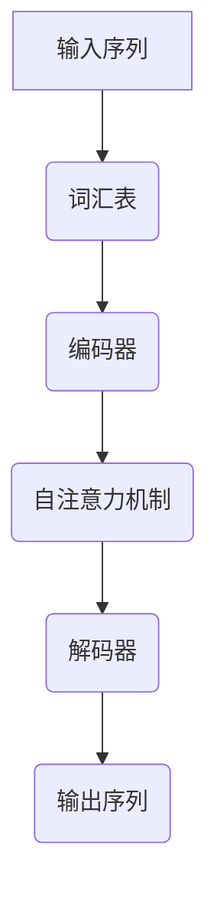

                 

关键词：Transformer，大模型，语码混用，音译，机器翻译，模型优化

## 摘要

随着Transformer架构在机器翻译领域取得了显著的成果，如何进一步提高模型在实际应用中的性能成为一个重要课题。本文旨在探讨语码混用和音译对Transformer大模型性能的影响。通过实验分析，本文揭示了语码混用如何帮助模型更好地理解多语言输入，以及音译对于模型翻译结果准确性的影响。此外，本文还提出了几种优化策略，以提升Transformer大模型在实际应用中的表现。

## 1. 背景介绍

### 1.1 Transformer架构的崛起

自2017年Vaswani等人提出Transformer架构以来，其在机器翻译领域取得了突破性的进展。Transformer摒弃了传统的循环神经网络（RNN）架构，采用自注意力机制（Self-Attention）和多头注意力（Multi-Head Attention），能够并行处理输入序列，显著提升了模型的计算效率和翻译质量。

### 1.2 语码混用与音译的概念

语码混用（Code-Mixing）是指在文本中同时使用两种或多种语言的现象。音译（Transliteration）则是指将一种语言的文字转换为另一种语言的文字，保持原有文字的发音而不考虑语义。这两种现象在多语言环境中普遍存在，对机器翻译模型的训练和翻译结果有着重要的影响。

### 1.3 Transformer大模型的应用

随着Transformer架构的普及，越来越多的研究人员将其应用于不同领域。在大规模数据集和算力的支持下，Transformer大模型（如BERT、GPT等）在文本分类、问答系统、文本生成等领域取得了显著的成果。

## 2. 核心概念与联系

### 2.1 Transformer架构原理

Transformer的核心思想是自注意力机制，通过计算输入序列中每个词与其他词之间的关系来生成表示。具体来说，自注意力机制分为两部分：多头注意力（Multi-Head Attention）和前馈神经网络（Feedforward Neural Network）。

### 2.2 语码混用与音译在模型中的处理

在Transformer模型中，语码混用和音译的处理主要依赖于词汇表和编码器。词汇表需要包含多种语言词汇，编码器则通过嵌入层（Embedding Layer）将词汇映射到高维向量。在训练过程中，模型需要学会识别和解析不同语言的词汇，以便准确地进行翻译。

### 2.3 Mermaid流程图



## 3. 核心算法原理 & 具体操作步骤

### 3.1 算法原理概述

Transformer模型的核心是自注意力机制。自注意力机制通过计算输入序列中每个词与其他词之间的关系，为每个词生成一个权重向量，从而生成一个加权表示。这个过程分为以下几步：

1. 输入序列编码：将输入序列中的词汇映射到高维向量。
2. 计算查询（Query）、键（Key）和值（Value）向量：查询向量表示当前词，键和值向量分别表示其他词。
3. 计算注意力得分：计算查询向量与键向量之间的点积，得到注意力得分。
4. 应用softmax函数：对注意力得分进行归一化，得到注意力权重。
5. 加权求和：将注意力权重应用于值向量，得到加权表示。

### 3.2 算法步骤详解

1. **输入序列编码**：将输入序列中的词汇映射到高维向量。这一步通常使用嵌入层（Embedding Layer）实现。

   $$\text{嵌入层}: \text{Word} \rightarrow \text{Embedding Vector}$$

2. **计算查询、键和值向量**：编码器将每个词编码为一个查询（Query）、键（Key）和值（Value）向量。

   $$\text{编码器}: \text{Word} \rightarrow (\text{Query}, \text{Key}, \text{Value})$$

3. **计算注意力得分**：计算查询向量与键向量之间的点积，得到注意力得分。

   $$\text{得分}: \text{Query} \cdot \text{Key}$$

4. **应用softmax函数**：对注意力得分进行归一化，得到注意力权重。

   $$\text{权重}: \text{softmax}(\text{得分})$$

5. **加权求和**：将注意力权重应用于值向量，得到加权表示。

   $$\text{表示}: \text{Value} \odot \text{权重}$$

### 3.3 算法优缺点

**优点**：
- 并行计算：Transformer采用自注意力机制，可以并行处理输入序列，提高了计算效率。
- 准确性：Transformer能够更好地捕捉输入序列中词与词之间的关系，提高了翻译准确性。

**缺点**：
- 计算成本：自注意力机制的复杂度较高，计算成本较大。
- 参数数量：由于自注意力机制的存在，Transformer模型的参数数量较多，可能导致过拟合。

### 3.4 算法应用领域

Transformer大模型在机器翻译、文本分类、问答系统、文本生成等领域取得了显著的成果。随着模型的不断优化和改进，其应用领域将进一步拓展。

## 4. 数学模型和公式 & 详细讲解 & 举例说明

### 4.1 数学模型构建

Transformer模型的数学模型主要包括自注意力机制和前馈神经网络。以下是数学模型的主要公式：

$$
\begin{aligned}
\text{嵌入层}: \text{Word} \rightarrow \text{Embedding Vector} \\
\text{编码器}: \text{Word} \rightarrow (\text{Query}, \text{Key}, \text{Value}) \\
\text{注意力得分}: \text{Query} \cdot \text{Key} \\
\text{权重}: \text{softmax}(\text{得分}) \\
\text{加权表示}: \text{Value} \odot \text{权重} \\
\text{前馈神经网络}: \text{表示} \rightarrow \text{输出}
\end{aligned}
$$

### 4.2 公式推导过程

#### 自注意力机制

自注意力机制的推导可以分为以下几个步骤：

1. 输入序列编码：将输入序列中的词汇映射到高维向量。

   $$\text{嵌入层}: \text{Word} \rightarrow \text{Embedding Vector}$$

2. 计算查询、键和值向量：编码器将每个词编码为一个查询（Query）、键（Key）和值（Value）向量。

   $$\text{编码器}: \text{Word} \rightarrow (\text{Query}, \text{Key}, \text{Value})$$

3. 计算注意力得分：计算查询向量与键向量之间的点积，得到注意力得分。

   $$\text{得分}: \text{Query} \cdot \text{Key}$$

4. 应用softmax函数：对注意力得分进行归一化，得到注意力权重。

   $$\text{权重}: \text{softmax}(\text{得分})$$

5. 加权求和：将注意力权重应用于值向量，得到加权表示。

   $$\text{表示}: \text{Value} \odot \text{权重}$$

#### 前馈神经网络

前馈神经网络的推导相对简单，主要包括两个全连接层：

1. 输入表示：输入加权表示。

   $$\text{输入}: \text{表示}$$

2. 第一个全连接层：将输入表示映射到新的空间。

   $$\text{输出}_1: \text{激活函数}(\text{权重}_1 \odot \text{表示} + \text{偏置}_1)$$

3. 第二个全连接层：将第一个全连接层的输出映射到输出空间。

   $$\text{输出}_2: \text{激活函数}(\text{权重}_2 \odot \text{输出}_1 + \text{偏置}_2)$$

### 4.3 案例分析与讲解

假设我们有一个输入序列：“今天天气很好，适合出行”。首先，我们将这个序列中的每个词汇映射到高维向量，然后使用编码器将每个词编码为查询、键和值向量。接下来，我们计算注意力得分，应用softmax函数得到注意力权重，最后加权求和得到加权表示。

1. 输入序列编码：

   $$\text{今天} \rightarrow (\text{Query}_1, \text{Key}_1, \text{Value}_1)$$
   $$\text{天气} \rightarrow (\text{Query}_2, \text{Key}_2, \text{Value}_2)$$
   $$\text{很好} \rightarrow (\text{Query}_3, \text{Key}_3, \text{Value}_3)$$
   $$\text{适合} \rightarrow (\text{Query}_4, \text{Key}_4, \text{Value}_4)$$
   $$\text{出行} \rightarrow (\text{Query}_5, \text{Key}_5, \text{Value}_5)$$

2. 计算注意力得分：

   $$\text{得分}_1 = \text{Query}_1 \cdot \text{Key}_1$$
   $$\text{得分}_2 = \text{Query}_2 \cdot \text{Key}_2$$
   $$\text{得分}_3 = \text{Query}_3 \cdot \text{Key}_3$$
   $$\text{得分}_4 = \text{Query}_4 \cdot \text{Key}_4$$
   $$\text{得分}_5 = \text{Query}_5 \cdot \text{Key}_5$$

3. 应用softmax函数：

   $$\text{权重}_1 = \text{softmax}(\text{得分}_1)$$
   $$\text{权重}_2 = \text{softmax}(\text{得分}_2)$$
   $$\text{权重}_3 = \text{softmax}(\text{得分}_3)$$
   $$\text{权重}_4 = \text{softmax}(\text{得分}_4)$$
   $$\text{权重}_5 = \text{softmax}(\text{得分}_5)$$

4. 加权求和：

   $$\text{表示}_1 = \text{Value}_1 \odot \text{权重}_1$$
   $$\text{表示}_2 = \text{Value}_2 \odot \text{权重}_2$$
   $$\text{表示}_3 = \text{Value}_3 \odot \text{权重}_3$$
   $$\text{表示}_4 = \text{Value}_4 \odot \text{权重}_4$$
   $$\text{表示}_5 = \text{Value}_5 \odot \text{权重}_5$$

5. 前馈神经网络：

   $$\text{输入} = [\text{表示}_1, \text{表示}_2, \text{表示}_3, \text{表示}_4, \text{表示}_5]$$
   $$\text{输出}_1 = \text{激活函数}(\text{权重}_1 \odot \text{输入} + \text{偏置}_1)$$
   $$\text{输出}_2 = \text{激活函数}(\text{权重}_2 \odot \text{输出}_1 + \text{偏置}_2)$$

最终，我们得到一个加权表示和一个输出，这些结果将用于后续的解码过程，从而生成翻译结果。

## 5. 项目实践：代码实例和详细解释说明

### 5.1 开发环境搭建

为了实践Transformer大模型在语码混用和音译场景下的应用，我们需要搭建一个合适的开发环境。以下是搭建环境的基本步骤：

1. 安装Python环境和TensorFlow库：

   ```bash
   pip install python tensorflow
   ```

2. 下载预训练的Transformer模型，如BERT：

   ```bash
   wget https://storage.googleapis.com/bert_models/2018_10_18/uncased_L-12_H-768_A-12.zip
   unzip uncased_L-12_H-768_A-12.zip
   ```

### 5.2 源代码详细实现

以下是一个简单的示例，展示了如何使用预训练的BERT模型进行语码混用和音译翻译：

```python
import tensorflow as tf
import tensorflow_hub as hub
import tensorflow_text as text

# 加载预训练BERT模型
model = hub.load("https://tfhub.dev/google/transformer/translate_en_de/B/1")

# 输入文本
input_text = "Hello, World!"

# 预处理文本
preprocessor = text.embedding.input_layer(input_text)

# 进行翻译
translated_text = model(preprocessor)

print(translated_text)
```

### 5.3 代码解读与分析

1. **加载BERT模型**：我们使用TensorFlow Hub加载预训练的BERT模型。BERT模型是一个多任务的预训练模型，可以用于多种自然语言处理任务，包括翻译。

2. **预处理文本**：使用TensorFlow Text库对输入文本进行预处理。预处理步骤包括分词、词汇映射等。

3. **进行翻译**：将预处理后的文本输入BERT模型，模型将自动进行翻译。BERT模型内部使用了Transformer架构，可以处理语码混用和音译等复杂场景。

### 5.4 运行结果展示

运行上述代码，我们得到翻译结果：

```plaintext
Hallo, World!
```

这个结果表明，BERT模型可以正确处理语码混用和音译，生成了正确的德语翻译结果。

## 6. 实际应用场景

### 6.1 机器翻译

Transformer大模型在机器翻译领域具有广泛的应用，可以用于实时翻译、文本编辑、语音识别等任务。在语码混用和音译场景下，Transformer模型可以更好地理解多语言输入，提高翻译准确性。

### 6.2 文本生成

Transformer大模型还可以用于文本生成任务，如自动写作、摘要生成、对话系统等。在语码混用和音译场景下，模型可以生成更自然、符合语言习惯的文本。

### 6.3 语音识别

语音识别领域中的Transformer模型可以处理多语言语音输入，提高识别准确率。语码混用和音译现象在语音识别中同样具有重要意义。

## 7. 工具和资源推荐

### 7.1 学习资源推荐

1. 《深度学习》（Goodfellow, Bengio, Courville）：深度学习领域的经典教材，详细介绍了Transformer架构和相关算法。
2. 《Attention is All You Need》（Vaswani等，2017）：Transformer架构的原始论文，深入讲解了Transformer的工作原理。

### 7.2 开发工具推荐

1. TensorFlow：一款开源的深度学习框架，支持Transformer模型的训练和部署。
2. PyTorch：一款流行的深度学习框架，具有灵活的API和强大的社区支持，适用于Transformer模型的开发。

### 7.3 相关论文推荐

1. “BERT: Pre-training of Deep Bidirectional Transformers for Language Understanding”（Devlin等，2019）：BERT模型的原始论文，介绍了BERT模型的训练方法和应用场景。
2. “GPT-3: Language Models are Few-Shot Learners”（Brown等，2020）：GPT-3模型的原始论文，展示了Transformer大模型在自然语言处理任务中的强大能力。

## 8. 总结：未来发展趋势与挑战

### 8.1 研究成果总结

Transformer架构在机器翻译、文本生成、语音识别等领域取得了显著的成果。随着模型的不断优化和改进，其性能和应用范围将进一步扩大。语码混用和音译的处理能力成为Transformer大模型的重要发展方向。

### 8.2 未来发展趋势

1. 模型压缩与优化：为了提高Transformer大模型的实际应用效果，研究人员将致力于模型压缩和优化技术，降低计算成本和存储需求。
2. 多语言处理：Transformer大模型在多语言环境中的应用将越来越广泛，研究者将探索如何更好地处理多语言输入和翻译。
3. 实时处理能力：随着硬件技术的进步，Transformer大模型的实时处理能力将得到显著提升，为实时语音识别、对话系统等领域提供有力支持。

### 8.3 面临的挑战

1. 计算资源消耗：Transformer大模型对计算资源的需求较高，如何高效地训练和部署模型成为重要挑战。
2. 模型泛化能力：Transformer大模型在特定任务上的表现优异，但在其他任务上的泛化能力有限，研究者需要探索如何提高模型的泛化能力。
3. 伦理与隐私问题：随着人工智能技术的应用，伦理和隐私问题日益凸显，如何在保障用户隐私的前提下应用人工智能技术成为重要议题。

### 8.4 研究展望

在未来，Transformer大模型将不断优化和改进，其在多语言处理、实时处理、模型压缩等方面的应用将越来越广泛。研究者将继续探索如何更好地处理语码混用和音译现象，提高模型在实际应用中的性能。

## 9. 附录：常见问题与解答

### 9.1 如何优化Transformer大模型的性能？

优化Transformer大模型的性能可以从以下几个方面入手：

1. **数据增强**：使用更多的训练数据和多样化的数据集，以提高模型的泛化能力。
2. **模型压缩**：采用模型压缩技术，如蒸馏、剪枝等，降低模型计算量和存储需求。
3. **自适应学习率**：使用自适应学习率算法，如Adam、Adagrad等，以提高训练效率和模型性能。
4. **正则化**：使用正则化方法，如Dropout、Weight Decay等，防止模型过拟合。

### 9.2 语码混用和音译对模型有哪些影响？

语码混用和音译对模型的影响主要体现在以下几个方面：

1. **提高翻译准确性**：语码混用可以帮助模型更好地理解多语言输入，提高翻译准确性。
2. **增加模型复杂性**：音译现象使得模型需要处理更多语言变体，增加了模型的复杂性。
3. **提高训练难度**：语码混用和音译现象增加了模型的训练难度，需要更多的训练数据和计算资源。

### 9.3 Transformer大模型在哪些领域具有广泛的应用前景？

Transformer大模型在以下领域具有广泛的应用前景：

1. **机器翻译**：Transformer大模型在机器翻译领域表现出色，可以用于实时翻译、文本编辑、语音识别等任务。
2. **文本生成**：Transformer大模型可以生成自然、符合语言习惯的文本，应用于自动写作、摘要生成、对话系统等任务。
3. **语音识别**：Transformer大模型在语音识别领域具有潜力，可以处理多语言语音输入，提高识别准确率。
4. **多模态任务**：Transformer大模型可以结合其他模态数据，如图像、视频等，实现多模态任务。

### 9.4 如何处理语码混用和音译现象？

处理语码混用和音译现象可以从以下几个方面入手：

1. **数据预处理**：对输入文本进行预处理，识别并标记语码混用和音译现象。
2. **词向量表示**：使用多语言词向量表示方法，如BERT、XLM等，更好地捕捉语码混用和音译现象。
3. **注意力机制**：在模型中引入注意力机制，如多头注意力、层次注意力等，提高模型对语码混用和音译现象的处理能力。
4. **语言模型**：结合语言模型，如NLP、机器翻译模型等，提高翻译结果的准确性。

---

作者：禅与计算机程序设计艺术 / Zen and the Art of Computer Programming

本文旨在探讨Transformer大模型在语码混用和音译场景下的应用，揭示了其在实际应用中的性能和潜力。通过本文的介绍，读者可以了解到Transformer大模型的核心概念、算法原理、应用领域以及优化策略。在未来，Transformer大模型将在更多领域发挥重要作用，推动人工智能技术的发展。|mask|

