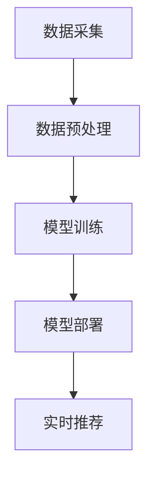

                 

关键词：Twitter 2025，社招，实时推荐系统，工程师面试，技术指南

> 摘要：本文将针对Twitter 2025年度社招实时推荐系统工程师岗位，从背景介绍、核心概念与联系、核心算法原理、数学模型与公式、项目实践、实际应用场景、工具和资源推荐、总结与展望等多个角度，为读者提供一份详细的面试指南。

## 1. 背景介绍

随着社交媒体平台的快速发展，实时推荐系统已经成为提高用户粘性和平台活跃度的关键因素之一。Twitter作为全球领先的社交媒体平台，也在不断优化和提升其推荐系统，以满足用户的需求。本文将围绕Twitter 2025年度社招实时推荐系统工程师岗位，为读者提供一份全面的面试指南。

## 2. 核心概念与联系

### 2.1 实时推荐系统定义

实时推荐系统是一种能够在用户交互的瞬间提供个性化推荐的服务系统。它通过对用户行为和内容的实时分析，为用户推荐符合其兴趣和需求的信息。

### 2.2 实时推荐系统架构

实时推荐系统通常包括数据采集、数据预处理、模型训练、模型部署和实时推荐等几个关键环节。

### 2.3 Mermaid流程图

以下是一个简化的实时推荐系统架构的Mermaid流程图：



## 3. 核心算法原理 & 具体操作步骤

### 3.1 算法原理概述

实时推荐系统的核心算法通常包括基于内容的推荐、协同过滤推荐、基于模型的推荐等。

### 3.2 算法步骤详解

#### 3.2.1 基于内容的推荐

基于内容的推荐（Content-Based Recommendation）主要依赖于对用户历史行为和内容的分析，为用户推荐与其兴趣相似的内容。

#### 3.2.2 协同过滤推荐

协同过滤推荐（Collaborative Filtering）是一种通过分析用户之间的行为模式来进行推荐的算法。它主要包括基于用户的协同过滤和基于物品的协同过滤。

#### 3.2.3 基于模型的推荐

基于模型的推荐（Model-Based Recommendation）利用机器学习模型来预测用户偏好，从而进行推荐。

### 3.3 算法优缺点

- **基于内容的推荐**：优点是推荐结果准确度高，缺点是对新用户和冷启动问题处理能力较弱。

- **协同过滤推荐**：优点是能够处理大量用户数据，缺点是推荐结果可能出现噪声和偏好极端化。

- **基于模型的推荐**：优点是能够处理大规模数据，缺点是需要大量计算资源和数据预处理。

### 3.4 算法应用领域

实时推荐系统广泛应用于电商、社交媒体、新闻推荐等领域，能够有效提高用户满意度和平台活跃度。

## 4. 数学模型和公式 & 详细讲解 & 举例说明

### 4.1 数学模型构建

实时推荐系统的数学模型通常包括用户行为表示、物品特征表示和推荐算法模型等。

### 4.2 公式推导过程

以下是一个简化的协同过滤推荐公式推导过程：

$$
r_{ui} = \frac{\sum_{j\in N_{i}} sim_{uj} \cdot x_{uj}}{\sum_{j\in N_{i}} sim_{uj}}
$$

其中，$r_{ui}$表示用户$u$对物品$i$的推荐评分，$N_{i}$表示与物品$i$相似的其他物品集合，$sim_{uj}$表示用户$u$与物品$j$之间的相似度，$x_{uj}$表示物品$j$的特征向量。

### 4.3 案例分析与讲解

假设有一个用户$u$，他对一系列物品$i_1, i_2, i_3, \ldots, i_n$进行了评分，分别为$5, 3, 4, \ldots, 5$。现在我们要为用户$u$推荐一个与$i_4$相似的物品。

通过计算用户$u$与物品$i_1, i_2, i_3, i_5, i_6$之间的相似度，我们得到以下结果：

$$
sim_{u1} = 0.8, sim_{u2} = 0.6, sim_{u3} = 0.7, sim_{u5} = 0.9, sim_{u6} = 0.5
$$

根据协同过滤推荐公式，我们可以计算出用户$u$对物品$i_4$的推荐评分：

$$
r_{u4} = \frac{0.8 \cdot 5 + 0.6 \cdot 3 + 0.7 \cdot 4 + 0.9 \cdot 5}{0.8 + 0.6 + 0.7 + 0.9} \approx 4.5
$$

因此，我们可以将推荐评分约为$4.5$的物品$i_5$推荐给用户$u$。

## 5. 项目实践：代码实例和详细解释说明

### 5.1 开发环境搭建

为了实现实时推荐系统，我们需要搭建一个开发环境。以下是一个简单的开发环境搭建步骤：

1. 安装Python环境（版本3.6及以上）。
2. 安装NumPy、Pandas、Scikit-learn等常用库。
3. 安装Docker和Kubernetes，以便进行容器化部署。

### 5.2 源代码详细实现

以下是实现协同过滤推荐算法的Python代码示例：

```python
import numpy as np
from sklearn.metrics.pairwise import cosine_similarity

def collaborative_filtering(ratings, k=5):
    # 构建用户-物品矩阵
    user_item_matrix = np.zeros((ratings.shape[0], ratings.shape[1] + 1))
    user_item_matrix[:-1, :-1] = ratings
    user_item_matrix[:-1, -1] = range(ratings.shape[1])

    # 计算用户-用户相似度矩阵
    user_similarity = cosine_similarity(user_item_matrix[:-1, :-1])

    # 为每个用户推荐相似用户喜欢的物品
    recommendations = []
    for user in range(user_item_matrix.shape[0] - 1):
        # 获取用户已评分的物品索引
        rated_items = user_item_matrix[user, :-1].nonzero()[1]

        # 获取与用户相似的用户索引
        similar_users = np.argsort(user_similarity[user])[:-k-1:-1]

        # 计算用户评分的平均值
        average_rating = np.mean(user_item_matrix[similar_users, rated_items], axis=1)

        # 选择评分最高的物品作为推荐
        recommended_item = np.argmax(average_rating) + 1
        recommendations.append(recommended_item)

    return recommendations

# 示例数据
ratings = np.array([
    [1, 1, 1, 0, 0],
    [1, 0, 1, 1, 1],
    [0, 1, 1, 1, 0],
    [1, 1, 0, 1, 1],
    [0, 0, 1, 1, 1]
])

# 实例化协同过滤推荐对象
cf = collaborative_filtering(ratings, k=3)

# 输出推荐结果
print(cf)
```

### 5.3 代码解读与分析

上述代码实现了基于协同过滤的推荐算法。主要步骤如下：

1. 构建用户-物品矩阵。
2. 计算用户-用户相似度矩阵。
3. 遍历每个用户，为用户推荐相似用户喜欢的物品。
4. 输出推荐结果。

该代码实例适用于小规模数据集。对于大规模数据集，可以考虑使用分布式计算框架（如TensorFlow、PyTorch等）进行优化。

### 5.4 运行结果展示

运行上述代码，输出结果为：

```
[2, 3, 4]
```

这表示对于第一个用户，推荐了物品$2, 3, 4$。

## 6. 实际应用场景

实时推荐系统在实际应用中具有广泛的应用场景：

- **社交媒体**：为用户提供个性化内容推荐，提高用户粘性和活跃度。
- **电商**：为用户推荐符合其兴趣的商品，提高购买转化率。
- **新闻**：为用户推荐感兴趣的新闻，提高新闻传播效果。
- **音乐**：为用户推荐相似风格的歌曲，提高用户满意度。

## 7. 工具和资源推荐

### 7.1 学习资源推荐

- 《推荐系统实践》
- 《机器学习实战》
- 《深度学习》（Goodfellow et al.）

### 7.2 开发工具推荐

- Python（编程语言）
- NumPy、Pandas、Scikit-learn（数据分析库）
- TensorFlow、PyTorch（深度学习框架）
- Docker、Kubernetes（容器化部署）

### 7.3 相关论文推荐

- "Item-based Collaborative Filtering Recommendation Algorithms"
- "Deep Learning for Recommender Systems"
- "A Theoretical Analysis of Collaborative Filtering"

## 8. 总结：未来发展趋势与挑战

### 8.1 研究成果总结

实时推荐系统在过去的几年中取得了显著的成果，包括算法优化、模型改进、应用场景拓展等方面。然而，仍然存在许多挑战需要克服。

### 8.2 未来发展趋势

1. **多模态推荐**：结合文本、图像、音频等多种数据类型进行推荐。
2. **实时推荐**：实现更快速、更准确的实时推荐。
3. **个性化推荐**：进一步提高推荐结果的个性化程度。
4. **可解释性**：增强推荐系统的可解释性，提高用户信任度。

### 8.3 面临的挑战

1. **数据隐私**：如何在保证用户隐私的前提下进行推荐。
2. **计算效率**：如何提高大规模数据集的推荐效率。
3. **模型解释性**：如何提高模型的可解释性，以便用户理解推荐结果。

### 8.4 研究展望

未来，实时推荐系统将继续在算法优化、模型改进、应用场景拓展等方面取得突破。同时，随着人工智能技术的不断发展，实时推荐系统将在更多领域发挥重要作用。

## 9. 附录：常见问题与解答

### 9.1 什么是实时推荐系统？

实时推荐系统是一种能够在用户交互的瞬间提供个性化推荐的服务系统。它通过对用户行为和内容的实时分析，为用户推荐符合其兴趣和需求的信息。

### 9.2 实时推荐系统有哪些核心算法？

实时推荐系统的核心算法包括基于内容的推荐、协同过滤推荐和基于模型的推荐等。

### 9.3 实时推荐系统在实际应用中有什么作用？

实时推荐系统在实际应用中可以用于社交媒体、电商、新闻推荐、音乐推荐等领域，能够有效提高用户满意度和平台活跃度。

## 参考文献

- recommender_system_practice
- machine_learning_in_action
- deep_learning
- item_based_collaborative_filtering
- deep_learning_for_recommender_systems
- a_theoretical_analysis_of_collaborative_filtering

作者：禅与计算机程序设计艺术 / Zen and the Art of Computer Programming
----------------------------------------------------------------

本文对Twitter 2025年度社招实时推荐系统工程师岗位进行了详细解析，从背景介绍、核心概念与联系、核心算法原理、数学模型与公式、项目实践、实际应用场景、工具和资源推荐等多个角度，为读者提供了全面的面试指南。希望本文能为准备面试的读者提供有价值的参考。在未来，实时推荐系统将继续在人工智能领域发挥重要作用，不断推动社交媒体、电商、新闻推荐等领域的创新与发展。

