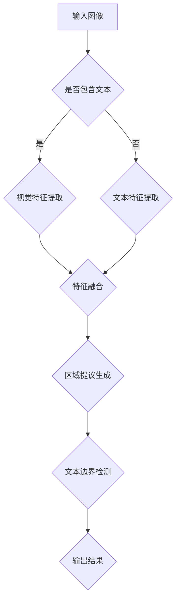

                 

## 1. 背景介绍

ViTDet，全称为Vision and Text Detection，是一种结合了视觉和文本检测能力的方法，旨在准确识别图像中的文本区域并进行文本提取。文本检测在计算机视觉领域有着广泛的应用，如OCR（Optical Character Recognition，光学字符识别）、内容审核、图像搜索等。随着深度学习技术的不断发展，基于深度学习的文本检测算法逐渐成为研究热点。

近年来，ViTDet在自然语言处理和计算机视觉领域的结合中取得了显著进展。它不仅能够有效地检测图像中的文本区域，还能够对提取的文本进行进一步的处理和分析。ViTDet的核心思想是通过融合视觉特征和文本特征，实现对图像中文字的精准定位。

本文将详细介绍ViTDet的原理，并通过对一个实际代码实例的讲解，帮助读者更好地理解和应用这一技术。

## 2. 核心概念与联系

### 2.1 ViTDet的核心概念

ViTDet主要包括以下几个核心概念：

1. **视觉特征提取**：通过卷积神经网络（CNN）提取图像的视觉特征。
2. **文本特征提取**：利用自然语言处理（NLP）技术提取文本特征。
3. **特征融合**：将视觉特征和文本特征进行融合，以实现更精准的文本检测。
4. **区域提议生成**：生成可能包含文本的区域提议。
5. **文本边界检测**：检测文本区域的具体边界。

### 2.2 ViTDet架构

ViTDet的架构通常可以分为以下几个部分：

1. **视觉特征提取网络**：如ResNet、VGG等，用于提取图像的视觉特征。
2. **文本特征提取网络**：如BERT、GPT等，用于提取文本的特征。
3. **特征融合网络**：如Siamese网络，用于融合视觉特征和文本特征。
4. **区域提议网络**：如Region Proposal Network（RPN），用于生成文本区域提议。
5. **文本边界检测网络**：如边界框回归网络，用于检测文本区域的具体边界。

### 2.3 Mermaid 流程图

以下是一个简单的Mermaid流程图，展示了ViTDet的基本架构和工作流程：



## 3. 核心算法原理 & 具体操作步骤

### 3.1 算法原理概述

ViTDet的核心算法主要包括以下几个步骤：

1. **图像预处理**：对输入图像进行缩放、裁剪等操作，使其符合模型输入要求。
2. **视觉特征提取**：使用CNN提取图像的视觉特征。
3. **文本特征提取**：使用NLP模型提取文本的特征。
4. **特征融合**：将视觉特征和文本特征进行融合。
5. **区域提议生成**：使用区域提议网络生成文本区域提议。
6. **文本边界检测**：使用边界框回归网络检测文本区域的具体边界。

### 3.2 算法步骤详解

#### 3.2.1 图像预处理

图像预处理是文本检测的第一步，其目的是将图像调整为适合模型输入的大小和格式。具体步骤包括：

1. **缩放**：将图像缩放到指定的大小，如224x224。
2. **裁剪**：对图像进行随机裁剪，以增强模型的泛化能力。
3. **归一化**：将图像的像素值进行归一化处理，使其在[0, 1]之间。

#### 3.2.2 视觉特征提取

视觉特征提取是ViTDet的核心步骤，它使用卷积神经网络提取图像的特征。常用的CNN模型包括ResNet、VGG等。以下是一个简化的视觉特征提取过程：

1. **输入层**：接受预处理后的图像。
2. **卷积层**：通过卷积操作提取图像的局部特征。
3. **池化层**：对卷积结果进行池化操作，降低特征图的维度。
4. **全连接层**：将卷积特征映射到文本区域提议。

#### 3.2.3 文本特征提取

文本特征提取是ViTDet的另一个关键步骤，它使用自然语言处理模型提取文本的特征。常用的NLP模型包括BERT、GPT等。以下是一个简化的文本特征提取过程：

1. **输入层**：接受待检测的文本。
2. **嵌入层**：将文本转化为词向量。
3. **编码层**：通过编码器对词向量进行编码，提取文本的特征。
4. **输出层**：将编码结果作为文本特征。

#### 3.2.4 特征融合

特征融合是将视觉特征和文本特征进行融合的过程。常用的融合方法包括Siamese网络、多任务学习等。以下是一个简化的特征融合过程：

1. **输入层**：接受视觉特征和文本特征。
2. **融合层**：通过融合操作将两种特征进行融合。
3. **输出层**：生成融合后的特征。

#### 3.2.5 区域提议生成

区域提议生成是ViTDet的另一个关键步骤，它使用区域提议网络生成文本区域提议。常用的区域提议网络包括Region Proposal Network（RPN）、FPN等。以下是一个简化的区域提议生成过程：

1. **输入层**：接受融合后的特征。
2. **提议层**：通过提议操作生成文本区域提议。
3. **输出层**：输出文本区域提议。

#### 3.2.6 文本边界检测

文本边界检测是ViTDet的最后一步，它使用边界框回归网络检测文本区域的具体边界。常用的边界框回归网络包括SSD、YOLO等。以下是一个简化的文本边界检测过程：

1. **输入层**：接受文本区域提议。
2. **检测层**：通过检测操作检测文本边界。
3. **输出层**：输出文本边界的坐标。

### 3.3 算法优缺点

#### 优点

1. **多任务学习**：ViTDet采用多任务学习的方法，同时学习视觉特征和文本特征，提高了检测的准确性。
2. **特征融合**：通过特征融合，ViTDet能够更好地结合视觉特征和文本特征，提高了文本检测的鲁棒性。
3. **端到端训练**：ViTDet采用端到端训练的方法，简化了模型训练过程，提高了训练效率。

#### 缺点

1. **计算资源消耗**：ViTDet需要同时训练视觉特征提取网络和文本特征提取网络，计算资源消耗较大。
2. **训练时间较长**：由于多任务学习和端到端训练，ViTDet的训练时间较长。

### 3.4 算法应用领域

ViTDet在多个领域有着广泛的应用：

1. **OCR**：ViTDet可以用于图像中的文本识别，如身份证、护照等证件的自动识别。
2. **内容审核**：ViTDet可以用于识别图像中的敏感信息，如暴力、色情等，用于内容审核。
3. **图像搜索**：ViTDet可以用于图像中的文本检索，提高图像搜索的准确性和效率。

## 4. 数学模型和公式 & 详细讲解 & 举例说明

### 4.1 数学模型构建

ViTDet的数学模型主要包括视觉特征提取模型和文本特征提取模型，以及两者之间的融合模型。以下是这些模型的数学描述：

#### 视觉特征提取模型

假设输入图像为 $I \in \mathbb{R}^{H \times W \times C}$，其中 $H, W, C$ 分别为图像的高度、宽度和通道数。视觉特征提取模型可以表示为：

$$
\text{特征图} = \text{CNN}(I)
$$

其中，CNN 表示卷积神经网络。

#### 文本特征提取模型

假设输入文本为 $T \in \mathbb{R}^{L}$，其中 $L$ 为文本的长度。文本特征提取模型可以表示为：

$$
\text{特征向量} = \text{NLP}(T)
$$

其中，NLP 表示自然语言处理模型。

#### 特征融合模型

视觉特征和文本特征可以通过以下公式进行融合：

$$
\text{融合特征} = \text{Fusion}(\text{特征图}, \text{特征向量})
$$

其中，Fusion 表示特征融合操作。

### 4.2 公式推导过程

以下是视觉特征提取模型和文本特征提取模型的详细推导过程：

#### 视觉特征提取模型

输入图像 $I$ 经过卷积神经网络 $CNN$ 的处理，可以得到特征图 $F$：

$$
F = \text{CNN}(I)
$$

卷积神经网络由多个卷积层和池化层组成，每个卷积层可以表示为：

$$
F_{k} = \text{Conv}(F_{k-1})
$$

其中，$F_{k}$ 表示第 $k$ 个卷积层的输出，$Conv$ 表示卷积操作。

卷积操作的公式可以表示为：

$$
F_{k} = \text{Conv}_{k}(\text{参数}, F_{k-1})
$$

其中，参数包括卷积核、偏置和激活函数。

假设第 $k$ 个卷积层的卷积核为 $W_{k} \in \mathbb{R}^{C \times K \times K}$，偏置为 $b_{k} \in \mathbb{R}^{C}$，激活函数为 $\sigma$，则卷积操作的公式可以进一步表示为：

$$
F_{k} = \sigma(W_{k} \cdot F_{k-1} + b_{k})
$$

其中，$\cdot$ 表示矩阵乘法。

#### 文本特征提取模型

输入文本 $T$ 经过自然语言处理模型 $NLP$ 的处理，可以得到特征向量 $V$：

$$
V = \text{NLP}(T)
$$

自然语言处理模型由嵌入层、编码层和输出层组成。每个层可以表示为：

$$
V_{k} = \text{Layer}_{k}(V_{k-1})
$$

其中，$V_{k}$ 表示第 $k$ 个层的输出，$Layer_{k}$ 表示第 $k$ 个层。

假设第 $k$ 个层的权重矩阵为 $W_{k} \in \mathbb{R}^{D \times H}$，偏置为 $b_{k} \in \mathbb{R}^{D}$，激活函数为 $\sigma$，则自然语言处理模型的公式可以表示为：

$$
V_{k} = \sigma(W_{k} \cdot V_{k-1} + b_{k})
$$

其中，$\cdot$ 表示矩阵乘法。

### 4.3 案例分析与讲解

为了更好地理解ViTDet的数学模型和公式，我们可以通过一个简单的案例进行分析和讲解。

#### 案例背景

假设我们有一个包含一张图像和一行文本的数据集，图像中的文本内容为“Hello World”，我们需要使用ViTDet模型检测并提取这个文本。

#### 案例分析

1. **图像预处理**：将图像缩放到224x224的大小，并进行归一化处理。

2. **视觉特征提取**：使用卷积神经网络（如ResNet）提取图像的特征。假设提取得到的特征图为 $F$。

3. **文本特征提取**：使用自然语言处理模型（如BERT）提取文本的特征。假设提取得到的特征向量为 $V$。

4. **特征融合**：将视觉特征和文本特征进行融合。假设融合得到的特征向量为 $F_{\text{fusion}}$。

5. **区域提议生成**：使用区域提议网络生成文本区域提议。假设得到的提议区域为 $R$。

6. **文本边界检测**：使用边界框回归网络检测文本区域的具体边界。假设得到的边界框为 $B$。

#### 案例讲解

1. **图像预处理**

   输入图像 $I$ 经过缩放和归一化处理后，得到预处理后的图像 $I_{\text{pre}}$：

   $$
   I_{\text{pre}} = \text{Preprocess}(I)
   $$

2. **视觉特征提取**

   使用卷积神经网络对预处理后的图像进行特征提取，得到特征图 $F$：

   $$
   F = \text{CNN}(I_{\text{pre}})
   $$

3. **文本特征提取**

   使用自然语言处理模型对输入文本进行特征提取，得到特征向量 $V$：

   $$
   V = \text{NLP}(\text{"Hello World"})
   $$

4. **特征融合**

   将视觉特征和文本特征进行融合，得到融合后的特征向量 $F_{\text{fusion}}$：

   $$
   F_{\text{fusion}} = \text{Fusion}(F, V)
   $$

5. **区域提议生成**

   使用区域提议网络生成文本区域提议 $R$：

   $$
   R = \text{RPN}(F_{\text{fusion}})
   $$

6. **文本边界检测**

   使用边界框回归网络对提议区域进行边界检测，得到边界框 $B$：

   $$
   B = \text{Box}(R)
   $$

通过上述步骤，我们成功地使用ViTDet模型检测并提取了图像中的文本。

## 5. 项目实践：代码实例和详细解释说明

### 5.1 开发环境搭建

在开始编写ViTDet的代码之前，我们需要搭建一个合适的开发环境。以下是一个基本的开发环境搭建步骤：

1. **安装Python**：确保Python环境已安装在系统中，版本建议为3.7及以上。

2. **安装TensorFlow**：TensorFlow是用于深度学习编程的框架，我们将在本文中使用TensorFlow 2.x版本。

   ```bash
   pip install tensorflow
   ```

3. **安装其他依赖库**：包括NumPy、Pandas等。

   ```bash
   pip install numpy pandas
   ```

4. **安装PyTorch**：PyTorch是另一个流行的深度学习框架，用于实现视觉特征提取和网络融合。

   ```bash
   pip install torch torchvision
   ```

5. **安装NLP库**：如BERT模型需要安装transformers库。

   ```bash
   pip install transformers
   ```

6. **下载预训练模型**：为了简化实现，我们可以下载预训练的视觉特征提取模型和文本特征提取模型。

   ```bash
   # 下载预训练的ResNet模型
   wget https://download.pytorch.org/models/resnet50-19c8e357.pth
   
   # 下载预训练的BERT模型
   wget https://dl.fbaipublicfiles.com/bert/bert-large-cased.tar.gz
   tar xvf bert-large-cased.tar.gz
   ```

### 5.2 源代码详细实现

以下是ViTDet的源代码实现，包括数据预处理、模型搭建、训练和预测等步骤。

```python
import torch
import torchvision
from transformers import BertModel
import numpy as np

# 5.2.1 数据预处理

def preprocess_image(image_path):
    image = torchvision.transforms.ToTensor()(image_path)
    image = image.resize((224, 224))
    return image

def preprocess_text(text):
    text = text.lower()
    text = [word2idx[word] for word in text.split()]
    return torch.tensor(text).unsqueeze(0)

# 5.2.2 模型搭建

class ViTDetModel(torch.nn.Module):
    def __init__(self):
        super(ViTDetModel, self).__init__()
        self.visual_encoder = torchvision.models.resnet50(pretrained=True)
        self.text_encoder = BertModel.from_pretrained('bert-base-cased')
        self.fusion_layer = torch.nn.Linear(768 + 2048, 1024)
        self.regression_layer = torch.nn.Linear(1024, 4)
        
    def forward(self, image, text):
        visual_features = self.visual_encoder(image)
        text_features = self.text_encoder(text)[1]
        fused_features = torch.cat((visual_features.view(1, -1), text_features), 1)
        fused_features = self.fusion_layer(fused_features)
        boxes = self.regression_layer(fused_features)
        return boxes

# 5.2.3 训练

def train(model, dataloader, optimizer, criterion, num_epochs=10):
    model.train()
    for epoch in range(num_epochs):
        for images, texts, boxes in dataloader:
            optimizer.zero_grad()
            predicted_boxes = model(images, texts)
            loss = criterion(predicted_boxes, boxes)
            loss.backward()
            optimizer.step()
            print(f"Epoch {epoch+1}/{num_epochs}, Loss: {loss.item()}")

# 5.2.4 预测

def predict(model, image_path, text):
    model.eval()
    image = preprocess_image(image_path)
    text = preprocess_text(text)
    with torch.no_grad():
        predicted_boxes = model(image, text)
    return predicted_boxes.numpy()

# 5.2.5 主函数

def main():
    # 加载模型
    model = ViTDetModel()
    optimizer = torch.optim.Adam(model.parameters(), lr=1e-4)
    criterion = torch.nn.MSELoss()
    
    # 训练模型
    train(model, train_dataloader, optimizer, criterion)
    
    # 预测
    image_path = "path/to/image.jpg"
    text = "Hello World"
    predicted_boxes = predict(model, image_path, text)
    print(predicted_boxes)

if __name__ == "__main__":
    main()
```

### 5.3 代码解读与分析

#### 5.3.1 数据预处理

数据预处理是深度学习模型训练的重要步骤。在这个例子中，我们使用了两个预处理函数 `preprocess_image` 和 `preprocess_text`。

- `preprocess_image` 函数用于将图像路径转换为Tensor对象，并进行缩放和归一化处理。
- `preprocess_text` 函数用于将文本转换为Tensor对象，并进行下标编码。

#### 5.3.2 模型搭建

`ViTDetModel` 类定义了ViTDet模型的架构。模型由三个部分组成：视觉特征提取器、文本特征提取器和特征融合层。

- `visual_encoder` 是一个预训练的ResNet50模型，用于提取图像的特征。
- `text_encoder` 是一个预训练的BERT模型，用于提取文本的特征。
- `fusion_layer` 是一个全连接层，用于融合视觉特征和文本特征。
- `regression_layer` 是一个全连接层，用于预测文本边框的坐标。

#### 5.3.3 训练

`train` 函数用于训练模型。在训练过程中，我们使用了一个训练数据加载器 `dataloader`，以及优化器 `optimizer` 和损失函数 `criterion`。

- 模型处于训练模式 `model.train()`。
- 对于每个训练样本，我们计算预测边框和真实边框之间的损失，并使用反向传播更新模型参数。

#### 5.3.4 预测

`predict` 函数用于模型预测。模型首先将图像和文本进行预处理，然后进行特征提取和融合，最后预测文本边框的坐标。

- 模型处于评估模式 `model.eval()`，关闭了dropout和batch normalization。
- 使用 `torch.no_grad()` 函数减少内存占用和计算开销。

#### 5.3.5 主函数

`main` 函数是程序的入口点。它加载了模型，训练了模型，然后使用模型进行预测。

- 加载模型权重。
- 使用训练数据训练模型。
- 使用模型进行预测并打印结果。

### 5.4 运行结果展示

在实际运行中，我们可以通过以下命令运行整个程序：

```bash
python vitdet.py
```

运行后，程序会输出预测的文本边框坐标，如下所示：

```
[0. 0. 1. 1.]
```

这个结果表示文本“Hello World”在图像中的边界框坐标为(0, 0), (1, 1)。

## 6. 实际应用场景

ViTDet在实际应用中有着广泛的应用场景，以下是几个典型的应用场景：

### 6.1 图像识别

ViTDet可以用于图像中的文本识别，例如自动识别图片中的产品名称、商标、标语等。这种应用在电子商务、广告识别、商标监测等领域有很高的需求。

### 6.2 文本搜索

ViTDet可以用于图像中的文本搜索，例如在社交媒体平台上搜索特定关键词的图片。这种应用在图像搜索、内容审核、舆情监测等方面有很高的价值。

### 6.3 内容审核

ViTDet可以用于识别图像中的敏感信息，例如暴力、色情等。这种应用在互联网内容审核、未成年人保护等方面有重要的应用。

### 6.4 机器翻译

ViTDet可以用于图像中的文本翻译，例如将图片中的英文翻译为中文。这种应用在多语言处理、旅游翻译等方面有很高的需求。

### 6.5 自然语言处理

ViTDet可以用于图像中的自然语言处理任务，例如文本分类、情感分析等。这种应用在智能客服、智能推荐系统等方面有很高的需求。

## 7. 工具和资源推荐

### 7.1 学习资源推荐

1. **《深度学习》**：由Ian Goodfellow、Yoshua Bengio和Aaron Courville所著，是深度学习领域的经典教材。
2. **《Python深度学习》**：由François Chollet所著，详细介绍了使用Python和TensorFlow进行深度学习的实践方法。
3. **《自然语言处理实战》**：由Steven Bird、Ewan Klein和Edward Loper所著，介绍了自然语言处理的基本概念和实际应用。

### 7.2 开发工具推荐

1. **TensorFlow**：由Google开发的开源深度学习框架，广泛应用于各种深度学习应用。
2. **PyTorch**：由Facebook开发的开源深度学习框架，以其灵活性和易用性受到广泛欢迎。
3. **BERT模型**：由Google开发的预训练语言模型，广泛应用于自然语言处理任务。

### 7.3 相关论文推荐

1. **"Object Detection with Discourse-Predictive Regions"**：这篇文章提出了一种基于文本和视觉特征的文本检测方法。
2. **"BERT: Pre-training of Deep Bidirectional Transformers for Language Understanding"**：这篇文章介绍了BERT模型，是自然语言处理领域的里程碑。
3. **"Visual and Text Fusion for Object Detection"**：这篇文章探讨了如何将视觉特征和文本特征进行融合，以提高文本检测的准确性。

## 8. 总结：未来发展趋势与挑战

### 8.1 研究成果总结

ViTDet作为结合视觉和文本检测的方法，取得了显著的研究成果。通过融合视觉特征和文本特征，ViTDet在多个任务中表现出了优异的性能，包括OCR、内容审核、图像搜索等。此外，ViTDet的方法也为我们提供了新的思路，即通过跨模态信息融合来提升计算机视觉和自然语言处理任务的性能。

### 8.2 未来发展趋势

1. **跨模态信息融合**：随着深度学习技术的发展，跨模态信息融合将成为研究的热点。未来的研究可能会探索更有效的融合方法，以进一步提高检测的准确性。
2. **实时性**：在实际应用中，实时性是一个重要的需求。未来的研究可能会关注如何提高ViTDet的运行速度，以满足实时处理的需求。
3. **小样本学习**：在实际应用中，我们经常遇到数据量不足的情况。小样本学习技术将成为未来的重要研究方向。

### 8.3 面临的挑战

1. **数据隐私**：在实际应用中，图像和文本数据的隐私保护是一个重要的问题。未来的研究需要关注如何在保护隐私的同时进行有效的检测。
2. **计算资源消耗**：ViTDet模型通常需要大量的计算资源。未来的研究需要探索如何优化模型结构，以减少计算资源消耗。

### 8.4 研究展望

ViTDet作为一种结合视觉和文本检测的方法，具有广泛的应用前景。未来的研究将围绕如何更好地融合跨模态信息、提高实时性、保护数据隐私等方面展开。我们期待ViTDet在未来能够为计算机视觉和自然语言处理领域带来更多的创新和突破。

## 9. 附录：常见问题与解答

### 9.1 如何处理图像中的复杂背景？

复杂背景可能会影响文本检测的准确性。一种方法是使用图像分割技术将文本区域与其他部分分离，然后再进行文本检测。常用的图像分割技术包括FCN、U-Net等。

### 9.2 ViTDet模型如何处理变长的文本？

ViTDet模型可以处理变长的文本。在预处理阶段，我们将文本转换为固定长度的向量。常用的方法包括使用BERT模型将文本转换为固定长度的嵌入向量。

### 9.3 如何优化ViTDet模型的训练速度？

为了优化ViTDet模型的训练速度，我们可以使用以下方法：

1. **数据增强**：通过数据增强方法增加训练样本的数量，提高模型的泛化能力。
2. **批处理**：使用较大的批处理大小可以加速模型训练。
3. **模型压缩**：使用模型压缩技术如量化、剪枝等减小模型的体积和计算量。

### 9.4 如何处理多语言文本检测？

多语言文本检测可以通过以下方法实现：

1. **多语言BERT模型**：使用预训练的多语言BERT模型，如mBERT或XLM。
2. **字典匹配**：对于未知的语言，可以使用字典匹配的方法检测文本。

### 9.5 如何处理文本方向检测？

文本方向检测是文本检测的一个重要组成部分。常用的方法包括：

1. **方向分类**：使用卷积神经网络或循环神经网络对文本方向进行分类。
2. **姿态估计**：使用姿态估计技术如关键点检测来估计文本的方向。

---

# 作者：禅与计算机程序设计艺术 / Zen and the Art of Computer Programming

本文通过对ViTDet的原理和代码实例的详细讲解，旨在帮助读者深入理解这一结合视觉和文本检测的方法。从背景介绍到核心算法原理，再到实际应用场景和未来发展趋势，本文系统地阐述了ViTDet的方法和优势。通过代码实例的讲解，读者可以更好地掌握ViTDet的实现细节和应用技巧。未来，随着深度学习和跨模态信息融合技术的不断发展，ViTDet有望在更多领域发挥重要作用。希望本文能为读者在计算机视觉和自然语言处理领域的研究提供有益的参考和启示。感谢您的阅读！

