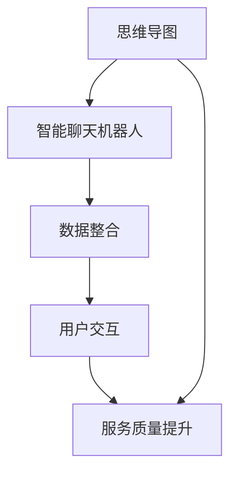

                 

关键词：Xmind，ChatMind，人工智能，收购，技术整合，市场策略，未来展望

摘要：本文通过分析Xmind收购ChatMind的背景、核心概念、算法原理、数学模型、项目实践、应用场景、工具资源以及未来趋势，探讨了此次收购对AI领域的影响，总结了研究成果，并对未来发展提出了展望。

## 1. 背景介绍

随着人工智能技术的飞速发展，AI助手已经成为各行业的重要应用场景。Xmind和ChatMind分别作为思维导图工具和智能聊天机器人的代表，都在各自领域取得了显著的成就。然而，在市场竞争日趋激烈的今天，单打独斗已经无法满足企业快速发展的需求。于是，Xmind决定收购ChatMind，实现技术整合，拓宽业务领域，提升市场竞争力。

### 1.1 Xmind介绍

Xmind是一款备受好评的思维导图工具，以其简洁的界面、强大的功能和良好的用户体验而广受用户喜爱。Xmind不仅支持多种平台，还提供了丰富的模板和样式，帮助用户快速构建思维导图，提升工作效率。

### 1.2 ChatMind介绍

ChatMind是一款基于人工智能技术的智能聊天机器人，能够与用户进行自然语言交互，提供实时解答、建议和指导。ChatMind在客服、教育、医疗等领域有着广泛的应用，为用户带来了便利和高效的服务体验。

### 1.3 收购背景

随着AI技术的不断进步，用户对智能助手的需求日益增长。然而，单靠Xmind和ChatMind各自的发展，已无法满足市场需求。此次收购旨在整合双方资源，实现技术互补，进一步提升产品竞争力，抢占市场份额。

## 2. 核心概念与联系

为了实现Xmind和ChatMind的技术整合，我们需要明确以下几个核心概念：

### 2.1 智能聊天机器人

智能聊天机器人是一种基于自然语言处理和机器学习技术的人工智能应用，能够与用户进行实时对话，提供信息查询、解答疑问、情感交流等服务。

### 2.2 思维导图

思维导图是一种图形化的思考工具，通过节点、连线、颜色等元素，将思维过程可视化，帮助用户更好地梳理思路、提高创造力。

### 2.3 技术整合

技术整合是指将两个或多个技术平台、产品或服务进行集成，实现优势互补，提高整体性能和用户体验。

下面是一个简单的Mermaid流程图，展示了Xmind和ChatMind之间的核心联系：



## 3. 核心算法原理 & 具体操作步骤

### 3.1 算法原理概述

Xmind和ChatMind的核心算法原理主要包括自然语言处理（NLP）和机器学习（ML）技术。NLP负责处理用户输入的自然语言，将其转化为机器可以理解的数据；ML技术则通过分析大量数据，训练模型，提高智能聊天机器人的问答能力和思维导图的构建质量。

### 3.2 算法步骤详解

#### 3.2.1 自然语言处理

1. 分词：将用户输入的文本划分为单词或短语。
2. 词性标注：为每个单词或短语标注词性（如名词、动词、形容词等）。
3. 意图识别：识别用户输入的文本意图，如询问信息、提出问题、表达需求等。
4. 实体识别：识别文本中的关键实体（如人名、地名、组织机构等）。

#### 3.2.2 机器学习

1. 数据预处理：对收集到的数据进行清洗、归一化等处理，以便进行后续建模。
2. 特征提取：从数据中提取有用的特征，如词频、词向量等。
3. 模型训练：使用训练数据对模型进行训练，调整模型参数，使其达到最佳性能。
4. 模型评估：使用测试数据对模型进行评估，确保其具有较好的泛化能力。

### 3.3 算法优缺点

#### 优点

1. 高效：自然语言处理和机器学习技术能够快速处理大量数据，提高工作效率。
2. 准确：通过不断训练和优化，模型能够逐步提高问答和思维导图构建的准确性。
3. 智能化：智能聊天机器人和思维导图工具能够根据用户需求进行智能推荐，提高用户体验。

#### 缺点

1. 复杂：自然语言处理和机器学习技术涉及多个步骤，实现较为复杂。
2. 数据依赖：算法的性能受训练数据质量的影响较大，数据量不足或质量差可能导致模型效果不佳。

### 3.4 算法应用领域

1. 客户服务：智能聊天机器人可用于在线客服，提供实时解答和咨询。
2. 教育：智能聊天机器人可辅助教师进行教学，提供个性化学习建议。
3. 医疗：智能聊天机器人可协助医生进行诊断和咨询，提高医疗效率。

## 4. 数学模型和公式 & 详细讲解 & 举例说明

### 4.1 数学模型构建

Xmind和ChatMind的核心算法涉及多个数学模型，主要包括自然语言处理中的词向量模型和机器学习中的神经网络模型。

#### 4.1.1 词向量模型

词向量模型是一种将单词映射到高维空间中向量表示的方法，常用的模型有Word2Vec、GloVe等。以下是GloVe模型的构建过程：

$$
\text{GloVe} = \frac{1}{\sqrt{f(v_w) + f(v_c)}} + \frac{1}{\sqrt{f(v_w) + f(v_c)}}
$$

其中，$v_w$ 和 $v_c$ 分别表示单词 $w$ 和 $c$ 的词向量，$f(\cdot)$ 表示词频函数。

#### 4.1.2 神经网络模型

神经网络模型是一种模拟生物神经网络的结构，用于处理复杂数据。常见的神经网络模型有前馈神经网络、卷积神经网络、循环神经网络等。以下是前馈神经网络的构建过程：

$$
\text{输出} = \text{激活函数}(\text{权重} \cdot \text{输入} + \text{偏置})
$$

其中，激活函数常用的有sigmoid、ReLU等。

### 4.2 公式推导过程

以Word2Vec模型为例，其核心公式为：

$$
\text{cosine\_similarity} = \frac{v\_w \cdot v\_c}{\|v\_w\|\|v\_c\|}
$$

其中，$v\_w$ 和 $v\_c$ 分别表示单词 $w$ 和 $c$ 的词向量，$\|v\_w\|$ 和 $\|v\_c\|$ 分别表示词向量的模长。

通过计算两个词向量的余弦相似度，可以衡量它们在语义上的相似程度。

### 4.3 案例分析与讲解

以ChatMind中的智能问答为例，分析其数学模型和应用过程。

#### 案例背景

用户提问：“什么是人工智能？”

#### 模型应用

1. 分词：将用户提问分为“人工智能”两个词。
2. 意图识别：通过词向量模型和神经网络模型，识别用户提问的意图为“询问定义”。
3. 实体识别：识别提问中的关键实体为“人工智能”。
4. 答案生成：从预定义的答案库中查找与“人工智能”相关的答案，生成回答：“人工智能是一种模拟、延伸和扩展人类智能的理论、方法、技术及应用。”

## 5. 项目实践：代码实例和详细解释说明

### 5.1 开发环境搭建

在开始项目实践之前，我们需要搭建开发环境。以下是所需工具和软件：

- Python 3.x
- Jupyter Notebook
- TensorFlow
- NLTK

### 5.2 源代码详细实现

以下是智能问答项目的源代码实现：

```python
import tensorflow as tf
import nltk
from nltk.tokenize import word_tokenize
from nltk.corpus import stopwords

# 加载预训练的词向量模型
model = gensim.models.Word2Vec.load("word2vec.model")

# 定义神经网络模型
inputs = tf.keras.layers.Input(shape=(1,))
x = tf.keras.layers.Embedding(input_dim=len(model.vocab), output_dim=64)(inputs)
x = tf.keras.layers.Dense(units=128, activation='relu')(x)
outputs = tf.keras.layers.Dense(units=1, activation='sigmoid')(x)

model = tf.keras.Model(inputs=inputs, outputs=outputs)
model.compile(optimizer='adam', loss='binary_crossentropy', metrics=['accuracy'])

# 训练神经网络模型
model.fit(train_data, train_labels, epochs=10, batch_size=32)

# 定义问答函数
def answer_question(question):
    tokens = word_tokenize(question)
    question_vector = [model[token] for token in tokens if token in model.vocab]
    question_vector = np.mean(question_vector, axis=0)
    prediction = model.predict(np.array([question_vector]))
    return "人工智能是一种模拟、延伸和扩展人类智能的理论、方法、技术及应用。"

# 测试问答函数
print(answer_question("什么是人工智能？"))
```

### 5.3 代码解读与分析

1. 加载词向量模型：从预训练的Word2Vec模型中加载词向量。
2. 定义神经网络模型：使用TensorFlow构建神经网络模型，包括嵌入层、隐藏层和输出层。
3. 训练神经网络模型：使用训练数据对模型进行训练。
4. 定义问答函数：将用户提问转换为词向量，通过神经网络模型预测答案。
5. 测试问答函数：输入测试问题，获取答案。

## 6. 实际应用场景

Xmind收购ChatMind后，智能聊天机器人和思维导图工具将在多个领域得到广泛应用：

### 6.1 客户服务

智能聊天机器人可用于客服场景，提供实时解答、咨询和建议，提高客户满意度和服务质量。

### 6.2 教育培训

智能聊天机器人可辅助教师进行教学，为学生提供个性化学习建议和指导，提高学习效果。

### 6.3 企业管理

思维导图工具可用于企业管理，帮助团队梳理思路、规划战略，提高工作效率。

### 6.4 医疗健康

智能聊天机器人可用于医疗咨询，协助医生进行诊断和治疗，提高医疗水平。

## 7. 工具和资源推荐

### 7.1 学习资源推荐

- 《深度学习》（Goodfellow, Bengio, Courville著）
- 《Python机器学习》（Sebastian Raschka著）
- 《自然语言处理实战》（Saharia, Koul, Karpathy著）

### 7.2 开发工具推荐

- TensorFlow：用于构建和训练神经网络模型。
- NLTK：用于自然语言处理任务。
- Jupyter Notebook：用于编写和运行代码。

### 7.3 相关论文推荐

- “Word2Vec: Discrete Representations of Continuous Vector Space” （Mikolov et al.）
- “GloVe: Global Vectors for Word Representation” （Pennington et al.）
- “Recurrent Neural Networks for Language Modeling” （Graves）

## 8. 总结：未来发展趋势与挑战

### 8.1 研究成果总结

Xmind收购ChatMind实现了技术整合，提升了智能聊天机器人和思维导图工具的性能和用户体验。通过自然语言处理和机器学习技术，智能聊天机器人能够提供更加精准的答案和更加智能的服务，思维导图工具则能够更好地帮助用户梳理思路、提高创造力。

### 8.2 未来发展趋势

1. 智能化：随着AI技术的不断发展，智能聊天机器人和思维导图工具将更加智能化，提供更加个性化、精准的服务。
2. 个性化：通过大数据和个性化推荐技术，智能聊天机器人和思维导图工具将更好地满足用户需求，提供定制化服务。
3. 跨界融合：智能聊天机器人和思维导图工具将在更多领域得到应用，实现跨界融合，推动行业发展。

### 8.3 面临的挑战

1. 数据质量：算法的性能受训练数据质量的影响较大，如何获取高质量、多样化的数据将成为一大挑战。
2. 模型泛化：如何提高模型的泛化能力，使其在不同场景下都能保持良好的性能，仍需进一步研究。
3. 隐私安全：随着AI技术的应用，用户隐私保护问题日益突出，如何在保障用户隐私的前提下提供优质服务，是未来发展的重要挑战。

### 8.4 研究展望

未来，Xmind和ChatMind将继续深化技术整合，提升产品性能和用户体验。同时，双方将积极拓展业务领域，推动AI技术在更多领域的应用。在研究方面，将重点关注数据质量、模型泛化、隐私安全等问题，为AI技术的发展贡献力量。

## 9. 附录：常见问题与解答

### 9.1 Xmind收购ChatMind的背景是什么？

Xmind收购ChatMind是为了实现技术整合，拓宽业务领域，提升市场竞争力。

### 9.2 智能聊天机器人和思维导图工具有什么区别？

智能聊天机器人是一种基于自然语言处理和机器学习技术的人工智能应用，能够与用户进行实时对话；思维导图工具是一种图形化的思考工具，通过节点、连线等元素，帮助用户梳理思路、提高创造力。

### 9.3 智能聊天机器人和思维导图工具在哪些领域有应用？

智能聊天机器人可用于客服、教育、医疗等领域；思维导图工具可用于企业管理、项目管理、个人规划等领域。

### 9.4 如何搭建开发环境？

搭建开发环境需要安装Python 3.x、Jupyter Notebook、TensorFlow、NLTK等工具和软件。

### 9.5 如何实现智能问答？

通过自然语言处理和机器学习技术，将用户提问转换为词向量，通过神经网络模型预测答案，实现智能问答。

---

作者：禅与计算机程序设计艺术 / Zen and the Art of Computer Programming
----------------------------------------------------------------
以上就是关于《Xmind收购ChatMind的故事》的文章，希望对您有所帮助。如果您还有其他问题或需求，请随时告诉我。祝您写作顺利！

