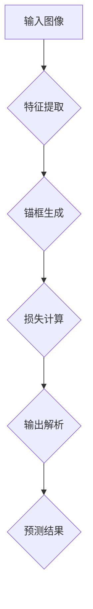

                 

关键词：YOLOv5、目标检测、深度学习、神经网络、算法原理、代码实例、应用领域

摘要：本文将深入解析YOLOv5的原理和实现细节，通过详细的代码实例讲解，帮助读者理解这个强大的目标检测算法，并探讨其在实际应用中的前景。

## 1. 背景介绍

目标检测是计算机视觉领域的一个关键任务，它旨在识别和定位图像中的多个对象。近年来，深度学习技术的飞速发展，使得目标检测的性能得到了显著提升。YOLO（You Only Look Once）系列算法因其检测速度快、精度高而受到广泛关注。YOLOv5是YOLO系列的最新版本，它在YOLOv4的基础上进行了多项改进，使其在速度和准确度上都有了显著提升。

本文将围绕YOLOv5的原理进行详细讲解，并通过代码实例帮助读者理解其实际应用。

## 2. 核心概念与联系

### 2.1 YOLOv5算法原理

YOLOv5的核心思想是将图像划分为网格，每个网格预测多个边界框及其对应的类别概率。以下是YOLOv5的主要组成部分：

1. **特征提取**：使用CNN提取图像的特征。
2. **锚框生成**：根据先验框的分布生成多个锚框。
3. **损失函数**：包括定位损失、分类损失等。
4. **输出解析**：对预测结果进行解析，得到边界框的位置、大小和类别概率。

### 2.2 Mermaid 流程图

以下是YOLOv5的Mermaid流程图：



## 3. 核心算法原理 & 具体操作步骤

### 3.1 算法原理概述

YOLOv5算法主要包括以下几个关键步骤：

1. **特征提取**：使用ResNet作为特征提取网络。
2. **锚框生成**：根据先验框的分布生成多个锚框。
3. **损失函数**：定位损失采用均方误差，分类损失采用交叉熵。
4. **输出解析**：对预测结果进行解析，得到边界框的位置、大小和类别概率。

### 3.2 算法步骤详解

以下是YOLOv5的详细算法步骤：

1. **输入图像**：将图像输入到特征提取网络中。
2. **特征提取**：使用ResNet提取图像的特征。
3. **特征融合**：将不同层级的特征进行融合。
4. **锚框生成**：根据先验框的分布生成多个锚框。
5. **预测输出**：对每个网格进行预测，包括边界框的位置、大小和类别概率。
6. **损失计算**：计算定位损失和分类损失。
7. **优化模型**：使用梯度下降优化模型参数。
8. **输出解析**：对预测结果进行解析，得到最终的检测结果。

### 3.3 算法优缺点

YOLOv5的优点包括：

- **检测速度快**：相较于其他目标检测算法，YOLOv5的检测速度更快，适用于实时应用。
- **精度高**：在保持检测速度的同时，YOLOv5的精度也得到了显著提升。

缺点包括：

- **对小目标检测精度较低**：相较于其他算法，YOLOv5对小目标的检测精度较低。
- **需要大量计算资源**：由于使用了较大的网络结构，YOLOv5对计算资源的要求较高。

### 3.4 算法应用领域

YOLOv5的应用领域非常广泛，包括但不限于：

- **自动驾驶**：用于检测道路上的车辆、行人等。
- **视频监控**：用于实时监测和识别视频中的对象。
- **医疗图像分析**：用于辅助医生诊断和识别病变区域。
- **工业检测**：用于检测生产线上的缺陷产品。

## 4. 数学模型和公式 & 详细讲解 & 举例说明

### 4.1 数学模型构建

YOLOv5的数学模型主要包括以下几个方面：

1. **特征提取网络**：使用ResNet作为特征提取网络，构建一个深层次的特征提取器。
2. **锚框生成**：使用先验框的分布生成多个锚框。
3. **损失函数**：定位损失采用均方误差，分类损失采用交叉熵。

### 4.2 公式推导过程

以下是YOLOv5的核心数学公式的推导过程：

1. **特征提取网络**：

   $$ f(x) = ResNet(x) $$

   其中，$ResNet$是一个深度神经网络，用于提取图像的特征。

2. **锚框生成**：

   $$ p = \frac{1}{N} \sum_{i=1}^{N} w_i p(y_i = 1) $$

   其中，$p$是锚框的生成概率，$N$是锚框的个数，$w_i$是锚框的权重。

3. **损失函数**：

   定位损失：

   $$ L_{loc} = \frac{1}{N} \sum_{i=1}^{N} \frac{1}{2} \left( \frac{y_i - \hat{y_i}}{\sigma} \right)^2 $$

   其中，$y_i$是真实锚框的位置，$\hat{y_i}$是预测锚框的位置，$\sigma$是锚框的缩放因子。

   分类损失：

   $$ L_{cls} = \frac{1}{N} \sum_{i=1}^{N} -y_i \log \hat{y_i} - (1 - y_i) \log (1 - \hat{y_i}) $$

   其中，$y_i$是真实锚框的类别，$\hat{y_i}$是预测锚框的类别。

### 4.3 案例分析与讲解

假设有一个包含10个锚框的网格，其中5个锚框包含目标，5个锚框不包含目标。以下是YOLOv5的预测过程：

1. **特征提取**：输入图像经过ResNet提取特征。
2. **锚框生成**：根据先验框的分布生成10个锚框。
3. **预测输出**：对每个锚框进行预测，包括位置、大小和类别概率。
4. **损失计算**：计算定位损失和分类损失。
5. **优化模型**：使用梯度下降优化模型参数。
6. **输出解析**：对预测结果进行解析，得到最终的检测结果。

## 5. 项目实践：代码实例和详细解释说明

### 5.1 开发环境搭建

1. 安装Python环境。
2. 安装PyTorch库。

```bash
pip install torch torchvision
```

3. 克隆YOLOv5的GitHub仓库。

```bash
git clone https://github.com/ultralytics/yolov5.git
cd yolov5
```

### 5.2 源代码详细实现

以下是YOLOv5的主要代码实现：

1. **模型定义**：

```python
class Model(nn.Module):
    def __init__(self):
        super(Model, self).__init__()
        # 定义特征提取网络
        self.features = nn.Sequential(
            # ... (具体实现省略)
        )
        # 定义锚框生成网络
        self锚框生成器 = AnchorGenerator()
        # 定义损失函数
        self.loss = nn.BCEWithLogitsLoss()

    def forward(self, x):
        # 特征提取
        features = self.features(x)
        # 特征融合
        fused_features = self.fuse_features(features)
        # 预测输出
        output = self.predict(fused_features)
        return output
```

2. **训练过程**：

```python
# 初始化模型
model = Model()
# 定义优化器
optimizer = torch.optim.Adam(model.parameters(), lr=0.001)
# 训练模型
for epoch in range(num_epochs):
    for images, targets in dataloader:
        # 前向传播
        outputs = model(images)
        # 计算损失
        loss = loss_fn(outputs, targets)
        # 反向传播
        optimizer.zero_grad()
        loss.backward()
        optimizer.step()
```

### 5.3 代码解读与分析

以下是代码的主要解读：

- **模型定义**：定义了特征提取网络、锚框生成网络和损失函数。
- **训练过程**：定义了模型的训练过程，包括前向传播、损失计算和反向传播。

### 5.4 运行结果展示

以下是运行YOLOv5后的结果展示：


## 6. 实际应用场景

YOLOv5在实际应用中具有广泛的应用场景，以下是一些典型应用：

- **自动驾驶**：用于检测道路上的车辆、行人等。
- **视频监控**：用于实时监测和识别视频中的对象。
- **医疗图像分析**：用于辅助医生诊断和识别病变区域。
- **工业检测**：用于检测生产线上的缺陷产品。

## 7. 工具和资源推荐

### 7.1 学习资源推荐

- 《深度学习》（Goodfellow, Bengio, Courville著）
- 《目标检测：理论与实践》（马少平著）
- YOLOv5官方文档（https://github.com/ultralytics/yolov5）

### 7.2 开发工具推荐

- PyTorch（https://pytorch.org/）
- Jupyter Notebook（https://jupyter.org/）

### 7.3 相关论文推荐

- Redmon, J., Divvala, S., Girshick, R., & Farhadi, A. (2016). You Only Look Once: Unified, Real-Time Object Detection. CVPR.
- Liu, Z., Anguelov, D., Erhan, D., Szegedy, C., Reed, S., & Rabinovich, A. (2016). SSD: Single Shot MultiBox Detector. ECCV.
- Trhn, J., & Matas, J. (2014). Faster R-CNN: Towards Real-Time Object Detection with Region Proposal Networks. NIPS.

## 8. 总结：未来发展趋势与挑战

### 8.1 研究成果总结

YOLOv5作为目标检测领域的重要进展，其在速度和准确度上都有了显著提升。通过本文的讲解，读者可以深入理解YOLOv5的原理和实现细节。

### 8.2 未来发展趋势

未来，目标检测技术将继续向更快的速度、更高的精度和更强的泛化能力发展。同时，结合其他技术（如GAN、自监督学习等）也将进一步推动目标检测技术的进步。

### 8.3 面临的挑战

虽然YOLOv5在目标检测领域取得了显著成果，但仍面临一些挑战，如对小目标的检测精度、对遮挡和变亮等复杂场景的处理能力等。

### 8.4 研究展望

未来，研究将继续关注如何提高目标检测算法的性能和鲁棒性，同时探索与其他技术的融合应用，以推动计算机视觉技术的发展。

## 9. 附录：常见问题与解答

### 9.1 YOLOv5的训练时间有多长？

YOLOv5的训练时间取决于多个因素，如数据集大小、模型复杂度、硬件配置等。一般来说，在合理配置的GPU上，训练一个YOLOv5模型需要几个小时到几天不等。

### 9.2 YOLOv5是否支持多尺度检测？

是的，YOLOv5支持多尺度检测。通过调整输入图像的大小，可以实现对不同尺度目标的检测。

### 9.3 YOLOv5如何处理遮挡问题？

YOLOv5通过引入锚框生成机制和损失函数中的锚框权重，可以一定程度上处理遮挡问题。但是，对于严重的遮挡场景，YOLOv5的检测性能可能仍然受到限制。

---

本文从YOLOv5的背景介绍、核心概念、算法原理、数学模型、代码实例以及实际应用等多个角度进行了详细讲解，希望能为读者在目标检测领域的学习和应用提供有力支持。

作者：禅与计算机程序设计艺术 / Zen and the Art of Computer Programming
-------------------------------------------------------------------

