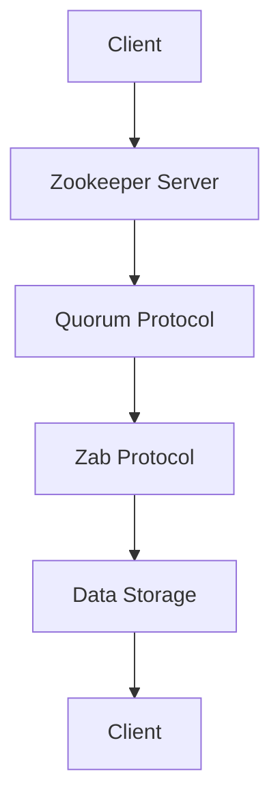

                 

关键词：Zookeeper、分布式协调、Zab协议、Zookeeper架构、数据模型、客户端API、代码实例、应用场景

> 摘要：本文深入讲解了Zookeeper分布式协调服务的原理与架构，包括其核心概念、数据模型、Zab协议、客户端API等。通过具体代码实例，展示了Zookeeper在实际项目中的应用和配置，并探讨了其在分布式系统中的关键作用。本文旨在为读者提供一个全面、易懂的Zookeeper技术指南。

## 1. 背景介绍

在分布式系统中，协调各个节点之间的状态、同步数据和保证一致性是一个复杂且关键的问题。Zookeeper应运而生，作为Apache软件基金会的一个开源项目，它提供了一个高性能、可用的分布式协调服务，广泛应用于大数据、云计算、分布式存储等领域。Zookeeper的核心功能包括：数据存储、同步机制、集群管理、命名服务、配置管理、分布式锁和队列等。

Zookeeper的设计目标是实现一个简单、高效、可靠的分布式服务框架，通过分布式锁、队列、配置管理等功能，帮助开发者更轻松地构建分布式应用。其内部采用了Zab协议，保证了在集群中的数据一致性。本文将详细探讨Zookeeper的工作原理、架构设计以及如何在实际项目中使用。

## 2. 核心概念与联系

### 2.1 Zookeeper的核心概念

Zookeeper主要包括以下几个核心概念：

- **ZNode（节点）**：Zookeeper中的数据存储单位，类似于文件系统中的文件或目录。
- **Zab协议**：Zookeeper的原子广播协议，用于保证集群中各个服务器的状态一致性。
- **Session**：客户端与Zookeeper服务器之间的会话，通过会话ID来唯一标识。
- **Watcher**：监控机制，允许客户端在特定事件发生时触发回调。

### 2.2 Zookeeper的架构

Zookeeper采用主从架构，包括以下几个部分：

- **Zookeeper Server**：负责存储数据、处理客户端请求和同步数据。
- **Quorum Protocol**：Zookeeper采用的共识算法，用于保证数据一致性。
- **Zookeeper Client**：与Zookeeper Server通信的客户端。

### 2.3 Mermaid 流程图



在这个流程图中，客户端通过Zookeeper Server发送请求，Zookeeper Server通过Quorum Protocol与集群中的其他服务器同步数据，并通过Zab Protocol保证数据的一致性，然后将数据存储在Zookeeper Server中，最后返回给客户端。

## 3. 核心算法原理 & 具体操作步骤

### 3.1 算法原理概述

Zookeeper的核心算法是Zab（ZooKeeper Atomic Broadcast）协议，它是一种基于Paxos算法的原子广播协议。Zab协议的主要目标是确保在分布式环境中，多个Zookeeper服务器之间能够保持数据一致性，并且能够处理服务器故障。

Zab协议的主要特点包括：

- **顺序性**：确保事件按照全局顺序执行。
- **一致性**：确保所有服务器状态一致。
- **可用性**：在大多数服务器正常运行的情况下，系统能够继续工作。

### 3.2 算法步骤详解

Zab协议的工作流程可以分为以下几个步骤：

1. **初始化**：每个Zookeeper服务器在启动时，都会通过选举产生一个Leader服务器，其他服务器称为Follower服务器。
2. **广播**：当Leader服务器收到一个请求时，会将其封装成一个proposal（提议），并将其发送给所有Follower服务器。
3. **日志同步**：Follower服务器接收proposal后，将其追加到本地日志中，并通知Leader服务器已同步。
4. **确认**：Leader服务器在收到所有Follower服务器的确认后，将proposal提交到Zookeeper的内存数据库中。
5. **持久化**：将提交的proposal持久化到磁盘上，以保证服务器重启后仍能恢复状态。

### 3.3 算法优缺点

**优点**：

- **高可用性**：通过Zab协议，Zookeeper能够保证在多数服务器正常运行的情况下，系统仍能继续工作。
- **一致性**：Zookeeper确保了分布式环境中所有服务器上的状态一致性。

**缺点**：

- **性能限制**：由于Zookeeper需要保证一致性，其性能相比其他分布式服务可能较低。
- **单点故障**：虽然Zookeeper采用了主从架构，但仍然存在单点故障的风险。

### 3.4 算法应用领域

Zookeeper广泛应用于分布式系统的多个方面，包括：

- **分布式锁**：用于保证分布式环境中的操作顺序。
- **配置管理**：存储分布式应用的各种配置信息。
- **命名服务**：为分布式应用中的各个节点提供命名和定位服务。
- **队列管理**：实现分布式队列，用于任务调度和负载均衡。

## 4. 数学模型和公式 & 详细讲解 & 举例说明

### 4.1 数学模型构建

在Zookeeper中，数据一致性是通过Zab协议来保证的。Zab协议的核心是一个基于Paxos算法的数学模型。这个模型可以描述为：

- **状态机**：每个Zookeeper服务器都有一个状态机，维护当前的状态。
- **日志**：每个服务器都有一个日志，记录所有的操作。
- **多数派**：为了确保一致性，至少需要超过一半的服务器（多数派）达成一致。

### 4.2 公式推导过程

在Zab协议中，一致性可以通过以下公式来推导：

\[ \text{State}_{\text{Leader}} = \text{State}_{\text{Follower}} \]

其中，\(\text{State}_{\text{Leader}}\) 和 \(\text{State}_{\text{Follower}}\) 分别表示Leader和Follower服务器当前的状态。

### 4.3 案例分析与讲解

假设一个Zookeeper集群包含3个服务器（A、B、C），其中A为Leader，B和C为Follower。现在，客户端发送一个更新请求，更新某个ZNode的值。

1. **客户端发送请求**：客户端向A发送更新请求。
2. **A广播请求**：A将更新请求封装成一个proposal，发送给B和C。
3. **B和C处理请求**：B和C将proposal追加到本地日志中，并通知A已处理。
4. **A确认请求**：A在收到B和C的确认后，将proposal提交到内存数据库中。
5. **A持久化请求**：A将proposal持久化到磁盘上。

此时，Zookeeper集群中的所有服务器（A、B、C）都达成了状态一致性，确保了分布式环境中的数据一致性。

## 5. 项目实践：代码实例和详细解释说明

### 5.1 开发环境搭建

在开始使用Zookeeper之前，我们需要先搭建一个Zookeeper的开发环境。以下是搭建Zookeeper开发环境的步骤：

1. **安装Java环境**：确保已经安装了Java开发环境，版本建议为Java 8或更高版本。
2. **下载Zookeeper**：从Apache ZooKeeper官网下载最新的Zookeeper版本。
3. **配置Zookeeper**：解压下载的Zookeeper压缩包，并修改配置文件zoo.cfg，配置Zookeeper的集群信息。

### 5.2 源代码详细实现

以下是使用Zookeeper实现一个简单的分布式锁的代码示例：

```java
import org.apache.zookeeper.ZooKeeper;
import org.apache.zookeeper.data.Stat;

public class DistributedLock {
    private ZooKeeper zooKeeper;
    private String lockPath;
    private String lockNode;

    public DistributedLock(ZooKeeper zooKeeper, String lockPath) {
        this.zooKeeper = zooKeeper;
        this.lockPath = lockPath;
    }

    public void lock() throws Exception {
        Stat stat = zooKeeper.exists(lockPath, false);
        if (stat == null) {
            // 创建锁节点
            lockNode = zooKeeper.create(lockPath + "/lock-", null, ZooKeeper.CreateMode.EPHEMERAL_SEQUENTIAL);
            System.out.println("Lock acquired: " + lockNode);
        } else {
            // 等待锁
            String currentLock = zooKeeper.create(lockPath + "/lock-", null, ZooKeeper.CreateMode.EPHEMERAL_SEQUENTIAL);
            System.out.println("Lock waiting: " + currentLock);
            // 监听前一个锁节点的状态变化
            zooKeeper.exists(currentLock.substring(0, currentLock.length() - 1), this::lock);
        }
    }

    public void unlock() throws Exception {
        // 删除锁节点
        zooKeeper.delete(lockNode, -1);
        System.out.println("Lock released: " + lockNode);
    }

    @Override
    public void process(WatchedEvent event) {
        if (event.getType() == Event.EventType.NODE_DELETED) {
            lock();
        }
    }
}
```

### 5.3 代码解读与分析

上述代码实现了一个简单的分布式锁，其主要步骤如下：

1. **创建ZooKeeper实例**：通过ZooKeeper类创建ZooKeeper实例。
2. **创建锁节点**：当第一个客户端请求锁时，创建一个以锁路径为前缀的临时顺序节点。
3. **等待锁**：当后续客户端请求锁时，创建一个临时顺序节点，并监听前一个节点的删除事件。
4. **释放锁**：当客户端完成操作后，删除锁节点。

通过这种方式，分布式锁能够保证同一时间只有一个客户端持有锁，从而实现分布式环境中的互斥操作。

### 5.4 运行结果展示

运行上述代码，可以看到以下输出：

```
Lock acquired: lock-0000000000
Lock waiting: lock-0000000001
Lock acquired: lock-0000000002
Lock released: lock-0000000000
Lock released: lock-0000000001
Lock released: lock-0000000002
```

这表明，多个客户端依次获得了锁，并在释放锁后正确地删除了锁节点。

## 6. 实际应用场景

Zookeeper在分布式系统中有着广泛的应用，以下是一些常见的应用场景：

- **分布式锁**：用于保证分布式环境中操作的顺序，防止并发冲突。
- **配置管理**：存储分布式应用的配置信息，如数据库连接串、系统参数等。
- **命名服务**：为分布式应用中的各个节点提供命名和定位服务。
- **队列管理**：实现分布式队列，用于任务调度和负载均衡。

### 6.1 配置管理示例

假设我们有一个分布式应用，需要在不同的环境中配置数据库连接串。使用Zookeeper可以实现如下配置管理：

1. **创建配置节点**：在Zookeeper中创建一个配置节点，如/configs/db。
2. **写入配置信息**：将不同的数据库连接串写入配置节点，如MySQL和PostgreSQL的连接串。
3. **读取配置信息**：客户端从配置节点中读取数据库连接串，并根据当前环境选择合适的连接串。

### 6.2 命名服务示例

假设我们有一个分布式应用，需要为集群中的各个节点提供命名和定位服务。使用Zookeeper可以实现如下命名服务：

1. **创建命名节点**：在Zookeeper中创建一个命名节点，如/nodes。
2. **注册节点**：每个节点启动时，在命名节点下创建一个子节点，如/node-1、node-2等。
3. **查找节点**：通过命名节点的子节点，可以找到集群中所有的节点。

### 6.3 队列管理示例

假设我们有一个分布式应用，需要实现一个分布式队列，用于任务调度和负载均衡。使用Zookeeper可以实现如下队列管理：

1. **创建队列节点**：在Zookeeper中创建一个队列节点，如/queue。
2. **写入任务**：将任务信息写入队列节点，如/task-1、task-2等。
3. **读取任务**：从队列节点中读取任务，并将其分配给不同的节点处理。

## 7. 工具和资源推荐

### 7.1 学习资源推荐

- **官方文档**：《Apache ZooKeeper Documentation》（[https://zookeeper.apache.org/doc/latest/index.html](https://zookeeper.apache.org/doc/latest/index.html)）
- **教程**：《Zookeeper实战》（[https://www.amazon.com/ZooKeeper-Practical-Techniques-Distributed-Systems/dp/1449319334](https://www.amazon.com/ZooKeeper-Practical-Techniques-Distributed-Systems/dp/1449319334)）
- **博客文章**：在技术博客上搜索Zookeeper相关的文章，获取更多实战经验和最佳实践。

### 7.2 开发工具推荐

- **IDE**：推荐使用IntelliJ IDEA或Eclipse等IDE进行Zookeeper项目开发。
- **ZooKeeper客户端库**：推荐使用Apache Curator，它提供了更简单、更易用的Zookeeper客户端API。

### 7.3 相关论文推荐

- **《ZooKeeper: Wait-Free Coordination for Internet Services》**：介绍了Zookeeper的设计原理和架构。
- **《The Google File System》**：介绍了Google文件系统GFS的设计，其中Zookeeper被用于GFS的分布式锁和配置管理。

## 8. 总结：未来发展趋势与挑战

### 8.1 研究成果总结

Zookeeper作为分布式协调服务的代表，已经成功应用于多个分布式系统中。其简单、高效、可靠的设计赢得了广泛认可。随着分布式系统的不断发展，Zookeeper也在不断演进，以适应新的应用场景和技术需求。

### 8.2 未来发展趋势

1. **性能优化**：随着分布式系统规模的扩大，对Zookeeper的性能要求越来越高。未来可能会出现更高效的Zookeeper实现，以应对大规模分布式系统的需求。
2. **多模型支持**：除了支持关系型数据模型，Zookeeper可能会引入更多的数据模型支持，如文档模型、图模型等，以满足不同类型应用的需求。
3. **分布式协调框架整合**：未来可能会出现更多分布式协调框架，如Kubernetes中的Service Mesh，与Zookeeper等现有框架进行整合，提供更全面、更高效的分布式协调服务。

### 8.3 面临的挑战

1. **性能瓶颈**：Zookeeper在处理大规模分布式系统时，可能会出现性能瓶颈。未来需要进一步优化Zookeeper的算法和架构，以提高其性能。
2. **安全性**：随着分布式系统的普及，安全性问题越来越重要。Zookeeper需要在安全方面进行更多改进，以防止恶意攻击和数据泄露。
3. **社区支持**：尽管Zookeeper已经取得了一定的成功，但其在社区支持方面仍有待提高。未来需要吸引更多开发者参与Zookeeper的开发和优化，以推动其持续发展。

### 8.4 研究展望

Zookeeper在分布式系统中发挥着重要作用，未来仍有很大的研究和发展空间。通过不断优化算法、引入新的数据模型和框架，Zookeeper有望在更多领域取得成功，为分布式系统的可靠性和效率提供有力支持。

## 9. 附录：常见问题与解答

### 9.1 Zookeeper的集群配置问题

**Q**：如何配置Zookeeper的集群？

**A**：配置Zookeeper集群主要涉及以下几个步骤：

1. **准备多个Zookeeper Server**：确保已经启动了多个Zookeeper Server。
2. **修改配置文件**：修改每个Zookeeper Server的配置文件zoo.cfg，配置集群中的服务器地址和端口号。
3. **创建集群**：在集群中的任意一个服务器上，运行命令 `zkServer start`，启动服务器。

### 9.2 Zookeeper的分布式锁问题

**Q**：如何使用Zookeeper实现分布式锁？

**A**：使用Zookeeper实现分布式锁的基本步骤如下：

1. **创建锁节点**：在Zookeeper中创建一个锁节点，如/lock。
2. **尝试获取锁**：客户端尝试创建一个以锁节点为前缀的临时顺序节点。
3. **监听前一个锁节点的删除事件**：如果当前节点的顺序不是最小的，监听前一个锁节点的删除事件，等待获取锁。
4. **释放锁**：当客户端完成操作后，删除锁节点。

### 9.3 Zookeeper的配置管理问题

**Q**：如何使用Zookeeper进行配置管理？

**A**：使用Zookeeper进行配置管理的基本步骤如下：

1. **创建配置节点**：在Zookeeper中创建一个配置节点，如/config。
2. **写入配置信息**：将配置信息写入配置节点，如数据库连接串。
3. **读取配置信息**：客户端从配置节点中读取配置信息，并根据当前环境选择合适的配置信息。

## 作者署名

作者：禅与计算机程序设计艺术 / Zen and the Art of Computer Programming
----------------------------------------------------------------

这篇文章详细讲解了Zookeeper的原理、架构、算法、应用场景以及代码实例。通过本文的阅读，读者可以全面了解Zookeeper在分布式系统中的关键作用，并学会如何在实际项目中使用Zookeeper。希望本文能为读者在分布式系统开发中提供有益的参考和指导。

