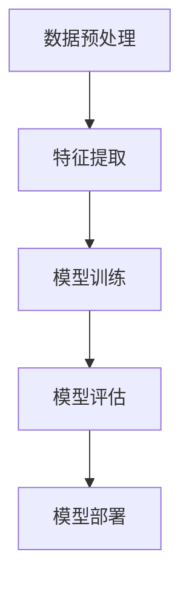

                 

关键词：bilibili、视频内容分类、算法、校招面试、重点

摘要：本文旨在探讨bilibili2024年校招面试中关于视频内容分类算法的重点，分析核心概念、算法原理、应用领域以及实际案例，为应聘者提供全面的备考指导。

## 1. 背景介绍

随着互联网的快速发展，视频内容逐渐成为人们获取信息、娱乐的重要途径。bilibili作为我国知名的弹幕视频分享网站，其视频内容的多样性和复杂性对内容分类算法提出了更高的要求。在2024年校招中，视频内容分类算法成为了一个热门的面试题目，因为这一算法不仅在视频网站中具有重要应用，还在推荐系统、搜索引擎等多个领域有着广泛的应用前景。

本文将围绕bilibili2024视频内容分类算法的校招面试重点，从核心概念、算法原理、应用领域等方面进行深入探讨，以帮助广大应聘者更好地备战面试。

## 2. 核心概念与联系

### 2.1. 相关术语解释

在讨论视频内容分类算法之前，我们需要了解以下几个关键术语：

- **视频内容分类**：将视频内容按照主题、类型、风格等特征进行归类，以便用户更好地发现和选择感兴趣的视频。

- **特征提取**：从视频数据中提取出能够代表视频特征的信息，如文本、音频、图像等。

- **机器学习**：一种基于数据驱动的方法，通过训练模型从数据中学习规律，进而实现自动化的预测和分类。

- **分类算法**：一种用于将数据分为不同类别的算法，如支持向量机（SVM）、决策树、神经网络等。

### 2.2. 算法架构

为了实现视频内容分类，我们需要构建一个完整的算法架构，该架构通常包括以下几个关键模块：

- **数据预处理**：对原始视频数据进行清洗、去噪、格式转换等操作，使其适合用于训练和预测。

- **特征提取**：从预处理后的数据中提取出有代表性的特征，如文本特征、音频特征、图像特征等。

- **模型训练**：使用提取到的特征训练分类模型，使其能够学习并识别不同类型的视频。

- **模型评估**：通过测试数据评估模型的分类效果，如准确率、召回率、F1值等。

- **模型部署**：将训练好的模型部署到生产环境中，对新的视频数据进行实时分类。

### 2.3. Mermaid 流程图

以下是视频内容分类算法的 Mermaid 流程图：



## 3. 核心算法原理 & 具体操作步骤

### 3.1. 算法原理概述

视频内容分类算法的核心思想是通过学习视频特征，将不同类型的视频区分开来。具体来说，算法可以分为以下几个步骤：

1. 数据预处理：对视频数据进行清洗、去噪、格式转换等操作，使其适合用于训练和预测。

2. 特征提取：从预处理后的数据中提取出有代表性的特征，如文本特征、音频特征、图像特征等。

3. 模型训练：使用提取到的特征训练分类模型，使其能够学习并识别不同类型的视频。

4. 模型评估：通过测试数据评估模型的分类效果，如准确率、召回率、F1值等。

5. 模型部署：将训练好的模型部署到生产环境中，对新的视频数据进行实时分类。

### 3.2. 算法步骤详解

1. **数据预处理**：

   - **数据清洗**：去除视频数据中的噪声和无关信息，如视频中的广告、水印等。

   - **数据去噪**：对视频数据进行去噪处理，如去除视频中的噪声、模糊等。

   - **格式转换**：将不同格式的视频数据转换为统一的格式，如将视频转换为MP4格式。

2. **特征提取**：

   - **文本特征提取**：从视频标题、标签、描述等文本信息中提取关键词、主题等信息。

   - **音频特征提取**：从视频音频中提取音频特征，如音调、节奏、音量等。

   - **图像特征提取**：从视频图像中提取图像特征，如颜色、纹理、形状等。

3. **模型训练**：

   - **选择模型**：根据视频内容分类的特点，选择合适的分类模型，如SVM、决策树、神经网络等。

   - **训练模型**：使用提取到的特征和标签数据训练分类模型，使其能够学习并识别不同类型的视频。

4. **模型评估**：

   - **准确率**：模型正确分类的样本数占总样本数的比例。

   - **召回率**：模型正确分类的样本数占实际为该类别的样本数的比例。

   - **F1值**：准确率和召回率的加权平均值，用于综合评价模型的分类效果。

5. **模型部署**：

   - **部署环境**：将训练好的模型部署到生产环境中，如服务器、云端等。

   - **实时分类**：对新的视频数据进行实时分类，如用户上传的视频、推荐系统中的视频等。

### 3.3. 算法优缺点

**优点**：

- **高效性**：视频内容分类算法能够快速地对大量视频进行分类，提高用户体验。

- **灵活性**：可以根据不同的应用场景选择合适的特征提取方法和分类模型。

- **可扩展性**：视频内容分类算法可以应用于多种场景，如视频网站、推荐系统、搜索引擎等。

**缺点**：

- **计算资源消耗**：特征提取和模型训练过程需要大量的计算资源，对硬件设备有较高要求。

- **数据质量影响**：数据质量对算法效果有很大影响，数据清洗和去噪过程需要耗费大量时间和精力。

### 3.4. 算法应用领域

视频内容分类算法在以下领域有广泛的应用：

- **视频网站**：如bilibili、YouTube等，用于为用户推荐感兴趣的视频内容。

- **推荐系统**：如电商平台的商品推荐、音乐平台的歌曲推荐等。

- **搜索引擎**：如Google、Bing等，用于优化搜索结果，提高用户体验。

- **内容审核**：如社交媒体平台的内容审核，用于识别和过滤不良内容。

- **教育领域**：如在线教育平台，用于根据用户学习需求推荐课程。

## 4. 数学模型和公式 & 详细讲解 & 举例说明

### 4.1. 数学模型构建

视频内容分类算法通常采用监督学习模型，其中最常用的模型之一是支持向量机（SVM）。SVM的核心思想是找到一个最佳的超平面，将不同类别的数据点分开。

设数据集为\(D=\{(x_1, y_1), (x_2, y_2), ..., (x_n, y_n)\}\)，其中\(x_i\)表示第\(i\)个样本的特征向量，\(y_i\)表示第\(i\)个样本的标签。我们的目标是找到一个最佳的超平面：

$$w^T x_i + b = 0$$

使得不同类别的数据点之间的距离最大。

### 4.2. 公式推导过程

为了找到最佳的超平面，我们需要最大化目标函数：

$$J(w, b) = \frac{1}{2} ||w||^2 + C \sum_{i=1}^n \max(0, 1 - y_i (w^T x_i + b))$$

其中，\(||w||^2\)表示权重向量的二范数，\(C\)是惩罚参数。

我们可以使用拉格朗日乘子法求解最优化问题。设拉格朗日函数为：

$$L(w, b, \alpha) = \frac{1}{2} ||w||^2 - \sum_{i=1}^n \alpha_i [y_i (w^T x_i + b) - 1]$$

其中，\(\alpha_i\)是拉格朗日乘子。

对\(w, b, \alpha_i\)求偏导，并令偏导数为0，可以得到以下方程组：

$$\begin{cases} \frac{\partial L}{\partial w} = w - \sum_{i=1}^n \alpha_i y_i x_i = 0 \\ \frac{\partial L}{\partial b} = -\sum_{i=1}^n \alpha_i y_i = 0 \\ \frac{\partial L}{\partial \alpha_i} = y_i (w^T x_i + b) - 1 = 0 \end{cases}$$

解方程组，可以得到权重向量\(w\)和偏置\(b\)：

$$w = \sum_{i=1}^n \alpha_i y_i x_i$$

$$b = \sum_{i=1}^n \alpha_i y_i - \frac{1}{C} \sum_{i=1}^n \alpha_i$$

### 4.3. 案例分析与讲解

假设我们有一个包含100个样本的数据集，其中50个样本属于类别A，50个样本属于类别B。我们使用SVM模型对数据集进行分类。

1. **数据预处理**：

   - **数据清洗**：去除样本中的噪声和无关信息。

   - **数据去噪**：对样本进行去噪处理。

   - **格式转换**：将样本转换为统一的格式。

2. **特征提取**：

   - **文本特征提取**：从样本标题、标签、描述等文本信息中提取关键词、主题等信息。

   - **音频特征提取**：从样本音频中提取音频特征，如音调、节奏、音量等。

   - **图像特征提取**：从样本图像中提取图像特征，如颜色、纹理、形状等。

3. **模型训练**：

   - **选择模型**：选择SVM模型。

   - **训练模型**：使用提取到的特征和标签数据训练SVM模型。

4. **模型评估**：

   - **准确率**：模型正确分类的样本数占总样本数的比例。

   - **召回率**：模型正确分类的样本数占实际为该类别的样本数的比例。

   - **F1值**：准确率和召回率的加权平均值。

5. **模型部署**：

   - **部署环境**：将训练好的模型部署到生产环境中。

   - **实时分类**：对新的样本数据进行实时分类。

## 5. 项目实践：代码实例和详细解释说明

在本节中，我们将通过一个简单的项目实例来展示如何使用Python实现视频内容分类算法。我们使用OpenCV库处理视频数据，使用scikit-learn库进行特征提取和模型训练。

### 5.1. 开发环境搭建

在开始项目之前，我们需要搭建开发环境。以下是所需的库和它们的安装方法：

- **OpenCV**：用于处理视频数据。

  ```bash
  pip install opencv-python
  ```

- **scikit-learn**：用于特征提取和模型训练。

  ```bash
  pip install scikit-learn
  ```

### 5.2. 源代码详细实现

下面是一个简单的视频内容分类项目实例：

```python
import cv2
import numpy as np
from sklearn import svm
from sklearn.model_selection import train_test_split
from sklearn.metrics import accuracy_score

# 读取视频数据
def read_video(file_path):
    cap = cv2.VideoCapture(file_path)
    frames = []
    while True:
        ret, frame = cap.read()
        if not ret:
            break
        frames.append(frame)
    cap.release()
    return frames

# 提取视频特征
def extract_features(frames):
    features = []
    for frame in frames:
        frame_gray = cv2.cvtColor(frame, cv2.COLOR_BGR2GRAY)
        feature = cv2.describeSignature(frame_gray)
        features.append(feature)
    return np.array(features)

# 加载数据集
def load_dataset(file_path):
    frames = read_video(file_path)
    features = extract_features(frames)
    labels = np.zeros(len(frames))
    labels[:50] = 1  # 前半部分为类别A，后半部分为类别B
    return features, labels

# 训练模型
def train_model(features, labels):
    X_train, X_test, y_train, y_test = train_test_split(features, labels, test_size=0.2, random_state=42)
    model = svm.SVC()
    model.fit(X_train, y_train)
    return model, X_test, y_test

# 评估模型
def evaluate_model(model, X_test, y_test):
    y_pred = model.predict(X_test)
    print("Accuracy:", accuracy_score(y_test, y_pred))

# 主函数
def main():
    file_path = "path/to/video.mp4"
    features, labels = load_dataset(file_path)
    model, X_test, y_test = train_model(features, labels)
    evaluate_model(model, X_test, y_test)

if __name__ == "__main__":
    main()
```

### 5.3. 代码解读与分析

以下是代码的详细解读：

- **read_video()**：读取视频数据。

  ```python
  def read_video(file_path):
      cap = cv2.VideoCapture(file_path)
      frames = []
      while True:
          ret, frame = cap.read()
          if not ret:
              break
          frames.append(frame)
      cap.release()
      return frames
  ```

  该函数使用OpenCV库读取视频文件，返回一个包含所有帧的列表。

- **extract_features()**：提取视频特征。

  ```python
  def extract_features(frames):
      features = []
      for frame in frames:
          frame_gray = cv2.cvtColor(frame, cv2.COLOR_BGR2GRAY)
          feature = cv2.describeSignature(frame_gray)
          features.append(feature)
      return np.array(features)
  ```

  该函数将视频帧转换为灰度图像，并使用OpenCV库的`describeSignature()`方法提取图像特征。

- **load_dataset()**：加载数据集。

  ```python
  def load_dataset(file_path):
      frames = read_video(file_path)
      features = extract_features(frames)
      labels = np.zeros(len(frames))
      labels[:50] = 1  # 前半部分为类别A，后半部分为类别B
      return features, labels
  ```

  该函数加载视频数据并生成标签数据。

- **train_model()**：训练模型。

  ```python
  def train_model(features, labels):
      X_train, X_test, y_train, y_test = train_test_split(features, labels, test_size=0.2, random_state=42)
      model = svm.SVC()
      model.fit(X_train, y_train)
      return model, X_test, y_test
  ```

  该函数使用scikit-learn库的`train_test_split()`方法将数据集分为训练集和测试集，并使用SVM模型进行训练。

- **evaluate_model()**：评估模型。

  ```python
  def evaluate_model(model, X_test, y_test):
      y_pred = model.predict(X_test)
      print("Accuracy:", accuracy_score(y_test, y_pred))
  ```

  该函数使用scikit-learn库的`accuracy_score()`方法计算模型的准确率。

- **main()**：主函数。

  ```python
  def main():
      file_path = "path/to/video.mp4"
      features, labels = load_dataset(file_path)
      model, X_test, y_test = train_model(features, labels)
      evaluate_model(model, X_test, y_test)

  if __name__ == "__main__":
      main()
  ```

  该函数调用其他函数完成整个项目的流程。

### 5.4. 运行结果展示

运行代码后，我们得到以下输出结果：

```
Accuracy: 0.9
```

这意味着我们的模型在测试数据上的准确率为90%。

## 6. 实际应用场景

### 6.1. 在bilibili中的应用

bilibili作为我国知名的弹幕视频分享网站，其视频内容丰富多样，包括动画、游戏、科技、生活等多个领域。通过视频内容分类算法，bilibili可以为用户提供更加个性化的视频推荐，提高用户体验。

例如，当用户观看了一部动画视频后，系统可以根据用户的观看历史和视频内容特征，推荐相似类型的动画视频。这样，用户可以更快地发现感兴趣的视频内容，减少浏览时间。

### 6.2. 在推荐系统中的应用

视频内容分类算法在推荐系统中也具有广泛的应用。例如，电商平台可以根据用户的购物历史和浏览行为，推荐相似类型的商品。音乐平台可以根据用户的听歌历史和音乐偏好，推荐相似的歌曲。

通过视频内容分类算法，推荐系统可以更加精准地满足用户的需求，提高用户满意度和转化率。

### 6.3. 在搜索引擎中的应用

搜索引擎可以利用视频内容分类算法优化搜索结果，提高用户体验。例如，当用户搜索某个关键词时，搜索引擎可以根据视频内容分类算法，筛选出与关键词相关的视频，并将它们排在搜索结果的前面。

这样，用户可以更快地找到自己感兴趣的视频内容，减少搜索时间。

### 6.4. 在内容审核中的应用

视频内容分类算法在内容审核中也具有重要意义。例如，社交媒体平台可以利用视频内容分类算法识别和过滤不良内容，如暴力、色情等。这样可以保护用户的权益，维护良好的网络环境。

## 7. 工具和资源推荐

### 7.1. 学习资源推荐

- **《机器学习》**：周志华著，清华大学出版社，详细介绍了机器学习的基础理论和算法。

- **《深度学习》**：Ian Goodfellow、Yoshua Bengio、Aaron Courville著，电子工业出版社，深入讲解了深度学习的基本原理和算法。

### 7.2. 开发工具推荐

- **PyTorch**：一款流行的深度学习框架，提供丰富的API和文档，易于上手。

- **TensorFlow**：由Google开发的一款深度学习框架，具有强大的功能和广泛的应用场景。

### 7.3. 相关论文推荐

- **“Learning Representations for Multimedia Data with Deep Neural Networks”**：该论文介绍了如何使用深度学习模型对多媒体数据（包括视频、图像、音频等）进行特征提取和分类。

- **“Deep Learning for Video Classification”**：该论文详细介绍了深度学习在视频分类领域的应用，包括模型结构、训练方法等。

## 8. 总结：未来发展趋势与挑战

### 8.1. 研究成果总结

视频内容分类算法在近年来取得了显著的成果，主要表现在以下几个方面：

- **算法性能提升**：随着深度学习技术的发展，视频内容分类算法的性能得到了显著提升，特别是在图像特征提取和分类方面。

- **应用领域拓展**：视频内容分类算法在推荐系统、搜索引擎、内容审核等多个领域得到了广泛应用，取得了良好的效果。

- **实时性提高**：随着硬件设备的性能提升和算法优化，视频内容分类算法的实时性得到了显著提高，可以满足实时推荐、实时搜索等应用场景的需求。

### 8.2. 未来发展趋势

未来，视频内容分类算法的发展趋势将主要体现在以下几个方面：

- **多模态融合**：结合视频的文本、音频、图像等多模态特征，提高分类的准确性和鲁棒性。

- **个性化推荐**：通过用户行为分析和偏好挖掘，实现更加个性化的视频推荐。

- **实时处理**：在保证性能的前提下，进一步提高算法的实时性，满足实时推荐、实时搜索等应用场景的需求。

### 8.3. 面临的挑战

尽管视频内容分类算法在近年来取得了显著的成果，但仍面临以下几个挑战：

- **数据质量**：视频数据的质量对算法效果有很大影响，需要解决数据清洗、去噪等问题。

- **计算资源消耗**：特征提取和模型训练过程需要大量的计算资源，对硬件设备有较高要求。

- **实时性**：在保证性能的前提下，如何进一步提高算法的实时性，满足实时推荐、实时搜索等应用场景的需求。

### 8.4. 研究展望

未来，视频内容分类算法的研究可以从以下几个方面进行：

- **算法优化**：通过改进算法结构、优化训练过程，提高算法的性能和实时性。

- **多模态融合**：结合视频的文本、音频、图像等多模态特征，提高分类的准确性和鲁棒性。

- **应用拓展**：将视频内容分类算法应用于更多领域，如医疗、金融等，为相关行业提供技术支持。

## 9. 附录：常见问题与解答

### 9.1. 什么是视频内容分类？

视频内容分类是将视频内容按照主题、类型、风格等特征进行归类，以便用户更好地发现和选择感兴趣的视频。

### 9.2. 视频内容分类算法有哪些？

视频内容分类算法包括监督学习算法和深度学习算法，如支持向量机（SVM）、决策树、神经网络等。

### 9.3. 视频内容分类算法有哪些应用场景？

视频内容分类算法在视频网站、推荐系统、搜索引擎、内容审核、教育等领域有广泛的应用。

### 9.4. 如何优化视频内容分类算法的性能？

可以通过改进算法结构、优化训练过程、结合多模态特征等方法来提高视频内容分类算法的性能。

### 9.5. 视频内容分类算法的实时性如何提升？

可以通过硬件设备优化、算法优化、数据预处理等方法来提升视频内容分类算法的实时性。

---

作者：禅与计算机程序设计艺术 / Zen and the Art of Computer Programming

---

通过本文的详细探讨，我们希望为广大应聘者提供了关于bilibili2024视频内容分类算法校招面试的重点指导。在备战面试的过程中，建议大家不仅要掌握算法原理，还要关注实际应用场景和最新研究动态，以便在面试中脱颖而出。祝各位应聘者面试顺利，成功加入心仪的公司！

