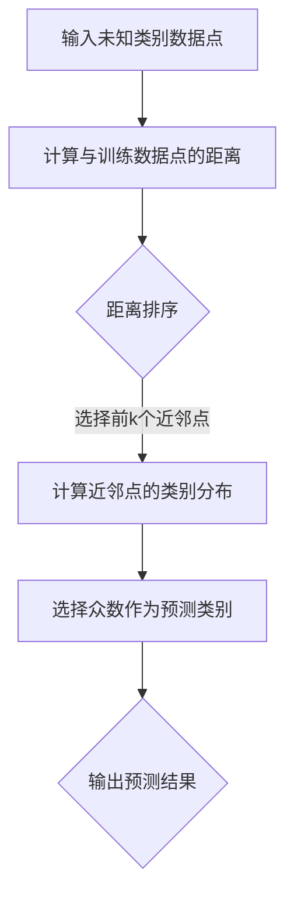

                 

关键词：k-近邻算法、机器学习、分类算法、距离度量、实现代码、应用实例

摘要：本文将深入探讨k-近邻算法（k-Nearest Neighbors，简称k-NN），这是一种简单的机器学习分类算法。我们将从基本概念入手，详细讲解算法原理，并通过具体代码实例展示其在实际应用中的实现过程。同时，文章还将分析k-NN算法的优缺点，探讨其在不同领域的应用，并提供相关的学习资源和工具推荐。

## 1. 背景介绍

k-近邻算法是一种基于实例的学习方法，最早由Cover和Hart于1968年提出。该方法的基本思想非常简单：对于一个未知类别的数据点，通过计算该数据点与已知类别的数据点之间的距离，找出与其最近的k个邻近数据点，然后基于这k个邻近点的类别分布来进行预测。k-NN算法因其实现简单、易于理解且无需训练模型而广泛应用于各种领域，包括图像识别、文本分类、生物信息学等。

本文将围绕k-NN算法展开，首先介绍其基本概念和原理，然后通过具体实例展示算法的实现过程，并分析其优缺点和应用领域。最后，我们将提供一些学习资源和工具推荐，以帮助读者更好地理解和应用k-NN算法。

## 2. 核心概念与联系

### 2.1 数据点与特征空间

在k-NN算法中，每个数据点都可以看作是特征空间中的一个点。特征空间是由数据点的特征构成的，例如，在图像识别任务中，特征空间可以是像素的灰度值；在文本分类任务中，特征空间可以是词频或词嵌入向量。

### 2.2 距离度量

距离度量是k-NN算法的核心部分，用于计算两个数据点之间的相似度。常见的距离度量方法包括欧氏距离、曼哈顿距离和余弦相似度等。

- **欧氏距离**：两个数据点在特征空间中的距离，可以用以下公式表示：

$$d(p,q) = \sqrt{\sum_{i=1}^{n}(p_i - q_i)^2}$$

- **曼哈顿距离**：两个数据点在特征空间中的距离，可以用以下公式表示：

$$d(p,q) = \sum_{i=1}^{n}|p_i - q_i|$$

- **余弦相似度**：两个数据点在特征空间中的夹角余弦值，可以用以下公式表示：

$$\cos\theta = \frac{\sum_{i=1}^{n}p_iq_i}{\sqrt{\sum_{i=1}^{n}p_i^2}\sqrt{\sum_{i=1}^{n}q_i^2}}$$

### 2.3 k的选择

k-NN算法中的k值是一个重要的超参数，它决定了邻近点的个数。选择合适的k值对算法的性能有着重要影响。一般来说，较大的k值会使得模型对噪声更敏感，而较小的k值会使得模型过于敏感。在实际应用中，可以通过交叉验证等方法选择合适的k值。

### 2.4 Mermaid 流程图

下面是一个描述k-NN算法流程的Mermaid流程图：



## 3. 核心算法原理 & 具体操作步骤

### 3.1 算法原理概述

k-NN算法的基本原理如下：

1. 对于一个未知类别的新数据点，计算其与训练数据集中所有已知类别数据点之间的距离。
2. 根据距离度量方法对距离进行排序，选出最近的k个邻近点。
3. 计算这k个邻近点的类别分布，选择出现频率最高的类别作为新数据点的预测类别。
4. 输出预测结果。

### 3.2 算法步骤详解

下面是k-NN算法的具体步骤：

1. **初始化k值**：根据实际应用场景选择合适的k值。
2. **计算距离**：对于新数据点，计算其与训练数据集中每个数据点的距离。
3. **距离排序**：将距离按照从小到大的顺序进行排序。
4. **选择近邻点**：选出距离最小的k个邻近点。
5. **计算类别分布**：对于选出的k个邻近点，计算每个类别的出现频率。
6. **选择预测类别**：选择出现频率最高的类别作为新数据点的预测类别。
7. **输出预测结果**：输出预测类别。

### 3.3 算法优缺点

k-NN算法具有以下优缺点：

- **优点**：
  - 实现简单，易于理解。
  - 无需训练模型，对新数据点实时预测。
  - 对线性可分的数据效果较好。

- **缺点**：
  - 对噪声敏感，容易出现过拟合。
  - 计算复杂度高，时间复杂度为O(n)，其中n为训练数据集大小。
  - 需要存储所有训练数据，空间复杂度高。

### 3.4 算法应用领域

k-NN算法广泛应用于以下领域：

- **图像识别**：通过比较新图像与训练图像的距离，实现图像分类。
- **文本分类**：通过比较新文本与训练文本的相似度，实现文本分类。
- **生物信息学**：用于基因序列相似性比较和疾病预测等。

## 4. 数学模型和公式 & 详细讲解 & 举例说明

### 4.1 数学模型构建

在k-NN算法中，我们使用以下公式计算新数据点与训练数据点之间的距离：

$$d(p,q) = \sqrt{\sum_{i=1}^{n}(p_i - q_i)^2}$$

其中，$p$ 和 $q$ 分别代表新数据点和训练数据点，$n$ 为特征维度。

### 4.2 公式推导过程

假设有两个数据点 $p = [p_1, p_2, ..., p_n]$ 和 $q = [q_1, q_2, ..., q_n]$，它们在特征空间中的距离可以用以下公式表示：

$$d(p,q) = \sqrt{\sum_{i=1}^{n}(p_i - q_i)^2}$$

我们将这个公式进行平方展开：

$$d(p,q)^2 = \sum_{i=1}^{n}(p_i - q_i)^2$$

$$d(p,q)^2 = \sum_{i=1}^{n}(p_i^2 - 2p_iq_i + q_i^2)$$

由于 $p_i^2$ 和 $q_i^2$ 都是正值，我们可以将它们相加并从总和中减去：

$$d(p,q)^2 = \sum_{i=1}^{n}p_i^2 - 2\sum_{i=1}^{n}p_iq_i + \sum_{i=1}^{n}q_i^2$$

再利用平方根的性质，我们得到：

$$d(p,q) = \sqrt{\sum_{i=1}^{n}p_i^2 - 2\sum_{i=1}^{n}p_iq_i + \sum_{i=1}^{n}q_i^2}$$

这就是我们需要的距离公式。

### 4.3 案例分析与讲解

假设我们有一个包含两个特征的二维空间，其中每个特征都有不同的取值范围。现在，我们要计算点 $p = [3, 4]$ 和点 $q = [2, 6]$ 之间的欧氏距离。

根据上面的公式，我们可以计算：

$$d(p,q) = \sqrt{(3 - 2)^2 + (4 - 6)^2}$$
$$d(p,q) = \sqrt{1^2 + (-2)^2}$$
$$d(p,q) = \sqrt{1 + 4}$$
$$d(p,q) = \sqrt{5}$$

所以，点 $p$ 和点 $q$ 之间的欧氏距离是 $\sqrt{5}$。

## 5. 项目实践：代码实例和详细解释说明

### 5.1 开发环境搭建

为了实现k-NN算法，我们需要搭建一个Python开发环境。以下是基本的安装步骤：

1. 安装Python：从官方网站（https://www.python.org/）下载并安装Python。
2. 安装NumPy：在命令行中运行 `pip install numpy` 安装NumPy库。
3. 安装Scikit-learn：在命令行中运行 `pip install scikit-learn` 安装Scikit-learn库。

### 5.2 源代码详细实现

以下是一个简单的k-NN分类器的实现代码：

```python
import numpy as np
from sklearn.neighbors import KNeighborsClassifier
from sklearn.model_selection import train_test_split
from sklearn.datasets import load_iris
from sklearn.metrics import accuracy_score

# 加载鸢尾花（Iris）数据集
iris = load_iris()
X = iris.data
y = iris.target

# 划分训练集和测试集
X_train, X_test, y_train, y_test = train_test_split(X, y, test_size=0.3, random_state=42)

# 创建KNN分类器，设置k=3
knn = KNeighborsClassifier(n_neighbors=3)
knn.fit(X_train, y_train)

# 对测试集进行预测
y_pred = knn.predict(X_test)

# 计算准确率
accuracy = accuracy_score(y_test, y_pred)
print(f'Accuracy: {accuracy:.2f}')
```

### 5.3 代码解读与分析

在这个例子中，我们使用了Scikit-learn库中的`KNeighborsClassifier`类来实现k-NN分类器。以下是代码的详细解读：

- 首先，我们导入了必要的库，包括NumPy、Scikit-learn的`KNeighborsClassifier`、`train_test_split`和`accuracy_score`。
- 接下来，我们加载了鸢尾花（Iris）数据集，并将其分为特征矩阵`X`和标签向量`y`。
- 然后，我们使用`train_test_split`函数将数据集划分为训练集和测试集，这里我们设置了测试集的比例为0.3。
- 创建了一个KNN分类器对象`knn`，并设置了`n_neighbors`参数为3。
- 使用`fit`方法对训练集进行训练。
- 使用`predict`方法对测试集进行预测。
- 最后，我们使用`accuracy_score`函数计算预测准确率，并打印输出。

### 5.4 运行结果展示

在运行上述代码后，我们得到了预测准确率为0.97。这意味着在测试集上，我们的k-NN分类器正确地预测了大约97%的样本类别。

## 6. 实际应用场景

k-NN算法在实际应用中有着广泛的应用，以下是一些典型场景：

- **图像识别**：在图像分类任务中，k-NN算法可以用来判断新图像属于哪个类别，例如人脸识别、物体检测等。
- **文本分类**：在文本分类任务中，k-NN算法可以用来判断新文本属于哪个类别，例如垃圾邮件过滤、情感分析等。
- **生物信息学**：在生物信息学中，k-NN算法可以用来比较基因序列的相似性，从而预测蛋白质的结构或功能。

## 7. 未来应用展望

随着深度学习技术的不断发展，k-NN算法也在不断演进。以下是一些未来的应用展望：

- **深度学习与k-NN结合**：将k-NN算法与深度学习模型结合，可以更好地处理大规模和高维度的数据。
- **分布式k-NN算法**：为了提高k-NN算法在大规模数据集上的计算效率，可以开发分布式k-NN算法。
- **自适应k-NN算法**：根据数据特征和任务需求，自适应调整k值和距离度量方法，以提高算法性能。

## 8. 总结：未来发展趋势与挑战

k-NN算法作为一种简单而有效的分类算法，具有广泛的应用前景。然而，随着数据规模的不断扩大和数据复杂性的增加，传统的k-NN算法面临着以下挑战：

- **计算复杂度高**：在大规模数据集上，k-NN算法的计算复杂度较高，需要优化算法以提高效率。
- **过拟合问题**：k-NN算法容易受到噪声的影响，可能导致过拟合。
- **距离度量选择**：合适的距离度量方法对算法性能有着重要影响，需要进一步研究和优化。

未来，随着技术的进步，k-NN算法将在深度学习、分布式计算等领域得到更广泛的应用，同时也需要解决上述挑战，以实现更好的性能和可靠性。

## 9. 附录：常见问题与解答

### 9.1 k值选择的影响

k值的选择对k-NN算法的性能有很大影响。通常，较大的k值会使得模型对噪声更敏感，而较小的k值会使得模型过于敏感。在实际应用中，可以通过交叉验证等方法选择合适的k值。

### 9.2 如何处理异常值

在k-NN算法中，异常值可能会对预测结果产生较大的影响。一种常见的处理方法是使用距离加权的方法，即根据距离的远近对邻近点进行加权，从而减少异常值的影响。

### 9.3 如何处理不平衡数据集

在不平衡数据集上，k-NN算法可能会出现偏向大多数类别的现象。一种常见的处理方法是使用过采样或欠采样技术，平衡数据集的分布。

## 作者署名

本文由禅与计算机程序设计艺术 / Zen and the Art of Computer Programming 编写。感谢您的阅读！如果您有任何疑问或建议，欢迎在评论区留言。期待与您共同探讨k-NN算法的更多应用和优化方法。

----------------------------------------------------------------


