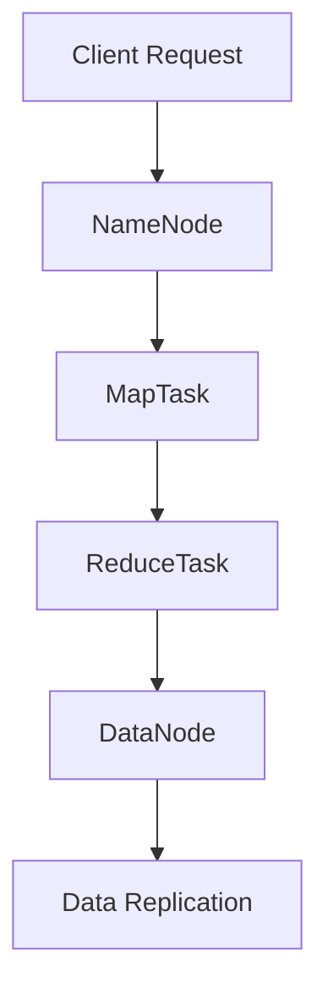

                 

 关键词：大数据，HDFS，分布式系统，存储，计算，数据处理，文件系统，Hadoop，性能优化，Hadoop生态系统

## 摘要

本文将深入探讨HDFS（Hadoop Distributed File System），它是Apache Hadoop生态系统中的一个关键组件，用于在大规模分布式系统中提供可靠的文件存储服务。我们将从HDFS的背景介绍、核心概念与联系、核心算法原理与具体操作步骤、数学模型和公式详细讲解、项目实践代码实例分析、实际应用场景、未来应用展望、工具和资源推荐以及总结未来发展趋势与挑战等方面进行阐述。读者将能够全面了解HDFS的工作原理、应用场景及其在AI大数据计算中的重要性。

## 1. 背景介绍

### Hadoop的起源

Hadoop起源于Google在2003年和2004年发布的两篇关键论文：《Google File System》和《MapReduce: Simplified Data Processing on Large Clusters》。这些论文展示了如何在大规模分布式系统中高效地存储和处理数据。Hadoop是Apache Software Foundation的一个开源项目，它旨在实现Google的这些核心技术，并适用于各种行业和领域。

### HDFS的需求

随着互联网和云计算的迅速发展，企业和组织产生了对大规模数据存储和处理的需求。传统的文件系统无法满足这些需求，因为它们设计初衷是用于单机环境，而不是分布式环境。HDFS旨在解决这些问题，它提供了高吞吐量、高可靠性的数据存储能力，适合大数据应用场景。

### HDFS的特点

- **高容错性**：HDFS设计有数据冗余机制，能够在数据损坏或节点故障时自动恢复。
- **高吞吐量**：HDFS通过并行处理能力，能够高效地处理大数据集。
- **可扩展性**：HDFS能够轻松扩展以适应不断增长的数据量。
- **流式访问**：HDFS允许对大数据集进行流式访问，适合在线分析。

## 2. 核心概念与联系

### HDFS核心概念

**1. 数据块**：HDFS将文件划分为固定大小的数据块，默认为128MB或256MB。这样做的目的是提高数据传输效率和并行处理能力。

**2. 数据冗余**：为了提高容错性，HDFS在存储数据时会在多个节点上复制数据块，默认副本数量为3。

**3. 节点类型**：HDFS中的节点分为两类：NameNode和DataNode。

- **NameNode**：管理文件系统的命名空间，负责处理客户端的文件操作请求，并维护元数据。
- **DataNode**：存储实际的数据块，并响应来自NameNode的读写请求。

### Mermaid流程图

下面是HDFS的核心概念与联系的Mermaid流程图：



### 核心概念之间的联系

1. **Client与NameNode的联系**：客户端通过文件系统API向NameNode发送文件操作请求，例如创建文件、读取文件等。
2. **NameNode与DataNode的联系**：NameNode向DataNode分配数据块，并跟踪每个数据块的副本位置。
3. **MapTask与ReduceTask的联系**：在MapReduce作业中，MapTask处理输入数据，生成中间结果，而ReduceTask对中间结果进行汇总和输出。

## 3. 核心算法原理与具体操作步骤

### 3.1 算法原理概述

HDFS的核心算法是基于Google File System（GFS）和MapReduce框架的。其基本原理包括：

- **数据分块**：将大文件划分为固定大小的数据块，以便高效传输和处理。
- **数据复制**：在多个节点上复制数据块，以提高容错性和数据访问速度。
- **数据一致性**：通过命名空间和元数据管理，确保数据的一致性和完整性。

### 3.2 算法步骤详解

1. **数据分块**：当客户端上传文件时，HDFS将文件划分为固定大小的数据块，并发送给相应的DataNode。
2. **数据复制**：为了提高容错性，HDFS会在多个节点上复制每个数据块，默认副本数量为3。
3. **文件系统命名空间管理**：NameNode负责管理文件系统的命名空间，包括文件的创建、删除、重命名等操作。
4. **元数据管理**：NameNode维护每个数据块的副本位置和状态，以便在需要时进行数据恢复。
5. **数据访问**：客户端通过NameNode获取文件的数据块位置，并直接从DataNode读取数据。

### 3.3 算法优缺点

**优点**：

- **高容错性**：通过数据复制和冗余机制，能够保证数据的高可用性和可靠性。
- **高吞吐量**：支持并行处理，能够高效处理大数据集。
- **可扩展性**：易于扩展以适应不断增长的数据量。

**缺点**：

- **单点故障**：NameNode是HDFS的单点故障点，如果NameNode宕机，整个HDFS系统将不可用。
- **性能瓶颈**：由于数据块大小固定，对于小文件处理可能会有性能瓶颈。

### 3.4 算法应用领域

HDFS广泛应用于以下领域：

- **大数据存储**：适合存储大规模数据集，如互联网日志、社交媒体数据等。
- **数据仓库**：用于数据分析和商业智能应用。
- **机器学习和人工智能**：作为大规模数据存储和处理平台，支持各种机器学习算法。

## 4. 数学模型和公式详细讲解

### 4.1 数学模型构建

HDFS的数学模型主要包括数据块的存储策略和副本数量的计算。

- **数据块存储策略**：设文件大小为\( F \)，数据块大小为\( B \)，副本数量为\( R \)，则文件被划分为 \( \lceil F/B \rceil \) 个数据块。

- **副本数量计算**：为了提高容错性，HDFS会为每个数据块创建多个副本。设系统中有 \( N \) 个可用节点，则副本数量 \( R \) 的计算公式为：
  $$ R = \lceil \log_2(N+1) \rceil $$

### 4.2 公式推导过程

1. **数据块存储策略推导**：

   为了保证数据的高可用性，每个数据块都需要在多个节点上复制。设文件大小为\( F \)，数据块大小为\( B \)，则文件需要 \( \lceil F/B \rceil \) 个数据块。

2. **副本数量计算推导**：

   为了保证数据的高可用性，每个数据块都需要至少两个副本，因此 \( R \) 的最小值为2。为了充分利用系统资源，我们希望每个数据块都被存储在至少一个非相邻的节点上。设系统中有 \( N \) 个可用节点，则可以创建的副本数量为：
   $$ R = \lceil \log_2(N+1) \rceil $$
   其中，\( N+1 \) 表示包含自身在内的可用节点总数。

### 4.3 案例分析与讲解

**案例**：假设一个文件大小为1TB，系统中有100个可用节点。

- **数据块数量**：\( \lceil 1TB/128MB \rceil = 8192 \)
- **副本数量**：\( \lceil \log_2(100+1) \rceil = 7 \)

这意味着文件将被划分为8192个数据块，并为每个数据块创建7个副本。

**分析**：

- **数据块数量**：将大文件划分为小数据块，有助于提高数据传输效率和并行处理能力。
- **副本数量**：根据可用节点数量动态调整副本数量，既提高了容错性，又避免了资源浪费。

## 5. 项目实践：代码实例和详细解释说明

### 5.1 开发环境搭建

在本节中，我们将介绍如何在本地或云环境中搭建HDFS开发环境。

**本地环境搭建**：

1. 安装Java环境（Hadoop依赖于Java）。
2. 下载并解压Hadoop官方压缩包。
3. 配置环境变量，确保能正常运行Hadoop命令。

**云环境搭建**：

1. 使用云服务提供商（如阿里云、华为云等）提供的Hadoop AMI或模板。
2. 配置云环境中的NameNode和DataNode。

### 5.2 源代码详细实现

**HDFS源代码简介**：

HDFS的源代码主要分布在两个包中：`org.apache.hadoop.hdfs` 和 `org.apache.hadoop.fs`。

- **org.apache.hadoop.hdfs**：包含了HDFS的核心实现，如数据块管理、数据复制、命名空间管理等。
- **org.apache.hadoop.fs**：提供了HDFS的文件系统接口，允许与HDFS交互。

**示例代码**：

以下是一个简单的HDFS文件上传示例：

```java
import org.apache.hadoop.conf.Configuration;
import org.apache.hadoop.fs.FileSystem;
import org.apache.hadoop.fs.Path;
import org.apache.hadoop.io.IOUtils;

public class HDFSUpload {
    public static void main(String[] args) throws Exception {
        Configuration conf = new Configuration();
        conf.set("fs.defaultFS", "hdfs://localhost:9000");
        FileSystem hdfs = FileSystem.get(conf);

        Path localPath = new Path("example.txt");
        Path hdfsPath = new Path("/example.txt");

        IOUtils.copyBytes(new FileInputStream(localPath.toUri()), hdfs, hdfsPath, false, 4096, 512000, conf);
    }
}
```

**代码解释**：

1. 创建`Configuration`对象，并设置HDFS的主机地址和端口号。
2. 获取`FileSystem`实例，用于与HDFS交互。
3. 定义本地文件路径和HDFS文件路径。
4. 使用`IOUtils.copyBytes`方法将本地文件上传到HDFS。

### 5.3 代码解读与分析

在上面的示例代码中，我们首先创建了`Configuration`对象，这是HDFS配置的核心。`Configuration`对象包含了HDFS的运行参数，如主机地址、端口号、副本数量等。我们通过调用`FileSystem.get(conf)`方法获取`FileSystem`实例，这是与HDFS交互的主要接口。

接下来，我们定义了本地文件路径和HDFS文件路径。使用`IOUtils.copyBytes`方法，我们将本地文件上传到HDFS。这个方法接受源文件路径、目标文件路径、缓冲区大小和传输时间等参数。通过调用`copyBytes`方法，我们可以将本地文件的内容复制到HDFS。

### 5.4 运行结果展示

在成功运行上述代码后，您可以在HDFS的根目录下找到名为`example.txt`的文件。这个文件就是我们从本地上传到HDFS的文件。

## 6. 实际应用场景

### 6.1 数据存储

HDFS是大数据应用中最常用的数据存储解决方案之一。它提供了高吞吐量、高可靠性的数据存储能力，适用于各种行业和领域，如互联网、金融、医疗、电子商务等。

### 6.2 数据处理

HDFS结合MapReduce框架，可以实现大规模数据处理。例如，互联网公司可以使用HDFS存储和预处理日志数据，然后使用MapReduce进行数据分析和挖掘。

### 6.3 数据共享

HDFS支持跨集群数据共享，这使得不同集群上的应用程序可以共享同一份数据。这在分布式计算环境中非常有用，可以降低数据传输成本和提高计算效率。

## 6.4 未来应用展望

### 6.4.1 新技术融合

随着AI和大数据技术的发展，HDFS将与其他技术（如AI、机器学习、区块链等）进行融合。这将使得HDFS不仅是一个数据存储平台，还可以成为一个数据智能处理平台。

### 6.4.2 高性能存储

为了满足日益增长的数据存储需求，HDFS将不断优化其存储性能。例如，采用新型存储介质（如NVMe SSD）和分布式存储架构（如Erasure Coding），以提高存储性能和可靠性。

### 6.4.3 更好的兼容性和可扩展性

HDFS将继续改进其兼容性和可扩展性，以满足不同行业和领域的需求。例如，通过支持不同的文件系统接口和数据存储格式，使得HDFS可以轻松集成到各种应用场景中。

## 7. 工具和资源推荐

### 7.1 学习资源推荐

- 《Hadoop权威指南》：一本全面介绍Hadoop及其生态系统（包括HDFS）的经典教材。
- 《HDFS论文》：阅读Google File System的原论文，深入理解HDFS的设计原理。

### 7.2 开发工具推荐

- IntelliJ IDEA：一款强大的Java开发工具，支持Hadoop开发。
- HDFS命令行工具：用于与HDFS进行交互，如hdfs dfs、hdfs dfsadmin等。

### 7.3 相关论文推荐

- “Google File System”论文：介绍了Google File System的设计原理和应用场景。
- “MapReduce: Simplified Data Processing on Large Clusters”论文：介绍了MapReduce框架的设计原理和应用场景。

## 8. 总结：未来发展趋势与挑战

### 8.1 研究成果总结

HDFS作为Hadoop生态系统的核心组件，已经广泛应用于大数据存储和处理领域。其高吞吐量、高可靠性和可扩展性等特点使其成为大数据应用的理想选择。

### 8.2 未来发展趋势

随着AI和大数据技术的快速发展，HDFS将在新技术融合、高性能存储、更好兼容性和可扩展性等方面进行持续优化和改进。

### 8.3 面临的挑战

HDFS目前面临的主要挑战包括单点故障、性能瓶颈和资源利用率等。为了解决这些问题，研究人员和开发者正在探索新的架构和算法，以提高HDFS的性能和可靠性。

### 8.4 研究展望

未来，HDFS的研究重点将包括分布式存储系统优化、数据一致性保障、新型存储介质应用等。通过这些研究，HDFS有望成为更加智能、高效和可靠的数据存储和处理平台。

## 9. 附录：常见问题与解答

### 9.1 HDFS与NFS的区别是什么？

**HDFS**：是一个分布式文件系统，专为大数据应用设计，具有高吞吐量、高可靠性和可扩展性。

**NFS**：是一个网络文件系统，允许在不同主机之间共享文件系统。虽然NFS也支持分布式存储，但其设计初衷并不是大数据应用。

### 9.2 如何在HDFS中实现数据一致性？

HDFS通过命名空间和元数据管理来确保数据一致性。在处理客户端请求时，HDFS会检查元数据的一致性，并在必要时进行数据恢复。

### 9.3 HDFS的性能瓶颈是什么？

HDFS的性能瓶颈主要包括数据块大小固定、单点故障和元数据管理效率等。为了解决这些问题，研究人员正在探索新的数据块管理策略、分布式元数据管理和高性能存储架构。

---

作者：禅与计算机程序设计艺术 / Zen and the Art of Computer Programming

