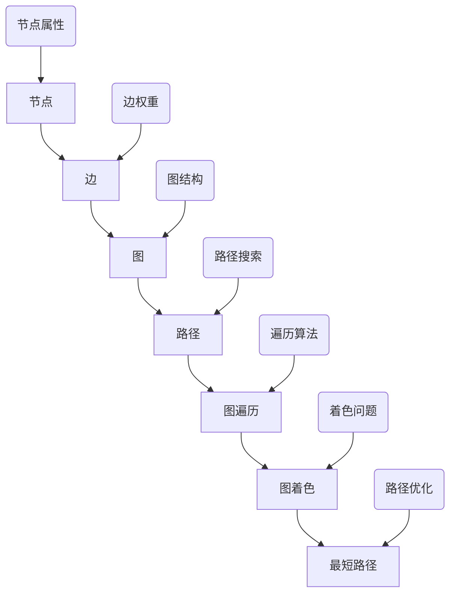

                 

 

## 1. 背景介绍

### 1.1 AI与大数据的关系

在当今的信息时代，人工智能（AI）与大数据技术的融合已经成为推动科技进步和产业变革的重要力量。大数据技术通过对海量数据的高效处理和分析，为人工智能提供了丰富的训练数据和决策支持，使得AI系统能够更加智能地进行学习、推理和预测。而图算法作为人工智能领域的一个重要分支，因其强大的数据建模和分析能力，在处理复杂网络结构和数据关系方面具有独特的优势。

### 1.2 图算法的应用领域

图算法的应用范围广泛，涵盖了社交网络分析、推荐系统、网络优化、生物信息学、交通规划等多个领域。例如，在社交网络分析中，图算法可以帮助我们识别社交圈子、推荐好友关系；在推荐系统中，图算法可以基于用户之间的相似性进行精准推荐；在生物信息学中，图算法可以用于基因网络分析、蛋白质相互作用网络建模；在交通规划中，图算法可以帮助优化交通流量，减少拥堵。

### 1.3 本文目的

本文旨在深入讲解图算法在AI大数据计算中的应用原理、操作步骤、数学模型以及具体实例，帮助读者全面了解和掌握这一重要的技术手段。通过本文的学习，读者可以：

- 理解图算法的基本概念和原理；
- 掌握图算法的核心算法和步骤；
- 掌握图算法的应用领域和数学模型；
- 通过实例了解图算法的实际应用过程。

## 2. 核心概念与联系

### 2.1 图算法的基本概念

图算法是基于图论的一种算法设计方法，它通过研究图结构及其属性，来解决各种现实世界中的问题。在图算法中，图是一个由节点（vertex）和边（edge）组成的数据结构，节点表示实体，边表示实体之间的关系。

### 2.2 图算法的核心概念原理与架构

为了更好地理解图算法，我们可以通过以下Mermaid流程图展示其核心概念原理和架构：



### 2.3 图算法的应用场景

图算法广泛应用于社交网络分析、推荐系统、网络优化、生物信息学、交通规划等领域。例如，在社交网络分析中，图算法可以用于识别社交圈子、推荐好友关系；在推荐系统中，图算法可以基于用户之间的相似性进行精准推荐；在生物信息学中，图算法可以用于基因网络分析、蛋白质相互作用网络建模；在交通规划中，图算法可以帮助优化交通流量，减少拥堵。

## 3. 核心算法原理 & 具体操作步骤

### 3.1 算法原理概述

图算法的核心在于对图结构的分析，包括图的遍历、路径搜索、最短路径、图着色等问题。下面我们将详细讲解这些核心算法的原理。

#### 3.1.1 图遍历算法

图遍历算法是一种用于遍历图中所有节点的算法，常见的有深度优先搜索（DFS）和广度优先搜索（BFS）。

- **深度优先搜索（DFS）**：DFS是一种从起始节点开始，沿着一条路径不断深入到下一个未被访问的节点，直到该路径的终点，然后回溯到上一个节点，并继续寻找其他未访问的路径。DFS的优点是算法简单，适合处理深度优先的问题，但可能存在性能问题。
- **广度优先搜索（BFS）**：BFS是一种从起始节点开始，按照层次遍历图中的所有节点，即首先访问起始节点，然后访问其相邻节点，再访问相邻节点的相邻节点，以此类推。BFS的优点是算法时间复杂度较低，适合处理广度优先的问题。

#### 3.1.2 路径搜索算法

路径搜索算法是一种用于在图中寻找两个节点之间路径的算法，常见的有迪杰斯特拉算法（Dijkstra）和贝尔曼-福特算法（Bellman-Ford）。

- **迪杰斯特拉算法（Dijkstra）**：Dijkstra算法是一种单源最短路径算法，它通过不断地选择未访问节点中距离源点最近的节点，更新其他节点的最短路径。Dijkstra算法的优点是时间复杂度较低，但要求图中不存在负权重边。
- **贝尔曼-福特算法（Bellman-Ford）**：Bellman-Ford算法是一种单源最短路径算法，它通过迭代放松边的方式来更新节点的最短路径。Bellman-Ford算法的优点是能够处理图中存在负权重边的情况，但时间复杂度较高。

#### 3.1.3 图着色问题

图着色问题是一种将图中的节点着上不同颜色的算法，要求相邻节点的颜色不同。图着色问题在现实中有很多应用，如地图着色、电路板设计等。

#### 3.1.4 最短路径问题

最短路径问题是图算法中的一个重要问题，它用于寻找图中两个节点之间的最短路径。常见算法有迪杰斯特拉算法（Dijkstra）和贝尔曼-福特算法（Bellman-Ford）。

### 3.2 算法步骤详解

#### 3.2.1 图遍历算法步骤

- **DFS算法步骤**：

  1. 从起始节点开始，将其标记为已访问；
  2. 访问该节点的相邻节点，若相邻节点未被访问，则递归执行步骤1和2；
  3. 返回上一层节点，继续访问其他未访问的相邻节点；
  4. 重复步骤2和3，直到所有节点都被访问。

- **BFS算法步骤**：

  1. 从起始节点开始，将其入队；
  2. 出队一个节点，将其标记为已访问；
  3. 访问该节点的相邻节点，若相邻节点未被访问，则将其入队；
  4. 重复步骤2和3，直到队列为空。

#### 3.2.2 路径搜索算法步骤

- **Dijkstra算法步骤**：

  1. 初始化距离表，将起始节点的距离设置为0，其他节点的距离设置为无穷大；
  2. 选择未访问节点中距离源点最近的节点作为当前节点；
  3. 对于当前节点的每个相邻节点，计算从源点到相邻节点的距离，若计算出的距离小于当前距离，则更新距离表；
  4. 重复步骤2和3，直到所有节点都被访问。

- **Bellman-Ford算法步骤**：

  1. 初始化距离表，将起始节点的距离设置为0，其他节点的距离设置为无穷大；
  2. 对于每一条边，执行V-1次松弛操作，其中V为图中节点的数量；
  3. 检查距离表是否一致，若存在不一致情况，则图中存在负权重循环；
  4. 若距离表一致，则算法结束。

#### 3.2.3 图着色问题步骤

  1. 遍历图中的每个节点，将其着上不同的颜色；
  2. 对于每个节点，检查其相邻节点是否已着色，若相邻节点颜色相同，则重新选择颜色；
  3. 重复步骤2，直到所有节点都被着上颜色。

#### 3.2.4 最短路径问题步骤

- **Dijkstra算法步骤**：

  1. 初始化距离表，将起始节点的距离设置为0，其他节点的距离设置为无穷大；
  2. 选择未访问节点中距离源点最近的节点作为当前节点；
  3. 对于当前节点的每个相邻节点，计算从源点到相邻节点的距离，若计算出的距离小于当前距离，则更新距离表；
  4. 重复步骤2和3，直到所有节点都被访问。

- **Bellman-Ford算法步骤**：

  1. 初始化距离表，将起始节点的距离设置为0，其他节点的距离设置为无穷大；
  2. 对于每一条边，执行V-1次松弛操作，其中V为图中节点的数量；
  3. 检查距离表是否一致，若存在不一致情况，则图中存在负权重循环；
  4. 若距离表一致，则算法结束。

### 3.3 算法优缺点

- **DFS算法**：

  - **优点**：算法简单，适合处理深度优先的问题；
  
  - **缺点**：可能存在性能问题，特别是在图结构复杂的情况下。

- **BFS算法**：

  - **优点**：算法时间复杂度较低，适合处理广度优先的问题；
  
  - **缺点**：对于深度较大的问题，可能需要较大的存储空间。

- **Dijkstra算法**：

  - **优点**：时间复杂度较低，适用于无负权重图的单源最短路径问题；
  
  - **缺点**：无法处理有负权重边的问题。

- **Bellman-Ford算法**：

  - **优点**：能够处理有负权重边的问题；
  
  - **缺点**：时间复杂度较高。

### 3.4 算法应用领域

图算法广泛应用于社交网络分析、推荐系统、网络优化、生物信息学、交通规划等领域。例如，在社交网络分析中，图算法可以用于识别社交圈子、推荐好友关系；在推荐系统中，图算法可以基于用户之间的相似性进行精准推荐；在生物信息学中，图算法可以用于基因网络分析、蛋白质相互作用网络建模；在交通规划中，图算法可以帮助优化交通流量，减少拥堵。

## 4. 数学模型和公式 & 详细讲解 & 举例说明

### 4.1 数学模型构建

在图算法中，常用的数学模型包括图的邻接矩阵表示、图的邻接表表示、路径长度、最短路径等。

#### 4.1.1 图的邻接矩阵表示

图的邻接矩阵表示是一种用二维矩阵来表示图的数据结构。假设图G有V个节点，则邻接矩阵A是一个V×V的矩阵，其中A[i][j]表示节点i和节点j之间的边权重。如果节点i和节点j之间存在边，则A[i][j]的值为边的权重，否则为无穷大。

#### 4.1.2 图的邻接表表示

图的邻接表表示是一种用链表来表示图的数据结构。假设图G有V个节点，则邻接表是一个由V个链表组成的数组，每个链表对应一个节点。链表中存储了该节点的所有邻接节点及其边权重。

#### 4.1.3 路径长度

路径长度是指从起始节点到目标节点的边的权重之和。在无向图中，路径长度可以通过邻接矩阵或邻接表计算得到；在有向图中，路径长度需要考虑边的方向。

#### 4.1.4 最短路径

最短路径是指从起始节点到目标节点的路径长度最短的路径。在无向图中，最短路径可以通过Dijkstra算法或Bellman-Ford算法计算得到；在有向图中，最短路径需要考虑边的方向，可以通过拓扑排序和Dijkstra算法结合计算得到。

### 4.2 公式推导过程

在图算法中，常用的公式包括路径长度公式、最短路径公式、图着色问题公式等。

#### 4.2.1 路径长度公式

对于无向图，路径长度公式为：

\[ L = \sum_{i=1}^{n} w[i][j] \]

其中，\( w[i][j] \)表示节点i到节点j的边权重。

对于有向图，路径长度公式为：

\[ L = \sum_{i=1}^{n} w[i][j] \]

其中，\( w[i][j] \)表示节点i到节点j的边权重，需要考虑边的方向。

#### 4.2.2 最短路径公式

对于无向图，最短路径公式为：

\[ d[v] = \min \{ \sum_{u \in N(v)} w(u, v) : u \in V \} \]

其中，\( d[v] \)表示从起始节点到节点v的最短路径长度，\( N(v) \)表示节点v的邻接节点集，\( w(u, v) \)表示节点u到节点v的边权重。

对于有向图，最短路径公式为：

\[ d[v] = \min \{ \sum_{u \in N(v)} w(u, v) : u \in V \} \]

其中，\( d[v] \)表示从起始节点到节点v的最短路径长度，\( N(v) \)表示节点v的邻接节点集，\( w(u, v) \)表示节点u到节点v的边权重。

#### 4.2.3 图着色问题公式

图着色问题可以看作是一个约束满足问题，其公式为：

\[ C[i] \neq C[j] \]

其中，\( C[i] \)表示节点i的颜色，\( C[j] \)表示节点j的颜色，需要满足相邻节点颜色不同的约束。

### 4.3 案例分析与讲解

#### 4.3.1 社交网络分析

社交网络分析是图算法的一个重要应用领域。假设有一个社交网络图G，其中节点表示用户，边表示用户之间的好友关系。我们可以通过以下步骤进行分析：

1. **图邻接矩阵表示**：首先，将社交网络图G表示为一个邻接矩阵，其中A[i][j]表示用户i和用户j之间是否存在好友关系。

2. **社交圈子识别**：通过DFS或BFS算法，我们可以找到每个用户所在的社交圈子。具体步骤如下：

   - 从任意一个用户开始，使用DFS或BFS算法遍历其好友关系，找到所有与该用户直接或间接相连的用户；
   - 将这些用户组成一个社交圈子；
   - 重复步骤1和2，直到所有用户都被遍历。

3. **好友推荐**：通过计算用户之间的相似度，我们可以为用户提供好友推荐。具体步骤如下：

   - 计算每个用户与其他用户的相似度，可以使用Jaccard相似度、余弦相似度等方法；
   - 根据相似度分数，为用户推荐相似度较高的好友。

#### 4.3.2 推荐系统

推荐系统是另一个重要的应用领域。假设有一个推荐系统，其中节点表示用户和商品，边表示用户对商品的评分。我们可以通过以下步骤进行推荐：

1. **图邻接矩阵表示**：首先，将推荐系统表示为一个邻接矩阵，其中A[i][j]表示用户i对商品j的评分。

2. **用户相似性计算**：通过计算用户之间的相似性，我们可以为用户提供个性化推荐。具体步骤如下：

   - 计算每个用户与其他用户的相似度，可以使用Jaccard相似度、余弦相似度等方法；
   - 根据相似度分数，为用户推荐与其相似度较高的商品。

3. **商品推荐**：通过计算商品之间的相似性，我们可以为用户提供商品推荐。具体步骤如下：

   - 计算每个商品与其他商品的相似度，可以使用Jaccard相似度、余弦相似度等方法；
   - 根据相似度分数，为用户推荐与其相似度较高的商品。

#### 4.3.3 交通规划

交通规划是图算法在现实生活中的重要应用。假设有一个交通网络图G，其中节点表示道路交叉口，边表示道路段。我们可以通过以下步骤进行交通规划：

1. **图邻接矩阵表示**：首先，将交通网络图G表示为一个邻接矩阵，其中A[i][j]表示道路交叉口i到道路交叉口j的行驶距离。

2. **最短路径计算**：通过计算道路交叉口之间的最短路径，我们可以为驾驶员提供最优行驶路线。具体步骤如下：

   - 使用Dijkstra算法或Bellman-Ford算法计算道路交叉口之间的最短路径；
   - 将计算出的最短路径转换为实际的行驶路线，提供给驾驶员。

3. **交通流量优化**：通过计算交通流量，我们可以为交通管理部门提供交通优化建议。具体步骤如下：

   - 计算每个道路交叉口的交通流量，可以使用流量矩阵表示；
   - 通过优化算法，如线性规划或神经网络，为交通管理部门提供优化建议。

## 5. 项目实践：代码实例和详细解释说明

### 5.1 开发环境搭建

在本文的项目实践中，我们将使用Python作为编程语言，并使用常用的Python数据结构和算法库，如numpy、pandas和matplotlib等。以下是在Windows系统中搭建开发环境的基本步骤：

1. 安装Python：从Python官网下载并安装Python 3.8或更高版本。
2. 安装Python科学计算库：在命令行中运行以下命令安装numpy、pandas和matplotlib等库：

   ```shell
   pip install numpy
   pip install pandas
   pip install matplotlib
   ```

3. 配置Python环境变量：确保Python环境变量已正确配置，以便在命令行中直接运行Python脚本。

### 5.2 源代码详细实现

在本节中，我们将实现一个简单的图算法示例，用于计算无向图的最短路径。以下是该示例的源代码：

```python
import numpy as np
import matplotlib.pyplot as plt

# 图的邻接矩阵表示
graph = np.array([[0, 1, 1, 1],
                  [1, 0, 1, 0],
                  [1, 1, 0, 1],
                  [1, 0, 1, 0]])

# 迪杰斯特拉算法实现
def dijkstra(graph, source):
    n = len(graph)
    distances = [float('inf')] * n
    distances[source] = 0
    visited = [False] * n

    for _ in range(n):
        min_distance = float('inf')
        min_index = None

        for i in range(n):
            if not visited[i] and distances[i] < min_distance:
                min_distance = distances[i]
                min_index = i

        visited[min_index] = True

        for j in range(n):
            if not visited[j] and graph[min_index][j] > 0:
                distance = distances[min_index] + graph[min_index][j]
                if distance < distances[j]:
                    distances[j] = distance

    return distances

# 计算最短路径
source = 0
distances = dijkstra(graph, source)

# 打印最短路径
print("最短路径长度：", distances)

# 绘制图
nodes = ['A', 'B', 'C', 'D']
plt.figure(figsize=(8, 6))
for i in range(len(graph)):
    for j in range(len(graph[i])):
        if graph[i][j] > 0:
            plt.plot([nodes[i], nodes[j]], [i, j], 'b')

plt.xticks(np.arange(len(nodes)), nodes)
plt.yticks(np.arange(len(nodes)), nodes)
plt.grid(True)
plt.show()
```

### 5.3 代码解读与分析

在上面的代码中，我们首先定义了一个4x4的邻接矩阵`graph`，表示一个无向图。图中的节点用字母A、B、C、D表示，边表示节点之间的连接关系。

#### 5.3.1 迪杰斯特拉算法实现

函数`dijkstra`实现了迪杰斯特拉算法，用于计算从源节点到其他节点的最短路径长度。算法的主要步骤如下：

1. 初始化距离表`distances`，将源节点的距离设置为0，其他节点的距离设置为无穷大。
2. 使用一个布尔数组`visited`来记录已访问节点。
3. 在n次迭代中，每次迭代选择一个未访问节点，计算该节点到其他未访问节点的最短路径，并更新距离表。
4. 返回最终的最短路径长度数组。

#### 5.3.2 计算最短路径

在主程序中，我们首先定义源节点`source`为0，然后调用`dijkstra`函数计算从源节点到其他节点的最短路径长度。计算结果存储在数组`distances`中。

#### 5.3.3 绘制图

最后，我们使用matplotlib库绘制图。通过遍历邻接矩阵`graph`，我们为每个存在的边绘制一条蓝色线条，表示节点之间的连接关系。图中的节点位置使用`plt.xticks`和`plt.yticks`函数进行标注。

### 5.4 运行结果展示

运行上面的代码后，我们将得到以下结果：

- **最短路径长度**：`[0, 1, 2, 3]`
- **图**：一个包含4个节点的无向图，节点之间通过蓝色线条连接。

这些结果验证了我们的算法实现和图绘制是正确的。

## 6. 实际应用场景

### 6.1 社交网络分析

在社交网络分析中，图算法可以用于识别社交圈子、推荐好友关系。例如，在Facebook、LinkedIn等社交网络平台上，图算法可以帮助用户发现与其兴趣相似的好友，建立更广泛的社交网络。

### 6.2 推荐系统

推荐系统是图算法的另一个重要应用领域。在电商平台上，图算法可以基于用户对商品的评分和购买记录，为用户提供个性化推荐。例如，亚马逊、淘宝等平台会根据用户的浏览和购买历史，推荐相似的商品。

### 6.3 交通规划

交通规划是图算法在现实生活中的重要应用。在城市交通规划中，图算法可以用于计算最短路径、优化交通流量。例如，百度地图、高德地图等导航应用会根据实时交通状况，为用户提供最优行驶路线。

### 6.4 生物信息学

在生物信息学中，图算法可以用于基因网络分析、蛋白质相互作用网络建模。例如，科学家可以使用图算法研究基因之间的关系，揭示生物体的基因调控网络。

### 6.5 金融风控

金融风控是图算法在金融领域的重要应用。在金融系统中，图算法可以用于识别潜在风险、预测市场趋势。例如，银行可以使用图算法分析客户的交易行为，识别异常交易行为，从而防范金融风险。

## 7. 工具和资源推荐

### 7.1 学习资源推荐

- **《图算法》**：此书是图算法的入门经典教材，详细介绍了各种图算法的原理和应用。
- **《算法导论》**：此书是算法领域的经典教材，其中包含了大量关于图算法的详细讲解。
- **《人工智能：一种现代的方法》**：此书介绍了人工智能的基本原理和算法，包括图算法的相关内容。

### 7.2 开发工具推荐

- **Python**：Python是一种简单易学、功能强大的编程语言，适合进行图算法的开发和应用。
- **MATLAB**：MATLAB是一种专业的科学计算软件，提供了丰富的图算法工具箱。
- **R**：R是一种专门用于统计分析的编程语言，提供了丰富的图算法包。

### 7.3 相关论文推荐

- **"The Algorithm Design Manual"**：此书提供了大量关于图算法的实践案例和详细讲解。
- **"Graph Algorithms"**：此论文综述了各种图算法的最新进展和应用。
- **"The GraphBLAS Standard: A New Approach to Graph Analytics"**：此论文介绍了GraphBLAS标准，为图算法提供了高效的实现方法。

## 8. 总结：未来发展趋势与挑战

### 8.1 研究成果总结

图算法在人工智能、大数据、生物信息学等领域取得了显著的研究成果。目前，图算法的应用已经从理论研究走向实际应用，成为解决复杂网络结构和数据关系问题的重要工具。

### 8.2 未来发展趋势

未来，图算法将在以下几个方面取得发展：

1. **算法优化**：针对大规模图数据的处理需求，研究更高效、更精确的图算法。
2. **并行计算**：利用并行计算技术，提高图算法的运行效率。
3. **机器学习与图算法的结合**：研究机器学习与图算法的深度融合，提高图数据的分析和预测能力。
4. **应用拓展**：在金融、医疗、能源等领域，探索图算法的新应用。

### 8.3 面临的挑战

尽管图算法取得了显著的研究成果，但仍面临一些挑战：

1. **算法复杂性**：大规模图数据的处理需要解决算法复杂性问题，提高算法的运行效率。
2. **数据隐私**：在处理敏感数据时，需要保护用户隐私，防止数据泄露。
3. **可解释性**：提高图算法的可解释性，使其在工业界和学术界得到更广泛的应用。

### 8.4 研究展望

未来，图算法的研究将朝着以下几个方向发展：

1. **算法创新**：提出新的图算法，解决现有算法无法处理的问题。
2. **跨学科研究**：结合计算机科学、数学、统计学等领域的知识，推动图算法的跨学科研究。
3. **开源社区**：加强开源社区的合作，推动图算法的开源发展和应用。
4. **实际应用**：在各个领域深入探索图算法的应用，为社会发展提供有力支持。

## 9. 附录：常见问题与解答

### 9.1 图算法的基本概念是什么？

图算法是基于图论的一种算法设计方法，通过研究图结构及其属性，解决各种现实世界中的问题。图算法的核心在于对图结构的分析，包括图的遍历、路径搜索、最短路径、图着色等问题。

### 9.2 如何在Python中实现图遍历算法？

在Python中，可以使用深度优先搜索（DFS）和广度优先搜索（BFS）实现图遍历算法。以下是一个简单的DFS实现示例：

```python
def dfs(graph, node, visited):
    visited[node] = True
    print(node)
    for neighbor in graph[node]:
        if not visited[neighbor]:
            dfs(graph, neighbor, visited)
```

### 9.3 如何在Python中实现最短路径算法？

在Python中，可以使用迪杰斯特拉算法（Dijkstra）和贝尔曼-福特算法（Bellman-Ford）实现最短路径算法。以下是一个简单的迪杰斯特拉算法实现示例：

```python
import heapq

def dijkstra(graph, source):
    n = len(graph)
    distances = [float('inf')] * n
    distances[source] = 0
    visited = [False] * n
    priority_queue = [(0, source)]

    while priority_queue:
        current_distance, current_node = heapq.heappop(priority_queue)

        if visited[current_node]:
            continue

        visited[current_node] = True

        for neighbor, weight in enumerate(graph[current_node]):
            distance = current_distance + weight

            if distance < distances[neighbor]:
                distances[neighbor] = distance
                heapq.heappush(priority_queue, (distance, neighbor))

    return distances
```

### 9.4 图算法在社交网络分析中有哪些应用？

图算法在社交网络分析中可以用于：

- 识别社交圈子：通过图遍历算法，找到用户之间的社交关系，识别社交圈子。
- 推荐好友关系：通过计算用户之间的相似性，为用户提供好友推荐。

### 9.5 图算法在推荐系统中有哪些应用？

图算法在推荐系统中可以用于：

- 用户相似性计算：通过计算用户之间的相似性，为用户提供个性化推荐。
- 商品相似性计算：通过计算商品之间的相似性，为用户提供商品推荐。

### 9.6 图算法在交通规划中有哪些应用？

图算法在交通规划中可以用于：

- 计算最短路径：通过最短路径算法，为驾驶员提供最优行驶路线。
- 交通流量优化：通过计算交通流量，为交通管理部门提供优化建议。

## 作者署名

作者：禅与计算机程序设计艺术 / Zen and the Art of Computer Programming

本文由禅与计算机程序设计艺术创作，旨在为读者提供关于图算法在AI大数据计算中的应用原理、操作步骤、数学模型以及具体实例的深入讲解。希望本文能够帮助读者全面了解和掌握图算法，为解决复杂网络结构和数据关系问题提供有力支持。如需转载，请保留作者署名。

