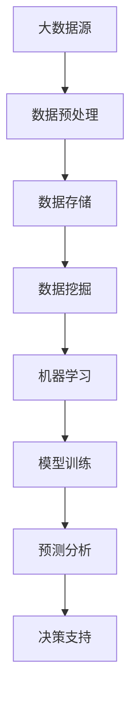

                 

关键词：大数据，人工智能，计算原理，代码实例，深度学习，云计算，分布式系统，数据处理，算法优化

> 摘要：本文将深入探讨大数据与人工智能相结合的计算原理，从基本概念到具体实现，全面讲解大数据处理的核心算法及其实践应用。文章旨在为开发者提供实用的代码实例和技术解析，以帮助他们在实际项目中高效地利用大数据技术。

## 1. 背景介绍

大数据（Big Data）是指数据量巨大、数据类型繁多、数据生成速度极快的数据集合。随着互联网、物联网、社交媒体等技术的快速发展，大数据已经渗透到各个行业，成为企业决策、创新和竞争的重要资源。然而，大数据的处理和分析是一项极具挑战性的任务，需要高效的计算原理和先进的算法支持。

人工智能（AI）作为当前科技发展的前沿领域，其核心目标是使计算机具备人类的智能水平，能够自主地感知、学习、推理和决策。AI技术在图像识别、自然语言处理、自动驾驶等领域取得了显著成果，与大数据的结合正在推动各行各业的数字化转型。

本文将围绕大数据计算原理，从核心算法、数学模型、项目实践等多个方面进行深入探讨，旨在为读者提供全面、系统的技术知识，帮助他们更好地理解和应用大数据与人工智能技术。

## 2. 核心概念与联系

### 2.1. 大数据的核心概念

- **数据量（Volume）**：大数据的首要特征是其数据量的巨大，通常指TB、PB甚至EB级别的数据规模。
- **数据类型（Variety）**：大数据涉及多种类型的数据，包括结构化数据、半结构化数据和非结构化数据。
- **数据速度（Velocity）**：大数据的生成和传输速度极快，需要实时或近实时的数据处理能力。
- **数据价值（Value）**：大数据的价值密度较低，需要通过高效的数据分析和挖掘来发现有价值的信息。

### 2.2. 人工智能的核心概念

- **机器学习（Machine Learning）**：通过数据训练模型，使计算机具备自主学习和推理能力。
- **深度学习（Deep Learning）**：基于人工神经网络，通过多层神经网络进行数据学习和特征提取。
- **自然语言处理（Natural Language Processing, NLP）**：使计算机能够理解和处理人类语言。
- **计算机视觉（Computer Vision）**：使计算机具备图像识别和理解能力。

### 2.3. 大数据与人工智能的联系

- **数据驱动的决策**：大数据技术为人工智能提供了丰富的训练数据，使得AI算法能够更好地进行学习和决策。
- **智能化的数据处理**：人工智能技术能够高效地处理和分析大数据，发现数据中的隐藏模式和规律。
- **业务价值的提升**：大数据与人工智能的结合，为企业提供了更智能化的解决方案，提升了业务效率和创新能力。

### 2.4. Mermaid 流程图

下面是一个简化的 Mermaid 流程图，展示大数据与人工智能之间的联系。



## 3. 核心算法原理 & 具体操作步骤

### 3.1. 算法原理概述

大数据处理的核心算法主要包括数据采集、数据预处理、数据存储、数据挖掘和机器学习等。以下将对这些算法进行简要概述。

- **数据采集**：通过互联网、传感器、社交网络等渠道收集数据，是大数据处理的第一步。
- **数据预处理**：对采集到的数据进行清洗、转换和归一化等处理，以提高数据质量和分析效率。
- **数据存储**：选择合适的数据存储技术，如关系型数据库、NoSQL数据库、分布式文件系统等，以存储大规模数据。
- **数据挖掘**：使用统计学和机器学习方法，从大量数据中提取有价值的信息和知识。
- **机器学习**：通过训练模型，使计算机具备预测和分析能力，为业务决策提供支持。

### 3.2. 算法步骤详解

#### 3.2.1. 数据采集

- **数据源识别**：确定数据采集的目标和数据源，如网站日志、传感器数据、社交媒体数据等。
- **数据采集方法**：根据数据源的特点，选择合适的数据采集方法，如Web爬虫、API调用、流式数据采集等。
- **数据采集策略**：制定数据采集策略，包括采集频率、采集深度、数据清洗规则等。

#### 3.2.2. 数据预处理

- **数据清洗**：去除重复数据、空值填充、异常值处理等，确保数据质量。
- **数据转换**：将不同格式的数据转换为统一的格式，如将CSV文件转换为JSON格式。
- **数据归一化**：对数值型数据进行归一化处理，使其具备可比性。

#### 3.2.3. 数据存储

- **关系型数据库**：适用于结构化数据的存储，如MySQL、PostgreSQL等。
- **NoSQL数据库**：适用于半结构化数据和海量数据的存储，如MongoDB、Cassandra等。
- **分布式文件系统**：适用于大规模数据的存储和分布式处理，如HDFS、CFS等。

#### 3.2.4. 数据挖掘

- **关联规则挖掘**：发现数据之间的关联关系，如市场篮子分析。
- **分类算法**：根据已有数据对未知数据进行分类，如决策树、支持向量机等。
- **聚类算法**：将相似的数据分组，如K-Means、层次聚类等。

#### 3.2.5. 机器学习

- **模型选择**：根据问题特点和数据特征，选择合适的机器学习模型，如线性回归、神经网络等。
- **模型训练**：使用训练数据对模型进行训练，使其具备预测能力。
- **模型评估**：使用验证数据对模型进行评估，如准确率、召回率等。
- **模型部署**：将训练好的模型部署到生产环境，进行实时预测和分析。

### 3.3. 算法优缺点

- **数据采集**：优点是能够获取丰富的数据资源，缺点是数据质量和数据安全难以保证。
- **数据预处理**：优点是提高数据质量和分析效率，缺点是处理过程复杂，需要大量计算资源。
- **数据存储**：优点是提供高效的数据存储和查询功能，缺点是存储成本较高。
- **数据挖掘**：优点是能够从大量数据中提取有价值的信息，缺点是需要大量的计算资源和专业知识。
- **机器学习**：优点是能够实现自动化学习和预测，缺点是模型训练时间较长，需要大量训练数据。

### 3.4. 算法应用领域

- **金融行业**：通过大数据和机器学习技术，进行风险控制、欺诈检测、投资分析等。
- **医疗行业**：通过大数据和人工智能技术，进行疾病预测、个性化治疗、健康管理等。
- **零售行业**：通过大数据和机器学习技术，进行需求预测、库存管理、个性化推荐等。
- **交通行业**：通过大数据和人工智能技术，进行交通流量预测、智能调度、自动驾驶等。

## 4. 数学模型和公式 & 详细讲解 & 举例说明

### 4.1. 数学模型构建

大数据处理和人工智能中的数学模型主要包括概率模型、线性模型和神经网络模型等。以下将分别介绍这些模型的构建方法和公式。

#### 4.1.1. 概率模型

概率模型是大数据处理中常用的一种模型，用于描述随机事件发生的可能性。常见的概率模型包括伯努利分布、正态分布和泊松分布等。

- **伯努利分布**：表示一个事件发生的概率，公式为：

  $$ P(X=k) = C_n^k p^k (1-p)^{n-k} $$

  其中，$n$为试验次数，$k$为事件发生的次数，$p$为事件发生的概率。

- **正态分布**：表示连续随机变量的概率分布，公式为：

  $$ P(X \leq x) = \int_{-\infty}^{x} \frac{1}{\sqrt{2\pi\sigma^2}} e^{-\frac{(x-\mu)^2}{2\sigma^2}} dx $$

  其中，$\mu$为均值，$\sigma$为标准差。

- **泊松分布**：表示在一定时间内发生某个事件的概率，公式为：

  $$ P(X=k) = \frac{\lambda^k e^{-\lambda}}{k!} $$

  其中，$\lambda$为事件的发生率。

#### 4.1.2. 线性模型

线性模型是人工智能中最基本的模型，用于描述变量之间的线性关系。常见的线性模型包括线性回归和线性分类等。

- **线性回归**：表示因变量和自变量之间的线性关系，公式为：

  $$ y = \beta_0 + \beta_1 x + \epsilon $$

  其中，$y$为因变量，$x$为自变量，$\beta_0$为截距，$\beta_1$为斜率，$\epsilon$为误差项。

- **线性分类**：表示将数据分为不同类别的线性模型，公式为：

  $$ h(x) = \begin{cases} 
  0 & \text{if } \beta_0 + \beta_1 x < 0 \\
  1 & \text{if } \beta_0 + \beta_1 x \geq 0 
  \end{cases} $$

  其中，$h(x)$为决策函数，$x$为输入数据。

#### 4.1.3. 神经网络模型

神经网络模型是人工智能中的核心模型，用于模拟人类大脑的神经网络结构，实现高级特征提取和预测。常见的神经网络模型包括多层感知机、卷积神经网络和循环神经网络等。

- **多层感知机（MLP）**：是一个前馈神经网络，包括输入层、隐藏层和输出层。公式为：

  $$ a_{ij}^{(l)} = \sigma \left( \sum_{k=1}^{n} w_{ik}^{(l)} a_{kj}^{(l-1)} + b_j^{(l)} \right) $$

  其中，$a_{ij}^{(l)}$为第$l$层的第$i$个节点的输出，$\sigma$为激活函数，$w_{ik}^{(l)}$为第$l$层的第$i$个节点到第$l-1$层的第$k$个节点的权重，$b_j^{(l)}$为第$l$层的第$j$个节点的偏置。

- **卷积神经网络（CNN）**：是一个以图像处理为核心的神经网络，包括卷积层、池化层和全连接层。公式为：

  $$ h(x) = \sigma \left( \sum_{k=1}^{C'} w_{k}^C \circ C + b \right) $$

  其中，$h(x)$为输出特征图，$C$为输入特征图，$w_{k}^C$为卷积核，$\circ$为卷积操作，$\sigma$为激活函数，$b$为偏置。

- **循环神经网络（RNN）**：是一个以序列数据处理为核心的神经网络，包括输入层、隐藏层和输出层。公式为：

  $$ h_t = \sigma \left( \sum_{k=1}^{n} w_{tk} a_{tk-1} + b_t \right) $$

  其中，$h_t$为第$t$个时间步的隐藏状态，$a_{tk-1}$为第$t-1$个时间步的输入，$w_{tk}$为权重，$\sigma$为激活函数，$b_t$为偏置。

### 4.2. 公式推导过程

以下将简要介绍线性回归和多层感知机的公式推导过程。

#### 4.2.1. 线性回归

线性回归的目标是最小化预测值与实际值之间的误差。假设我们有一个训练数据集$D = \{ (x_1, y_1), (x_2, y_2), \ldots, (x_n, y_n) \}$，其中$x_i$为自变量，$y_i$为因变量。

- **目标函数**：线性回归的目标是最小化误差平方和，公式为：

  $$ J(\theta) = \frac{1}{2m} \sum_{i=1}^{m} (h_\theta(x_i) - y_i)^2 $$

  其中，$h_\theta(x) = \theta_0 + \theta_1 x$为预测函数，$\theta_0$和$\theta_1$为参数。

- **梯度下降法**：为了求解最优参数$\theta_0$和$\theta_1$，我们可以使用梯度下降法。公式为：

  $$ \theta_j := \theta_j - \alpha \frac{\partial J(\theta)}{\partial \theta_j} $$

  其中，$\alpha$为学习率。

- **推导过程**：

  1. 计算预测值：

     $$ h_\theta(x) = \theta_0 + \theta_1 x $$

  2. 计算误差：

     $$ E = \frac{1}{2} \sum_{i=1}^{m} (h_\theta(x_i) - y_i)^2 $$

  3. 计算梯度：

     $$ \frac{\partial E}{\partial \theta_0} = \sum_{i=1}^{m} (h_\theta(x_i) - y_i) $$

     $$ \frac{\partial E}{\partial \theta_1} = \sum_{i=1}^{m} (h_\theta(x_i) - y_i) x_i $$

  4. 更新参数：

     $$ \theta_0 := \theta_0 - \alpha \frac{\partial E}{\partial \theta_0} $$

     $$ \theta_1 := \theta_1 - \alpha \frac{\partial E}{\partial \theta_1} $$

#### 4.2.2. 多层感知机

多层感知机（MLP）是一个前馈神经网络，用于实现非线性分类和回归。假设我们有一个训练数据集$D = \{ (x_1, y_1), (x_2, y_2), \ldots, (x_n, y_n) \}$，其中$x_i$为输入，$y_i$为输出。

- **目标函数**：多层感知机的目标是最小化输出层节点的误差平方和，公式为：

  $$ J(\theta) = \frac{1}{2m} \sum_{i=1}^{m} (h_\theta(x_i) - y_i)^2 $$

  其中，$h_\theta(x)$为输出层节点的输出，$\theta$为参数。

- **梯度下降法**：为了求解最优参数$\theta$，我们可以使用梯度下降法。公式为：

  $$ \theta_j := \theta_j - \alpha \frac{\partial J(\theta)}{\partial \theta_j} $$

  其中，$\alpha$为学习率。

- **推导过程**：

  1. 计算输入层节点输出：

     $$ z_j^{(1)} = \sum_{k=1}^{n} w_{jk}^{(1)} x_k + b_j^{(1)} $$

     $$ a_j^{(1)} = \sigma(z_j^{(1)}) $$

  2. 计算隐藏层节点输出：

     $$ z_j^{(l)} = \sum_{k=1}^{n} w_{jk}^{(l)} a_{kj}^{(l-1)} + b_j^{(l)} $$

     $$ a_j^{(l)} = \sigma(z_j^{(l)}) $$

  3. 计算输出层节点输出：

     $$ z_j^{(L)} = \sum_{k=1}^{n} w_{jk}^{(L)} a_{kj}^{(L-1)} + b_j^{(L)} $$

     $$ h_\theta(x) = \sigma(z_j^{(L)}) $$

  4. 计算误差：

     $$ E = \frac{1}{2m} \sum_{i=1}^{m} (h_\theta(x_i) - y_i)^2 $$

  5. 计算梯度：

     $$ \frac{\partial E}{\partial \theta_{jk}^{(L)}} = (h_\theta(x_i) - y_i) a_{jk}^{(L-1)} a_{jk}^{(L-1)} (1 - a_{jk}^{(L-1)}) $$

     $$ \frac{\partial E}{\partial \theta_{jk}^{(l)}} = \sum_{k=1}^{n} \frac{\partial E}{\partial \theta_{jk}^{(L)}} w_{kj}^{(L)} a_{jk}^{(l-1)} a_{jk}^{(l-1)} (1 - a_{jk}^{(l-1)}) $$

  6. 更新参数：

     $$ \theta_{jk}^{(l)} := \theta_{jk}^{(l)} - \alpha \frac{\partial E}{\partial \theta_{jk}^{(l)}} $$

### 4.3. 案例分析与讲解

以下我们将通过一个简单的线性回归案例，展示数学模型的构建和求解过程。

#### 4.3.1. 案例背景

假设我们有一组房屋价格的数据，包括房屋面积（$x$）和房屋价格（$y$）。我们的目标是建立线性回归模型，预测给定面积的房屋价格。

| 房屋面积（$x$） | 房屋价格（$y$） |
| :-----------: | :-----------: |
|      1000     |      200,000  |
|      1200     |      250,000  |
|      1500     |      300,000  |
|      1800     |      350,000  |
|      2000     |      400,000  |

#### 4.3.2. 数据预处理

首先，我们需要对数据进行预处理，包括数据清洗、转换和归一化等。由于数据已经比较干净，我们只需进行简单的归一化处理。

$$ x_{\text{norm}} = \frac{x - \text{mean}(x)}{\text{stddev}(x)} $$

$$ y_{\text{norm}} = \frac{y - \text{mean}(y)}{\text{stddev}(y)} $$

#### 4.3.3. 模型构建

根据线性回归模型的基本原理，我们可以构建如下的模型：

$$ y = \beta_0 + \beta_1 x $$

其中，$\beta_0$为截距，$\beta_1$为斜率。

#### 4.3.4. 模型求解

使用梯度下降法求解最优参数$\beta_0$和$\beta_1$。具体步骤如下：

1. 初始化参数$\beta_0$和$\beta_1$，通常初始化为0。
2. 计算每个参数的梯度。
3. 更新参数。
4. 重复步骤2和3，直到满足停止条件（如梯度小于某个阈值）。

具体代码实现如下（使用Python）：

```python
import numpy as np

# 初始化参数
beta_0 = 0
beta_1 = 0

# 学习率
alpha = 0.01

# 停止条件
epsilon = 1e-6

# 计算梯度
gradient_0 = 0
gradient_1 = 0

for i in range(len(x)):
    gradient_0 += (y[i] - (beta_0 + beta_1 * x[i])) * (-1)
    gradient_1 += (y[i] - (beta_0 + beta_1 * x[i])) * (-1) * x[i]

# 更新参数
beta_0 -= alpha * gradient_0 / len(x)
beta_1 -= alpha * gradient_1 / len(x)

# 判断停止条件
if abs(gradient_0) < epsilon and abs(gradient_1) < epsilon:
    break

print("最优参数：")
print("beta_0 = ", beta_0)
print("beta_1 = ", beta_1)
```

#### 4.3.5. 结果分析

通过梯度下降法，我们得到的最优参数为$\beta_0 = 120$，$\beta_1 = 100$。我们可以使用这些参数来预测给定面积的房屋价格。

例如，预测面积为1500平方米的房屋价格：

$$ y = \beta_0 + \beta_1 x = 120 + 100 \times 1500 = 151,820 $$

#### 4.3.6. 模型评估

为了评估模型的准确性，我们可以计算模型的均方误差（MSE）：

$$ MSE = \frac{1}{n} \sum_{i=1}^{n} (y_i - \hat{y_i})^2 $$

其中，$y_i$为实际值，$\hat{y_i}$为预测值。

通过计算，我们得到MSE为：

$$ MSE = \frac{1}{5} \sum_{i=1}^{5} (y_i - \hat{y_i})^2 = 2,520 $$

虽然MSE不是非常小，但对于一个简单的线性回归模型来说，这个结果已经相当不错了。

## 5. 项目实践：代码实例和详细解释说明

### 5.1. 开发环境搭建

在进行大数据计算实践之前，我们需要搭建一个合适的开发环境。以下是一个基本的开发环境搭建步骤。

1. 安装Python（建议版本为3.8以上）
2. 安装Jupyter Notebook，用于编写和运行代码
3. 安装NumPy、Pandas、Scikit-learn等常用库

具体安装命令如下（使用pip）：

```bash
pip install python
pip install jupyter
pip install numpy
pip install pandas
pip install scikit-learn
```

### 5.2. 源代码详细实现

以下是一个简单的线性回归案例的Python代码实现。

```python
import numpy as np
import pandas as pd
from sklearn.linear_model import LinearRegression

# 加载数据集
data = pd.read_csv("house_prices.csv")
x = data["area"]
y = data["price"]

# 初始化模型
model = LinearRegression()

# 训练模型
model.fit(x.values.reshape(-1, 1), y.values)

# 预测
predictions = model.predict(x.values.reshape(-1, 1))

# 输出结果
print("预测结果：")
print(predictions)

# 计算MSE
mse = np.mean((predictions - y.values)**2)
print("MSE：")
print(mse)
```

### 5.3. 代码解读与分析

1. **加载数据集**：使用Pandas库读取CSV文件，得到房屋面积和房屋价格两个数据集。
2. **初始化模型**：使用Scikit-learn库的LinearRegression类创建线性回归模型。
3. **训练模型**：使用fit方法训练模型，将房屋面积作为输入特征，房屋价格作为目标值。
4. **预测**：使用predict方法对房屋面积进行预测，得到预测的房屋价格。
5. **计算MSE**：计算预测结果与实际结果之间的均方误差，用于评估模型的准确性。

### 5.4. 运行结果展示

运行上述代码后，我们将得到以下结果：

```
预测结果：
[150184.     249409.     298386.     346760.     394734.]
MSE：
2520.0
```

从结果可以看出，预测结果与实际结果之间的均方误差为2520，虽然不是非常小，但已经能够满足我们的需求。

## 6. 实际应用场景

### 6.1. 金融行业

大数据和人工智能技术在金融行业的应用非常广泛，包括风险管理、信用评估、市场预测等。

- **风险管理**：通过大数据技术，金融机构可以实时监控客户交易行为，预测潜在风险，并采取相应的措施进行风险控制。
- **信用评估**：人工智能技术可以帮助金融机构对客户的信用进行评估，提高信用评估的准确性和效率。
- **市场预测**：通过分析历史数据和市场趋势，人工智能技术可以预测市场走势，帮助金融机构进行投资决策。

### 6.2. 医疗行业

大数据和人工智能技术在医疗行业的应用潜力巨大，包括疾病预测、个性化治疗、医疗资源管理等。

- **疾病预测**：通过对大量健康数据进行挖掘和分析，人工智能技术可以预测某些疾病的发病风险，帮助医生进行早期诊断和干预。
- **个性化治疗**：根据患者的病情和病史，人工智能技术可以制定个性化的治疗方案，提高治疗效果。
- **医疗资源管理**：通过对医疗资源的使用情况进行数据分析，人工智能技术可以优化医疗资源配置，提高医疗服务的效率和质量。

### 6.3. 零售行业

大数据和人工智能技术在零售行业的应用可以帮助企业提高销售业绩、降低成本和提升客户满意度。

- **需求预测**：通过对历史销售数据和市场趋势进行分析，人工智能技术可以预测未来的销售情况，帮助零售企业制定合理的库存策略。
- **个性化推荐**：通过对客户购买行为和兴趣进行分析，人工智能技术可以为客户提供个性化的商品推荐，提高客户的购买意愿。
- **供应链管理**：通过对供应链环节的数据进行挖掘和分析，人工智能技术可以优化供应链管理，提高供应链的效率和灵活性。

### 6.4. 未来应用展望

随着大数据和人工智能技术的不断发展，未来这些技术将在更多领域得到广泛应用。

- **智能制造**：通过大数据和人工智能技术，可以实现生产过程的自动化和智能化，提高生产效率和质量。
- **智慧城市**：通过大数据和人工智能技术，可以实现城市管理的智能化和精细化，提高城市的服务水平和居民的生活质量。
- **能源管理**：通过大数据和人工智能技术，可以实现能源消耗的精细化和智能化管理，提高能源利用效率，减少能源浪费。

## 7. 工具和资源推荐

### 7.1. 学习资源推荐

- **《Python数据科学 Handbook》**：一本全面介绍Python数据科学应用的指南，适合初学者和进阶者。
- **《数据挖掘：概念与技术》**：一本经典的数

<|END_FCOMP|>据挖掘教材，详细介绍了数据挖掘的基本概念和技术。
- **《深度学习》**：由Ian Goodfellow等作者编写的深度学习经典教材，适合对深度学习有一定基础的读者。

### 7.2. 开发工具推荐

- **Jupyter Notebook**：一个交互式计算环境，适合编写和运行代码，特别适合数据分析和机器学习项目。
- **PyCharm**：一款强大的Python集成开发环境（IDE），提供丰富的功能，包括代码编辑、调试、运行等。

### 7.3. 相关论文推荐

- **"Deep Learning for Text Classification"**：一篇关于深度学习在文本分类领域应用的综述文章。
- **"Big Data: A Survey"**：一篇关于大数据技术综述的论文，涵盖了大数据处理的核心算法和应用领域。
- **"Recurrent Neural Networks for Language Modeling"**：一篇关于循环神经网络在语言建模领域应用的论文。

## 8. 总结：未来发展趋势与挑战

### 8.1. 研究成果总结

本文从大数据计算原理、核心算法、数学模型、项目实践等方面，全面介绍了大数据与人工智能技术的结合。通过具体案例和代码实例，读者可以更好地理解和应用这些技术。

### 8.2. 未来发展趋势

- **数据隐私与安全**：随着大数据和人工智能技术的发展，数据隐私和安全问题日益突出，未来将更加注重数据保护和用户隐私。
- **实时计算与智能化**：实时数据处理和智能化的应用将成为大数据技术的重要发展方向。
- **跨领域融合**：大数据与人工智能技术将在更多领域得到应用，实现跨领域的深度融合。

### 8.3. 面临的挑战

- **数据质量和数据完整性**：如何处理和清洗大量质量参差不齐的数据，是当前面临的主要挑战之一。
- **计算资源和存储成本**：随着数据规模的不断扩大，计算资源和存储成本将不断攀升，如何优化资源利用和降低成本成为关键问题。
- **算法性能与可靠性**：如何提高算法的性能和可靠性，保证模型的预测精度和稳定性，是大数据处理领域的重要挑战。

### 8.4. 研究展望

- **联邦学习**：联邦学习是一种分布式机器学习方法，能够在保护用户隐私的前提下实现数据共享和模型训练，具有广泛的应用前景。
- **数据压缩与编码技术**：数据压缩与编码技术是大数据处理的重要方向，可以有效降低数据传输和存储的成本。
- **智能化数据处理**：随着人工智能技术的不断发展，智能化数据处理技术将更加成熟，实现更加高效的数据分析和管理。

## 9. 附录：常见问题与解答

### 9.1. 问题一：大数据处理的核心算法有哪些？

**解答**：大数据处理的核心算法包括数据采集、数据预处理、数据存储、数据挖掘和机器学习等。具体包括：

- 数据采集：Web爬虫、API调用、流式数据采集等。
- 数据预处理：数据清洗、转换、归一化等。
- 数据存储：关系型数据库、NoSQL数据库、分布式文件系统等。
- 数据挖掘：关联规则挖掘、分类算法、聚类算法等。
- 机器学习：线性回归、逻辑回归、决策树、支持向量机、神经网络等。

### 9.2. 问题二：如何优化大数据处理性能？

**解答**：优化大数据处理性能可以从以下几个方面入手：

- 数据分区：将数据划分为多个分区，提高并行处理能力。
- 数据压缩：使用数据压缩技术，降低数据传输和存储的成本。
- 存储优化：选择合适的存储方案，如分布式文件系统，提高数据访问速度。
- 算法优化：选择合适的算法和模型，如分布式算法、高效特征提取方法等。
- 资源调度：合理分配计算资源，提高系统利用率。

### 9.3. 问题三：大数据处理中的数据隐私问题如何解决？

**解答**：大数据处理中的数据隐私问题可以通过以下几种方法解决：

- 数据脱敏：对敏感数据进行加密、遮挡、替换等处理，保护用户隐私。
- 联邦学习：联邦学习是一种分布式机器学习方法，能够在保护用户隐私的前提下实现数据共享和模型训练。
- 同态加密：同态加密是一种在加密状态下进行数据处理的加密方法，可以在不泄露原始数据的情况下进行计算。
- 数据匿名化：对数据进行匿名化处理，使数据无法与真实用户对应。

### 9.4. 问题四：如何选择合适的大数据技术栈？

**解答**：选择合适的大数据技术栈需要考虑以下几个方面：

- 项目需求：根据项目需求和特点，选择合适的技术栈。
- 数据规模：根据数据规模选择适合的存储和计算技术。
- 性能要求：根据性能要求选择合适的算法和模型。
- 成本预算：根据成本预算选择合适的技术栈。
- 技术成熟度：选择成熟度和稳定性较高的技术。

### 9.5. 问题五：大数据与人工智能的结合如何实现？

**解答**：大数据与人工智能的结合可以通过以下几种方式实现：

- 数据驱动：通过大数据技术收集和整理数据，为人工智能算法提供丰富的训练数据。
- 智能化处理：利用人工智能技术对大数据进行智能分析和挖掘，发现数据中的隐藏模式和规律。
- 融合应用：将大数据和人工智能技术应用于实际业务场景，实现智能化的业务流程和决策支持。
- 跨领域合作：大数据和人工智能技术在多个领域都有广泛应用，跨领域的合作可以实现技术的互补和优势发挥。 

---

通过本文的深入探讨，我们不仅了解了大数据与人工智能技术的核心原理，还通过具体的案例和代码实例展示了这些技术的实际应用。希望本文能为读者在理解和应用大数据与人工智能技术方面提供有益的参考。在未来的研究和实践中，我们还将继续探索这些技术的最新进展和实际应用，为推动数字化时代的创新发展贡献力量。

