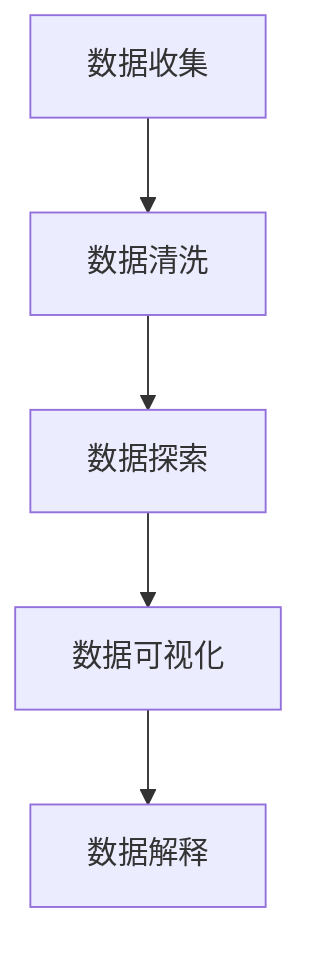

                 

关键词：数据可视化、AI 大数据、计算原理、代码实例、Python、图表库

摘要：本文将深入探讨 AI 大数据计算中的数据可视化原理，并通过实际代码实例，展示如何利用 Python 和相关图表库实现高效的数据可视化。本文旨在帮助读者理解数据可视化的重要性，掌握其基本原理和实现方法。

## 1. 背景介绍

数据可视化是一种将复杂的数据集以图形化的方式呈现的技术，它有助于我们更直观地理解和分析数据。随着 AI 和大数据技术的不断发展，数据可视化在各个领域，如商业智能、医疗、金融等，都发挥着越来越重要的作用。

在 AI 大数据计算中，数据可视化不仅有助于我们更好地理解数据，还可以帮助我们识别数据中的模式和异常。通过数据可视化，我们可以将大量的数据转换为易于理解的图表，从而辅助决策和问题解决。

本文将主要介绍以下内容：

1. 数据可视化的基本原理和重要性。
2. 数据可视化的核心算法和实现步骤。
3. Python 中常用的数据可视化库和工具。
4. 实际代码实例和详细解释。
5. 数据可视化在各个领域的应用。
6. 未来发展趋势和面临的挑战。

## 2. 核心概念与联系

### 2.1 数据可视化定义

数据可视化（Data Visualization）是指使用图表、图像和其他视觉元素来表示和传达数据信息。它是一种通过视觉展示数据的方法，旨在使复杂的数据更容易理解和分析。

### 2.2 数据可视化的重要性

- **辅助决策**：通过图形化的数据展示，决策者可以更直观地理解数据，从而做出更明智的决策。
- **发现模式**：数据可视化有助于我们识别数据中的模式和趋势，发现潜在的问题和机会。
- **传达信息**：通过图表和图像，可以更有效地传达复杂的数据信息，使报告和分析更加生动和易懂。
- **节省时间**：数据可视化可以显著提高数据分析的效率，减少手动处理数据的时间。

### 2.3 数据可视化的基本流程

1. **数据收集**：收集需要可视化的数据。
2. **数据清洗**：处理数据中的缺失值、异常值等。
3. **数据探索**：对数据进行初步分析，了解数据的基本特征和趋势。
4. **数据可视化**：选择合适的图表和可视化库，将数据呈现为图形。
5. **数据解释**：对可视化的结果进行解释和解读。

### 2.4 Mermaid 流程图



## 3. 核心算法原理 & 具体操作步骤

### 3.1 算法原理概述

数据可视化涉及多种算法和技巧，包括但不限于：

- **图表类型选择**：选择合适的图表类型，如条形图、折线图、散点图等。
- **数据映射**：将数据映射到图表的坐标轴、颜色、形状等。
- **交互性**：增加图表的交互性，如缩放、过滤、切换等。
- **美学设计**：遵循美学原则，设计易于阅读和理解的图表。

### 3.2 算法步骤详解

1. **选择合适的图表类型**：根据数据的特点和需要传达的信息选择合适的图表类型。
2. **数据预处理**：对数据进行清洗和转换，使其适合可视化。
3. **数据映射**：将数据映射到图表的各个部分，如坐标轴、颜色、形状等。
4. **图表绘制**：使用可视化库绘制图表。
5. **交互设计**：增加交互性，使图表更易于操作和理解。
6. **图表优化**：根据反馈进行图表的优化和调整。

### 3.3 算法优缺点

- **优点**：
  - **直观性**：图表可以直观地展示数据，使数据更容易理解。
  - **高效性**：通过图表，可以快速识别数据中的模式和趋势。
  - **互动性**：交互式图表可以提供更好的用户体验。
- **缺点**：
  - **复杂性**：设计和理解复杂的图表可能需要专业知识和技能。
  - **误导性**：图表的设计不当可能导致错误的解读和决策。

### 3.4 算法应用领域

- **商业智能**：用于市场分析、销售数据监控等。
- **医疗**：用于疾病数据分析、患者监控等。
- **金融**：用于股票市场分析、财务报表等。
- **科研**：用于数据分析和可视化，辅助科研工作。

## 4. 数学模型和公式 & 详细讲解 & 举例说明

### 4.1 数学模型构建

数据可视化中的数学模型主要包括数据映射、坐标轴表示、颜色映射等。

- **数据映射**：将数据映射到图表的坐标轴上，如线性映射、非线性映射等。
- **坐标轴表示**：坐标轴的刻度和标签，如线性刻度、对数刻度等。
- **颜色映射**：使用颜色表示数据的特征，如热图、色块图等。

### 4.2 公式推导过程

- **线性映射**：y = kx + b，其中 x 为原始数据，y 为映射后的数据，k 和 b 为映射系数。
- **对数映射**：y = log\_b(x)，其中 x 为原始数据，y 为映射后的数据，b 为底数。

### 4.3 案例分析与讲解

假设我们有一组销售数据，需要将其映射到条形图上。我们可以使用线性映射公式进行数据转换。

- **原始数据**：销售量（单位：万元）
  ```plaintext
  1000, 1500, 2000, 2500, 3000
  ```

- **映射系数**：
  - k（比例因子）：1
  - b（偏移量）：0

- **映射后数据**：
  ```plaintext
  1000, 1500, 2000, 2500, 3000
  ```

我们使用 Python 的 matplotlib 库绘制条形图：

```python
import matplotlib.pyplot as plt

# 原始数据
sales = [1000, 1500, 2000, 2500, 3000]
labels = ['产品A', '产品B', '产品C', '产品D', '产品E']

# 绘制条形图
plt.bar(labels, sales)
plt.xlabel('产品')
plt.ylabel('销售量（万元）')
plt.title('产品销售情况')
plt.show()
```

这将绘制一个简单的条形图，展示各个产品的销售情况。

## 5. 项目实践：代码实例和详细解释说明

### 5.1 开发环境搭建

- **Python**：安装 Python 3.8 或以上版本。
- **可视化库**：安装 matplotlib、seaborn 等可视化库。

```bash
pip install matplotlib seaborn
```

### 5.2 源代码详细实现

以下是一个使用 matplotlib 绘制散点图的示例：

```python
import matplotlib.pyplot as plt
import numpy as np

# 生成数据
np.random.seed(0)
x = np.random.normal(size=100)
y = np.random.normal(size=100)

# 绘制散点图
plt.scatter(x, y)
plt.xlabel('X轴')
plt.ylabel('Y轴')
plt.title('散点图示例')
plt.show()
```

### 5.3 代码解读与分析

- **数据生成**：使用 `numpy.random.normal` 生成两组服从正态分布的数据。
- **绘制散点图**：使用 `plt.scatter` 函数绘制散点图。
- **标签和标题**：添加 X 轴、Y 轴标签和图表标题。

### 5.4 运行结果展示

运行以上代码，将显示一个简单的散点图，展示数据的分布情况。


## 6. 实际应用场景

### 6.1 商业智能

商业智能领域使用数据可视化来监控销售数据、市场趋势等。例如，销售团队可以使用数据可视化来分析产品的销售情况，识别高销量产品和低销量产品。

### 6.2 金融领域

金融领域使用数据可视化来分析股票市场、风险分布等。例如，投资者可以使用数据可视化来监控市场趋势，识别潜在的投资机会。

### 6.3 医疗领域

医疗领域使用数据可视化来分析疾病数据、患者状况等。例如，医生可以使用数据可视化来监控患者的健康状况，制定个性化的治疗方案。

### 6.4 科研领域

科研领域使用数据可视化来展示实验数据、分析结果等。例如，科研人员可以使用数据可视化来探索新的科学领域，发现潜在的研究方向。

## 7. 工具和资源推荐

### 7.1 学习资源推荐

- **数据可视化教程**：[数据可视化教程](https://www.datavizualization101.com/)
- **Python 数据可视化库文档**：[matplotlib 文档](https://matplotlib.org/stable/index.html)、[seaborn 文档](https://seaborn.pydata.org/)

### 7.2 开发工具推荐

- **Jupyter Notebook**：用于编写和运行 Python 代码。
- **PyCharm**：一款强大的 Python 集成开发环境（IDE）。

### 7.3 相关论文推荐

- **"The Visual Organization: How Big Data and Analytics Are Transforming the Modern Enterprise"**：讨论了数据可视化在企业中的重要性。
- **"Data Visualization: A Brief History"**：回顾了数据可视化的发展历程。

## 8. 总结：未来发展趋势与挑战

### 8.1 研究成果总结

- 数据可视化技术在算法、工具和实践中取得了显著进展。
- 交互式数据可视化和实时数据可视化成为研究热点。
- 多媒体和跨平台的数据可视化应用不断涌现。

### 8.2 未来发展趋势

- **智能化**：数据可视化将更加智能化，自动推荐最佳的图表类型和布局。
- **跨平台**：数据可视化将支持更多设备和平台，提供一致的用户体验。
- **实时性**：实时数据可视化将更加普及，支持动态数据展示。

### 8.3 面临的挑战

- **数据隐私**：如何在保障数据隐私的同时进行数据可视化。
- **可视化效率**：如何提高数据可视化的计算和渲染效率。
- **用户体验**：如何提供更好的用户体验，使数据可视化更加直观和易用。

### 8.4 研究展望

数据可视化将继续在 AI 大数据领域发挥重要作用，为决策支持和问题解决提供有力工具。未来的研究将聚焦于智能化、实时性和用户体验的提升，以实现更高效、更直观的数据可视化。

## 9. 附录：常见问题与解答

### 9.1 什么是数据可视化？

数据可视化是指使用图表、图像和其他视觉元素来表示和传达数据信息。

### 9.2 数据可视化有哪些应用领域？

数据可视化在商业智能、医疗、金融、科研等多个领域有广泛应用。

### 9.3 如何选择合适的图表类型？

根据数据的特点和需要传达的信息选择合适的图表类型，如条形图、折线图、散点图等。

### 9.4 如何提高数据可视化效率？

通过使用高效的算法、优化代码和利用图形处理器的加速功能来提高数据可视化效率。

---

作者：禅与计算机程序设计艺术 / Zen and the Art of Computer Programming
----------------------------------------------------------------
注意：以上内容仅为示例，并非完整文章。您需要根据具体要求和内容撰写完整的文章。以上内容仅供参考和引导。在实际撰写文章时，请确保遵循所有要求和指南。祝您撰写顺利！

