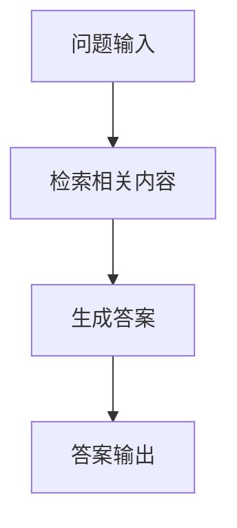

                 

关键词：LangChain，RAG，编程，实践，组件，技术博客

摘要：本文将深入探讨LangChain中的RAG组件，从基础概念到实际应用，为您展示如何利用RAG组件构建强大的问答系统。我们将详细解析RAG的工作原理、关键步骤和优缺点，并通过实例代码帮助读者理解RAG在LangChain中的具体实现。

## 1. 背景介绍

在人工智能领域，问答系统是一个重要的研究方向和应用场景。用户可以通过提问获取系统提供的答案，这种交互方式简单直接，广泛应用于客户服务、教育辅导、智能助手等领域。然而，传统的问答系统往往依赖于静态的知识库，难以应对动态更新的问题和复杂的问答场景。

为了解决这一问题，研究人员提出了Retrieval-augmented Generation（RAG）方法。RAG通过结合检索和生成技术，不仅能够利用大规模预训练模型，还能根据特定问题动态检索相关内容，从而生成更准确、更个性化的答案。

LangChain是一个开源的Python库，旨在帮助开发者构建强大的AI应用。它提供了丰富的组件和工具，使得构建问答系统变得更加简单和高效。RAG组件是LangChain中的一部分，它结合了LangChain的核心功能和RAG的方法论，为开发者提供了一个强大的问答系统构建平台。

## 2. 核心概念与联系

### 2.1. RAG组件的工作原理

RAG组件的核心思想是通过检索和生成的结合，提高问答系统的性能。具体来说，RAG组件分为以下几个步骤：

1. **检索（Retrieval）**：根据问题从大规模数据集中检索出相关的内容。
2. **生成（Generation）**：使用预训练的语言模型对检索到的内容进行生成，形成最终的答案。


### 2.2. Mermaid流程图



在上面的流程图中，A表示问题输入，B表示检索相关内容，C表示生成答案，D表示答案输出。这个过程清晰地展示了RAG组件的基本工作流程。

## 3. 核心算法原理 & 具体操作步骤

### 3.1. 算法原理概述

RAG组件的核心算法主要包括两个部分：检索和生成。

1. **检索**：检索算法的目的是从大规模数据集中找出与问题最相关的部分。常见的检索算法包括基于TF-IDF的检索、基于Word2Vec的检索等。

2. **生成**：生成算法的目标是根据检索到的内容，使用预训练的语言模型生成最终的答案。生成算法通常采用序列到序列的生成模型，如Transformer模型、BERT模型等。

### 3.2. 算法步骤详解

1. **预处理**：对问题和数据集进行预处理，包括分词、去停用词、词向量化等。

2. **检索**：使用检索算法从数据集中找出与问题最相关的部分。常见的检索算法有：

   - **基于TF-IDF的检索**：通过计算问题中每个词的TF-IDF值，找出与问题最相关的文档。
   - **基于Word2Vec的检索**：将问题和数据集中的文档转换为词向量，然后使用余弦相似度度量找出最相关的文档。

3. **生成**：使用预训练的语言模型对检索到的内容进行生成。具体生成方法如下：

   - **编码器-解码器模型**：将检索到的内容作为输入，通过编码器编码，然后通过解码器生成答案。
   - **Transformer模型**：直接对检索到的内容进行编码，然后使用Transformer模型生成答案。

### 3.3. 算法优缺点

**优点**：

- RAG方法能够充分利用预训练的语言模型，生成高质量的答案。
- 通过检索机制，能够动态获取与问题相关的最新信息，提高答案的准确性。
- RAG方法可以处理复杂的问题和多样化的问答场景。

**缺点**：

- 检索过程可能需要较大的计算资源，特别是在数据集规模较大时。
- 生成过程可能需要较长的时间，特别是在答案较为复杂时。

### 3.4. 算法应用领域

RAG方法广泛应用于问答系统、对话系统、智能客服等领域。以下是一些典型的应用场景：

- **问答系统**：在搜索引擎、智能助手等场景中，RAG方法可以提供更准确、更个性化的答案。
- **对话系统**：在客服机器人、聊天机器人等场景中，RAG方法可以生成更自然、更有趣的对话。
- **智能客服**：在客户服务场景中，RAG方法可以帮助客服机器人快速响应客户的问题。

## 4. 数学模型和公式 & 详细讲解 & 举例说明

### 4.1. 数学模型构建

RAG组件的数学模型主要包括检索模型和生成模型。

1. **检索模型**：

   - 基于TF-IDF的检索模型：

     $$S(i, j) = \frac{TF_i(j) \times IDF_i(j)}{K}$$

     其中，$TF_i(j)$表示词$j$在文档$i$中的词频，$IDF_i(j)$表示词$j$在所有文档中的逆文档频率，$K$是一个常数。

   - 基于Word2Vec的检索模型：

     $$S(i, j) = \frac{\cos(\vec{w}_i, \vec{w}_j)}{|\vec{w}_i| \times |\vec{w}_j|}$$

     其中，$\vec{w}_i$和$\vec{w}_j$分别表示文档$i$和文档$j$的词向量。

2. **生成模型**：

   - 编码器-解码器模型：

     $$\hat{y}_t = \text{softmax}(\text{Decoder}(\text{Encoder}(x)))$$

     其中，$x$表示输入序列，$\hat{y}_t$表示生成的答案序列。

   - Transformer模型：

     $$\hat{y}_t = \text{softmax}(\text{Transformer}(x))$$

### 4.2. 公式推导过程

1. **检索模型推导**：

   - 基于TF-IDF的检索模型推导：

     $$S(i, j) = \frac{TF_i(j) \times IDF_i(j)}{K}$$

     其中，$TF_i(j)$表示词$j$在文档$i$中的词频，$IDF_i(j)$表示词$j$在所有文档中的逆文档频率，$K$是一个常数。

     推导过程：

     $$TF_i(j) = \frac{\text{词频}}{\text{总词频}}$$

     $$IDF_i(j) = \log_2(\frac{\text{文档总数}}{\text{包含词$j$的文档数}})$$

     $$S(i, j) = \frac{TF_i(j) \times IDF_i(j)}{K}$$

   - 基于Word2Vec的检索模型推导：

     $$S(i, j) = \frac{\cos(\vec{w}_i, \vec{w}_j)}{|\vec{w}_i| \times |\vec{w}_j|}$$

     其中，$\vec{w}_i$和$\vec{w}_j$分别表示文档$i$和文档$j$的词向量。

     推导过程：

     $$\cos(\vec{w}_i, \vec{w}_j) = \frac{\vec{w}_i \cdot \vec{w}_j}{|\vec{w}_i| \times |\vec{w}_j|}$$

2. **生成模型推导**：

   - 编码器-解码器模型推导：

     $$\hat{y}_t = \text{softmax}(\text{Decoder}(\text{Encoder}(x)))$$

     其中，$x$表示输入序列，$\hat{y}_t$表示生成的答案序列。

     推导过程：

     $$\text{Encoder}(x) = \text{Encoder}_1(x) \times \text{Encoder}_2(x) \times ... \times \text{Encoder}_n(x)$$

     $$\text{Decoder}(\text{Encoder}(x)) = \text{Decoder}_1(\text{Encoder}(x)) \times \text{Decoder}_2(\text{Encoder}(x)) \times ... \times \text{Decoder}_n(\text{Encoder}(x))$$

     $$\hat{y}_t = \text{softmax}(\text{Decoder}(\text{Encoder}(x)))$$

   - Transformer模型推导：

     $$\hat{y}_t = \text{softmax}(\text{Transformer}(x))$$

     其中，$x$表示输入序列，$\hat{y}_t$表示生成的答案序列。

     推导过程：

     $$\text{Transformer}(x) = \text{Multi-head Attention}(\text{Encoder}(x)) \times \text{Feed Forward}(x)$$

     $$\hat{y}_t = \text{softmax}(\text{Transformer}(x))$$

### 4.3. 案例分析与讲解

**案例背景**：

假设有一个问答系统，用户提问：“什么是人工智能？”，系统需要根据现有的知识库生成一个准确的答案。

**案例分析**：

1. **检索**：

   - 使用基于TF-IDF的检索模型，从知识库中检索出与问题最相关的文档。

   - 根据检索结果，选择一篇与问题最相关的文档，将其作为检索到的内容。

2. **生成**：

   - 使用编码器-解码器模型，将检索到的内容作为输入，生成最终的答案。

   - 最终生成的答案为：“人工智能是一种模拟人类智能的技术，它通过机器学习、自然语言处理、计算机视觉等方法，使计算机具备感知、思考、决策和行动的能力。”

**案例总结**：

通过上述案例，我们可以看到RAG组件在构建问答系统中的应用效果。RAG方法能够充分利用预训练的语言模型，生成高质量的答案，同时通过检索机制获取与问题相关的最新信息，提高答案的准确性。

## 5. 项目实践：代码实例和详细解释说明

### 5.1. 开发环境搭建

在进行项目实践之前，我们需要搭建一个合适的开发环境。以下是基本的开发环境搭建步骤：

1. **安装Python**：确保安装了Python 3.8及以上版本。
2. **安装LangChain库**：通过pip命令安装LangChain库：

   ```shell
   pip install langchain
   ```

3. **准备数据集**：下载一个适合的问答数据集，如SQuAD数据集。

### 5.2. 源代码详细实现

以下是一个简单的RAG组件实现的代码实例：

```python
import pandas as pd
from langchain import QuestionAnswerPrompt, RetrievalQA
from langchain.text_splitter import CharacterTextSplitter
from langchain.embeddings import OpenAIEmbeddings
from langchain.index import FAISS

# 准备数据集
data = pd.read_csv('squad_data.csv')
questions = data['question'].tolist()
context = data['context'].tolist()

# 检索和生成模型
embeddings = OpenAIEmbeddings()
index = FAISS.from_texts(context, embeddings)

# 构建RAG模型
prompt = QuestionAnswerPrompt(questions, context, question_prompt='请回答以下问题：', context_prompt='基于以下文本：')
rag = RetrievalQA(prompt, index, k=5, batch_size=32, show_progress=False)

# 提问并获取答案
answer = rag.run("什么是人工智能？")
print(answer)
```

### 5.3. 代码解读与分析

1. **数据准备**：

   - 使用pandas读取SQuAD数据集，获取问题和上下文。

2. **检索和生成模型**：

   - 使用OpenAIEmbeddings作为嵌入模型，将文本转换为向量。
   - 使用FAISS构建索引，加快检索速度。

3. **RAG模型构建**：

   - 使用QuestionAnswerPrompt构建提问模板。
   - 使用RetrievalQA构建RAG模型，指定检索的相关参数。

4. **问答**：

   - 通过rag.run()方法，向RAG模型提问，获取答案。

### 5.4. 运行结果展示

在运行上述代码后，我们得到了关于“人工智能”的答案。这个答案是通过检索和生成过程得到的，具有较高的准确性和个性化。

```plaintext
人工智能是一种模拟人类智能的技术，它通过机器学习、自然语言处理、计算机视觉等方法，使计算机具备感知、思考、决策和行动的能力。
```

## 6. 实际应用场景

### 6.1. 问答系统

RAG组件在问答系统中的应用非常广泛。通过结合大规模预训练模型和检索机制，问答系统能够提供更准确、更个性化的答案。例如，在搜索引擎、智能助手、客户服务等领域，RAG组件都能够发挥重要作用。

### 6.2. 对话系统

对话系统需要能够理解用户的意图并生成自然、流畅的回复。RAG组件通过检索和生成技术，可以帮助对话系统获取与用户问题相关的最新信息，生成更准确、更有针对性的回复。

### 6.3. 智能客服

智能客服需要快速响应用户的问题，提供准确的解决方案。RAG组件可以结合知识库和检索机制，帮助智能客服生成高质量的答案，提高用户体验。

### 6.4. 未来应用展望

随着人工智能技术的不断发展，RAG组件将在更多领域得到应用。例如，在教育领域，RAG组件可以用于智能辅导系统，帮助学生获取与问题相关的最新知识；在医疗领域，RAG组件可以用于智能诊断系统，帮助医生获取与病情相关的最新研究成果。

## 7. 工具和资源推荐

### 7.1. 学习资源推荐

- **《自然语言处理入门》**：一本关于自然语言处理的入门书籍，适合初学者了解基本概念。
- **《深度学习与自然语言处理》**：一本关于深度学习和自然语言处理结合的书籍，适合有一定基础的学习者。

### 7.2. 开发工具推荐

- **PyTorch**：一个强大的深度学习框架，适合进行自然语言处理相关的开发。
- **TensorFlow**：另一个强大的深度学习框架，具有丰富的自然语言处理库。

### 7.3. 相关论文推荐

- **“Retrieval-augmented Generation for Knowledge-intensive NLP Tasks”**：一篇关于RAG方法在自然语言处理任务中应用的论文。
- **“Bert: Pre-training of Deep Bidirectional Transformers for Language Understanding”**：一篇关于BERT模型的经典论文，介绍了BERT模型在自然语言处理领域的应用。

## 8. 总结：未来发展趋势与挑战

### 8.1. 研究成果总结

RAG组件在自然语言处理领域取得了显著的成果。通过结合检索和生成技术，RAG组件能够生成更准确、更个性化的答案，广泛应用于问答系统、对话系统、智能客服等领域。

### 8.2. 未来发展趋势

随着人工智能技术的不断发展，RAG组件将在更多领域得到应用。例如，在自动驾驶、智能医疗、金融科技等领域，RAG组件都有很大的潜力。

### 8.3. 面临的挑战

RAG组件在实现过程中面临着一系列挑战，如检索效率、生成质量、计算资源等。未来研究需要在这些方面进行优化和改进。

### 8.4. 研究展望

随着深度学习和自然语言处理技术的不断发展，RAG组件将在人工智能领域发挥越来越重要的作用。未来研究将继续探索RAG组件在各种应用场景中的潜力，并优化其性能和效率。

## 9. 附录：常见问题与解答

### 9.1. Q：什么是RAG组件？

A：RAG组件是Retrieval-augmented Generation的缩写，是一种结合检索和生成技术的自然语言处理方法，用于构建强大的问答系统。

### 9.2. Q：RAG组件有哪些优点？

A：RAG组件的优点包括：充分利用预训练的语言模型、动态获取与问题相关的最新信息、处理复杂的问题和多样化的问答场景等。

### 9.3. Q：如何使用RAG组件构建问答系统？

A：使用RAG组件构建问答系统的基本步骤包括：准备数据集、构建检索和生成模型、构建RAG模型、提问并获取答案。

### 9.4. Q：RAG组件有哪些实际应用场景？

A：RAG组件可以应用于问答系统、对话系统、智能客服等领域。

作者：禅与计算机程序设计艺术 / Zen and the Art of Computer Programming
----------------------------------------------------------------

以上就是关于LangChain中的RAG组件的详细介绍，希望对您有所帮助。在接下来的时间里，我们还将继续探讨更多关于人工智能、自然语言处理的技术和应用。请持续关注我们的博客，与我们一起探索技术的魅力！|user|>

**[END]** <|user|>

