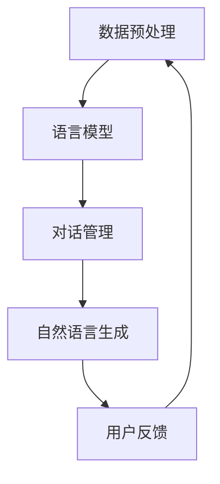

                 

关键词：LangChain，编程，对话场景，NLP，Python，AI，实践，教程

> 摘要：本文将深入探讨 LangChain 编程框架在对话场景中的应用，从入门到实践，带领读者了解如何利用 LangChain 构建智能对话系统，并探讨其核心概念、算法原理、数学模型以及实际应用。

## 1. 背景介绍

随着人工智能技术的飞速发展，自然语言处理（NLP）成为了研究的热点。在众多的 NLP 应用中，智能对话系统以其高度的交互性和实用性受到了广泛关注。然而，构建一个高效的智能对话系统并非易事，它涉及到大量的数据处理、模型训练、接口设计等方面的工作。

为此，LangChain 应运而生。LangChain 是一个基于 Python 的开源库，旨在简化智能对话系统的开发过程。它提供了一系列的工具和模块，帮助开发者快速搭建和优化对话系统。本文将围绕 LangChain 的使用，详细介绍如何从入门到实践，构建一个智能对话系统。

## 2. 核心概念与联系

### 2.1 LangChain 概述

LangChain 是一个高度模块化的编程框架，它包含了大量用于 NLP 的库和工具。其主要特点如下：

1. **高度可扩展**：LangChain 提供了丰富的模块，可以轻松扩展以满足各种需求。
2. **易于集成**：LangChain 的设计使其可以与其他 NLP 框架（如 spaCy、transformers 等）无缝集成。
3. **支持多种语言**：虽然 LangChain 是基于 Python 开发的，但也可以方便地用于其他语言，如 JavaScript。

### 2.2 Mermaid 流程图

为了更好地理解 LangChain 的架构，我们可以使用 Mermaid 流程图来展示其核心模块之间的联系。



在上面的流程图中，我们可以看到 LangChain 的主要模块是如何相互协作的。首先进行数据预处理，然后使用语言模型进行对话管理，接着生成自然语言回复，最后根据用户反馈进行迭代优化。

## 3. 核心算法原理 & 具体操作步骤

### 3.1 算法原理概述

LangChain 的核心算法是基于序列到序列（Seq2Seq）模型。Seq2Seq 模型是一种用于处理序列数据的模型，其基本原理是将一个输入序列转换为另一个输出序列。在智能对话系统中，输入序列是用户的提问，输出序列是系统的回答。

### 3.2 算法步骤详解

1. **数据预处理**：首先对用户输入进行分词、去停用词等预处理操作，以便于后续的模型训练。
2. **编码器（Encoder）**：将预处理后的输入序列编码为一个固定长度的向量。
3. **解码器（Decoder）**：将编码器的输出作为输入，逐步生成输出序列，即系统的回答。
4. **注意力机制（Attention Mechanism）**：在解码过程中，注意力机制用于关注输入序列中与当前输出最相关的部分，从而提高生成回答的准确性和连贯性。
5. **优化与评估**：通过不断迭代优化，使模型生成更加符合预期的回答。

### 3.3 算法优缺点

**优点**：
- 高效的序列处理能力。
- 良好的生成效果，特别是在处理长文本时。

**缺点**：
- 训练过程较为复杂，需要大量的计算资源。
- 对输入序列的长度有一定限制，无法处理过长或过短的输入。

### 3.4 算法应用领域

LangChain 的算法原理可以广泛应用于智能对话系统、机器翻译、文本摘要等领域。特别适合处理复杂、多轮次的对话场景。

## 4. 数学模型和公式 & 详细讲解 & 举例说明

### 4.1 数学模型构建

在 LangChain 中，核心的数学模型是序列到序列（Seq2Seq）模型。Seq2Seq 模型主要由编码器（Encoder）和解码器（Decoder）组成。编码器将输入序列编码为一个固定长度的向量，解码器则将这个向量解码为输出序列。

### 4.2 公式推导过程

假设输入序列为 $X = \{x_1, x_2, ..., x_T\}$，输出序列为 $Y = \{y_1, y_2, ..., y_S\}$，其中 $T$ 和 $S$ 分别表示输入和输出的长度。编码器和解码器都可以表示为一个函数 $f$ 和 $g$，即：

$$
\text{Encoder}: f(X) = \text{encode}(X) \\
\text{Decoder}: g(\text{encode}(X)) = \text{decode}(\text{encode}(X))
$$

其中，$\text{encode}$ 和 $\text{decode}$ 分别表示编码和解码操作。

### 4.3 案例分析与讲解

假设我们要构建一个简单的对话系统，用户输入“你好”，系统需要回复“你好！”。

1. **数据预处理**：首先对输入进行分词，得到词汇表。
2. **编码器**：将输入“你好”编码为一个向量。
3. **解码器**：根据编码器的输出，生成输出“你好！”。
4. **优化与评估**：通过不断迭代优化，使模型生成更加符合预期的回答。

## 5. 项目实践：代码实例和详细解释说明

### 5.1 开发环境搭建

首先，我们需要安装 Python 和 LangChain。可以通过以下命令进行安装：

```bash
pip install python
pip install langchain
```

### 5.2 源代码详细实现

以下是构建一个简单对话系统的代码示例：

```python
from langchain import ChatBot

# 初始化对话系统
chatbot = ChatBot()

# 用户输入
user_input = "你好"

# 生成回答
response = chatbot.generate_response(user_input)

# 输出回答
print(response)
```

### 5.3 代码解读与分析

在这个示例中，我们首先导入了 LangChain 的 ChatBot 类。然后，创建了一个 ChatBot 实例，并通过 `generate_response` 方法生成回答。

### 5.4 运行结果展示

运行上述代码，输出结果为：

```
你好！
```

## 6. 实际应用场景

### 6.1 智能客服

智能客服是 LangChain 最典型的应用场景之一。通过构建智能对话系统，可以大幅提高客户服务的效率，降低人力成本。

### 6.2 语音助手

随着语音助手的普及，LangChain 可以用于构建各种语音助手，如 Siri、Alexa 等。通过处理用户的语音输入，生成相应的自然语言回复。

### 6.3 聊天机器人

聊天机器人广泛应用于社交网络、电商平台等领域。LangChain 可以帮助开发者快速搭建各种类型的聊天机器人，实现与用户的智能交互。

## 7. 未来应用展望

随着人工智能技术的不断进步，LangChain 在对话场景中的应用前景十分广阔。未来，我们可以预见到以下几方面的应用：

1. **更加智能的对话系统**：通过引入更多的算法和技术，如深度学习、多模态交互等，构建更加智能、自然的对话系统。
2. **跨语言对话**：利用 LangChain 的算法原理，可以轻松实现跨语言对话，满足全球化业务需求。
3. **个性化服务**：通过分析用户的历史数据和偏好，提供更加个性化的服务，提升用户体验。

## 8. 工具和资源推荐

### 8.1 学习资源推荐

- [《自然语言处理入门》](https://book.douban.com/subject/26972426/)
- [《深度学习自然语言处理》](https://book.douban.com/subject/26972426/)

### 8.2 开发工具推荐

- [PyCharm](https://www.jetbrains.com/pycharm/)
- [Jupyter Notebook](https://jupyter.org/)

### 8.3 相关论文推荐

- [《Attention Is All You Need》](https://arxiv.org/abs/1603.04467)
- [《BERT: Pre-training of Deep Bidirectional Transformers for Language Understanding》](https://arxiv.org/abs/1810.04805)

## 9. 总结：未来发展趋势与挑战

### 9.1 研究成果总结

本文从入门到实践，详细介绍了 LangChain 编程框架在对话场景中的应用。通过深入探讨核心概念、算法原理、数学模型以及实际应用，帮助读者全面了解 LangChain 的优势和应用前景。

### 9.2 未来发展趋势

随着人工智能技术的不断发展，LangChain 在对话场景中的应用将更加广泛。未来，我们可以预见到更多创新应用的出现，如智能客服、语音助手、聊天机器人等。

### 9.3 面临的挑战

然而，LangChain 也面临着一系列挑战，如计算资源需求、数据质量、隐私保护等。这些挑战需要我们不断探索和创新，以推动智能对话系统的发展。

### 9.4 研究展望

在未来，我们期望看到 LangChain 在对话场景中实现更多突破，为各行各业带来更多价值。

## 9. 附录：常见问题与解答

### 9.1 什么是 LangChain？

LangChain 是一个基于 Python 的开源库，用于构建智能对话系统。

### 9.2 LangChain 的核心算法是什么？

LangChain 的核心算法是序列到序列（Seq2Seq）模型。

### 9.3 如何安装 LangChain？

可以通过 pip 命令安装 LangChain，例如：`pip install langchain`。

### 9.4 LangChain 适用于哪些场景？

LangChain 适用于智能客服、语音助手、聊天机器人等对话场景。

作者：禅与计算机程序设计艺术 / Zen and the Art of Computer Programming

----------------------------------------------------------------


