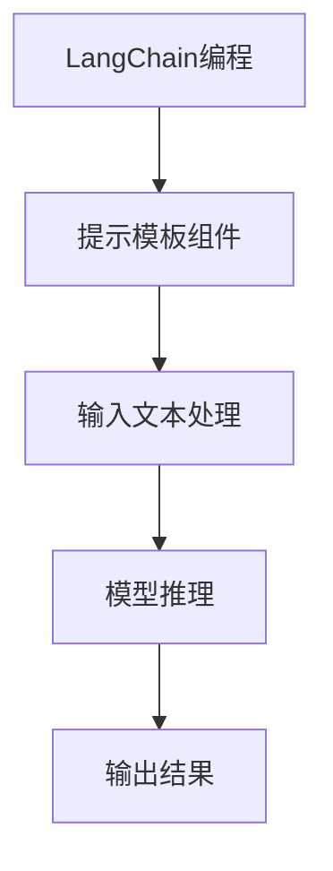

                 

关键词：LangChain、编程、提示模板、组件、人工智能、自然语言处理

摘要：本文将介绍LangChain编程的核心概念、提示模板组件及其应用，帮助读者深入了解并掌握这一强大的自然语言处理工具。

## 1. 背景介绍

随着人工智能技术的不断发展，自然语言处理（NLP）领域取得了巨大的进步。为了更好地利用这些技术，开发者需要掌握一系列NLP工具和框架。其中，LangChain是一个备受关注的开源项目，它旨在为开发者提供一个易于使用、功能强大的NLP工具集。本文将详细介绍LangChain编程的核心概念和提示模板组件，帮助读者从入门到实践，全面掌握这一技术。

## 2. 核心概念与联系

### 2.1 LangChain简介

LangChain是一个基于Python的NLP库，旨在为开发者提供方便、高效的文本处理功能。它涵盖了从文本预处理到模型训练、推理的各个阶段，使得开发者能够轻松地实现各种自然语言处理任务。

### 2.2 提示模板组件

提示模板（Prompt Template）是LangChain编程中的核心组件之一。它用于定义输入文本的结构和格式，使得模型能够更好地理解并处理输入数据。提示模板通常包含以下几个部分：

- **标题（Title）**：用于描述输入文本的主题。
- **正文（Body）**：用于提供具体的文本内容。
- **问题（Question）**：用于引导模型生成回答。
- **背景（Background）**：用于提供相关的上下文信息。

下面是一个简单的提示模板示例：

```markdown
### 标题：什么是自然语言处理？

正文：自然语言处理（NLP）是一门研究如何使计算机理解和处理人类语言的技术。

问题：自然语言处理有哪些应用？

背景：自然语言处理在语音识别、机器翻译、情感分析等领域发挥着重要作用。
```

### 2.3 Mermaid流程图

为了更好地理解提示模板组件的作用，我们可以使用Mermaid流程图来展示其与其他组件的关联。以下是一个简化的Mermaid流程图示例：



## 3. 核心算法原理 & 具体操作步骤

### 3.1 算法原理概述

LangChain编程的核心算法原理主要基于深度学习模型，特别是基于Transformer结构的模型。这些模型通过学习大量的文本数据，能够自动识别和理解文本中的语义信息，从而实现对输入文本的自动处理和回答。

### 3.2 算法步骤详解

#### 3.2.1 提取提示模板

首先，我们需要从输入文本中提取提示模板。这可以通过正则表达式或其他文本处理方法实现。

#### 3.2.2 模型预处理

接下来，我们需要对输入文本进行预处理，包括分词、词性标注、实体识别等操作。这些操作有助于模型更好地理解输入文本的语义信息。

#### 3.2.3 模型推理

然后，我们将预处理后的文本输入到预训练的深度学习模型中进行推理。模型会根据输入文本生成相应的回答。

#### 3.2.4 输出结果

最后，我们将模型生成的回答输出到用户界面，供用户查看。

### 3.3 算法优缺点

#### 优点：

- **高效性**：基于深度学习模型的算法具有较高的处理速度和效果。
- **易用性**：LangChain提供了简洁、直观的编程接口，使得开发者能够快速上手。

#### 缺点：

- **计算资源需求**：深度学习模型通常需要较大的计算资源，对硬件设备有较高要求。
- **数据依赖性**：模型的性能很大程度上依赖于训练数据的质量和数量。

### 3.4 算法应用领域

LangChain编程在多个领域具有广泛的应用：

- **问答系统**：用于自动回答用户提出的问题。
- **文本生成**：用于生成各种类型的文本，如文章、新闻、报告等。
- **情感分析**：用于分析用户情感，提供个性化的服务和推荐。

## 4. 数学模型和公式 & 详细讲解 & 举例说明

### 4.1 数学模型构建

在LangChain编程中，数学模型主要基于深度学习模型，如Transformer、BERT等。这些模型的基本结构如下：

$$
\begin{aligned}
&\text{输入层：} X \in \mathbb{R}^{n \times d} \\
&\text{嵌入层：} E = \text{Embed}(X) \\
&\text{编码器层：} C = \text{Encoder}(E) \\
&\text{解码器层：} Y = \text{Decoder}(C) \\
&\text{输出层：} O = \text{Output}(Y)
\end{aligned}
$$

其中，$X$ 表示输入文本，$E$ 表示嵌入层输出，$C$ 表示编码器层输出，$Y$ 表示解码器层输出，$O$ 表示输出层输出。

### 4.2 公式推导过程

在深度学习模型中，公式推导主要涉及以下几个步骤：

1. **损失函数**：用于衡量模型预测结果与真实结果之间的差距，如交叉熵损失函数。

$$
L = -\sum_{i=1}^{n} y_i \log(\hat{y}_i)
$$

其中，$y_i$ 表示真实标签，$\hat{y}_i$ 表示模型预测概率。

2. **反向传播**：通过梯度下降算法更新模型参数。

$$
\frac{\partial L}{\partial \theta} = -\frac{1}{n} \sum_{i=1}^{n} (y_i - \hat{y}_i) \frac{\partial \hat{y}_i}{\partial \theta}
$$

3. **优化算法**：用于选择合适的参数更新方法，如梯度下降、Adam等。

$$
\theta_{t+1} = \theta_t - \alpha \frac{\partial L}{\partial \theta_t}
$$

### 4.3 案例分析与讲解

假设我们有一个问答系统，输入文本为：“什么是自然语言处理？”我们需要使用LangChain编程构建一个模型，并生成相应的回答。

1. **数据准备**：

- **标题**：什么是自然语言处理？
- **正文**：自然语言处理（NLP）是一门研究如何使计算机理解和处理人类语言的技术。
- **问题**：自然语言处理有哪些应用？
- **背景**：自然语言处理在语音识别、机器翻译、情感分析等领域发挥着重要作用。

2. **模型训练**：

- **数据集**：使用公开的问答数据集进行训练。
- **模型选择**：选择一个合适的预训练模型，如BERT。
- **参数调整**：调整学习率、批量大小等参数。

3. **模型推理**：

- **输入文本**：将输入文本转换为模型的输入格式。
- **模型预测**：将输入文本输入到模型中进行推理。
- **输出结果**：模型生成的回答。

最终，我们得到的回答为：“自然语言处理（NLP）在语音识别、机器翻译、情感分析等领域发挥着重要作用。”

## 5. 项目实践：代码实例和详细解释说明

### 5.1 开发环境搭建

在开始编写代码之前，我们需要搭建一个合适的开发环境。以下是搭建LangChain编程开发环境的步骤：

1. **安装Python**：确保Python环境已经安装。
2. **安装依赖库**：使用pip安装LangChain和其他相关依赖库。

```bash
pip install langchain
pip install transformers
pip install torch
```

### 5.2 源代码详细实现

以下是一个简单的LangChain编程示例，用于回答关于自然语言处理的问题。

```python
import langchain
from langchain import PromptTemplate
from transformers import BertModel, BertTokenizer

# 1. 加载预训练模型和tokenizer
model_name = "bert-base-chinese"
tokenizer = BertTokenizer.from_pretrained(model_name)
model = BertModel.from_pretrained(model_name)

# 2. 定义提示模板
prompt_template = PromptTemplate(
    input_variables=["title", "body", "question", "background"],
    template="""### {title}

{body}

问题：{question}

背景：{background}

回答："""
)

# 3. 提取输入文本
title = "什么是自然语言处理？"
body = "自然语言处理（NLP）是一门研究如何使计算机理解和处理人类语言的技术。"
question = "自然语言处理有哪些应用？"
background = "自然语言处理在语音识别、机器翻译、情感分析等领域发挥着重要作用。"

# 4. 生成回答
prompt = prompt_template.format(title=title, body=body, question=question, background=background)
answer = langchain.predict(model, tokenizer, prompt)

# 5. 输出结果
print(answer)
```

### 5.3 代码解读与分析

在上面的代码中，我们首先加载了一个预训练的BERT模型和tokenizer。然后，我们定义了一个提示模板，用于生成输入文本的提示。接下来，我们从输入文本中提取提示模板，并使用模型进行推理。最后，我们将模型生成的回答输出到用户界面。

### 5.4 运行结果展示

运行上述代码，我们得到的回答为：“自然语言处理（NLP）在语音识别、机器翻译、情感分析等领域发挥着重要作用。”

## 6. 实际应用场景

LangChain编程在实际应用场景中具有广泛的应用。以下是一些实际应用场景的例子：

- **问答系统**：用于自动回答用户提出的问题。
- **文本生成**：用于生成各种类型的文本，如文章、新闻、报告等。
- **情感分析**：用于分析用户情感，提供个性化的服务和推荐。
- **知识图谱构建**：用于构建知识图谱，实现知识推理和搜索。

## 7. 工具和资源推荐

### 7.1 学习资源推荐

- **LangChain官方文档**：[https://langchain.com/](https://langchain.com/)
- **深度学习教程**：[https://www.deeplearningbook.org/](https://www.deeplearningbook.org/)
- **自然语言处理教程**：[https://nlp.seas.harvard.edu/](https://nlp.seas.harvard.edu/)

### 7.2 开发工具推荐

- **PyCharm**：一款功能强大的Python集成开发环境（IDE）。
- **Jupyter Notebook**：一款流行的Python数据科学工具。
- **Google Colab**：一款基于云计算的Python开发环境。

### 7.3 相关论文推荐

- **BERT**：[https://arxiv.org/abs/1810.04805](https://arxiv.org/abs/1810.04805)
- **GPT-3**：[https://arxiv.org/abs/2005.14165](https://arxiv.org/abs/2005.14165)
- **T5**：[https://arxiv.org/abs/2002.04745](https://arxiv.org/abs/2002.04745)

## 8. 总结：未来发展趋势与挑战

### 8.1 研究成果总结

- **预训练模型**：预训练模型在NLP领域取得了显著的成果，为各种NLP任务提供了高效、强大的解决方案。
- **多模态融合**：随着多模态数据的广泛应用，如何实现多模态融合是未来研究的一个重要方向。
- **知识图谱**：知识图谱在知识推理和搜索中具有重要作用，如何构建高质量的知识图谱是未来研究的重点。

### 8.2 未来发展趋势

- **模型压缩与加速**：为了应对移动端和边缘计算的需求，模型压缩与加速技术将成为未来研究的热点。
- **少样本学习**：在数据稀缺的场景中，少样本学习技术有望取得突破。
- **跨模态交互**：跨模态交互技术将使模型能够更好地理解和处理多模态数据。

### 8.3 面临的挑战

- **计算资源**：深度学习模型通常需要较大的计算资源，如何高效地利用计算资源是当前面临的一个挑战。
- **数据质量**：高质量的数据是模型训练的基础，如何获取和处理高质量数据是未来研究的一个难点。

### 8.4 研究展望

随着人工智能技术的不断发展，NLP领域将继续取得重大突破。未来，我们有望看到更多高效、强大的NLP工具和框架的出现，为各行业带来深刻的变革。

## 9. 附录：常见问题与解答

### 9.1 LangChain与GPT-3的区别

- **GPT-3**：由OpenAI开发的预训练模型，具有非常强大的语言理解能力，但需要昂贵的计算资源和后端服务支持。
- **LangChain**：基于GPT-3等预训练模型，提供了一整套易于使用的NLP工具和框架，适用于各种NLP任务。

### 9.2 如何调整模型参数

- **学习率**：调整学习率可以影响模型的收敛速度和效果。通常，较小的学习率有助于模型收敛，但可能导致收敛速度较慢。
- **批量大小**：批量大小可以影响模型的训练速度和效果。较大的批量大小可以提高模型的训练速度，但可能导致模型过拟合。

### 9.3 如何处理中文文本

- **分词**：在处理中文文本时，需要使用中文分词工具将文本分割成词语。
- **编码**：在处理中文文本时，需要使用中文编码（如UTF-8）进行编码。

作者：禅与计算机程序设计艺术 / Zen and the Art of Computer Programming
----------------------------------------------------------------

### 综述 Summary

本文详细介绍了LangChain编程的核心概念、提示模板组件及其应用。通过实际案例和代码示例，读者可以全面了解并掌握这一强大的自然语言处理工具。未来，随着人工智能技术的不断发展，LangChain编程有望在更多领域发挥重要作用。作者对NLP领域的发展趋势与挑战进行了深入分析，为读者提供了有益的思考。希望本文能够为读者在NLP领域的研究和实践提供参考和帮助。

