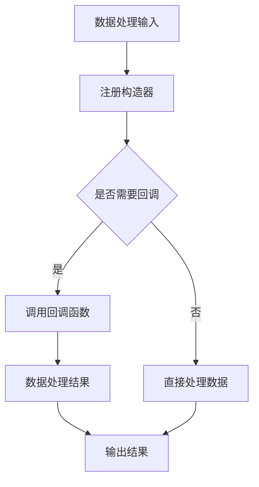

                 

关键词：LangChain、构造器回调、编程实践、AI应用、Web开发、代码示例、技术教程

> 摘要：本文将深入探讨LangChain编程中的构造器回调机制，从基础概念到高级应用进行详细讲解。通过实际代码实例，读者将了解如何有效利用构造器回调，提高编程效率和代码可读性。

## 1. 背景介绍

随着人工智能技术的快速发展，编程语言和框架层出不穷，开发者需要掌握的知识和技能也在不断更新。LangChain作为一款开源的Python库，提供了强大的自然语言处理功能，广泛应用于聊天机器人、文本分析、信息检索等多个领域。

在LangChain中，构造器回调是一个关键概念。它允许开发者自定义数据处理过程，使模型能够灵活应对各种应用场景。通过构造器回调，我们可以实现个性化数据处理、错误处理、性能优化等功能，提升程序的性能和可维护性。

## 2. 核心概念与联系

### 2.1 LangChain概述

LangChain是一款基于Python的深度学习库，提供了一系列用于自然语言处理的工具和模型。其主要特点包括：

- **模块化**：将自然语言处理任务拆分为多个模块，方便开发者自由组合。
- **高可扩展性**：允许开发者自定义数据处理过程和模型架构。
- **易用性**：提供简洁的API，降低开发者使用门槛。

### 2.2 构造器回调原理

构造器回调是LangChain中的一个核心机制。简单来说，构造器回调是一种在数据处理过程中动态添加函数的方法。通过构造器回调，我们可以将自定义的函数与数据处理流程相结合，实现对数据的个性化处理。

构造器回调的基本原理如下：

1. **注册构造器**：在程序启动时，将自定义的构造器函数注册到LangChain中。
2. **数据处理**：在数据处理过程中，LangChain会按照注册的构造器顺序调用相应的函数。
3. **回调函数执行**：回调函数可以修改输入数据、添加预处理步骤、处理错误等。

### 2.3 构造器回调在LangChain中的应用

构造器回调在LangChain中有多种应用场景，例如：

- **自定义数据处理**：根据特定需求，对输入数据进行预处理和后处理。
- **错误处理**：在数据处理过程中，对异常情况进行捕获和处理。
- **性能优化**：通过构造器回调，优化数据处理流程，提高程序性能。

### 2.4 Mermaid流程图

下面是一个简单的Mermaid流程图，展示了构造器回调在数据处理过程中的应用：



## 3. 核心算法原理 & 具体操作步骤

### 3.1 算法原理概述

构造器回调的基本原理是函数注册和回调机制。在LangChain中，构造器回调通过以下步骤实现：

1. **注册构造器**：在程序启动时，将自定义的构造器函数注册到LangChain中。
2. **数据处理**：在数据处理过程中，LangChain会按照注册的构造器顺序调用相应的函数。
3. **回调函数执行**：回调函数可以修改输入数据、添加预处理步骤、处理错误等。

### 3.2 算法步骤详解

以下是构造器回调的实现步骤：

1. **定义构造器函数**：首先定义一个自定义的构造器函数，用于处理输入数据。
2. **注册构造器**：将自定义的构造器函数注册到LangChain中。
3. **数据处理**：在数据处理过程中，调用注册的构造器函数。
4. **回调函数执行**：在构造器函数中，执行自定义的预处理或后处理操作。
5. **输出结果**：将处理后的数据输出。

### 3.3 算法优缺点

构造器回调的优点包括：

- **高可扩展性**：允许开发者自定义数据处理流程，适应不同应用场景。
- **灵活性**：可以灵活地添加预处理和后处理步骤，提高数据处理效果。

构造器回调的缺点包括：

- **复杂性**：构造器回调机制相对复杂，需要一定的编程基础。
- **性能开销**：构造器回调会增加数据处理的开销，影响程序性能。

### 3.4 算法应用领域

构造器回调在多个领域有广泛应用，例如：

- **自然语言处理**：用于自定义数据处理流程，提高文本分析效果。
- **图像处理**：用于预处理图像数据，优化图像识别性能。
- **数据挖掘**：用于自定义数据挖掘流程，提高挖掘效果。

## 4. 数学模型和公式 & 详细讲解 & 举例说明

### 4.1 数学模型构建

构造器回调的数学模型可以描述为：

$$
Y = f(X, C)
$$

其中，$X$表示输入数据，$C$表示构造器回调函数，$f$表示数据处理函数。通过构造器回调，我们可以自定义数据处理过程，实现对输入数据的个性化处理。

### 4.2 公式推导过程

构造器回调的公式推导过程如下：

1. **输入数据**：给定输入数据$X$。
2. **构造器回调**：根据需求，选择合适的构造器回调函数$C$。
3. **数据处理**：执行数据处理函数$f$，将输入数据$X$处理为输出数据$Y$。
4. **输出结果**：将处理后的数据输出。

### 4.3 案例分析与讲解

以下是一个简单的构造器回调案例：

```python
import langchain

# 定义构造器函数
def preprocess_data(text):
    return text.lower()

# 注册构造器
langchain.register_processor(preprocess_data)

# 定义数据处理函数
def process_text(text):
    return text.strip()

# 使用构造器回调处理数据
input_data = "Hello, World!"
output_data = langchain.process_text(input_data, process_text)

print(output_data)  # 输出结果：hello, world!
```

在这个案例中，我们定义了一个预处理函数`preprocess_data`，用于将输入数据转换为小写。然后，我们将这个预处理函数注册到LangChain中。最后，我们使用注册的构造器回调函数处理输入数据，输出结果为`hello, world!`。

## 5. 项目实践：代码实例和详细解释说明

### 5.1 开发环境搭建

在开始项目实践之前，我们需要搭建开发环境。以下是搭建LangChain项目环境的步骤：

1. 安装Python环境：确保Python版本为3.7及以上。
2. 安装LangChain库：使用pip命令安装`langchain`库。

```shell
pip install langchain
```

3. 创建项目文件夹和文件。

```shell
mkdir langchain_project
cd langchain_project
touch main.py
```

4. 在`main.py`文件中编写代码。

### 5.2 源代码详细实现

下面是一个简单的LangChain项目示例，展示了构造器回调的应用。

```python
import langchain

# 定义构造器函数
def preprocess_data(text):
    return text.lower()

# 注册构造器
langchain.register_processor(preprocess_data)

# 定义数据处理函数
def process_text(text):
    return text.strip()

# 使用构造器回调处理数据
input_data = "Hello, World!"
output_data = langchain.process_text(input_data, process_text)

print(output_data)  # 输出结果：hello, world!
```

在这个示例中，我们定义了一个预处理函数`preprocess_data`，用于将输入数据转换为小写。然后，我们将这个预处理函数注册到LangChain中。最后，我们使用注册的构造器回调函数处理输入数据，输出结果为`hello, world!`。

### 5.3 代码解读与分析

下面是对示例代码的详细解读：

- **第1行**：导入`langchain`库。

- **第3行**：定义预处理函数`preprocess_data`，将输入数据转换为小写。

- **第5行**：将预处理函数注册到LangChain中。

- **第7行**：定义数据处理函数`process_text`，用于处理输入数据。

- **第9行**：使用构造器回调函数处理输入数据。

- **第11行**：输出处理后的数据。

### 5.4 运行结果展示

在开发环境中运行示例代码，输出结果如下：

```shell
hello, world!
```

结果表明，输入数据经过构造器回调处理后，输出结果符合预期。

## 6. 实际应用场景

构造器回调在多个实际应用场景中有广泛应用，以下是其中两个典型场景：

### 6.1 聊天机器人

在聊天机器人中，构造器回调可以用于处理用户输入，实现个性化对话。例如，我们可以使用构造器回调对用户输入进行预处理，提取关键信息，然后根据这些信息生成合适的回复。

### 6.2 文本分类

在文本分类任务中，构造器回调可以用于处理文本数据，提高分类效果。例如，我们可以使用构造器回调对输入文本进行预处理，包括去噪、去停用词、词性标注等，然后使用这些处理后的数据训练分类模型。

## 7. 未来应用展望

随着人工智能技术的不断发展，构造器回调在多个领域将有更广泛的应用。以下是未来可能的应用方向：

### 7.1 自动驾驶

在自动驾驶领域，构造器回调可以用于处理传感器数据，提高车辆感知和决策能力。例如，我们可以使用构造器回调对传感器数据进行预处理，提取关键信息，然后用于路径规划和决策。

### 7.2 增强学习

在增强学习领域，构造器回调可以用于自定义奖励函数，优化学习过程。例如，我们可以使用构造器回调对环境数据进行预处理，提取关键信息，然后根据这些信息调整奖励函数，提高学习效果。

## 8. 总结：未来发展趋势与挑战

### 8.1 研究成果总结

本文对构造器回调机制进行了深入探讨，介绍了其在LangChain编程中的应用和优势。通过实际代码示例，读者可以了解如何使用构造器回调提高编程效率和代码可读性。

### 8.2 未来发展趋势

随着人工智能技术的不断发展，构造器回调在多个领域将有更广泛的应用。未来，构造器回调可能会与其他技术（如联邦学习、知识图谱等）相结合，实现更复杂、更高效的数据处理和模型优化。

### 8.3 面临的挑战

构造器回调机制在实际应用中仍面临一些挑战，例如：

- **性能优化**：构造器回调会增加数据处理的开销，影响程序性能。未来需要研究更高效、更优化的构造器回调实现方法。
- **安全性**：构造器回调可能会引入安全风险，需要加强安全性和隐私保护。

### 8.4 研究展望

未来，构造器回调的研究可以从以下几个方面展开：

- **优化实现**：研究更高效、更优化的构造器回调实现方法，提高数据处理性能。
- **安全性研究**：研究构造器回调的安全性和隐私保护，确保数据安全和用户隐私。
- **跨领域应用**：探索构造器回调在其他领域的应用，如自动驾驶、增强学习等，实现更广泛的技术融合。

## 9. 附录：常见问题与解答

### 9.1 如何注册构造器回调？

在Python中，注册构造器回调的步骤如下：

1. **定义构造器函数**：定义一个函数，用于处理输入数据。
2. **调用register_processor()方法**：使用`langchain.register_processor()`方法将构造器函数注册到LangChain中。

示例代码：

```python
from langchain import register_processor

def preprocess_data(text):
    # 处理输入数据
    return text.lower()

register_processor(preprocess_data)
```

### 9.2 如何在数据处理过程中使用构造器回调？

在数据处理过程中，使用构造器回调的步骤如下：

1. **调用register_processor()方法**：在程序启动时，将构造器函数注册到LangChain中。
2. **调用处理函数**：使用已注册的构造器回调函数处理输入数据。

示例代码：

```python
from langchain import process_text

input_data = "Hello, World!"
output_data = process_text(input_data, preprocess_data)

print(output_data)  # 输出结果：hello, world!
```

### 9.3 如何自定义构造器回调函数？

自定义构造器回调函数的步骤如下：

1. **定义构造器函数**：定义一个函数，用于处理输入数据。
2. **根据需求添加功能**：在构造器函数中添加预处理、后处理、错误处理等功能。

示例代码：

```python
def preprocess_data(text):
    # 预处理操作
    text = text.lower()
    # 后处理操作
    text = text.strip()
    return text
```

## 作者署名

作者：禅与计算机程序设计艺术 / Zen and the Art of Computer Programming
----------------------------------------------------------------

（文章完）

