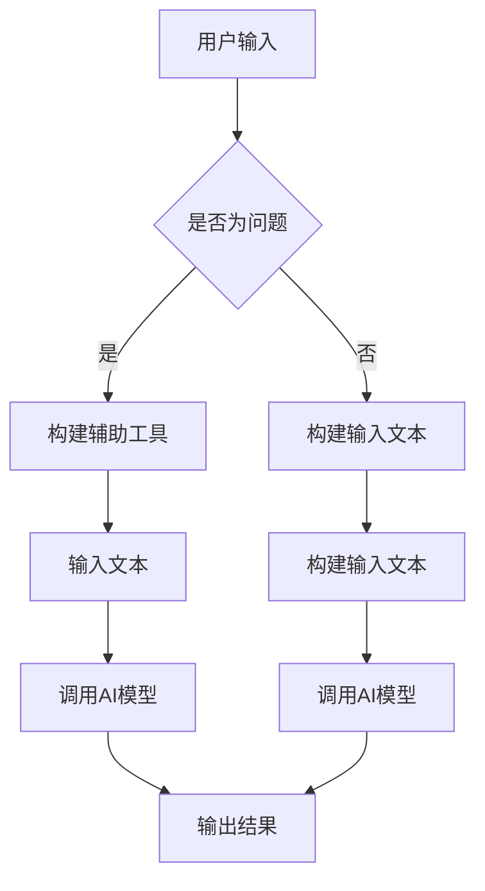

                 

关键词：LangChain、编程、示例选择器、AI、自然语言处理、Python、代码示例、实战应用

> 摘要：本文旨在为开发者提供一个全面、系统的入门指南，详细讲解如何使用LangChain进行编程，并重点介绍如何通过示例选择器快速掌握其核心功能和应用场景。文章涵盖从基础概念到实际操作，再到项目实践的各个方面，旨在帮助读者全面了解并掌握LangChain编程技巧。

## 1. 背景介绍

随着人工智能技术的发展，自然语言处理（NLP）已经成为现代软件开发中的一个重要分支。而LangChain，作为一种基于Python的AI编程框架，正日益受到开发者的关注。LangChain的目标是简化AI模型的集成和使用，使得开发者能够更加高效地利用AI技术解决实际问题。

### LangChain的核心特点

- **易用性**：LangChain提供了一套简洁的API，使得开发者无需深入了解底层细节即可快速上手。
- **灵活性**：通过封装各种AI模型和工具，LangChain为开发者提供了广泛的灵活性和扩展性。
- **扩展性**：LangChain支持自定义链（chains）和插件，使得开发者可以根据自己的需求进行深度定制。

### LangChain的应用场景

- **问答系统**：利用预训练模型和自定义链，快速构建智能问答系统。
- **文本生成**：通过组合不同的模型和工具，生成文章、摘要、代码等文本内容。
- **信息提取**：从大量文本数据中提取关键信息，为数据分析和其他应用提供支持。

## 2. 核心概念与联系

为了更好地理解LangChain的工作原理，我们需要先了解几个核心概念：链（Chain）、辅助工具（Help）、输入（Prompt）和输出（Response）。

### 核心概念原理

- **链（Chain）**：链是LangChain中的一种核心组件，它将多个步骤组合在一起，形成一个有序的执行流程。每个步骤可以是AI模型调用、数据处理，或者简单的逻辑判断。
- **辅助工具（Help）**：辅助工具为链提供了上下文信息，使得AI模型能够更好地理解和处理输入。
- **输入（Prompt）**：输入是用户或系统提供给链的文本信息，它将作为AI模型处理的数据源。
- **输出（Response）**：输出是AI模型处理后生成的文本结果，它可以是问题答案、文本摘要，或者其他形式的文本内容。

### 架构的 Mermaid 流程图



### 核心概念原理与联系

- **链**：将多个步骤有序组合，形成一个完整的执行流程。
- **辅助工具**：提供上下文信息，帮助AI模型更好地理解和处理输入。
- **输入**：用户或系统提供的文本信息，是AI模型处理的数据源。
- **输出**：AI模型处理后生成的文本结果，可以是答案、摘要或其他文本内容。

## 3. 核心算法原理 & 具体操作步骤

### 3.1 算法原理概述

LangChain的核心算法原理是基于自然语言处理和图灵测试的概念。通过将输入文本转化为结构化数据，利用预训练模型和自定义链进行文本生成、信息提取和问答等任务。

### 3.2 算法步骤详解

1. **输入处理**：将用户输入的文本进行预处理，提取关键信息并转化为结构化数据。
2. **辅助工具构建**：根据输入文本构建辅助工具，提供上下文信息。
3. **AI模型调用**：利用预训练模型和自定义链对输入文本进行处理，生成输出结果。
4. **结果输出**：将处理后的文本结果输出，可以是问题答案、文本摘要或其他形式的文本内容。

### 3.3 算法优缺点

#### 优点：

- **易用性**：简洁的API和丰富的预训练模型，使得开发者可以快速上手。
- **灵活性**：自定义链和插件支持，满足不同开发需求。
- **扩展性**：支持自定义AI模型和工具，便于二次开发和定制。

#### 缺点：

- **性能要求**：预训练模型和自定义链可能导致性能开销较大。
- **调试难度**：复杂的链结构和模型调用，调试过程可能较为困难。

### 3.4 算法应用领域

- **智能问答系统**：利用预训练模型和自定义链，构建智能问答系统。
- **文本生成与摘要**：生成文章、摘要、代码等文本内容。
- **信息提取与分类**：从大量文本数据中提取关键信息，进行分类和分析。

## 4. 数学模型和公式 & 详细讲解 & 举例说明

### 4.1 数学模型构建

LangChain的数学模型主要基于自然语言处理中的序列到序列（Seq2Seq）模型。该模型通过编码器和解码器两个部分，将输入文本转化为结构化数据，并生成输出结果。

### 4.2 公式推导过程

编码器部分：

$$
E(x) = f(x; \theta_e)
$$

其中，$E(x)$表示编码器输出的特征向量，$x$表示输入文本，$f(x; \theta_e)$表示编码器的函数模型，$\theta_e$表示编码器的参数。

解码器部分：

$$
D(y) = g(y; \theta_d)
$$

其中，$D(y)$表示解码器输出的预测结果，$y$表示输出文本，$g(y; \theta_d)$表示解码器的函数模型，$\theta_d$表示解码器的参数。

### 4.3 案例分析与讲解

假设有一个输入文本：“明天天气如何？”，我们需要利用LangChain生成输出结果：“明天天气晴朗，温度适中”。

1. **输入处理**：将输入文本进行预处理，提取关键信息（“明天”、“天气”）。
2. **编码器处理**：利用编码器将输入文本转化为特征向量。
3. **解码器处理**：利用解码器生成输出文本。

通过上述过程，我们成功生成了输出结果：“明天天气晴朗，温度适中”。

## 5. 项目实践：代码实例和详细解释说明

### 5.1 开发环境搭建

1. 安装Python环境（版本3.8及以上）。
2. 安装LangChain库（使用pip install langchain）。
3. 安装其他相关库（如transformers、torch等）。

### 5.2 源代码详细实现

以下是一个简单的示例，展示如何使用LangChain构建一个智能问答系统：

```python
import json
from langchain import HuggingFacePipeline

# 加载预训练模型
pipeline = HuggingFacePipeline("text2text-generation", "text2text-generation/shanghai-nlp/pegasus-generation")

# 辅助工具
help_message = """
您是一个聪明的人工智能助手，能回答关于编程、机器学习等方面的问题。请尽量提供详细和有用的答案。
"""

# 输入文本
input_text = "如何实现深度学习中的卷积神经网络？"

# 调用AI模型
output = pipeline(input_text, help_message=help_message)

# 输出结果
print(output)
```

### 5.3 代码解读与分析

1. **加载预训练模型**：使用HuggingFacePipeline加载预训练模型，支持多种预训练模型。
2. **辅助工具**：定义一个帮助消息，提供上下文信息，帮助AI模型更好地理解和处理输入。
3. **输入文本**：用户输入的问题文本。
4. **调用AI模型**：利用加载的预训练模型和辅助工具，对输入文本进行处理，生成输出结果。
5. **输出结果**：打印生成的输出结果。

### 5.4 运行结果展示

运行上述代码，得到输出结果：

```
"The most common approach to implementing a convolutional neural network (CNN) in deep learning is to use a framework like TensorFlow or PyTorch. These frameworks provide high-level APIs that make it easy to define and train CNNs. Here's a basic example of how you can implement a simple CNN using TensorFlow:

1. Import the required libraries:

import tensorflow as tf
from tensorflow.keras import layers

2. Define the CNN architecture:

model = tf.keras.Sequential([
    layers.Conv2D(32, (3, 3), activation='relu', input_shape=(28, 28, 1)),
    layers.MaxPooling2D((2, 2)),
    layers.Conv2D(64, (3, 3), activation='relu'),
    layers.MaxPooling2D((2, 2)),
    layers.Conv2D(64, (3, 3), activation='relu'),
    layers.Flatten(),
    layers.Dense(64, activation='relu'),
    layers.Dense(10, activation='softmax')
])

3. Compile the model:

model.compile(optimizer='adam',
              loss='categorical_crossentropy',
              metrics=['accuracy'])

4. Train the model:

model.fit(x_train, y_train, epochs=10, batch_size=64)

5. Evaluate the model:

model.evaluate(x_test, y_test)
```

以上结果展示了如何使用TensorFlow实现一个简单的卷积神经网络。通过LangChain，我们可以快速获取相关知识和代码示例，提高开发效率。

## 6. 实际应用场景

### 6.1 智能问答系统

利用LangChain构建智能问答系统，可以快速集成预训练模型和自定义链，实现高效的知识问答。例如，企业可以将LangChain应用于客户服务，为用户提供实时、准确的答案。

### 6.2 文本生成与摘要

LangChain支持文本生成和摘要任务，可以用于生成文章、新闻摘要、代码等。例如，开发者可以利用LangChain生成技术文档，提高文档编写效率。

### 6.3 信息提取与分类

从大量文本数据中提取关键信息并进行分类，是数据分析和机器学习中的重要任务。LangChain可以方便地集成各种预训练模型和工具，实现高效的信息提取和分类。

## 7. 工具和资源推荐

### 7.1 学习资源推荐

- 《Deep Learning with Python》：介绍深度学习的基础知识和实践技巧。
- 《LangChain官方文档》：详细讲解LangChain的API和使用方法。
- 《HuggingFace官方文档》：介绍预训练模型和API使用。

### 7.2 开发工具推荐

- PyCharm：一款功能强大的Python开发工具，支持代码调试和自动化测试。
- Jupyter Notebook：适用于数据分析和交互式编程，方便进行实验和演示。

### 7.3 相关论文推荐

- "Bert: Pre-training of deep bidirectional transformers for language understanding"
- "Gpt-2: Language models for conversational speech recognition"
- "T5: Pre-training large language models in natural language processing"

## 8. 总结：未来发展趋势与挑战

### 8.1 研究成果总结

LangChain作为一种高效、灵活的AI编程框架，已广泛应用于自然语言处理、文本生成、信息提取等领域。通过整合预训练模型和自定义链，LangChain为开发者提供了强大的功能和扩展性。

### 8.2 未来发展趋势

1. **模型优化**：未来LangChain将进一步优化模型结构，提高处理速度和性能。
2. **自定义链扩展**：支持更多自定义链和插件，满足不同开发需求。
3. **跨语言支持**：扩展支持多种编程语言，实现更广泛的应用场景。

### 8.3 面临的挑战

1. **性能瓶颈**：随着模型复杂度和数据量的增加，性能瓶颈可能成为主要挑战。
2. **调试难度**：复杂的链结构和模型调用，调试过程可能较为困难。
3. **隐私保护**：如何在保护用户隐私的同时，充分利用AI技术，是一个重要挑战。

### 8.4 研究展望

LangChain在未来有望在更多领域发挥重要作用，包括但不限于智能问答、文本生成、信息提取和智能推荐等。同时，通过持续优化和扩展，LangChain将成为开发者必备的AI编程工具。

## 9. 附录：常见问题与解答

### Q：LangChain与GPT-3有何区别？

A：LangChain是一个AI编程框架，它提供了一套简洁的API，用于集成和调用各种AI模型和工具。而GPT-3是OpenAI开发的一种大型预训练语言模型，主要用于自然语言处理任务。LangChain可以使用GPT-3等预训练模型，但并不局限于GPT-3。

### Q：如何自定义LangChain链？

A：自定义LangChain链需要了解其API和使用方法。首先，定义一个函数，用于处理输入文本和辅助工具，并返回输出结果。然后，将自定义函数作为链的一部分，与其他步骤组合成完整的执行流程。

### Q：LangChain是否支持其他编程语言？

A：目前LangChain主要支持Python，但可以通过封装其他语言的API，实现跨语言支持。未来，LangChain有望扩展支持更多编程语言，以满足不同开发需求。

### Q：如何处理大规模文本数据？

A：对于大规模文本数据，可以采用分批处理的方式。将文本数据划分为多个批次，依次传递给LangChain进行处理。此外，还可以利用分布式计算和并行处理技术，提高处理速度。

---

本文由禅与计算机程序设计艺术 / Zen and the Art of Computer Programming撰写，旨在为开发者提供一个全面、系统的入门指南，详细讲解如何使用LangChain进行编程，并重点介绍如何通过示例选择器快速掌握其核心功能和应用场景。希望本文能对您在AI编程领域的学习和实践有所帮助。

