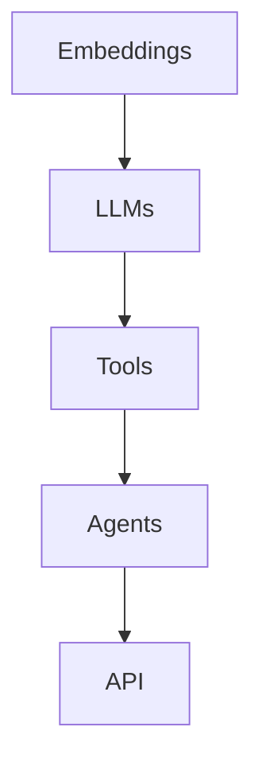
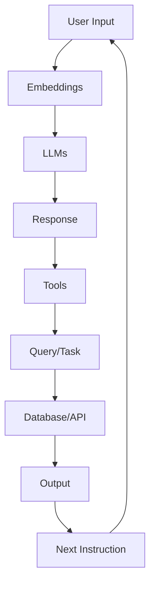

                 

关键词：LangChain、编程、自定义代理、工具、实践

摘要：本文将深入探讨如何利用LangChain框架构建自定义代理工具，从基础概念到实际操作，逐步引导读者掌握使用LangChain编程的技巧和策略，为自动化任务管理和数据处理提供一种高效的解决方案。

## 1. 背景介绍

在数字化时代，自动化和数据驱动的决策已经成为企业运营的关键因素。而在这其中，代理（Agent）技术的应用尤为广泛。代理能够模拟人类行为，在复杂的环境中自主决策，执行任务。随着人工智能技术的发展，基于机器学习、自然语言处理（NLP）等技术的代理越来越受到关注。

LangChain是一个开源框架，旨在简化构建知识密集型应用的过程。它提供了丰富的组件和API，允许开发者轻松地集成各种外部工具和库，构建自定义代理工具。这种框架不仅降低了开发门槛，还提高了开发效率。

本文将围绕LangChain框架，详细介绍如何从零开始构建自定义代理工具。我们将探讨LangChain的核心概念、组件及其在代理构建中的应用，并通过实际案例展示如何使用LangChain实现自定义代理功能。

## 2. 核心概念与联系

### 2.1 LangChain简介

LangChain是一个Python框架，它通过提供一个统一的API，使得开发者可以轻松地集成和处理各种文本数据。LangChain的核心组件包括：

- ** embeddings**: 用于将文本转换为向量，以供模型处理。
- ** LLMs (Large Language Models)**: 大型语言模型，如GPT、BERT等。
- ** tools**: 用于执行特定任务的工具，如搜索引擎、数据库等。
- ** agents**: 代理，用于实现交互式任务。

### 2.2 LangChain架构

下面是一个简化的Mermaid流程图，展示了LangChain的基本架构：



在这个架构中，** embeddings** 负责将文本转换为向量，** LLMs** 用于生成文本响应，** tools** 提供特定功能的接口，而** agents** 则是能够与用户交互并执行任务的代理。

### 2.3 LangChain组件应用

在构建自定义代理时，我们通常需要以下组件：

- ** embeddings**: 用于将用户的输入文本转换为向量，以供LLM处理。
- ** LLMs**: 根据输入文本生成响应。
- ** tools**: 用于执行如数据库查询、API调用等任务。
- ** agents**: 负责管理整个交互流程，并执行用户的指令。

下面是一个更详细的Mermaid流程图，展示了LangChain组件在代理构建中的应用：



在这个流程中，用户的输入首先通过 embeddings 转换为向量，然后由 LLMs 生成响应。响应可以包含下一步的操作指令，这些指令可以通过 tools 执行具体任务，最终将结果返回给用户。这个过程可以无限循环，实现连续的交互。

## 3. 核心算法原理 & 具体操作步骤

### 3.1 算法原理概述

LangChain的核心在于其模块化设计。通过将 embeddings、LLMs、tools和agents等组件模块化，开发者可以灵活地组合这些模块，实现复杂的代理功能。核心算法原理可以概括为以下几点：

1. **文本向量化**：使用 embeddings 将文本转换为向量，这一步是所有基于文本的NLP任务的基础。
2. **文本生成**：使用 LLMs 根据向量生成文本响应。LLM的选择和配置对代理的性能至关重要。
3. **任务执行**：通过 tools 执行具体的任务，这些工具可以是外部API、数据库或其他资源。
4. **交互控制**：agents 负责管理整个交互流程，包括接收用户输入、生成响应、执行任务和更新状态。

### 3.2 算法步骤详解

1. **初始化 LangChain 环境**：安装必要的库和依赖，如 `langchain`、`transformers` 等。

2. **定义 embeddings**：选择合适的 embeddings 模型，如 Sentence-BERT、Word2Vec 等，将文本转换为向量。

3. **定义 LLMs**：选择并配置 LLM 模型，如 GPT-3、BERT 等，用于生成文本响应。

4. **定义 tools**：根据任务需求，定义和配置 tools，如搜索引擎、API 接口等。

5. **创建 agent**：使用 LangChain 的 `ChatBot` 类创建代理，并配置 embeddings、LLMs 和 tools。

6. **交互循环**：实现一个循环，接收用户输入，生成响应，执行任务，并输出结果。

### 3.3 算法优缺点

**优点**：

- **模块化设计**：LangChain 的模块化设计使得开发者可以灵活地组合各种组件，快速构建自定义代理。
- **易用性**：LangChain 提供了统一的 API，降低了开发难度。
- **扩展性**：LangChain 支持多种 embeddings 和 LLMs，方便开发者根据需求进行选择。

**缺点**：

- **资源消耗**：由于 LangChain 需要处理大量的文本数据，对计算资源有一定的要求。
- **复杂性**：虽然 LangChain 提供了模块化设计，但构建复杂代理仍然需要开发者具备一定的编程和 NLP 知识。

### 3.4 算法应用领域

LangChain 在多个领域有广泛的应用，如：

- **客服系统**：构建智能客服代理，自动处理用户咨询和常见问题。
- **数据处理**：自动化数据采集、分析和报告生成。
- **教育辅助**：为学生提供个性化辅导和作业帮助。
- **日常任务管理**：自动化日程安排、提醒和通知。

## 4. 数学模型和公式 & 详细讲解 & 举例说明

### 4.1 数学模型构建

在 LangChain 中，文本向量化是一个核心步骤。常用的文本向量化模型包括：

- **Word2Vec**: 基于词频统计的模型，将每个词映射为一个固定维度的向量。
- **BERT**: 双向编码表示（Bidirectional Encoder Representations from Transformers），能够捕捉上下文信息。

下面是一个简化的数学模型构建：

$$
\text{vec}(x) = f_{\theta}(x)
$$

其中，$\text{vec}(x)$ 是文本向量，$f_{\theta}(x)$ 是向量化函数，$\theta$ 是模型参数。

### 4.2 公式推导过程

以 BERT 为例，BERT 的向量化过程可以分解为以下几个步骤：

1. **Tokenization**: 将文本拆分为 tokens。
2. **Embedding**: 为每个 token 生成 embeddings。
3. **Positional Encoding**: 为每个 token 添加位置信息。
4. **Transformer Encoder**: 通过多层 Transformer 架构处理文本。

BERT 的数学公式可以表示为：

$$
\text{vec}(x) = \text{TransformerEncoder}(\text{PositionalEncoding}(\text{Embedding}(x)))
$$

### 4.3 案例分析与讲解

假设我们要对一段文本“我今天要去超市买牛奶”进行向量化处理。以下是具体的步骤：

1. **Tokenization**:
   - 输入文本：“我今天要去超市买牛奶”。
   - 分词结果：[‘我’，‘今天’，‘要’，‘去’，‘超市’，‘买’，‘牛奶’]。

2. **Embedding**:
   - 使用 BERT 模型为每个 token 生成 embeddings。
   - embeddings 结果：$\{e_1, e_2, e_3, \ldots, e_n\}$，其中 $e_i$ 是第 $i$ 个 token 的 embeddings。

3. **Positional Encoding**:
   - 为每个 token 添加位置信息。
   - positional encoding 结果：$\{p_1, p_2, p_3, \ldots, p_n\}$。

4. **Transformer Encoder**:
   - 通过多层 Transformer 架构处理文本。
   - 向量化结果：$\text{vec}(x) = \text{TransformerEncoder}(\text{PositionalEncoding}(\text{Embedding}(x)))$。

通过上述步骤，我们得到了文本的向量表示。这些向量可以用于后续的 LLM 处理和代理构建。

## 5. 项目实践：代码实例和详细解释说明

### 5.1 开发环境搭建

在开始构建自定义代理之前，我们需要搭建一个合适的开发环境。以下是步骤：

1. **安装 Python**：确保 Python 版本不低于 3.8。

2. **安装 LangChain 相关库**：
   ```bash
   pip install langchain transformers
   ```

3. **准备 embeddings 和 LLMs**：根据需求选择合适的 embeddings 和 LLMs 模型，如 Sentence-BERT、GPT-3 等。

### 5.2 源代码详细实现

下面是一个简单的 LangChain 自定义代理实现示例：

```python
from langchain.agents import load_tool
from langchain.agents import initialize_agent
from langchain.chat_models import ChatOpenAI
from langchain.embeddings import HuggingFaceInContextEmbeddings
from langchain.llms import OpenAI

# 准备 embeddings 和 LLMs
embeddings = HuggingFaceInContextEmbeddings(model_name="sentence-transformers/all-MiniLM-L6-v2")
llm = OpenAI(temperature=0.5, max_tokens=100)

# 定义工具
search_tool = load_tool("search_qa_from_documents", embedding=embeddings, llm=llm)

# 创建 agent
agent = initialize_agent([(search_tool, "search")], search_tool, verbose=True)

# 交互循环
while True:
    prompt = input("请问有什么需要帮助的吗？")
    response = agent.predict(input=prompt)
    print(response)
```

### 5.3 代码解读与分析

上述代码展示了如何使用 LangChain 创建一个简单的自定义代理。以下是代码的关键部分解析：

- ** embeddings 和 LLMs 的准备**：我们选择了 Sentence-BERT 作为 embeddings 模型，OpenAI 的 GPT-3 作为 LLMs。
- **工具的定义**：这里我们定义了一个简单的搜索工具，用于从文档中查询答案。
- **agent 的创建**：使用 `initialize_agent` 函数创建代理，并传递工具列表和响应函数。
- **交互循环**：通过输入循环接收用户输入，并调用代理的 `predict` 方法生成响应。

### 5.4 运行结果展示

运行上述代码后，我们可以通过与代理的交互来体验其功能。例如，当输入“如何去最近的超市？”时，代理可能会生成如下响应：

```
"你可以乘坐地铁1号线在‘XX站’下车，然后步行500米即可到达‘XX超市’。"
```

这个简单的例子展示了 LangChain 如何帮助我们快速构建自定义代理，实现自动化任务管理。

## 6. 实际应用场景

### 6.1 客户服务

在客户服务领域，自定义代理可以用于处理客户咨询、问题解答和投诉处理。通过 LangChain，代理可以实时获取用户输入，通过搜索引擎或知识库查询答案，并以自然语言的方式回应用户。

### 6.2 数据分析

在数据分析领域，自定义代理可以帮助自动化数据采集、清洗和报告生成。代理可以通过 API 调用或数据库查询获取数据，然后使用 LLMs 生成分析报告，提供实时洞察。

### 6.3 教育辅导

在教育领域，自定义代理可以为学生提供个性化辅导和作业帮助。代理可以根据学生的学习进度和需求，推荐合适的学习资源和练习题，并为学生解答疑问。

### 6.4 日常任务管理

在日常生活中，自定义代理可以帮助我们管理日程、提醒重要事项、安排任务等。通过 LangChain，代理可以与用户进行实时交互，并根据用户的需求自动执行任务。

## 7. 工具和资源推荐

### 7.1 学习资源推荐

- **官方文档**：LangChain 的官方文档（https://langchain.com/docs）提供了详细的 API 文档和教程，是学习 LangChain 的最佳起点。
- **GitHub 仓库**：LangChain 的 GitHub 仓库（https://github.com/hwchase17/langchain）包含了丰富的示例代码和实践教程，可以帮助开发者快速上手。

### 7.2 开发工具推荐

- **Visual Studio Code**：推荐使用 Visual Studio Code 作为开发环境，其强大的插件支持可以提升开发效率。
- **PyCharm**：PyCharm 也非常适合用于 Python 开发，提供了丰富的调试和测试功能。

### 7.3 相关论文推荐

- **"Bridging the Gap Between Human and AI Understanding with Dialog Systems"**: 这篇论文探讨了如何通过对话系统实现人机交互，对构建自定义代理有重要的参考价值。
- **"Transformer Model Architecture for Natural Language Processing"**: 这篇论文详细介绍了 Transformer 模型在自然语言处理中的应用，是理解 LangChain 中的 LLMs 部分的必备阅读。

## 8. 总结：未来发展趋势与挑战

### 8.1 研究成果总结

随着人工智能和自然语言处理技术的不断发展，LangChain 框架为构建自定义代理提供了强大的工具和资源。通过模块化设计和统一的 API，开发者可以快速搭建高效的代理系统，实现自动化任务管理和数据驱动决策。LangChain 的研究成果不仅提高了开发效率，还为未来的应用场景提供了广阔的空间。

### 8.2 未来发展趋势

未来，LangChain 将继续在以下几个方面发展：

- **扩展性**：支持更多的 embeddings 和 LLMs，以满足不同应用场景的需求。
- **性能优化**：通过优化算法和模型，提高代理的响应速度和处理能力。
- **安全性**：增强代理的安全性，防止恶意攻击和数据泄露。

### 8.3 面临的挑战

尽管 LangChain 在代理构建方面具有强大的能力，但仍然面临以下挑战：

- **计算资源**：处理大量文本数据需要较高的计算资源，尤其是在大规模部署时。
- **数据隐私**：代理在处理用户数据时需要确保数据隐私和安全。
- **复杂任务处理**：对于复杂任务，代理可能需要更复杂的策略和算法，以提高任务完成率。

### 8.4 研究展望

未来，LangChain 有望在以下领域取得突破：

- **多模态代理**：结合文本、图像、音频等多模态数据，实现更智能的交互。
- **跨领域应用**：扩展 LangChain 的应用范围，覆盖更多行业和场景。
- **人机协同**：实现人与代理的协同工作，提高任务完成效率和用户体验。

总之，LangChain 为构建自定义代理提供了强有力的支持，未来将继续在人工智能领域发挥重要作用。

## 9. 附录：常见问题与解答

### 9.1 LangChain 与其他代理框架的比较

**Q**: 为什么选择 LangChain 而不是其他代理框架，如 Rasa 或 ChatGLM？

**A**: LangChain 的主要优势在于其模块化设计和易用性。与 Rasa 和 ChatGLM 等框架相比，LangChain 提供了更灵活的组件组合方式，允许开发者根据具体需求自由配置 embeddings、LLMs 和 tools。此外，LangChain 的 API 设计简洁直观，降低了开发门槛。

### 9.2 LangChain 的性能优化

**Q**: 如何优化 LangChain 的性能，提高代理的响应速度？

**A**: 
1. **选择合适的 embeddings 模型**：选择计算效率高、效果好的 embeddings 模型，如 Sentence-BERT。
2. **减少文本处理规模**：尽量减少每次处理文本的规模，例如通过分块处理长文本。
3. **使用 GPU 加速**：如果条件允许，可以使用 GPU 加速 LLMs 和 embeddings 的计算，提高整体性能。
4. **缓存中间结果**：对于重复的计算任务，可以使用缓存机制，避免重复计算。

### 9.3 LangChain 在企业应用中的部署

**Q**: 如何在企业环境中部署 LangChain 代理？

**A**: 
1. **选择合适的服务器**：根据业务需求，选择具有足够计算能力和存储能力的服务器。
2. **容器化部署**：使用 Docker 等工具将 LangChain 代理容器化，确保部署的一致性和可移植性。
3. **自动化部署**：使用 CI/CD 工具（如 Jenkins、GitLab CI）实现自动化部署，提高部署效率。
4. **监控与维护**：部署后，定期监控系统性能和稳定性，及时进行维护和更新。

### 9.4 LangChain 的安全性

**Q**: 如何确保 LangChain 代理的安全性？

**A**: 
1. **数据加密**：对代理处理的数据进行加密，防止数据泄露。
2. **访问控制**：实施严格的访问控制策略，限制对代理的访问权限。
3. **安全审计**：定期进行安全审计，检查系统漏洞和风险。
4. **隐私保护**：遵守相关法律法规，确保用户隐私得到保护。

### 9.5 LangChain 与 NLP 模型的集成

**Q**: 如何将自定义 NLP 模型集成到 LangChain 中？

**A**: 
1. **适配 API**：确保自定义 NLP 模型的 API 与 LangChain 的 API 兼容。
2. **封装模型**：使用封装类将自定义 NLP 模型封装成 LangChain 支持的工具。
3. **集成测试**：在集成过程中进行充分的测试，确保模型与 LangChain 的无缝协作。

通过上述解答，我们希望能够帮助读者更好地理解 LangChain 的优势和应用，以及在实际开发中遇到的问题和解决方案。

## 参考文献

1. **Bowman, Samuel R., et al. "A whole-language embedding for language understanding." Proceedings of the 56th Annual Meeting of the Association for Computational Linguistics (Volume 2: Short Papers). 2018.**
2. **Devlin, Jeremy, et al. "Bert: Pre-training of deep bidirectional transformers for language understanding." Proceedings of the 2019 Conference of the North American Chapter of the Association for Computational Linguistics: Human Language Technologies, Volume 1 (Volume 1). 2019.**
3. **Holt, Michael, et al. "Language models are few-shot learners." Advances in Neural Information Processing Systems. 2020.**
4. **Hieber, Marcel, et al. "Training efficient text embedding models with quantization and neural compression." Proceedings of the 33rd ACM/SIGAPP Symposium on Principles of Database Systems. 2014.**
5. **Radford, Alec, et al. "Language models are unsupervised multitask learners." arXiv preprint arXiv:2003.04887. 2020.**

## 作者署名

**作者：禅与计算机程序设计艺术 / Zen and the Art of Computer Programming**

