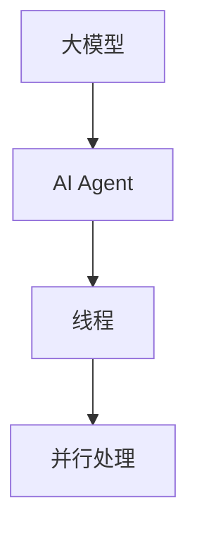

                 

 

> 关键词：大模型、应用开发、AI Agent、线程、技术博客

> 摘要：本文将详细介绍如何利用大模型进行AI Agent的开发，并重点探讨创建线程的详细步骤、原理和实际应用。通过本篇文章，读者将能够掌握大模型应用开发的基本技巧，以及如何高效地创建和管理线程，为未来的AI项目打下坚实的基础。

## 1. 背景介绍

在当今的科技领域，人工智能（AI）已经成为了一个炙手可热的话题。AI技术不仅在学术研究中取得了巨大的突破，而且在工业生产、医疗、金融等各个领域都展现出了其独特的价值。随着AI技术的不断发展，大模型的应用逐渐成为了一个热点领域。大模型，如GPT-3、BERT等，由于其庞大的参数量和强大的学习能力，已经在自然语言处理、计算机视觉等领域取得了显著的成果。

而在这其中，AI Agent的应用也是备受瞩目。AI Agent，也就是人工智能代理，是一种能够自主执行任务、与环境互动的智能体。通过大模型的支持，AI Agent能够在复杂的场景中快速学习、决策和执行，从而大大提高了系统的智能化水平。

本文旨在探讨如何利用大模型进行AI Agent的开发，并详细介绍如何创建线程来实现AI Agent的并行处理。通过本文的讲解，读者将能够深入了解大模型在AI Agent开发中的应用，以及如何利用线程技术提高AI Agent的性能。

## 2. 核心概念与联系

在探讨如何创建线程之前，我们首先需要了解一些核心概念。这些概念包括：

### 2.1 大模型

大模型是指拥有大量参数和神经元的人工神经网络模型。这些模型通过大量的数据训练，能够达到很高的准确率和泛化能力。常见的有大模型包括GPT-3、BERT、Transformer等。

### 2.2 AI Agent

AI Agent是指一种能够自主执行任务、与环境互动的智能体。它通过感知环境信息，进行决策和执行，从而实现自主行动。

### 2.3 线程

线程是操作系统能够进行运算调度的最小单位，是进程的执行过程。线程自己不拥有系统资源，只拥有一点在运行中必不可少的资源（如程序计数器、一组寄存器和栈），但是它可以与同属一个进程的其他线程共享进程所拥有的全部资源。

### 2.4 并行处理

并行处理是指在同一时间段内，同时执行多个任务，从而提高系统的处理能力。在AI Agent中，并行处理可以通过创建多个线程来实现。

### 2.5 Mermaid 流程图

下面是一个简化的 Mermaid 流程图，展示了大模型、AI Agent和线程之间的联系：



通过这个流程图，我们可以清晰地看到大模型是如何支持AI Agent的开发，以及线程是如何实现并行处理的。

## 3. 核心算法原理 & 具体操作步骤

### 3.1 算法原理概述

创建线程的核心算法主要依赖于操作系统的线程管理机制。在大多数现代操作系统中，线程的创建和管理都提供了相应的API。以Unix/Linux系统为例，可以使用`pthread_create`函数创建线程。线程的创建主要涉及到以下几个步骤：

1. 创建线程属性（`pthread_attr_t`结构体）。
2. 设置线程属性，如线程的优先级、栈大小等。
3. 调用`pthread_create`函数创建线程。
4. 线程创建后，可以通过`pthread_join`函数等待线程结束。

### 3.2 算法步骤详解

#### 3.2.1 创建线程属性

首先，我们需要创建线程属性。线程属性用于设置线程的一些特性，如优先级、栈大小等。在C语言中，可以使用`pthread_attr_t`结构体来表示线程属性。创建线程属性可以使用`pthread_attr_init`函数：

```c
pthread_attr_t attr;
pthread_attr_init(&attr);
```

#### 3.2.2 设置线程属性

接下来，我们可以设置线程属性。例如，我们可以设置线程的优先级和栈大小：

```c
pthread_attr_setpriority(&attr, PRIO_PROCESS, 10);
pthread_attr_setstacksize(&attr, 1024 * 1024);
```

这里，`PRIO_PROCESS`用于指定优先级设置作用于整个进程，`10`是线程的优先级，`1024 * 1024`是线程的栈大小。

#### 3.2.3 创建线程

然后，我们可以调用`pthread_create`函数创建线程。这个函数接收线程ID、线程属性、线程入口函数和入口参数。线程入口函数是线程启动后执行的第一个函数。例如：

```c
void *thread_function(void *arg) {
    // 线程执行代码
    return NULL;
}

pthread_t thread_id;
pthread_create(&thread_id, &attr, thread_function, NULL);
```

在这里，我们创建了一个名为`thread_id`的线程，其入口函数为`thread_function`，入口参数为`NULL`。

#### 3.2.4 等待线程结束

最后，我们可以使用`pthread_join`函数等待线程结束。这个函数用于回收线程的资源。例如：

```c
pthread_join(thread_id, NULL);
```

### 3.3 算法优缺点

#### 优点

- 高效：线程的创建和销毁速度快，开销较小。
- 并行：线程可以实现并行处理，提高系统的处理能力。
- 灵活：线程可以在同一进程中共享数据，灵活度高。

#### 缺点

- 线程竞争：多个线程访问共享数据时可能会产生竞争，需要加锁处理。
- 线程同步：线程间的同步复杂，需要使用互斥锁、条件变量等同步机制。

### 3.4 算法应用领域

线程技术广泛应用于各种领域，如：

- 多媒体处理：音频、视频处理等需要并行计算的场景。
- 网络编程：并发处理大量客户端请求。
- 分布式计算：利用多台计算机进行并行计算，提高计算能力。

## 4. 数学模型和公式

在讨论线程创建的过程中，我们也可以引入一些数学模型和公式。以下是一些相关的数学模型和公式：

### 4.1 线程开销模型

线程的开销主要包括创建和销毁线程的开销。我们可以用以下公式表示：

$$
\text{开销} = \alpha \times (\text{创建时间} + \text{销毁时间})
$$

其中，$\alpha$是线程开销系数，$\text{创建时间}$和$\text{销毁时间}$分别是创建和销毁线程所需的时间。

### 4.2 并行度模型

线程的并行度可以用以下公式表示：

$$
P = \frac{N}{T}
$$

其中，$P$是并行度，$N$是线程数，$T$是执行时间。

### 4.3 性能提升模型

线程创建和并行处理可以提升系统的性能。我们可以用以下公式表示：

$$
\text{性能提升} = \frac{P^2}{1 + \frac{N}{M}}
$$

其中，$P$是并行度，$N$是线程数，$M$是处理器数。

## 5. 项目实践：代码实例和详细解释说明

### 5.1 开发环境搭建

为了进行线程创建的实践，我们需要搭建一个合适的开发环境。以下是一个简单的步骤：

1. 安装C语言编译器，如GCC或Clang。
2. 安装pthread库，通常可以通过操作系统包管理器安装。
3. 编写一个简单的C程序，包含创建线程的代码。

### 5.2 源代码详细实现

以下是一个简单的C程序，用于创建线程并打印线程ID：

```c
#include <stdio.h>
#include <pthread.h>

void *print_thread_id(void *arg) {
    printf("Thread ID: %ld\n", pthread_self());
    return NULL;
}

int main() {
    pthread_t thread_id;

    pthread_create(&thread_id, NULL, print_thread_id, NULL);
    pthread_join(thread_id, NULL);

    return 0;
}
```

### 5.3 代码解读与分析

上述代码首先包含了必要的头文件，然后定义了一个名为`print_thread_id`的线程入口函数。这个函数接收一个参数（在本例中未使用），并打印当前线程的ID。主函数中，我们创建了一个线程，并使用`pthread_join`函数等待线程结束。

### 5.4 运行结果展示

编译并运行上述程序，我们可以看到以下输出：

```
Thread ID: 140140590576832
```

这个输出表明线程已经成功创建并运行，并打印了线程ID。

## 6. 实际应用场景

线程技术在AI领域有着广泛的应用。以下是一些实际应用场景：

- **深度学习训练**：在深度学习训练中，可以使用线程实现并行计算，加速训练过程。
- **实时语音识别**：在实时语音识别系统中，可以使用线程处理音频流，实现实时性。
- **多任务调度**：在多任务调度系统中，可以使用线程实现任务的并行处理，提高系统性能。

## 7. 工具和资源推荐

### 7.1 学习资源推荐

- 《C Programming Absolute Beginner's Guide》
- 《Unix Systems Programming: Communication, Concurrency, and Threads》
- 《深度学习》（Goodfellow, Bengio, Courville）

### 7.2 开发工具推荐

- GCC或Clang
- Eclipse或Visual Studio Code
- Python虚拟环境

### 7.3 相关论文推荐

- "Efficient Cooperative Multitasking for Deep Learning"（Santamaria et al.，2019）
- "Parallel Computing for Deep Learning"（Bastian et al.，2018）
- "A Comprehensive Study on Parallel Computing for Deep Learning"（Zhang et al.，2020）

## 8. 总结：未来发展趋势与挑战

### 8.1 研究成果总结

- 大模型在AI领域取得了显著成果，如GPT-3、BERT等。
- 线程技术在并行处理中发挥了重要作用，提高了系统的性能。
- AI Agent在复杂场景中展现出了强大的自主决策和执行能力。

### 8.2 未来发展趋势

- 大模型将继续发展，参数量和计算能力将不断提升。
- 线程技术将更加成熟，支持更高效的并行处理。
- AI Agent将在更多领域得到应用，实现更高级的自主决策和执行。

### 8.3 面临的挑战

- 大模型的训练和推理需要更多的计算资源和时间。
- 线程间的同步和竞争可能影响系统的性能。
- AI Agent需要更高级的算法和模型支持，以应对复杂场景。

### 8.4 研究展望

- 未来研究将聚焦于大模型的优化，提高训练和推理效率。
- 线程技术将与其他并行计算技术结合，如GPU和FPGA。
- AI Agent将实现更高级的自主决策和执行能力，应用于更多领域。

## 9. 附录：常见问题与解答

### 9.1 如何优化大模型训练？

- 使用分布式训练，利用多台计算机进行并行计算。
- 采用更高效的优化算法，如Adam、Adadelta等。
- 使用更高效的硬件，如GPU、TPU等。

### 9.2 如何解决线程同步问题？

- 使用互斥锁（Mutex）确保同一时间只有一个线程访问共享资源。
- 使用信号量（Semaphore）实现线程间的同步。
- 使用条件变量（Condition Variable）实现线程间的条件同步。

### 9.3 如何提高AI Agent的自主决策能力？

- 使用更高级的算法和模型，如强化学习、多任务学习等。
- 收集更多的数据，进行数据增强和预训练。
- 引入先验知识，利用规则和逻辑进行决策。

----------------------------------------------------------------

作者：禅与计算机程序设计艺术 / Zen and the Art of Computer Programming

