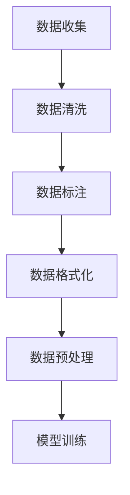

                 

关键词：大模型，AI Agent，数据收集，数据整理，数据预处理，应用开发

摘要：本文旨在探讨在大模型应用开发过程中，如何有效地收集与整理数据。通过对数据收集的重要性、常见方法、数据整理的步骤以及预处理技术的深入分析，帮助读者了解数据在人工智能应用中的核心作用，并提供实用的指导，以推动AI Agent的开发。

## 1. 背景介绍

在人工智能（AI）迅速发展的今天，大模型（如GPT-3、BERT等）已经成为推动AI应用创新的核心驱动力。然而，无论模型多么强大，其效果在很大程度上取决于数据的质量和数量。因此，数据收集与整理成为AI应用开发中不可或缺的环节。本文将详细讨论如何在大模型应用开发过程中，有效地收集和整理数据，以确保AI Agent的性能和可靠性。

### 数据收集的重要性

数据是AI模型的基石。高质量的训练数据可以显著提高模型的准确性和泛化能力。反之，低质量或错误的数据可能会导致模型性能不佳，甚至带来严重的安全隐患。因此，数据收集是一个需要特别关注的过程。

#### 常见数据收集方法

- **公开数据集**：许多公共数据集如CIFAR-10、MNIST、IMDB等，为AI研究提供了丰富的资源。

- **定制数据集**：针对特定应用场景，可能需要收集自定义数据集。例如，医疗AI应用需要收集大量的患者数据和医学图像。

- **在线数据流**：实时获取互联网上的数据，如社交媒体数据、搜索引擎查询日志等。

### 数据整理的意义

数据整理是将收集到的原始数据转化为适合模型训练的形式的过程。它包括数据清洗、标注、格式化等步骤，目的是去除噪声、错误和不一致的数据，提高数据的质量。

#### 数据整理的步骤

- **数据清洗**：处理缺失值、异常值和重复值。

- **数据标注**：为数据添加标签或类别信息，以供模型学习。

- **数据格式化**：将数据转换为统一的格式，便于模型处理。

## 2. 核心概念与联系

### 数据收集与整理的Mermaid流程图



### 数据收集与整理的核心概念

- **数据收集**：从各种来源获取数据的过程，包括公开数据集、定制数据集和在线数据流。

- **数据清洗**：处理数据中的噪声、异常值和重复值的过程。

- **数据标注**：为数据添加标签或类别信息的过程。

- **数据格式化**：将数据转换为统一格式的过程。

- **数据预处理**：在模型训练前对数据进行处理，以提高模型性能。

## 3. 核心算法原理 & 具体操作步骤

### 3.1 算法原理概述

数据收集与整理的核心算法涉及多种技术，包括数据挖掘、机器学习和数据可视化等。以下是这些算法的基本原理：

#### 数据挖掘

- **聚类**：通过将相似的数据点分组，发现数据中的模式。

- **分类**：将数据分为不同的类别，以帮助后续的数据整理。

#### 机器学习

- **监督学习**：利用标注数据进行训练，以预测新数据的类别或标签。

- **无监督学习**：在没有标注数据的情况下，自动发现数据中的结构。

#### 数据可视化

- **散点图**：用于展示数据之间的关联性。

- **热力图**：用于展示数据在不同维度上的分布情况。

### 3.2 算法步骤详解

#### 数据收集

1. **确定数据来源**：根据应用需求，选择合适的公开数据集、定制数据集或在线数据流。

2. **数据采集**：使用API、爬虫或其他工具收集数据。

#### 数据清洗

1. **缺失值处理**：使用插值、平均值等方法填补缺失值。

2. **异常值检测**：使用统计方法（如Z-Score、IQR等）检测并处理异常值。

3. **重复值处理**：使用去重算法（如哈希表）删除重复值。

#### 数据标注

1. **自动标注**：使用机器学习算法，如监督学习，自动标注新数据。

2. **人工标注**：对于复杂任务，可能需要人工参与标注。

#### 数据格式化

1. **统一编码**：将数据转换为统一的编码格式，如UTF-8。

2. **特征提取**：从原始数据中提取有用的特征。

### 3.3 算法优缺点

#### 数据挖掘

- **优点**：可以自动发现数据中的模式，有助于数据整理。

- **缺点**：可能产生过拟合，对噪声敏感。

#### 机器学习

- **优点**：可以处理大规模数据，提高模型性能。

- **缺点**：需要大量标注数据，训练时间较长。

#### 数据可视化

- **优点**：可以直观地展示数据分布和关联性。

- **缺点**：可能无法发现深层次的模式。

### 3.4 算法应用领域

- **金融**：使用数据挖掘和机器学习预测市场走势。

- **医疗**：使用数据清洗和标注技术，提高疾病诊断的准确性。

- **零售**：使用数据可视化技术，优化库存管理和供应链。

## 4. 数学模型和公式 & 详细讲解 & 举例说明

### 4.1 数学模型构建

数据收集与整理涉及多种数学模型，包括聚类模型、分类模型和回归模型等。以下是一个简单的聚类模型：

$$
C = \{C_1, C_2, ..., C_k\}
$$

其中，$C$ 是聚类结果，$C_i$ 是第 $i$ 个聚类，$k$ 是聚类个数。

### 4.2 公式推导过程

以K-means聚类算法为例，其目标是最小化数据点到聚类中心的距离：

$$
J = \sum_{i=1}^k \sum_{x \in C_i} ||x - \mu_i||^2
$$

其中，$J$ 是聚类目标函数，$\mu_i$ 是第 $i$ 个聚类中心。

### 4.3 案例分析与讲解

#### 案例背景

假设我们有一个包含100个二维数据点的数据集，我们需要将其分为5个聚类。

#### 操作步骤

1. **初始化聚类中心**：随机选择5个数据点作为初始聚类中心。

2. **分配数据点**：将每个数据点分配到最近的聚类中心。

3. **更新聚类中心**：计算每个聚类的中心，即数据点的平均值。

4. **迭代直到收敛**：重复步骤2和步骤3，直到聚类中心不再变化或达到最大迭代次数。

#### 结果分析

通过K-means聚类，我们得到5个聚类，每个聚类具有明确的中心。这些聚类有助于我们理解数据集的结构和模式。

## 5. 项目实践：代码实例和详细解释说明

### 5.1 开发环境搭建

首先，我们需要搭建一个Python开发环境，包括必要的库和工具。以下是一个简单的安装步骤：

```bash
pip install numpy pandas scikit-learn matplotlib
```

### 5.2 源代码详细实现

以下是一个使用K-means聚类算法进行数据收集与整理的Python代码示例：

```python
import numpy as np
import pandas as pd
from sklearn.cluster import KMeans
import matplotlib.pyplot as plt

# 加载数据集
data = pd.read_csv('data.csv')

# 提取特征
features = data.iloc[:, :2]

# 初始化KMeans模型
kmeans = KMeans(n_clusters=5, random_state=0)

# 训练模型
kmeans.fit(features)

# 分配数据点到聚类
labels = kmeans.predict(features)

# 更新聚类中心
centroids = kmeans.cluster_centers_

# 可视化结果
plt.scatter(features[:, 0], features[:, 1], c=labels, cmap='viridis')
plt.scatter(centroids[:, 0], centroids[:, 1], s=300, c='red', label='Centroids')
plt.title('K-means Clustering')
plt.xlabel('Feature 1')
plt.ylabel('Feature 2')
plt.legend()
plt.show()
```

### 5.3 代码解读与分析

- **数据加载**：使用pandas读取CSV文件。

- **特征提取**：从数据集中提取前两个特征用于可视化。

- **模型训练**：使用scikit-learn的KMeans模型进行训练。

- **结果可视化**：使用matplotlib绘制散点图，显示聚类结果。

### 5.4 运行结果展示

运行上述代码后，我们将看到一个散点图，其中每个数据点根据其聚类结果被标记不同的颜色，聚类中心用红色标记。

## 6. 实际应用场景

### 6.1 金融领域

在金融领域，数据收集与整理技术可以帮助金融机构监控市场走势、预测风险和管理投资组合。

### 6.2 医疗领域

在医疗领域，数据整理技术可以帮助医生快速诊断疾病、提高治疗效果并优化医疗资源。

### 6.3 零售领域

在零售领域，数据整理技术可以帮助企业分析消费者行为、优化库存管理和提升客户体验。

## 7. 工具和资源推荐

### 7.1 学习资源推荐

- 《机器学习实战》
- 《深度学习》（Goodfellow et al.）
- Coursera、edX等在线课程

### 7.2 开发工具推荐

- Jupyter Notebook
- PyCharm
- VS Code

### 7.3 相关论文推荐

- "K-means Clustering Algorithm"
- "Deep Learning for Text Classification"
- "Recurrent Neural Networks for Language Modeling"

## 8. 总结：未来发展趋势与挑战

### 8.1 研究成果总结

随着人工智能技术的不断发展，数据收集与整理技术也在不断进步。新的算法和工具不断涌现，提高了数据处理的效率和准确性。

### 8.2 未来发展趋势

- **自动化数据收集**：利用自动化工具和算法，实现更高效的数据收集。
- **数据隐私保护**：在数据收集和整理过程中，加强对数据隐私的保护。
- **多模态数据处理**：结合文本、图像、音频等多种数据类型，进行更全面的数据整理。

### 8.3 面临的挑战

- **数据质量**：保证数据的质量和可靠性，仍然是数据收集与整理的重要挑战。
- **计算资源**：大规模数据处理需要大量的计算资源，这对开发者和企业提出了更高的要求。
- **法律法规**：随着数据隐私保护法规的日益严格，如何在遵守法规的同时有效利用数据也成为一大挑战。

### 8.4 研究展望

随着人工智能技术的不断进步，数据收集与整理技术将在未来发挥更加重要的作用。研究重点将转向自动化、隐私保护和多模态数据处理等方面，以应对不断变化的应用场景和挑战。

## 9. 附录：常见问题与解答

### Q: 如何处理缺失值？

A: 缺失值处理方法包括插值、平均值填补和删除等。具体方法取决于数据的特点和任务需求。

### Q: 如何选择聚类算法？

A: 聚类算法的选择取决于数据类型、聚类目标和算法性能。常用的聚类算法包括K-means、层次聚类和DBSCAN等。

### Q: 如何评估聚类结果？

A: 评估聚类结果的方法包括轮廓系数、簇内相似度和簇间距离等指标。

作者：禅与计算机程序设计艺术 / Zen and the Art of Computer Programming
----------------------------------------------------------------


