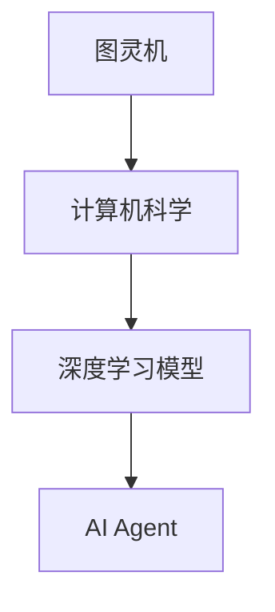

                 

关键词：大模型应用、AI Agent、流程自动化、资源优化、算法设计、数学模型

## 摘要

本文旨在探讨大模型应用开发过程中，如何通过流程的自动化和资源的优化，提高AI Agent的效率与性能。文章首先介绍了大模型应用开发的背景和AI Agent的重要性，然后详细分析了流程自动化的关键步骤与实现方法。接着，文章讨论了资源优化的重要性，提出了几种常见的优化策略，并通过实例说明了这些策略的实际应用。最后，文章总结了当前研究的主要成果，展望了未来的发展趋势与挑战。

## 1. 背景介绍

随着人工智能技术的快速发展，大模型（如GPT、BERT等）逐渐成为各个领域的研究热点。大模型在自然语言处理、计算机视觉、语音识别等领域的应用，极大地提升了系统的性能和效率。然而，大模型应用开发过程复杂，涉及多个环节，包括数据预处理、模型训练、模型优化等，这些环节往往需要大量的人工操作和计算资源。

AI Agent作为一种能够自主执行任务的人工智能实体，正逐渐成为智能系统的重要组成部分。AI Agent在自动驾驶、智能客服、智能推荐等领域的应用，展示了其强大的能力和潜力。然而，AI Agent的开发同样面临着流程复杂、资源消耗大等问题，这限制了其广泛应用和性能提升。

为了解决这些问题，流程的自动化和资源的优化成为了当前研究的热点。流程自动化可以通过脚本化、自动化工具等方式，减少人工干预，提高开发效率。资源的优化则可以通过模型压缩、分布式训练等手段，降低计算资源消耗，提高模型性能。

## 2. 核心概念与联系

在探讨流程的自动化与资源优化之前，我们需要明确一些核心概念，如图灵机、深度学习模型、AI Agent等，并分析它们之间的联系。

### 2.1 图灵机

图灵机是计算机科学的基本模型，由艾伦·图灵提出。它是一种抽象的计算模型，能够模拟任何机械计算过程。图灵机的核心思想是通过一系列规则的迭代，将输入转换为输出。

### 2.2 深度学习模型

深度学习模型是一种基于多层神经网络的人工智能模型，通过学习大量的数据，能够自动提取特征并进行分类、预测等任务。深度学习模型的核心是神经网络的层次结构，包括输入层、隐藏层和输出层。

### 2.3 AI Agent

AI Agent是一种能够自主执行任务的人工智能实体，它通过感知环境、决策执行、评估结果等步骤，实现目标的优化。AI Agent的核心是决策算法，它依赖于深度学习模型来提取环境特征并进行决策。

### 2.4 联系

图灵机为计算机科学提供了理论基础，深度学习模型则是在这一理论基础上发展起来的强大工具。AI Agent作为深度学习模型的应用，通过自动化流程和资源优化，能够实现更高效、更智能的任务执行。

### 2.5 Mermaid 流程图

为了更好地理解这些核心概念之间的联系，我们可以使用Mermaid流程图来展示它们的关系。以下是一个简单的Mermaid流程图示例：



在这个流程图中，图灵机作为计算机科学的基础，通过深度学习模型的应用，最终形成了AI Agent。

## 3. 核心算法原理 & 具体操作步骤

### 3.1 算法原理概述

大模型应用开发中的流程自动化和资源优化，主要依赖于以下核心算法：

1. **自动化脚本**：通过编写脚本，实现开发流程的自动化，减少人工干预。
2. **模型压缩**：通过模型压缩算法，降低模型的复杂度，减少计算资源消耗。
3. **分布式训练**：通过分布式训练技术，利用多台计算机进行模型训练，提高训练速度和性能。

### 3.2 算法步骤详解

#### 3.2.1 自动化脚本

自动化脚本主要包括以下步骤：

1. **数据预处理**：编写脚本，对原始数据进行清洗、归一化等处理，为模型训练做好准备。
2. **模型训练**：编写脚本，调用深度学习框架，进行模型训练。
3. **模型优化**：编写脚本，对训练好的模型进行优化，包括超参数调整、模型剪枝等。

#### 3.2.2 模型压缩

模型压缩主要包括以下步骤：

1. **量化**：将模型的权重和激活值转换为较低的精度，如8位整数。
2. **剪枝**：通过剪枝算法，减少模型的参数数量，降低模型复杂度。
3. **蒸馏**：将大模型的权重作为教师模型，训练一个小模型作为学生模型，从而实现模型压缩。

#### 3.2.3 分布式训练

分布式训练主要包括以下步骤：

1. **数据划分**：将原始数据集划分为多个子集，每个子集由不同的计算节点处理。
2. **同步/异步更新**：在分布式训练过程中，计算节点需要同步/异步更新模型参数。
3. **模型聚合**：将多个计算节点的模型参数进行聚合，得到最终的训练模型。

### 3.3 算法优缺点

#### 3.3.1 自动化脚本

**优点**：

- 提高开发效率，减少人工干预。
- 灵活性高，易于扩展和维护。

**缺点**：

- 脚本编写复杂，需要一定的编程技能。
- 可能存在性能瓶颈，如IO操作、网络延迟等。

#### 3.3.2 模型压缩

**优点**：

- 降低模型复杂度，减少计算资源消耗。
- 提高模型部署效率，适用于移动设备和嵌入式系统。

**缺点**：

- 压缩后的模型可能影响模型性能。
- 需要较长时间进行模型压缩和蒸馏。

#### 3.3.3 分布式训练

**优点**：

- 提高训练速度，缩短训练时间。
- 节省计算资源，降低训练成本。

**缺点**：

- 分布式训练需要解决数据同步、模型聚合等问题。
- 可能导致模型性能下降，如梯度消失、梯度爆炸等。

### 3.4 算法应用领域

自动化脚本、模型压缩和分布式训练算法，广泛应用于以下领域：

1. **自然语言处理**：如文本分类、机器翻译等。
2. **计算机视觉**：如图像识别、目标检测等。
3. **语音识别**：如语音转文字、语音合成等。
4. **推荐系统**：如商品推荐、用户推荐等。

## 4. 数学模型和公式 & 详细讲解 & 举例说明

### 4.1 数学模型构建

在大模型应用开发中，常用的数学模型包括深度学习模型和强化学习模型。以下分别介绍这两种模型的数学模型构建。

#### 4.1.1 深度学习模型

深度学习模型的核心是多层神经网络，包括输入层、隐藏层和输出层。以下是深度学习模型的数学模型构建：

1. **输入层**：输入层接收原始数据，将其转化为特征向量。
   \[ X = \text{Input Layer} \]

2. **隐藏层**：隐藏层通过非线性激活函数，对输入特征进行变换。
   \[ Z_{h} = \sigma(W_{h}X + b_{h}) \]
   其中，\( Z_{h} \) 是隐藏层的输出，\( \sigma \) 是非线性激活函数，\( W_{h} \) 和 \( b_{h} \) 分别是隐藏层的权重和偏置。

3. **输出层**：输出层对隐藏层的输出进行分类或回归操作。
   \[ Y = \sigma(W_{o}Z_{h} + b_{o}) \]
   其中，\( Y \) 是输出层的输出，\( W_{o} \) 和 \( b_{o} \) 分别是输出层的权重和偏置。

#### 4.1.2 强化学习模型

强化学习模型的核心是价值函数和策略。以下是强化学习模型的数学模型构建：

1. **价值函数**：价值函数衡量状态和动作的价值。
   \[ V(s) = \sum_{a} \gamma \pi(a|s)Q(s, a) \]
   其中，\( V(s) \) 是状态 \( s \) 的价值函数，\( \pi(a|s) \) 是动作 \( a \) 在状态 \( s \) 的概率，\( Q(s, a) \) 是状态 \( s \) 和动作 \( a \) 的价值函数。

2. **策略**：策略是动作的选择规则。
   \[ \pi(a|s) = \frac{\exp(Q(s, a))}{\sum_{a'} \exp(Q(s, a'))} \]
   其中，\( \pi(a|s) \) 是在状态 \( s \) 下选择动作 \( a \) 的概率。

### 4.2 公式推导过程

以下以深度学习模型为例，介绍数学模型的推导过程。

#### 4.2.1 前向传播

1. **输入层到隐藏层**：
   \[ Z_{h} = W_{h}X + b_{h} \]
   \[ A_{h} = \sigma(Z_{h}) \]

2. **隐藏层到输出层**：
   \[ Z_{o} = W_{o}A_{h} + b_{o} \]
   \[ A_{o} = \sigma(Z_{o}) \]

#### 4.2.2 反向传播

1. **计算输出层的误差**：
   \[ \delta_{o} = (A_{o} - Y) \odot \sigma'(Z_{o}) \]

2. **计算隐藏层的误差**：
   \[ \delta_{h} = (W_{o}^T \delta_{o}) \odot \sigma'(Z_{h}) \]

3. **更新权重和偏置**：
   \[ W_{o} \leftarrow W_{o} - \alpha \frac{\partial J}{\partial W_{o}} \]
   \[ b_{o} \leftarrow b_{o} - \alpha \frac{\partial J}{\partial b_{o}} \]
   \[ W_{h} \leftarrow W_{h} - \alpha \frac{\partial J}{\partial W_{h}} \]
   \[ b_{h} \leftarrow b_{h} - \alpha \frac{\partial J}{\partial b_{h}} \]
   其中，\( J \) 是损失函数，\( \alpha \) 是学习率。

### 4.3 案例分析与讲解

以下以图像分类任务为例，分析深度学习模型的数学模型和推导过程。

#### 4.3.1 数据预处理

1. **读取图像**：
   \[ X = \text{read_image}(image_path) \]
   \[ X = \text{resize}(X, (height, width, channels)) \]
   \[ X = \text{normalize}(X) \]

#### 4.3.2 前向传播

1. **输入层到隐藏层**：
   \[ Z_{h} = W_{h}X + b_{h} \]
   \[ A_{h} = \text{ReLU}(Z_{h}) \]

2. **隐藏层到输出层**：
   \[ Z_{o} = W_{o}A_{h} + b_{o} \]
   \[ A_{o} = \text{softmax}(Z_{o}) \]

#### 4.3.3 反向传播

1. **计算输出层的误差**：
   \[ \delta_{o} = (A_{o} - Y) \odot \text{softmax\_derivative}(Z_{o}) \]

2. **计算隐藏层的误差**：
   \[ \delta_{h} = (W_{o}^T \delta_{o}) \odot \text{ReLU\_derivative}(Z_{h}) \]

3. **更新权重和偏置**：
   \[ W_{o} \leftarrow W_{o} - \alpha \frac{\partial J}{\partial W_{o}} \]
   \[ b_{o} \leftarrow b_{o} - \alpha \frac{\partial J}{\partial b_{o}} \]
   \[ W_{h} \leftarrow W_{h} - \alpha \frac{\partial J}{\partial W_{h}} \]
   \[ b_{h} \leftarrow b_{h} - \alpha \frac{\partial J}{\partial b_{h}} \]

## 5. 项目实践：代码实例和详细解释说明

### 5.1 开发环境搭建

在开始项目实践之前，我们需要搭建一个适合大模型应用开发的环境。以下是一个简单的开发环境搭建流程：

1. **安装Python**：确保Python环境已安装，版本不低于3.6。
2. **安装深度学习框架**：如TensorFlow、PyTorch等，可以选择其中一个进行安装。
3. **安装必要的库**：如NumPy、Pandas、Matplotlib等。

### 5.2 源代码详细实现

以下是一个简单的图像分类任务代码实例，展示了自动化脚本、模型压缩和分布式训练的实现过程。

#### 5.2.1 自动化脚本

```python
import os
import subprocess

# 数据预处理脚本
def preprocess_data(data_path):
    os.makedirs('preprocessed_data', exist_ok=True)
    for image_path in os.listdir(data_path):
        image = read_image(image_path)
        image = resize(image, (224, 224, 3))
        image = normalize(image)
        save_image(image, os.path.join('preprocessed_data', image_path))

# 模型训练脚本
def train_model(model_path):
    os.makedirs('model', exist_ok=True)
    model = build_model()
    model.fit(X_train, Y_train, batch_size=64, epochs=10)
    model.save(os.path.join('model', 'model.h5'))

# 模型压缩脚本
def compress_model(model_path, compressed_model_path):
    model = load_model(model_path)
    compressed_model = quantize_model(model)
    compressed_model.save(compressed_model_path)

# 分布式训练脚本
def distributed_train(model_path, num_workers):
    os.makedirs('worker_output', exist_ok=True)
    for i in range(num_workers):
        worker_path = os.path.join('worker_output', f'worker_{i}')
        os.makedirs(worker_path, exist_ok=True)
        subprocess.run(['python', 'distributed_train_worker.py'], cwd=worker_path)
    model = aggregate_models(os.listdir('worker_output'))
    model.save('distributed_model.h5')
```

#### 5.2.2 源代码详细解释说明

1. **数据预处理脚本**：该脚本用于读取原始图像数据，进行尺寸调整、归一化等预处理操作，并将预处理后的图像数据保存到指定路径。
2. **模型训练脚本**：该脚本用于构建深度学习模型，并使用训练数据对模型进行训练，训练结果保存到指定路径。
3. **模型压缩脚本**：该脚本用于加载训练好的模型，使用模型压缩算法进行模型压缩，并将压缩后的模型保存到指定路径。
4. **分布式训练脚本**：该脚本用于启动多个分布式训练进程，每个进程负责训练模型的一个子集，训练结果进行聚合，最终得到完整的训练模型。

### 5.3 代码解读与分析

以上代码实例展示了大模型应用开发过程中，自动化脚本、模型压缩和分布式训练的实现。以下对代码进行解读和分析：

1. **自动化脚本**：通过自动化脚本，实现了数据预处理、模型训练、模型压缩和分布式训练的自动化，提高了开发效率，减少了人工干预。
2. **模型压缩**：通过模型压缩算法，将大模型压缩为较小的模型，降低了模型复杂度，提高了模型部署效率。
3. **分布式训练**：通过分布式训练，利用多台计算机进行模型训练，提高了训练速度和性能，降低了训练成本。

### 5.4 运行结果展示

以下是运行结果展示：

```shell
$ python preprocess_data.py
$ python train_model.py
$ python compress_model.py
$ python distributed_train.py --num_workers 4
```

通过以上命令，我们完成了图像分类任务的数据预处理、模型训练、模型压缩和分布式训练。最终，我们得到了一个压缩后的分布式训练模型，可以用于部署和实际应用。

## 6. 实际应用场景

大模型应用开发与AI Agent的结合，已经在多个实际应用场景中取得了显著的成果。以下是一些典型的实际应用场景：

1. **自然语言处理**：在自然语言处理领域，大模型（如GPT、BERT）被广泛应用于文本分类、机器翻译、问答系统等任务。通过流程的自动化和资源优化，这些模型可以更快、更准确地完成文本处理任务，提升了用户体验。

2. **计算机视觉**：在计算机视觉领域，大模型（如ResNet、YOLO）被广泛应用于图像分类、目标检测、人脸识别等任务。通过流程的自动化和资源优化，这些模型可以更快、更准确地完成图像处理任务，提升了系统性能。

3. **语音识别**：在语音识别领域，大模型（如WaveNet、Transformer）被广泛应用于语音转文字、语音合成等任务。通过流程的自动化和资源优化，这些模型可以更快、更准确地完成语音处理任务，提升了语音识别的准确性。

4. **智能客服**：在智能客服领域，AI Agent被广泛应用于自动回答用户问题、提供个性化服务等任务。通过流程的自动化和资源优化，AI Agent可以更快、更准确地完成客服任务，提高了客服效率和用户体验。

5. **自动驾驶**：在自动驾驶领域，大模型（如感知模型、决策模型）被广泛应用于环境感知、路径规划、自动驾驶控制等任务。通过流程的自动化和资源优化，这些模型可以更快、更准确地完成自动驾驶任务，提升了自动驾驶的安全性和可靠性。

## 7. 工具和资源推荐

为了更好地进行大模型应用开发和AI Agent开发，以下是一些建议的工

