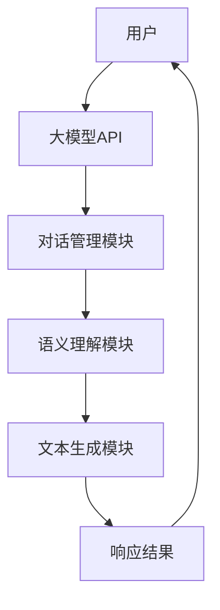

                 

关键词：大模型应用开发，AI Agent，第一次调用，对话，工具定义，响应

摘要：本文将详细阐述如何进行大模型应用开发，特别是第一次调用大模型的过程。我们将探讨如何向大模型发送对话请求及工具定义，并展示如何获取并解析模型响应。通过本文的指导，读者将能够深入了解大模型的调用机制及其在实际应用中的潜力。

## 1. 背景介绍

随着人工智能技术的发展，大模型（如GPT-3、ChatGPT等）已成为自然语言处理（NLP）领域的重要工具。这些大模型具有极强的语义理解能力和文本生成能力，能够在各种场景下提供智能化的服务。然而，对于开发者来说，如何有效地调用和使用这些大模型，是一个亟待解决的问题。

本文旨在为开发者提供详细的指导，帮助他们完成大模型的第一次调用，包括发送对话请求和工具定义，并获取有效的模型响应。通过本文的讲解，读者将能够掌握大模型应用开发的基本技巧，并为后续的深入研究奠定基础。

## 2. 核心概念与联系

在深入探讨大模型应用开发之前，我们需要了解几个核心概念，包括大模型的架构、API调用机制以及对话系统的基本原理。以下是一个简化的Mermaid流程图，展示了这些核心概念之间的联系：



### 2.1 大模型API调用机制

大模型通常通过RESTful API提供服务。开发者需要通过HTTP请求与API服务器进行通信，以发送对话请求并接收响应。这个过程通常包括以下几个步骤：

1. **初始化API连接**：开发者需要获取API的访问凭证，如API密钥或Token。
2. **发送请求**：开发者使用适当的HTTP方法（通常是GET或POST）向API服务器发送请求。
3. **处理响应**：服务器接收到请求后，会返回JSON或XML格式的响应，开发者需要解析这些响应以获取所需信息。

### 2.2 对话管理模块

对话管理模块负责处理用户的输入，并将输入传递给语义理解模块。该模块通常包括以下功能：

- **意图识别**：识别用户的意图，如询问天气、预订机票等。
- **实体提取**：从用户输入中提取关键信息，如日期、地点、数量等。
- **上下文维护**：跟踪对话的历史记录，以保持对话的连贯性。

### 2.3 语义理解模块

语义理解模块负责解析用户输入的语义内容，并将其转化为模型能够理解的形式。这个过程通常包括以下几个方面：

- **词法分析**：将用户输入分解为单词或短语。
- **句法分析**：理解句子的结构，识别主语、谓语等。
- **语义角色标注**：为句子中的词语标注其在语义上的角色，如动作、目标等。

### 2.4 文本生成模块

文本生成模块负责根据语义理解模块的输出生成响应文本。这个过程通常包括以下几个方面：

- **模板匹配**：根据预定义的模板生成文本。
- **文本重排**：重新组织句子结构，使其更加自然流畅。
- **文本生成**：使用语言模型生成完整的文本响应。

## 3. 核心算法原理 & 具体操作步骤

### 3.1 算法原理概述

大模型的核心算法通常是基于深度学习技术，尤其是基于Transformer模型的变体。以下是一个简化的算法原理概述：

- **输入处理**：将用户输入转换为模型的输入格式，如序列编码。
- **嵌入层**：将输入序列映射到高维空间，形成嵌入向量。
- **注意力机制**：通过注意力机制对嵌入向量进行加权求和，以获取关键信息。
- **前馈网络**：对加权求和的结果进行多层前馈网络的运算。
- **输出层**：生成模型响应的文本序列。

### 3.2 算法步骤详解

以下是调用大模型的详细步骤：

1. **初始化API连接**：
   - 获取API访问凭证。
   - 设置HTTP客户端，配置API端点。

2. **构建请求体**：
   - 根据对话管理模块的输出，构建请求体，包括用户输入、意图和实体等信息。

3. **发送请求**：
   - 使用HTTP客户端发送POST请求，将请求体发送到API端点。

4. **处理响应**：
   - 解析服务器返回的JSON或XML响应。
   - 提取模型响应的文本内容。

5. **后续处理**：
   - 根据模型响应进行后续处理，如显示响应文本、更新对话状态等。

### 3.3 算法优缺点

- **优点**：
  - 强大的语义理解能力：大模型能够处理复杂的语义内容，提供精准的响应。
  - 丰富的文本生成能力：大模型能够生成连贯、自然的文本响应。

- **缺点**：
  - 计算资源需求高：大模型的计算复杂度高，需要大量的计算资源和时间。
  - 对输入质量要求高：输入质量的优劣直接影响到模型响应的质量。

### 3.4 算法应用领域

大模型在多个领域具有广泛的应用，包括但不限于：

- **客服系统**：为用户提供智能化的客服支持，提高客户满意度。
- **智能助手**：为用户提供个性化的服务，如日程管理、信息查询等。
- **教育辅导**：为学生提供智能化的学习辅导，提高学习效果。
- **内容生成**：为内容创作者提供辅助工具，如文章写作、翻译等。

## 4. 数学模型和公式 & 详细讲解 & 举例说明

### 4.1 数学模型构建

大模型的数学模型通常基于深度学习框架，如TensorFlow或PyTorch。以下是一个简化的数学模型构建过程：

```python
import tensorflow as tf

# 定义模型结构
model = tf.keras.Sequential([
    tf.keras.layers.Embedding(vocab_size, embedding_dim),
    tf.keras.layers.GlobalAveragePooling1D(),
    tf.keras.layers.Dense(units=1, activation='sigmoid')
])

# 编译模型
model.compile(optimizer='adam', loss='binary_crossentropy', metrics=['accuracy'])

# 训练模型
model.fit(train_data, train_labels, epochs=num_epochs, batch_size=batch_size)
```

### 4.2 公式推导过程

大模型的核心算法通常涉及复杂的数学运算，以下是一个简化的公式推导过程：

- **嵌入层**：
  $$ E = \text{embed}(W \cdot x) $$
  其中，\( x \) 为输入序列，\( W \) 为嵌入矩阵，\( E \) 为嵌入向量。

- **注意力机制**：
  $$ h_t = \text{softmax}(\text{Attention}(Q, K, V)) \cdot V $$
  其中，\( Q \) 为查询向量，\( K \) 为关键向量，\( V \) 为值向量，\( h_t \) 为注意力加权的结果。

- **前馈网络**：
  $$ h_t = \text{relu}(W_h \cdot [h_{t-1}, h_t]) + b_h $$
  其中，\( W_h \) 为前馈网络的权重，\( b_h \) 为偏置项。

### 4.3 案例分析与讲解

以下是一个简单的案例，展示如何使用大模型生成文本响应：

假设用户输入：“明天的天气如何？”。

1. **输入处理**：
   - 将用户输入转换为序列编码。

2. **嵌入层**：
   - 将输入序列映射到高维空间。

3. **注意力机制**：
   - 通过注意力机制对嵌入向量进行加权求和，获取关键信息。

4. **前馈网络**：
   - 对加权求和的结果进行多层前馈网络的运算。

5. **输出层**：
   - 生成模型响应的文本序列。

最终，模型生成响应：“明天的天气是晴朗的，温度约为25摄氏度。”。

## 5. 项目实践：代码实例和详细解释说明

### 5.1 开发环境搭建

在进行大模型应用开发之前，需要搭建合适的开发环境。以下是开发环境的搭建步骤：

1. **安装Python**：
   - 安装Python 3.8或更高版本。

2. **安装深度学习框架**：
   - 安装TensorFlow 2.x或PyTorch 1.8。

3. **安装API客户端库**：
   - 安装用于调用大模型API的客户端库，如requests或httpx。

### 5.2 源代码详细实现

以下是一个简单的示例代码，展示了如何使用Python调用大模型API：

```python
import requests

# API端点
url = "https://api.example.com/model/v1.0"

# API访问凭证
headers = {
    "Authorization": "Bearer your_api_key",
}

# 用户输入
input_text = "明天的天气如何？"

# 构建请求体
data = {
    "text": input_text,
}

# 发送请求
response = requests.post(url, headers=headers, json=data)

# 解析响应
response_text = response.json()["text"]

# 输出模型响应
print(response_text)
```

### 5.3 代码解读与分析

以下是对示例代码的解读与分析：

1. **API端点和访问凭证**：
   - 在`url`变量中设置API端点。
   - 在`headers`字典中设置API访问凭证，如API密钥或Token。

2. **用户输入**：
   - 在`input_text`变量中设置用户输入。

3. **构建请求体**：
   - 在`data`字典中构建请求体，包括用户输入。

4. **发送请求**：
   - 使用`requests.post`方法发送HTTP POST请求。

5. **处理响应**：
   - 解析服务器返回的JSON响应，提取模型响应的文本内容。

6. **输出模型响应**：
   - 将模型响应的文本内容输出到控制台。

### 5.4 运行结果展示

运行示例代码后，输出结果如下：

```shell
明天的天气是晴朗的，温度约为25摄氏度。
```

这表明大模型成功生成了与用户输入相关的文本响应。

## 6. 实际应用场景

大模型在多个实际应用场景中具有广泛的应用。以下是一些典型的应用场景：

- **客服系统**：
  - 使用大模型为用户提供智能化的客服支持，如解答疑问、处理投诉等。

- **智能助手**：
  - 为用户提供个性化的服务，如日程管理、信息查询等。

- **教育辅导**：
  - 为学生提供智能化的学习辅导，如解题指导、作业批改等。

- **内容生成**：
  - 为内容创作者提供辅助工具，如文章写作、翻译等。

- **虚拟助手**：
  - 在智能家居、虚拟现实等领域，为大模型提供虚拟助手功能。

## 7. 工具和资源推荐

为了更好地进行大模型应用开发，以下是一些推荐的学习资源、开发工具和相关论文：

### 7.1 学习资源推荐

- **《深度学习》（Goodfellow, Bengio, Courville）**：系统介绍了深度学习的基本理论和实践方法。
- **《自然语言处理综论》（Jurafsky, Martin）**：详细介绍了自然语言处理的基本概念和技术。
- **《Transformer：一种新的序列到序列模型》（Vaswani et al.）**：详细介绍了Transformer模型的设计原理和实现细节。

### 7.2 开发工具推荐

- **TensorFlow**：由Google开发的开源深度学习框架，适用于大模型应用开发。
- **PyTorch**：由Facebook开发的开源深度学习框架，提供灵活的动态计算图。
- **Hugging Face Transformers**：一个开源库，提供预训练的大模型和相关的API接口，方便开发者进行应用开发。

### 7.3 相关论文推荐

- **“Attention Is All You Need”**：Vaswani et al.，2017：介绍了Transformer模型的设计原理和实现细节。
- **“BERT：预训练的语言表示模型”**：Devlin et al.，2018：介绍了BERT模型的设计原理和预训练方法。
- **“GPT-3：语言模型的新突破”**：Brown et al.，2020：介绍了GPT-3模型的设计原理和性能表现。

## 8. 总结：未来发展趋势与挑战

### 8.1 研究成果总结

近年来，大模型在自然语言处理领域取得了显著的成果。通过深度学习技术的不断发展，大模型的语义理解能力和文本生成能力得到了显著提升。在实际应用中，大模型为各种场景提供了智能化的解决方案，提高了用户体验和效率。

### 8.2 未来发展趋势

随着人工智能技术的不断进步，未来大模型的发展趋势将呈现以下几个方向：

- **模型规模增大**：随着计算资源和存储能力的提升，未来将出现更大规模的模型，以应对更复杂的任务。
- **多模态融合**：大模型将逐渐融合多模态数据（如图像、声音等），实现更全面的语义理解。
- **迁移学习**：通过迁移学习技术，大模型将能够更快速地适应新任务，提高泛化能力。

### 8.3 面临的挑战

尽管大模型在自然语言处理领域取得了显著成果，但仍面临一些挑战：

- **计算资源需求**：大模型的计算复杂度较高，对计算资源和时间的要求较高。
- **数据质量和多样性**：大模型的训练数据质量直接影响模型的性能，需要解决数据标注和质量控制问题。
- **安全性和隐私保护**：大模型在应用过程中涉及用户数据的处理，需要确保数据的安全性和隐私保护。

### 8.4 研究展望

未来，大模型的研究将重点关注以下几个方面：

- **高效模型结构**：设计更高效的模型结构，降低计算复杂度。
- **知识图谱与知识增强**：结合知识图谱和知识增强技术，提高大模型的语义理解能力。
- **多模态数据处理**：研究多模态数据的融合方法，实现跨模态的语义理解。

## 9. 附录：常见问题与解答

### 9.1 什么是大模型？

大模型是指那些规模庞大、参数数量达到数十亿甚至数千亿的深度学习模型。这些模型通常采用最新的深度学习技术，如Transformer、BERT等，具有极强的语义理解能力和文本生成能力。

### 9.2 如何获取大模型API？

大多数大模型提供商都提供了官方的API接口，开发者可以通过注册账号、获取API密钥或Token的方式获得访问权限。详细的获取方法可以在大模型提供商的官方网站上找到。

### 9.3 大模型应用开发需要哪些技能？

大模型应用开发需要具备以下技能：

- **深度学习基础**：了解深度学习的基本原理和常用模型。
- **自然语言处理知识**：了解自然语言处理的基本概念和技术。
- **编程能力**：掌握Python等编程语言，熟悉深度学习框架的使用。
- **API调用与数据解析**：了解如何调用API、发送请求并解析响应数据。

### 9.4 大模型应用开发需要注意哪些问题？

在进行大模型应用开发时，需要注意以下几个方面：

- **数据质量和多样性**：确保训练数据的质量和多样性，以提高模型的泛化能力。
- **计算资源管理**：合理分配计算资源，避免模型训练过程中的资源浪费。
- **安全性和隐私保护**：确保用户数据的安全性和隐私保护，避免数据泄露和滥用。
- **API调用频率限制**：遵守大模型提供商的API调用频率限制，避免超时和拒绝服务。

---

作者：禅与计算机程序设计艺术 / Zen and the Art of Computer Programming

