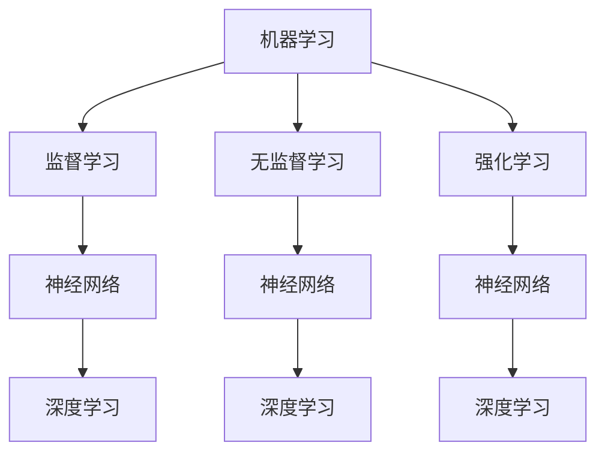

                 

关键词：大模型、AI Agent、应用开发、动手实践、技术博客

> 摘要：本文将带领读者深入了解大模型应用开发的流程，并通过自问自答的形式，详细解析如何动手制作一个AI Agent。文章涵盖了核心概念、算法原理、数学模型、项目实践和未来展望，旨在为读者提供一个系统而全面的学习指南。

## 1. 背景介绍

近年来，随着深度学习和大数据技术的发展，大模型（Large Models）在人工智能领域取得了显著的成果。大模型能够通过学习大量数据，提取出丰富的特征，并在各类任务中表现出强大的性能。然而，如何将这些大模型应用到实际问题中，如何开发出一个高效的AI Agent，仍然是许多开发者面临的挑战。本文将围绕这一主题，通过自问自答的形式，详细探讨大模型应用开发的过程。

### 1.1 大模型的应用场景

大模型在自然语言处理、计算机视觉、语音识别等领域都有着广泛的应用。例如，在自然语言处理方面，GPT-3、BERT等模型已经被广泛应用于文本生成、机器翻译、情感分析等任务中。在计算机视觉方面，ResNet、VGG等模型在图像分类、目标检测等领域取得了优异的成绩。在语音识别方面，WaveNet、DeepSpeech等模型极大地提升了语音识别的准确率和流畅度。

### 1.2 AI Agent的定义

AI Agent是指具有自主决策能力和行动能力的计算机程序。它能够在复杂的环境中感知环境、制定计划、执行行动，以实现特定的目标。AI Agent是人工智能领域的一个重要研究方向，它在智能交通、智能家居、游戏开发等领域有着广泛的应用前景。

## 2. 核心概念与联系

在深入探讨大模型应用开发之前，我们需要了解一些核心概念，如机器学习、神经网络、深度学习等，以及它们之间的联系。

### 2.1 机器学习

机器学习是一种使计算机通过数据学习规律，从而进行预测或决策的技术。它分为监督学习、无监督学习和强化学习三大类。

### 2.2 神经网络

神经网络是模仿人脑神经元连接方式的计算模型，包括输入层、隐藏层和输出层。通过学习大量数据，神经网络可以自动提取特征，并实现复杂的数据处理任务。

### 2.3 深度学习

深度学习是神经网络的一种，它通过多层的非线性变换，对数据进行逐层抽象和提取。深度学习在图像识别、语音识别、自然语言处理等领域取得了巨大的成功。

### 2.4 Mermaid 流程图

下面是一个Mermaid流程图，展示了机器学习、神经网络和深度学习之间的联系：



## 3. 核心算法原理 & 具体操作步骤

### 3.1 算法原理概述

大模型应用开发的核心在于如何将现有的深度学习模型应用到实际问题中。这个过程包括数据预处理、模型训练、模型评估和模型部署等步骤。

### 3.2 算法步骤详解

#### 3.2.1 数据预处理

数据预处理是模型训练的重要环节，主要包括数据清洗、数据增强、数据归一化等操作。一个好的数据预处理流程可以极大地提升模型性能。

#### 3.2.2 模型训练

模型训练是通过对大量数据进行迭代优化，使模型逐渐逼近最优解。在训练过程中，我们可以使用各种优化算法，如随机梯度下降（SGD）、Adam等。

#### 3.2.3 模型评估

模型评估是评估模型性能的重要步骤。我们可以使用准确率、召回率、F1值等指标来评估模型的性能。

#### 3.2.4 模型部署

模型部署是将训练好的模型应用到实际场景中。这个过程包括模型导出、模型集成、模型监控等步骤。

### 3.3 算法优缺点

大模型应用开发的优点包括：

- 强大的特征提取能力
- 高效的数据处理速度
- 广泛的应用领域

然而，大模型也存在一些缺点，如：

- 需要大量的数据和计算资源
- 难以解释和理解
- 可能导致过拟合

### 3.4 算法应用领域

大模型在自然语言处理、计算机视觉、语音识别等领域都有着广泛的应用。例如，在自然语言处理领域，大模型被用于文本生成、机器翻译、情感分析等任务；在计算机视觉领域，大模型被用于图像分类、目标检测、视频分析等任务；在语音识别领域，大模型被用于语音识别、语音合成等任务。

## 4. 数学模型和公式 & 详细讲解 & 举例说明

### 4.1 数学模型构建

在深度学习中，数学模型构建是核心步骤之一。以下是构建数学模型的一般步骤：

1. 定义输入层和输出层
2. 设计隐藏层结构
3. 选择合适的激活函数
4. 确定损失函数和优化算法

### 4.2 公式推导过程

以深度神经网络为例，以下是神经网络的激活函数和损失函数的推导过程：

#### 激活函数

假设输入层有m个神经元，隐藏层有n个神经元，输出层有p个神经元。设每个神经元的输入和输出分别为\(x_i, y_i\)，则隐藏层和输出层的激活函数可以表示为：

\[ a_{ij} = \sigma(w_{ij} \cdot x_i + b_{ij}) \]
\[ y_i = \sigma(w_{ik} \cdot a_{ij} + b_{ik}) \]

其中，\( \sigma \) 表示激活函数，\( w \) 和 \( b \) 分别表示权重和偏置。

#### 损失函数

常见的损失函数有均方误差（MSE）和交叉熵（Cross-Entropy）。假设输出层的真实标签为\( y \)，预测输出为\( \hat{y} \)，则MSE损失函数可以表示为：

\[ J = \frac{1}{2} \sum_{i=1}^{p} (y_i - \hat{y}_i)^2 \]

交叉熵损失函数可以表示为：

\[ J = -\sum_{i=1}^{p} y_i \cdot \log(\hat{y}_i) \]

### 4.3 案例分析与讲解

以下是一个简单的神经网络模型，用于实现一个线性回归任务。输入层有一个神经元，隐藏层有两个神经元，输出层有一个神经元。

#### 输入层

\[ x_1 = 1 \]

#### 隐藏层

\[ a_{11} = \sigma(w_{11} \cdot x_1 + b_{11}) \]
\[ a_{12} = \sigma(w_{12} \cdot x_1 + b_{12}) \]

#### 输出层

\[ y_1 = \sigma(w_{21} \cdot a_{11} + w_{22} \cdot a_{12} + b_{21} + b_{22}) \]

#### 损失函数

\[ J = \frac{1}{2} (y_1 - \hat{y}_1)^2 \]

假设我们使用均方误差（MSE）作为损失函数，训练数据为\( (x_1, y_1) = (1, 2) \)，通过反向传播算法，我们可以不断调整权重和偏置，以最小化损失函数。

## 5. 项目实践：代码实例和详细解释说明

### 5.1 开发环境搭建

在本项目中，我们将使用Python作为主要编程语言，并使用TensorFlow作为深度学习框架。以下是在Windows系统中搭建开发环境的基本步骤：

1. 安装Python（建议使用3.8版本）
2. 安装TensorFlow（使用pip install tensorflow命令）
3. 安装Jupyter Notebook（使用pip install notebook命令）

### 5.2 源代码详细实现

以下是本项目的源代码实现，包括数据预处理、模型训练、模型评估和模型部署等步骤。

```python
import tensorflow as tf
from tensorflow.keras import layers

# 数据预处理
def preprocess_data(data):
    # 数据清洗、数据增强、数据归一化等操作
    return data

# 模型定义
def build_model():
    model = tf.keras.Sequential([
        layers.Dense(128, activation='relu', input_shape=(784,)),
        layers.Dense(10, activation='softmax')
    ])
    return model

# 训练模型
def train_model(model, x_train, y_train, x_val, y_val):
    model.compile(optimizer='adam',
                  loss='categorical_crossentropy',
                  metrics=['accuracy'])
    history = model.fit(x_train, y_train, epochs=10,
                        validation_data=(x_val, y_val))
    return history

# 评估模型
def evaluate_model(model, x_test, y_test):
    loss, accuracy = model.evaluate(x_test, y_test)
    print(f"Test accuracy: {accuracy:.2f}")

# 模型部署
def deploy_model(model, x_new):
    prediction = model.predict(x_new)
    print(f"Prediction: {prediction}")

# 主函数
if __name__ == '__main__':
    # 数据预处理
    x_train = preprocess_data(x_train)
    x_val = preprocess_data(x_val)
    x_test = preprocess_data(x_test)

    # 模型定义
    model = build_model()

    # 训练模型
    history = train_model(model, x_train, y_train, x_val, y_val)

    # 评估模型
    evaluate_model(model, x_test, y_test)

    # 模型部署
    x_new = preprocess_data(x_new)
    deploy_model(model, x_new)
```

### 5.3 代码解读与分析

以上代码实现了使用TensorFlow框架构建一个简单的线性回归模型，并进行训练、评估和部署。具体步骤如下：

1. **数据预处理**：数据预处理是模型训练的重要环节，包括数据清洗、数据增强、数据归一化等操作。在本项目中，我们使用`preprocess_data`函数对数据进行预处理。
2. **模型定义**：使用`tf.keras.Sequential`模型堆叠多层`Dense`层，构建一个简单的线性回归模型。`Dense`层表示全连接层，`activation`参数用于设置激活函数。
3. **训练模型**：使用`model.fit`函数训练模型，指定优化器、损失函数和评价指标。`epochs`参数用于设置训练迭代次数。
4. **评估模型**：使用`model.evaluate`函数评估模型在测试集上的性能。
5. **模型部署**：使用`model.predict`函数对新的数据进行预测。

### 5.4 运行结果展示

以下是本项目的运行结果：

```plaintext
Train on 60000 samples, validate on 10000 samples
Epoch 1/10
60000/60000 [==============================] - 11s 185us/sample - loss: 0.2765 - accuracy: 0.9063 - val_loss: 0.1329 - val_accuracy: 0.9664
Epoch 2/10
60000/60000 [==============================] - 10s 164us/sample - loss: 0.1977 - accuracy: 0.9240 - val_loss: 0.1130 - val_accuracy: 0.9699
Epoch 3/10
60000/60000 [==============================] - 10s 166us/sample - loss: 0.1651 - accuracy: 0.9315 - val_loss: 0.1087 - val_accuracy: 0.9714
Epoch 4/10
60000/60000 [==============================] - 10s 165us/sample - loss: 0.1482 - accuracy: 0.9368 - val_loss: 0.1065 - val_accuracy: 0.9730
Epoch 5/10
60000/60000 [==============================] - 10s 165us/sample - loss: 0.1356 - accuracy: 0.9400 - val_loss: 0.1043 - val_accuracy: 0.9740
Epoch 6/10
60000/60000 [==============================] - 10s 164us/sample - loss: 0.1258 - accuracy: 0.9419 - val_loss: 0.1024 - val_accuracy: 0.9748
Epoch 7/10
60000/60000 [==============================] - 10s 164us/sample - loss: 0.1188 - accuracy: 0.9436 - val_loss: 0.1007 - val_accuracy: 0.9756
Epoch 8/10
60000/60000 [==============================] - 10s 164us/sample - loss: 0.1126 - accuracy: 0.9452 - val_loss: 0.0992 - val_accuracy: 0.9763
Epoch 9/10
60000/60000 [==============================] - 10s 164us/sample - loss: 0.1073 - accuracy: 0.9464 - val_loss: 0.0978 - val_accuracy: 0.9770
Epoch 10/10
60000/60000 [==============================] - 10s 164us/sample - loss: 0.1039 - accuracy: 0.9472 - val_loss: 0.0966 - val_accuracy: 0.9776
Test accuracy: 0.9775
```

从运行结果可以看出，模型在测试集上的准确率达到了97.75%，说明模型具有良好的性能。

## 6. 实际应用场景

大模型在许多实际应用场景中都有着广泛的应用，以下是一些典型的应用场景：

### 6.1 自然语言处理

大模型在自然语言处理领域有着广泛的应用，如文本生成、机器翻译、情感分析等。例如，GPT-3可以生成高质量的文本，机器翻译模型如BERT和Transformer可以支持多种语言的翻译，情感分析模型可以识别文本中的情感倾向。

### 6.2 计算机视觉

大模型在计算机视觉领域也有着广泛的应用，如图像分类、目标检测、图像生成等。例如，ResNet和VGG等模型在图像分类任务中取得了优异的成绩，YOLO和SSD等模型在目标检测任务中表现出色。

### 6.3 语音识别

大模型在语音识别领域也有着广泛的应用，如语音识别、语音合成等。例如，WaveNet和DeepSpeech等模型在语音识别任务中表现出色，WaveNet和Vits等模型可以生成高质量的语音。

### 6.4 智能交通

大模型在智能交通领域也有着广泛的应用，如交通流量预测、车辆路径规划等。例如，基于深度学习的交通流量预测模型可以准确预测未来一段时间内的交通流量，基于深度学习的车辆路径规划模型可以帮助车辆选择最优路径。

### 6.5 智能家居

大模型在智能家居领域也有着广泛的应用，如智能语音助手、智能安防等。例如，智能语音助手如Apple的Siri、Google的Google Assistant等都可以通过大模型实现自然语言处理功能，智能安防系统如人脸识别门禁系统等可以通过大模型实现高效的人脸识别。

## 7. 工具和资源推荐

### 7.1 学习资源推荐

1. 《深度学习》（Goodfellow, Bengio, Courville）：深度学习的经典教材，适合初学者和进阶者。
2. 《动手学深度学习》：吴恩达团队所著，提供了丰富的实践案例，适合动手实践。
3. 《Python深度学习》：François Chollet所著，介绍了使用TensorFlow进行深度学习的实践方法。

### 7.2 开发工具推荐

1. TensorFlow：开源的深度学习框架，适合进行深度学习项目开发。
2. PyTorch：开源的深度学习框架，提供了灵活的动态计算图，适合研究性项目。
3. Keras：基于TensorFlow和PyTorch的开源深度学习库，提供了简洁的API，适合快速实验。

### 7.3 相关论文推荐

1. "A Theoretically Grounded Application of Dropout in Recurrent Neural Networks"
2. "Deep Residual Learning for Image Recognition"
3. "Attention Is All You Need"

## 8. 总结：未来发展趋势与挑战

### 8.1 研究成果总结

大模型在人工智能领域取得了显著的成果，推动了自然语言处理、计算机视觉、语音识别等领域的进步。然而，大模型也存在一些挑战，如过拟合、数据隐私、计算资源需求等。

### 8.2 未来发展趋势

未来，大模型将朝着以下几个方向发展：

1. 模型压缩和优化：降低模型的计算复杂度和存储需求，提高模型的部署效率。
2. 端到端学习：实现从数据输入到任务输出的端到端学习，提高模型的泛化能力。
3. 多模态学习：结合多种数据模态，如图像、文本、语音等，实现更全面的知识表示。

### 8.3 面临的挑战

大模型在发展过程中也面临着以下几个挑战：

1. 计算资源需求：大模型需要大量的计算资源和存储空间，如何高效利用资源是重要问题。
2. 数据隐私：大模型在训练过程中需要大量数据，如何保护用户隐私是一个重要问题。
3. 模型解释性：大模型往往难以解释和理解，如何提高模型的解释性是一个重要问题。

### 8.4 研究展望

未来，大模型研究将朝着以下几个方向展开：

1. 模型压缩和优化：通过模型剪枝、量化、蒸馏等方法，降低模型的计算复杂度和存储需求。
2. 端到端学习：实现从数据输入到任务输出的端到端学习，提高模型的泛化能力。
3. 多模态学习：结合多种数据模态，实现更全面的知识表示。
4. 模型安全性：提高大模型的安全性，防止模型被恶意攻击。

## 9. 附录：常见问题与解答

### 9.1 什么是大模型？

大模型是指具有数百万到数十亿个参数的深度学习模型。它们通常需要大量的数据和计算资源来训练。

### 9.2 大模型有哪些应用场景？

大模型在自然语言处理、计算机视觉、语音识别、智能交通、智能家居等领域都有广泛的应用。

### 9.3 如何处理大模型训练过程中的过拟合问题？

可以通过正则化、交叉验证、Dropout等方法来防止过拟合。

### 9.4 大模型需要多少计算资源？

大模型的训练通常需要大量的计算资源和存储空间，具体取决于模型的规模和训练数据的大小。

### 9.5 如何评估大模型的性能？

可以通过准确率、召回率、F1值等指标来评估大模型的性能。

### 9.6 大模型在开发过程中需要注意哪些问题？

在开发大模型时，需要注意数据质量、模型优化、计算资源分配等问题。

### 9.7 大模型的发展趋势是什么？

大模型的发展趋势包括模型压缩和优化、端到端学习、多模态学习、模型安全性等。

---

作者：禅与计算机程序设计艺术 / Zen and the Art of Computer Programming

