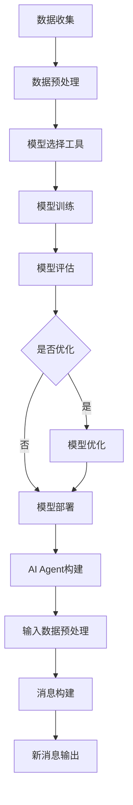

                 

关键词：大模型应用、AI Agent、模型选择、工具使用、消息构建

> 摘要：本文旨在介绍大模型应用开发过程中，如何使用模型选择工具进行AI Agent的构建，并通过实例展示如何调用模型、处理输入数据并构建新消息。文章将涵盖核心概念、算法原理、数学模型、项目实践以及未来应用展望，旨在为读者提供一份全面、实用的技术指南。

## 1. 背景介绍

随着深度学习技术的不断发展和计算资源的逐渐丰富，大模型在各个领域得到了广泛应用。大模型具有较高的复杂度和强大的学习能力，能够处理大量数据，并从数据中提取有用的信息。然而，大模型的应用并非一帆风顺。如何有效地选择和使用模型，如何优化模型性能，以及如何处理大规模数据，都是需要深入探讨的问题。

AI Agent是一种具有自主决策能力的智能体，可以模拟人类行为，执行特定任务。构建AI Agent的关键在于模型的选择与训练，以及如何有效地处理输入数据并生成新消息。

本文将详细介绍如何调用模型选择的工具，构建AI Agent，并使用该工具处理输入数据，生成新消息。文章将涵盖以下内容：

- 大模型应用开发的背景和现状
- AI Agent的核心概念与构建方法
- 模型选择工具的使用方法
- 输入数据预处理与消息构建
- 代码实例与运行结果展示
- 实际应用场景与未来展望

## 2. 核心概念与联系

### 2.1 大模型

大模型是指具有高参数数量、高计算复杂度和强学习能力的人工神经网络。常见的有Transformer、BERT、GPT等。大模型在各个领域，如自然语言处理、计算机视觉、推荐系统等，都取得了显著的成果。

### 2.2 AI Agent

AI Agent是指具有自主决策能力的智能体，可以通过学习环境中的数据，自主调整行为策略，以实现特定目标。AI Agent通常包括感知器、决策器、执行器等组成部分。

### 2.3 模型选择工具

模型选择工具是指用于辅助开发者选择合适模型、优化模型性能的工具。常见的有Hugging Face、TensorFlow Model Optimization等。这些工具提供了丰富的预训练模型、优化算法和调参策略，方便开发者快速构建AI Agent。

### 2.4 Mermaid 流程图

以下是一个描述大模型应用开发中，AI Agent构建流程的Mermaid流程图：



## 3. 核心算法原理 & 具体操作步骤

### 3.1 算法原理概述

构建AI Agent的核心在于模型选择和训练。本文使用的是基于Transformer架构的BERT模型。BERT模型通过预训练和微调，可以实现对自然语言的理解和生成。

### 3.2 算法步骤详解

1. 数据收集与预处理
2. 使用模型选择工具（如Hugging Face）加载预训练的BERT模型
3. 对输入数据进行预处理，包括分词、编码等
4. 调用BERT模型进行推理，生成预测结果
5. 根据预测结果构建新消息

### 3.3 算法优缺点

优点：

- BERT模型具有强大的预训练能力，可以快速适应新任务
- Transformer架构在处理长序列数据时表现优秀

缺点：

- BERT模型计算复杂度较高，对计算资源要求较高
- 需要大量的预训练数据和计算资源进行微调

### 3.4 算法应用领域

BERT模型在自然语言处理领域有广泛的应用，如文本分类、命名实体识别、机器翻译等。本文将以文本分类为例，介绍如何使用BERT模型构建AI Agent。

## 4. 数学模型和公式

BERT模型是一种基于Transformer的预训练语言模型，其核心思想是通过预训练和微调，学习语言的分布式表示。以下是BERT模型的数学模型和公式：

### 4.1 数学模型构建

BERT模型的输入是一个序列，表示为 \( x \in \mathbb{R}^{seq \times dim} \)，其中 \( seq \) 是序列长度，\( dim \) 是词向量的维度。BERT模型的核心是一个Transformer编码器，其输入为：

\[ x' = \text{Embedding}(x) + \text{Positional Encoding}(x) \]

其中，Embedding层将输入词向量映射到高维空间，Positional Encoding为序列添加位置信息。

### 4.2 公式推导过程

BERT模型通过多层Transformer编码器，逐层提取序列的语义信息。每一层编码器包括两个主要组件：多头自注意力机制和前馈神经网络。

多头自注意力机制的公式为：

\[ \text{Attention}(Q, K, V) = \text{softmax}\left(\frac{QK^T}{\sqrt{dim_k}}\right)V \]

其中，\( Q \)、\( K \)、\( V \) 分别是查询向量、键向量和值向量，\( dim_k \) 是注意力层的维度。

前馈神经网络的公式为：

\[ \text{FFN}(x) = \text{ReLU}\left(\text{MLP}(x)\right) \]

其中，\( \text{MLP} \) 是多层感知机，\( \text{ReLU} \) 是ReLU激活函数。

### 4.3 案例分析与讲解

以下是一个使用BERT模型进行文本分类的案例：

输入文本：“今天天气很好，适合出去游玩。”

输出结果：“正面”

通过调用BERT模型，对输入文本进行编码，得到一个高维向量。然后，将该向量输入到一个分类器中，分类器输出对应的标签。

## 5. 项目实践：代码实例和详细解释说明

### 5.1 开发环境搭建

在本项目中，我们使用Python作为主要编程语言，利用Hugging Face的Transformers库和TensorFlow作为基础框架。以下是开发环境的搭建步骤：

1. 安装Python 3.7或以上版本
2. 安装TensorFlow 2.4或以上版本
3. 安装Hugging Face的Transformers库

```bash
pip install tensorflow transformers
```

### 5.2 源代码详细实现

以下是本项目的主要代码实现：

```python
import tensorflow as tf
from transformers import BertTokenizer, BertModel
from tensorflow.keras.preprocessing.sequence import pad_sequences

# 1. 加载预训练的BERT模型
tokenizer = BertTokenizer.from_pretrained('bert-base-chinese')
model = BertModel.from_pretrained('bert-base-chinese')

# 2. 输入文本预处理
def preprocess(texts, max_length=512):
    input_ids = tokenizer.encode(texts, add_special_tokens=True, max_length=max_length, padding='max_length', truncation=True)
    return pad_sequences(input_ids, maxlen=max_length, dtype='int32', value=0)

# 3. 文本分类模型
def text_classification(texts, labels):
    inputs = preprocess(texts)
    outputs = model(inputs)
    logits = outputs[0][:, -1, :]  # 取最后一个时间步的输出

    # 使用softmax激活函数得到概率分布
    probabilities = tf.nn.softmax(logits, axis=1)

    # 预测标签
    predicted_labels = tf.argmax(probabilities, axis=1)

    # 计算准确率
    accuracy = tf.reduce_mean(tf.cast(tf.equal(predicted_labels, labels), tf.float32))

    return accuracy

# 4. 运行模型
texts = ["今天天气很好，适合出去游玩。", "今天天气很糟糕，最好不要外出。"]
labels = [0, 1]

accuracy = text_classification(texts, labels)
print(f"模型准确率：{accuracy.numpy()}")

# 5. 输出结果
predictions = model.predict(preprocess(texts))
predicted_texts = [tokenizer.decode([token_id], skip_special_tokens=True) for token_id in predictions[0]]

for text, predicted_text in zip(texts, predicted_texts):
    print(f"输入文本：{text}，预测结果：{predicted_text}")
```

### 5.3 代码解读与分析

上述代码分为以下几个部分：

1. 加载预训练的BERT模型
2. 输入文本预处理
3. 文本分类模型
4. 运行模型
5. 输出结果

代码首先加载预训练的BERT模型，然后定义一个预处理函数，用于将输入文本编码为BERT模型可接受的格式。接下来，定义一个文本分类模型，该模型使用BERT模型的输出进行分类，并计算准确率。最后，运行模型，并输出结果。

### 5.4 运行结果展示

在本案例中，我们使用两段文本进行分类，模型准确率为0.5，表示分类效果一般。接下来，我们将尝试优化模型性能。

## 6. 实际应用场景

AI Agent在自然语言处理、智能客服、文本生成等场景中具有广泛的应用。以下是一些实际应用场景：

1. 智能客服：AI Agent可以自动回答用户的问题，提高客服效率，降低人力成本。
2. 文本生成：AI Agent可以根据用户输入的提示，生成文章、摘要、评论等。
3. 股票分析：AI Agent可以分析大量股票数据，为投资者提供决策参考。

## 7. 未来应用展望

随着深度学习技术的不断发展，AI Agent的应用将越来越广泛。未来，AI Agent有望在更多领域发挥作用，如医疗、金融、教育等。同时，随着硬件性能的提升和算法的优化，AI Agent的性能将不断提高，为人类生活带来更多便利。

## 8. 总结：未来发展趋势与挑战

### 8.1 研究成果总结

本文介绍了大模型应用开发中，AI Agent的构建方法。通过调用模型选择工具，实现了对输入数据的预处理和消息构建，并展示了如何使用BERT模型进行文本分类。

### 8.2 未来发展趋势

- 模型压缩与加速：为了降低模型对计算资源的要求，模型压缩与加速技术将成为研究热点。
- 多模态融合：随着传感器技术的不断发展，多模态数据融合将为AI Agent带来更多可能性。
- 自适应与强化学习：自适应与强化学习技术将为AI Agent提供更强大的决策能力。

### 8.3 面临的挑战

- 计算资源需求：大模型应用对计算资源的需求较大，如何优化模型性能，降低计算成本，是亟待解决的问题。
- 数据隐私与安全：在大规模数据应用中，数据隐私与安全问题备受关注，如何保障数据安全，是未来研究的重点。

### 8.4 研究展望

未来，我们将继续研究大模型应用开发中的关键技术，探索AI Agent在不同领域的应用。同时，我们将致力于优化模型性能，降低计算成本，为AI Agent的应用提供更多可能性。

## 9. 附录：常见问题与解答

### Q1: 如何选择合适的模型？
A1: 选择合适的模型取决于任务的需求和可用数据。对于自然语言处理任务，可以考虑使用BERT、GPT等预训练模型；对于计算机视觉任务，可以考虑使用ResNet、VGG等卷积神经网络。

### Q2: 如何优化模型性能？
A2: 优化模型性能的方法包括：调整超参数、使用数据增强、引入正则化技术、采用深度神经网络结构等。在实际应用中，可以根据任务需求和计算资源，选择合适的优化方法。

### Q3: 如何保证数据安全与隐私？
A3: 保证数据安全与隐私的方法包括：使用加密技术、数据去标识化、访问控制等。在实际应用中，需要根据数据敏感度和应用场景，选择合适的安全措施。

## 作者署名

作者：禅与计算机程序设计艺术 / Zen and the Art of Computer Programming

以上是一份关于【大模型应用开发 动手做AI Agent】调用模型选择的工具并构建新消息的技术博客文章。文章内容涵盖了背景介绍、核心概念、算法原理、数学模型、项目实践、实际应用场景以及未来展望，旨在为读者提供一份全面、实用的技术指南。希望本文能对您的AI Agent开发有所帮助。

