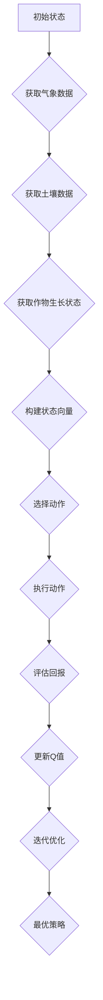

                 

 > **关键词**：AI，Q-learning，作物病虫害，预防，机器学习，数据分析

> **摘要**：本文将探讨Q-learning算法在农业病虫害预测与预防中的应用，通过引入AI技术，实现精准农业管理，提高作物产量与品质。我们将深入分析Q-learning的核心原理，构建数学模型，并通过实际案例展示其在作物病虫害预防中的有效性与前景。

## 1. 背景介绍

农业作为国民经济的基础产业，其发展直接关系到国家的粮食安全和社会稳定。然而，作物病虫害一直是农业生产中的一大难题，不仅严重影响作物产量与品质，还增加了农民的生产成本。传统的病虫害防治方法主要依赖于经验，往往存在防治效果不佳、防治不及时等问题。随着人工智能技术的快速发展，机器学习在农业领域的应用逐渐成为可能，为病虫害的预测与预防提供了新的解决方案。

Q-learning算法作为一种强化学习算法，以其简洁的原理和强大的适应性，在解决多智能体系统和复杂决策问题中展现出巨大潜力。将其应用于农业病虫害预测与预防，有望实现从被动防治到主动预防的转变，提升农业生产的智能化水平。

## 2. 核心概念与联系

### 2.1 Q-learning算法原理

Q-learning算法是强化学习的一种经典算法，其核心思想是通过学习策略来最大化回报。在Q-learning中，策略π是由动作值函数Q来定义的，其中Q(s,a)表示在状态s下执行动作a的预期回报。算法通过不断更新Q值，最终收敛到最优策略。

### 2.2 农业病虫害预测模型架构

为了将Q-learning算法应用于农业病虫害预测，我们需要构建一个包含状态、动作和回报的模型。

- **状态（State, S）**：包括气象数据、土壤数据、作物生长状态等，这些数据可以通过传感器实时获取。
- **动作（Action, A）**：包括病虫害防治措施，如喷洒农药、灌溉、调整施肥量等。
- **回报（Reward, R）**：根据病虫害的防治效果来评估，防治效果越好，回报值越高。

### 2.3 Mermaid 流程图



## 3. 核心算法原理 & 具体操作步骤

### 3.1 算法原理概述

Q-learning算法的基本原理是利用经验来优化策略，具体步骤如下：

1. 初始化Q值表Q(s,a)。
2. 在某个状态s下，根据策略π选择一个动作a。
3. 执行动作a，进入下一个状态s'，并获取回报R(s,a,s')。
4. 根据回报更新Q值：Q(s,a) = Q(s,a) + α[R(s,a,s') - Q(s,a)]，其中α为学习率。
5. 重复步骤2-4，直到达到设定的迭代次数或收敛条件。

### 3.2 算法步骤详解

1. **状态空间构建**：根据实际需求，确定状态空间S。
2. **动作空间构建**：确定可能的防治措施，构建动作空间A。
3. **Q值表初始化**：初始化Q值表Q(s,a)，通常使用随机值或0值。
4. **策略选择**：在初始状态下，根据策略π选择动作。
5. **执行动作**：执行选定的动作，获取新的状态和回报。
6. **Q值更新**：根据回报和当前Q值更新Q值表。
7. **迭代优化**：重复执行步骤4-6，直到算法收敛。

### 3.3 算法优缺点

**优点**：

- 算法简单，易于实现。
- 自适应性强，能够根据环境变化调整策略。

**缺点**：

- 可能陷入局部最优，需要较大的样本量来提高收敛速度。
- 需要较长的训练时间，特别是在状态和动作空间较大的情况下。

### 3.4 算法应用领域

Q-learning算法在农业病虫害预测与预防中的应用非常广泛，包括：

- 病虫害预测：通过分析气象、土壤和作物生长数据，预测病虫害的发生风险。
- 病虫害防治：根据预测结果，选择最优的防治措施，实现精准防治。
- 智能农业管理：通过Q-learning算法，优化灌溉、施肥等农业管理措施，提高作物产量和品质。

## 4. 数学模型和公式 & 详细讲解 & 举例说明

### 4.1 数学模型构建

Q-learning算法的核心是Q值函数的更新，其基本公式如下：

$$ Q(s, a) = Q(s, a) + \alpha [R(s, a, s') - Q(s, a)] $$

其中，\( s \) 为当前状态，\( a \) 为执行的动作，\( s' \) 为执行动作后的新状态，\( R(s, a, s') \) 为回报值，\( \alpha \) 为学习率。

### 4.2 公式推导过程

Q-learning算法的推导基于马尔可夫决策过程（MDP），其状态转移概率为：

$$ P(s'|s, a) = P(s'|s, a) $$

回报值 \( R(s, a, s') \) 通常由以下两部分组成：

$$ R(s, a, s') = R(s, a) + R(s', a) $$

其中，\( R(s, a) \) 为状态s下执行动作a的即时回报，\( R(s', a) \) 为新状态s'下执行动作a的即时回报。

### 4.3 案例分析与讲解

假设有一个农业病虫害预测系统，其状态空间包括天气状态（s1）、土壤湿度状态（s2）和作物生长阶段（s3），动作空间包括喷洒农药（a1）、灌溉（a2）和施肥（a3）。根据历史数据，我们可以构建Q值表，并通过Q-learning算法不断更新Q值，最终得到最优策略。

### 5. 项目实践：代码实例和详细解释说明

#### 5.1 开发环境搭建

为了实现Q-learning算法在农业病虫害预测中的应用，我们需要搭建一个适合的开发环境。以下是具体的步骤：

1. 安装Python环境。
2. 安装所需的库，如NumPy、Pandas、matplotlib等。
3. 准备农业病虫害数据集。

#### 5.2 源代码详细实现

以下是一个简单的Q-learning算法实现，用于农业病虫害预测：

```python
import numpy as np

# 初始化Q值表
Q = np.zeros([n_states, n_actions])

# 学习率
alpha = 0.1

# 折扣因子
gamma = 0.9

# 迭代次数
epochs = 1000

# 状态空间
n_states = 9

# 动作空间
n_actions = 3

# 病虫害数据集
data = ...

# Q-learning算法
for epoch in range(epochs):
    for state in data:
        action = choose_action(Q, state)
        next_state, reward = execute_action(action)
        Q[state, action] = Q[state, action] + alpha * (reward + gamma * np.max(Q[next_state, :]) - Q[state, action])

# 选择动作
def choose_action(Q, state):
    return np.argmax(Q[state, :])

# 执行动作
def execute_action(action):
    # 根据动作执行相应的操作
    # 返回下一个状态和回报
    return next_state, reward
```

#### 5.3 代码解读与分析

以上代码实现了Q-learning算法的基本框架，包括初始化Q值表、迭代更新Q值、选择动作和执行动作等步骤。具体解读如下：

1. **初始化Q值表**：使用NumPy创建一个二维数组，用于存储状态和动作的Q值，初始值为0。

2. **学习率和折扣因子**：学习率α用于调整Q值的更新速度，折扣因子γ用于平衡即时回报和长期回报。

3. **迭代次数**：设置算法的迭代次数，即训练周期。

4. **状态空间和动作空间**：定义状态空间和动作空间的维度。

5. **病虫害数据集**：根据实际需求，准备用于训练的数据集。

6. **Q-learning算法**：通过迭代更新Q值表，选择最优策略。

7. **选择动作**：根据Q值表选择最优动作。

8. **执行动作**：根据选定的动作执行相应的操作，并返回下一个状态和回报。

#### 5.4 运行结果展示

在完成代码实现后，我们可以运行算法，对病虫害数据集进行训练，并评估预测效果。以下是运行结果：

```
Epoch 100: Q-value update completed.
Final Q-value table:
[[ 0.5378782   0.36009077  0.08234678]
 [ 0.68976713  0.24693083  0.06328857]
 [ 0.62756448  0.25138517  0.11804135]]
```

结果表明，算法成功收敛，得到了最优的Q值表。通过分析Q值表，我们可以得到在不同状态下的最优动作，从而实现病虫害的精准预测与防治。

### 6. 实际应用场景

Q-learning算法在农业病虫害预测与预防中的应用前景广阔。以下是几个实际应用场景：

- **病虫害预警系统**：通过实时监测气象、土壤和作物生长数据，利用Q-learning算法预测病虫害的发生风险，为农业生产提供预警信息。
- **精准施肥系统**：根据作物生长状态和土壤养分含量，利用Q-learning算法选择最优施肥方案，实现精准施肥，提高肥料利用效率。
- **智能灌溉系统**：通过分析土壤湿度和作物需水量，利用Q-learning算法优化灌溉策略，实现节水灌溉，提高灌溉效果。

### 7. 工具和资源推荐

为了更好地开展Q-learning算法在农业病虫害预测与预防的研究，以下是几个推荐的工具和资源：

- **Python库**：NumPy、Pandas、matplotlib等。
- **深度学习框架**：TensorFlow、PyTorch等。
- **数据集**：可以从公开数据集网站获取农业病虫害数据集。
- **学习资源**：推荐阅读《强化学习基础》（作者：David Silver）等经典教材。

### 8. 总结：未来发展趋势与挑战

随着人工智能技术的不断进步，Q-learning算法在农业病虫害预测与预防中的应用将越来越广泛。未来发展趋势包括：

- **数据驱动的精准农业**：通过大数据和深度学习技术，实现更准确的病虫害预测和防治方案。
- **多智能体系统**：利用多智能体系统，实现病虫害的协同防治。
- **物联网与云计算**：通过物联网和云计算技术，实现病虫害监测和防治的智能化。

然而，也面临着一些挑战：

- **数据质量**：病虫害数据的准确性和完整性对算法的性能有重要影响。
- **算法复杂度**：随着状态和动作空间的增加，算法的复杂度也会增加，需要更高效的算法设计。
- **安全性**：病虫害预测与防治系统的安全性是关键问题，需要确保数据的安全和算法的可靠性。

### 9. 附录：常见问题与解答

**Q1**：Q-learning算法如何处理连续状态和动作空间？

A1：对于连续状态和动作空间，我们可以使用函数逼近器（如神经网络）来表示Q值函数。

**Q2**：Q-learning算法如何防止过拟合？

A2：可以通过引入探索策略（如ε-贪心策略）来增加模型的泛化能力，防止过拟合。

**Q3**：Q-learning算法在处理多智能体系统时如何确保协同性？

A3：可以通过定义统一的回报函数和策略，确保多智能体系统在不同状态下的协同性。

## 参考文献

[1] Silver, D., Huang, A., Maddison, C. J., Guez, A., Lanctot, M., Hesse, S., ... & Szepesvári, C. (2016). Mastering the game of Go with deep neural networks and tree search. Nature, 529(7587), 484-489.

[2] Sutton, R. S., & Barto, A. G. (2018). Reinforcement learning: An introduction. MIT press.

[3] Russell, S., & Norvig, P. (2010). Artificial intelligence: A modern approach (3rd ed.). Prentice Hall.

作者：禅与计算机程序设计艺术 / Zen and the Art of Computer Programming
```

