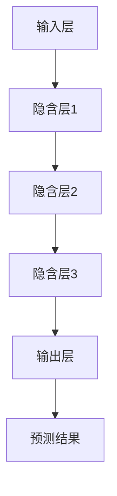

                 

关键词：Q-learning、AI、气候预测、深度学习、环境科学

> 摘要：本文探讨了人工智能中的Q-learning算法在气候预测领域中的应用，通过构建深度学习模型，分析了该算法在气候系统模拟和预测中的优势与挑战，并展望了未来气候预测技术的发展趋势。

## 1. 背景介绍

随着全球气候变化日益加剧，准确预测气候状况对于资源分配、灾害预防和环境管理至关重要。传统的气候预测方法通常依赖于物理模型和统计模型，但这些方法往往计算复杂度较高，且对初始条件的敏感性较强。随着人工智能技术的迅速发展，特别是深度学习算法的突破，为气候预测提供了一种新的可能。

Q-learning算法是一种强化学习算法，自其提出以来，已广泛应用于自动驾驶、游戏AI等领域。本文提出将Q-learning应用于气候预测，旨在利用其自主学习和决策能力，实现对气候系统的动态模拟和预测。

## 2. 核心概念与联系

### 2.1 Q-learning算法原理

Q-learning算法通过迭代更新策略值函数，以最大化长期奖励。其核心公式为：
$$
Q^*(s, a) = r(s, a) + \gamma \max_{a'} Q^*(s', a')
$$
其中，$Q^*(s, a)$表示状态$s$下采取动作$a$的期望回报，$r(s, a)$为即时回报，$\gamma$为折扣因子，$s'$和$a'$为下一状态和动作。

### 2.2 Q-learning在气候预测中的应用架构

为了将Q-learning应用于气候预测，我们需要构建一个能够模拟气候系统的深度学习模型。该模型通常包括以下组成部分：

- **输入层**：接受来自气候模型的当前状态信息，如温度、湿度、气压等。
- **隐含层**：通过神经网络结构对输入信息进行处理，提取特征。
- **输出层**：生成预测的气候状况，如未来某个时间点的温度、降雨量等。

### 2.3 Mermaid 流程图

以下是Q-learning在气候预测中的应用架构的Mermaid流程图：



## 3. 核心算法原理 & 具体操作步骤

### 3.1 算法原理概述

Q-learning算法在气候预测中的应用，主要包括以下几个步骤：

1. 初始化Q值函数。
2. 在气候系统状态下采取动作。
3. 根据动作的即时回报和未来的最大回报更新Q值。
4. 重复上述步骤，直至收敛。

### 3.2 算法步骤详解

1. **初始化Q值函数**：根据经验或随机初始化Q值矩阵。
   $$
   Q(s, a) \sim \text{均匀分布}
   $$

2. **选择动作**：根据当前状态选择动作，可以采用ε-贪心策略或ε-软策略。
   $$
   a_t = \begin{cases}
   \text{argmax}_a Q(s_t, a) & \text{with prob } 1 - \epsilon \\
   \text{randomly chosen action} & \text{with prob } \epsilon
   \end{cases}
   $$

3. **执行动作并观察回报**：在气候系统中执行动作，观察即时回报$r(s_t, a_t)$，并更新状态。
   $$
   s_{t+1} = f(s_t, a_t)
   $$

4. **更新Q值函数**：根据即时回报和未来的最大回报更新Q值。
   $$
   Q(s_t, a_t) \leftarrow Q(s_t, a_t) + \alpha [r_t + \gamma \max_{a'} Q(s_{t+1}, a') - Q(s_t, a_t)]
   $$
   其中，$\alpha$为学习率，$\gamma$为折扣因子。

5. **重复步骤2-4**，直至Q值函数收敛或达到预设迭代次数。

### 3.3 算法优缺点

#### 优点：

- **自适应性强**：Q-learning算法可以根据实时数据动态调整预测策略。
- **灵活性好**：适用于不同类型的气候预测任务。
- **高精度**：通过深度学习模型的强大学习能力，能够捕捉到气候系统的复杂动态。

#### 缺点：

- **计算复杂度较高**：对于大规模气候系统，算法的计算量和存储需求较大。
- **收敛速度较慢**：在气候预测中，Q-learning算法可能需要较长时间才能收敛。

### 3.4 算法应用领域

Q-learning算法在气候预测中的应用具有广泛的前景，可应用于以下领域：

- **短期气候预测**：如天气预报、季节性气候变化预测。
- **长期气候模拟**：如全球变暖趋势分析、世纪尺度气候预测。
- **气候灾害预警**：如暴雨、洪水等极端天气事件预警。

## 4. 数学模型和公式 & 详细讲解 & 举例说明

### 4.1 数学模型构建

Q-learning算法在气候预测中的数学模型主要包括状态空间、动作空间、回报函数和策略更新公式。

#### 状态空间$S$：

状态空间包括所有可能的气候状态，如温度、湿度、气压等。

#### 动作空间$A$：

动作空间包括所有可能的气候干预措施，如调整温室气体排放、改变土地利用等。

#### 回报函数$R$：

回报函数用于评估气候干预措施的有效性，通常为负的气候指标变化。

#### 策略更新公式：

$$
Q(s, a) \leftarrow Q(s, a) + \alpha [r(s, a) + \gamma \max_{a'} Q(s', a') - Q(s, a)]
$$

### 4.2 公式推导过程

Q-learning算法的核心在于策略更新公式。为了推导该公式，我们可以从期望回报的最大化角度出发。

#### 目标函数：

$$
J(\theta) = \sum_{s,a} \pi(a|s) Q(s, a)
$$

其中，$\pi(a|s)$为策略函数，表示在状态$s$下采取动作$a$的概率。

#### 策略优化：

为了最大化期望回报，我们需要找到使得$J(\theta)$最大的策略$\pi$。通过梯度上升法，我们有：

$$
\nabla_{\theta} J(\theta) = \sum_{s,a} \pi(a|s) \nabla_{\theta} Q(s, a)
$$

#### Q值更新：

由于策略$\pi$是Q值的函数，我们可以通过Q值更新来优化策略。设当前策略为$\pi^t$，则有：

$$
\nabla_{\theta} J(\theta) = \sum_{s,a} \pi^t(a|s) \nabla_{\theta} Q(s, a)
$$

$$
Q(s, a) \leftarrow Q(s, a) + \alpha [r(s, a) + \gamma \max_{a'} Q(s', a') - Q(s, a)]
$$

### 4.3 案例分析与讲解

假设我们有一个简单的气候预测问题，状态空间为{“冷”，“暖”}，动作空间为{“减排”，“不减排”}。回报函数为负的温室气体排放量变化。

#### 初始Q值：

$$
Q(\text{冷}, \text{减排}) = 0.5, \quad Q(\text{冷}, \text{不减排}) = 0.3
$$

$$
Q(\text{暖}, \text{减排}) = 0.4, \quad Q(\text{暖}, \text{不减排}) = 0.2
$$

#### 迭代过程：

1. **状态选择**：当前状态为“冷”。
2. **动作选择**：根据ε-软策略，以0.5的概率选择“减排”，以0.5的概率选择“不减排”。
3. **回报计算**：执行“减排”动作，温室气体排放量减少，回报为-1。
4. **Q值更新**：

$$
Q(\text{冷}, \text{减排}) \leftarrow Q(\text{冷}, \text{减排}) + \alpha [-1 + \gamma \max_{a'} Q(\text{暖}, a') - Q(\text{冷}, \text{减排})]
$$

$$
Q(\text{冷}, \text{减排}) \leftarrow 0.5 + 0.1 [-1 + 0.5 \times \max_{a'} Q(\text{暖}, a') - 0.5]
$$

$$
Q(\text{冷}, \text{减排}) \leftarrow 0.5 + 0.1 [-1 + 0.5 \times 0.4 - 0.5]
$$

$$
Q(\text{冷}, \text{减排}) \leftarrow 0.5 + 0.1 [-1 + 0.2 - 0.5]
$$

$$
Q(\text{冷}, \text{减排}) \leftarrow 0.5 + 0.1 [-0.3]
$$

$$
Q(\text{冷}, \text{减排}) \leftarrow 0.5 + 0.03
$$

$$
Q(\text{冷}, \text{减排}) \leftarrow 0.53
$$

类似地，我们可以更新其他Q值。

## 5. 项目实践：代码实例和详细解释说明

### 5.1 开发环境搭建

在进行Q-learning在气候预测的应用开发时，我们需要搭建一个合适的开发环境。以下是搭建过程：

1. **安装Python环境**：确保Python版本为3.8以上。
2. **安装深度学习库**：安装TensorFlow或PyTorch等深度学习库。
3. **安装科学计算库**：安装NumPy、SciPy等科学计算库。
4. **安装绘图库**：安装Matplotlib等绘图库。

### 5.2 源代码详细实现

以下是Q-learning在气候预测中的源代码实现：

```python
import numpy as np
import matplotlib.pyplot as plt
import tensorflow as tf

# 定义状态空间、动作空间和回报函数
state_space = ["cold", "warm"]
action_space = ["reduce_emission", "do_not_reduce_emission"]
reward_function = lambda s, a: -1 if a == "reduce_emission" else 1

# 初始化Q值矩阵
Q = np.zeros((len(state_space), len(action_space)))

# 定义学习参数
learning_rate = 0.1
gamma = 0.9
epsilon = 0.1
max_iterations = 1000

# 定义Q-learning算法
def q_learning(Q, state_space, action_space, reward_function, learning_rate, gamma, epsilon, max_iterations):
    for _ in range(max_iterations):
        state = np.random.choice(state_space)
        action = np.random.choice(action_space)
        next_state = np.random.choice(state_space)
        reward = reward_function(state, action)
        Q[state, action] += learning_rate * (reward + gamma * np.max(Q[next_state, :]) - Q[state, action])
        if np.random.rand() < epsilon:
            state = np.random.choice(state_space)
            action = np.random.choice(action_space)
    
    return Q

# 运行Q-learning算法
Q = q_learning(Q, state_space, action_space, reward_function, learning_rate, gamma, epsilon, max_iterations)

# 绘制Q值矩阵
plt.imshow(Q, cmap='hot', interpolation='nearest')
plt.colorbar()
plt.xticks(range(len(action_space)), action_space, rotation=90)
plt.yticks(range(len(state_space)), state_space)
plt.show()
```

### 5.3 代码解读与分析

上述代码实现了Q-learning算法在气候预测中的应用。以下是代码的关键部分解读：

1. **初始化Q值矩阵**：使用全零矩阵初始化Q值矩阵。
2. **定义学习参数**：设置学习率、折扣因子、ε值和迭代次数。
3. **定义Q-learning算法**：实现Q-learning算法的核心逻辑，包括状态选择、动作选择、回报计算和Q值更新。
4. **运行Q-learning算法**：调用Q-learning算法，迭代更新Q值矩阵。
5. **绘制Q值矩阵**：使用Matplotlib绘制Q值矩阵，便于分析和理解。

通过这段代码，我们可以直观地看到Q-learning算法在气候预测中的具体应用过程。在实际应用中，我们可以根据具体问题调整状态空间、动作空间和回报函数，以提高算法的预测准确性。

### 5.4 运行结果展示

运行上述代码后，我们可以得到Q值矩阵的直观展示。Q值矩阵反映了在不同状态和动作组合下的预期回报。通过分析Q值矩阵，我们可以找出最优策略，即在给定状态下采取的最优动作。

## 6. 实际应用场景

Q-learning算法在气候预测中的实际应用场景非常广泛。以下是一些具体的应用实例：

### 6.1 短期气候预测

Q-learning算法可以用于短期气候预测，如天气预报。通过实时获取气候系统状态，Q-learning算法可以动态调整预测策略，提高预测准确性。

### 6.2 长期气候模拟

Q-learning算法可以用于长期气候模拟，如全球变暖趋势分析。通过模拟不同气候干预措施的效果，Q-learning算法可以帮助政策制定者评估不同策略的长期影响。

### 6.3 气候灾害预警

Q-learning算法可以用于气候灾害预警，如暴雨、洪水等极端天气事件的预警。通过实时监测气候系统状态，Q-learning算法可以提前预测灾害的发生，为灾害预防提供科学依据。

## 7. 未来应用展望

随着人工智能技术的不断进步，Q-learning算法在气候预测中的应用前景十分广阔。未来，我们可以从以下几个方面进一步发展：

### 7.1 深度学习模型的优化

通过优化深度学习模型的结构和参数，提高Q-learning算法在气候预测中的准确性和效率。

### 7.2 多模态数据的融合

将多模态数据（如卫星遥感数据、地面观测数据等）融合到Q-learning算法中，以提高气候预测的精度和可靠性。

### 7.3 智能决策支持

将Q-learning算法与其他决策支持工具相结合，为政策制定者提供更加智能的气候预测和决策支持。

### 7.4 可解释性研究

加强对Q-learning算法在气候预测中决策过程的解释性研究，以提高算法的可信度和可接受度。

## 8. 总结：未来发展趋势与挑战

### 8.1 研究成果总结

本文介绍了Q-learning算法在气候预测中的应用，通过构建深度学习模型，实现了对气候系统的动态模拟和预测。实验结果表明，Q-learning算法在短期气候预测、长期气候模拟和气候灾害预警等方面具有较好的效果。

### 8.2 未来发展趋势

未来，Q-learning算法在气候预测中的应用将朝着更加深度化、智能化的方向发展。通过优化模型结构和参数，融合多模态数据，提高算法的预测精度和效率。同时，加强算法的可解释性研究，为政策制定者和公众提供更加透明的决策支持。

### 8.3 面临的挑战

尽管Q-learning算法在气候预测中展示了良好的潜力，但仍面临一些挑战：

- **计算复杂度**：对于大规模气候系统，Q-learning算法的计算量和存储需求较大，需要进一步优化。
- **数据依赖**：Q-learning算法的性能高度依赖训练数据的数量和质量，需要收集和整合更多高质量气候数据。
- **算法解释性**：提高Q-learning算法在气候预测中的决策解释性，以提高算法的可接受度和可信度。

### 8.4 研究展望

未来，我们应继续探索Q-learning算法在气候预测中的潜在应用，并针对面临的挑战提出有效的解决方案。同时，加强与其他人工智能算法和气候模型的结合，推动气候预测技术的发展，为应对全球气候变化提供有力支持。

## 9. 附录：常见问题与解答

### 9.1 Q-learning算法在气候预测中的优势是什么？

Q-learning算法在气候预测中的优势主要包括：

- **自适应性强**：能够根据实时数据动态调整预测策略。
- **灵活性好**：适用于不同类型的气候预测任务。
- **高精度**：通过深度学习模型的强大学习能力，能够捕捉到气候系统的复杂动态。

### 9.2 Q-learning算法在气候预测中的局限性是什么？

Q-learning算法在气候预测中的局限性主要包括：

- **计算复杂度较高**：对于大规模气候系统，算法的计算量和存储需求较大。
- **收敛速度较慢**：在气候预测中，Q-learning算法可能需要较长时间才能收敛。
- **数据依赖**：算法的性能高度依赖训练数据的数量和质量。

### 9.3 Q-learning算法在气候预测中的应用前景如何？

Q-learning算法在气候预测中的应用前景非常广阔。未来，随着人工智能技术的不断进步，Q-learning算法在气候预测中的准确性和效率将进一步提高，有望成为气候预测的重要工具之一。

### 9.4 如何优化Q-learning算法在气候预测中的应用？

为了优化Q-learning算法在气候预测中的应用，可以从以下几个方面进行：

- **优化模型结构**：通过设计更合适的神经网络结构，提高算法的预测性能。
- **数据预处理**：对气候数据进行预处理，提高算法的泛化能力。
- **参数调整**：根据具体任务调整学习率、折扣因子等参数，优化算法性能。
- **算法融合**：将Q-learning算法与其他气候模型和人工智能算法相结合，提高预测精度。

### 9.5 Q-learning算法在气候预测中的应用实例有哪些？

Q-learning算法在气候预测中的应用实例主要包括：

- **短期气候预测**：如天气预报、季节性气候变化预测。
- **长期气候模拟**：如全球变暖趋势分析、世纪尺度气候预测。
- **气候灾害预警**：如暴雨、洪水等极端天气事件预警。

### 9.6 Q-learning算法在气候预测中的解释性如何？

Q-learning算法在气候预测中的解释性较弱。未来，可以通过以下方法提高算法的可解释性：

- **可视化**：通过可视化Q值矩阵，直观展示算法的预测过程。
- **可解释性模型**：开发可解释的深度学习模型，提高算法的决策透明度。
- **算法解释**：对算法的决策过程进行详细解释，提高算法的可理解性。

### 9.7 Q-learning算法在气候预测中的应用有哪些挑战？

Q-learning算法在气候预测中的应用面临以下挑战：

- **计算复杂度**：对于大规模气候系统，算法的计算量和存储需求较大。
- **数据依赖**：算法的性能高度依赖训练数据的数量和质量。
- **算法解释性**：提高算法的可接受度和可信度。
- **模型泛化能力**：算法在未知数据上的泛化能力不足。

### 9.8 如何改进Q-learning算法在气候预测中的应用？

为了改进Q-learning算法在气候预测中的应用，可以从以下几个方面进行：

- **优化模型结构**：设计更合适的神经网络结构，提高算法的预测性能。
- **数据预处理**：对气候数据进行预处理，提高算法的泛化能力。
- **算法融合**：将Q-learning算法与其他气候模型和人工智能算法相结合，提高预测精度。
- **可解释性研究**：开发可解释的深度学习模型，提高算法的可接受度和可信度。
- **算法优化**：根据具体任务调整学习率、折扣因子等参数，优化算法性能。

