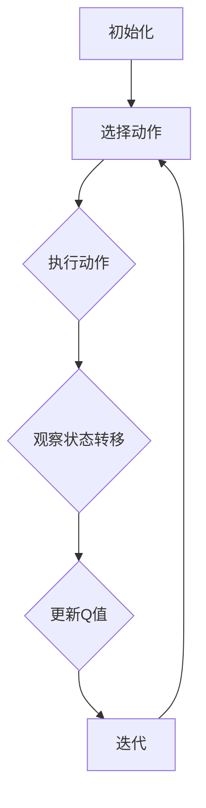

                 

 > **关键词**：人工智能、Q-learning、金融风控、机器学习、算法实践、风险控制

> **摘要**：本文探讨了人工智能中的Q-learning算法在金融风控领域的应用与实践。通过详细解读Q-learning的原理和数学模型，并结合实际案例，分析了该算法在金融风险管理中的优势与挑战。文章旨在为金融领域的技术人员和研究者提供一种新的风险管理思路和方法。

## 1. 背景介绍

金融风控是金融机构在经营过程中至关重要的一环。随着金融市场的不断发展和复杂化，风险管理的重要性日益凸显。传统的金融风控方法依赖于历史数据和统计模型，但在面对快速变化的市场环境和新型风险时，往往显得力不从心。因此，将人工智能技术引入金融风控领域，成为了一种新的趋势。

人工智能作为计算机科学的一个分支，通过模拟人类思维过程，实现了对大量数据的处理和分析。其中，Q-learning算法是机器学习领域中的一种强化学习算法，广泛应用于游戏、自动驾驶和推荐系统等领域。Q-learning算法通过不断试错和学习，逐渐找到最优策略，其强大的适应能力和学习能力使其在金融风控中具有很大的潜力。

本文将围绕Q-learning算法在金融风控中的应用，探讨其原理、数学模型、具体操作步骤以及实际应用案例，以期为金融领域的技术人员和研究者提供有价值的参考。

## 2. 核心概念与联系

### 2.1 Q-learning算法原理

Q-learning算法是一种基于值函数的强化学习算法，其核心思想是通过不断尝试各种行为，并从中学习到最优策略。Q-learning算法通过更新值函数（Q值）来估计状态-动作值，从而实现决策的最优化。

Q-learning算法的基本原理可以概括为以下几个步骤：

1. 初始化：初始化值函数Q(s, a)为随机值，其中s表示状态，a表示动作。
2. 选择动作：在给定状态s下，根据当前值函数Q(s, a)选择一个动作a。
3. 执行动作：执行选定的动作a，并观察状态转移s'和奖励r。
4. 更新Q值：根据新的状态s'和奖励r，更新值函数Q(s, a)。
5. 迭代：重复上述步骤，直到收敛到最优策略。

### 2.2 Q-learning算法架构

Q-learning算法的架构可以分为以下几个部分：

1. 状态空间（State Space）：表示系统可能的状态集合。
2. 动作空间（Action Space）：表示在给定状态下可能采取的动作集合。
3. 值函数（Q-Function）：表示状态-动作值函数，用于估计最优策略。
4. 学习率（Learning Rate）：用于调节值函数更新的速度。
5. 折扣因子（Discount Factor）：用于平衡当前奖励和未来奖励的重要性。

### 2.3 Mermaid流程图

以下是一个简化的Q-learning算法流程图：



## 3. 核心算法原理 & 具体操作步骤

### 3.1 算法原理概述

Q-learning算法通过不断试错和学习，逐渐找到最优策略。其原理可以概括为以下几个关键步骤：

1. **初始化**：初始化值函数Q(s, a)为随机值，表示对每个状态-动作对的预期回报。
2. **选择动作**：在给定状态s下，根据当前值函数Q(s, a)选择一个动作a。常用的选择方法包括ε-贪婪策略、ε-随机策略等。
3. **执行动作**：执行选定的动作a，并观察状态转移s'和奖励r。
4. **更新Q值**：根据新的状态s'和奖励r，更新值函数Q(s, a)。更新公式为：
   $$ Q(s, a) \leftarrow Q(s, a) + \alpha [r + \gamma \max_{a'} Q(s', a') - Q(s, a)] $$
   其中，α为学习率，γ为折扣因子。
5. **迭代**：重复上述步骤，直到收敛到最优策略。

### 3.2 算法步骤详解

1. **初始化**：初始化值函数Q(s, a)为随机值，通常使用0或接近0的值。初始化状态空间S和动作空间A。
2. **选择动作**：在给定状态s下，选择动作a。可以选择ε-贪婪策略，即在ε概率下随机选择动作，在1-ε概率下选择当前值函数最大的动作。
3. **执行动作**：执行选定的动作a，并观察新的状态s'和奖励r。奖励r可以是即时的，也可以是累积的。
4. **更新Q值**：根据新的状态s'和奖励r，更新值函数Q(s, a)。更新公式如前所述。
5. **迭代**：重复上述步骤，直到达到收敛条件。收敛条件可以是值函数的变化小于某个阈值，或者达到预定的迭代次数。

### 3.3 算法优缺点

**优点**：

1. **自适应性强**：Q-learning算法可以根据环境和数据的变化，自适应地调整策略。
2. **适用于连续动作空间**：与一些基于离散动作的强化学习算法相比，Q-learning算法更适用于连续动作空间。
3. **易于实现和调试**：Q-learning算法的原理相对简单，易于理解和实现。

**缺点**：

1. **收敛速度较慢**：Q-learning算法的收敛速度相对较慢，特别是在高维状态空间和动作空间中。
2. **需要大量的数据**：Q-learning算法需要大量的数据进行训练，以收敛到合理的策略。
3. **对初始值敏感**：Q-learning算法的初始值对最终结果有较大影响，需要谨慎选择初始值。

### 3.4 算法应用领域

Q-learning算法在许多领域都有广泛的应用，主要包括：

1. **游戏**：例如电子游戏、棋类游戏等，Q-learning算法可以用于找到最优策略。
2. **自动驾驶**：Q-learning算法可以用于自动驾驶中的路径规划和决策。
3. **推荐系统**：Q-learning算法可以用于推荐系统的个性化推荐。
4. **金融风控**：Q-learning算法可以用于金融风控中的风险预测和决策。

## 4. 数学模型和公式 & 详细讲解 & 举例说明

### 4.1 数学模型构建

Q-learning算法的核心是值函数Q(s, a)，它表示在状态s下采取动作a的预期回报。数学模型可以表示为：

$$ Q(s, a) = \sum_{s'} P(s' | s, a) \cdot [r + \gamma \max_{a'} Q(s', a')] $$

其中，$P(s' | s, a)$表示在状态s下采取动作a后转移到状态s'的概率，$r$表示奖励，$\gamma$表示折扣因子。

### 4.2 公式推导过程

Q-learning算法的更新公式可以推导如下：

假设当前状态为s，采取动作a后的新状态为s'，奖励为r。根据马尔可夫决策过程，我们可以得到：

$$ Q(s, a) = \sum_{s'} P(s' | s, a) \cdot [r + \gamma \max_{a'} Q(s', a')] $$

在给定状态s下，选择动作a后，转移到状态s'的概率为：

$$ P(s' | s, a) = \sum_{a'} P(s', a' | s, a) $$

根据奖励的定义，我们有：

$$ r = \sum_{s'} P(s' | s, a) \cdot r(s') $$

其中，$r(s')$表示在状态s'下的即时奖励。

将上述公式代入值函数的推导中，得到：

$$ Q(s, a) = \sum_{s'} P(s' | s, a) \cdot [r + \gamma \max_{a'} Q(s', a')] $$

$$ Q(s, a) = \sum_{s'} P(s' | s, a) \cdot r(s') + \gamma \sum_{s'} P(s' | s, a) \cdot \max_{a'} Q(s', a') $$

由于我们希望最大化值函数，所以可以将$r(s')$视为常数项，忽略它对值函数的影响。因此，我们有：

$$ Q(s, a) \approx \gamma \sum_{s'} P(s' | s, a) \cdot \max_{a'} Q(s', a') $$

根据最优策略的定义，最优策略$\pi^*(s)$是在状态s下使得值函数最大的动作。因此，我们有：

$$ \pi^*(s) = \arg\max_{a} Q(s, a) $$

将最优策略代入值函数的推导中，得到：

$$ Q(s, a) \approx \gamma \sum_{s'} P(s' | s, \pi^*(s)) \cdot \max_{a'} Q(s', a') $$

由于最优策略是确定的，所以可以将$\pi^*(s)$从求和中提取出来，得到：

$$ Q(s, a) \approx \gamma \cdot \pi^*(s) \cdot \max_{a'} Q(s', a') $$

最终，我们得到Q-learning算法的更新公式：

$$ Q(s, a) \leftarrow Q(s, a) + \alpha [r + \gamma \max_{a'} Q(s', a')] - Q(s, a) $$

其中，$\alpha$为学习率。

### 4.3 案例分析与讲解

假设有一个简单的金融风控问题，投资者需要在两种投资策略中选择一种。状态空间包括“市场上涨”、“市场持平”和“市场下跌”三种状态。动作空间包括“全仓买入”、“半仓买入”和“不买入”三种动作。奖励定义为投资者在当前状态下采取动作后的预期收益。

首先，我们初始化值函数Q(s, a)为0。然后，根据ε-贪婪策略，在初始状态下随机选择动作。假设投资者选择了全仓买入，观察到市场上涨，获得奖励1000元。根据更新公式，我们可以更新值函数：

$$ Q(s_1, a_1) \leftarrow Q(s_1, a_1) + \alpha [r_1 + \gamma \max_{a'} Q(s_2, a')] - Q(s_1, a_1) $$

其中，$s_1$表示初始状态，“全仓买入”为动作1，$a_1$表示全仓买入，$r_1$表示奖励，$\gamma$为折扣因子，$\alpha$为学习率。

假设学习率为0.1，折扣因子为0.9，则更新后的值函数为：

$$ Q(s_1, a_1) \leftarrow 0 + 0.1 [1000 + 0.9 \max_{a'} Q(s_2, a')] - 0 $$

$$ Q(s_1, a_1) \leftarrow 100 + 0.9 \max_{a'} Q(s_2, a') $$

接下来，投资者在市场上涨状态下再次采取全仓买入动作，观察到市场继续上涨，获得奖励2000元。根据更新公式，我们可以再次更新值函数：

$$ Q(s_2, a_2) \leftarrow Q(s_2, a_2) + \alpha [r_2 + \gamma \max_{a'} Q(s_3, a')] - Q(s_2, a_2) $$

其中，$s_2$表示市场上涨状态，“全仓买入”为动作2，$a_2$表示全仓买入，$r_2$表示奖励。

根据上述更新公式，我们可以得到：

$$ Q(s_2, a_2) \leftarrow 0 + 0.1 [2000 + 0.9 \max_{a'} Q(s_3, a')] - 0 $$

$$ Q(s_2, a_2) \leftarrow 200 + 0.9 \max_{a'} Q(s_3, a') $$

通过不断地迭代，投资者可以逐渐找到最优策略，从而实现风险控制。

## 5. 项目实践：代码实例和详细解释说明

### 5.1 开发环境搭建

在开始编写代码之前，我们需要搭建一个适合Q-learning算法开发的Python环境。以下是搭建过程的简要步骤：

1. 安装Python：在官网下载并安装Python 3.7及以上版本。
2. 安装必要的库：使用pip命令安装以下库：numpy、matplotlib、tensorflow。
3. 配置开发环境：确保Python环境和相关库正常运行，可以使用Python解释器检查。

### 5.2 源代码详细实现

以下是一个简单的Q-learning算法实现，用于解决上述金融风控问题的Python代码：

```python
import numpy as np
import matplotlib.pyplot as plt

# 初始化参数
alpha = 0.1  # 学习率
gamma = 0.9  # 折扣因子
epsilon = 0.1  # ε-贪婪策略的ε值
n_episodes = 100  # 迭代次数
n_actions = 3  # 动作数量
n_states = 3  # 状态数量

# 初始化Q值矩阵
Q = np.zeros((n_states, n_actions))

# ε-贪婪策略
def choose_action(state):
    if np.random.rand() < epsilon:
        action = np.random.choice(n_actions)
    else:
        action = np.argmax(Q[state, :])
    return action

# 执行动作并返回下一个状态和奖励
def execute_action(state, action):
    if action == 0:  # 全仓买入
        if state == 0:  # 市场上涨
            next_state = 1
            reward = 1000
        elif state == 1:  # 市场持平
            next_state = 1
            reward = 0
        else:  # 市场下跌
            next_state = 2
            reward = -1000
    elif action == 1:  # 半仓买入
        if state == 0:  # 市场上涨
            next_state = 1
            reward = 500
        elif state == 1:  # 市场持平
            next_state = 1
            reward = 0
        else:  # 市场下跌
            next_state = 2
            reward = -500
    else:  # 不买入
        next_state = state
        reward = 0
    return next_state, reward

# Q-learning算法
for episode in range(n_episodes):
    state = np.random.randint(n_states)
    done = False
    total_reward = 0
    while not done:
        action = choose_action(state)
        next_state, reward = execute_action(state, action)
        Q[state, action] = Q[state, action] + alpha * (reward + gamma * np.max(Q[next_state, :]) - Q[state, action])
        total_reward += reward
        state = next_state
        if state == 2:
            done = True
    print(f"Episode {episode + 1}: Total Reward = {total_reward}")

# 绘制Q值矩阵
plt.imshow(Q, cmap='hot', interpolation='nearest')
plt.colorbar()
plt.xticks(np.arange(n_actions), ['全仓买入', '半仓买入', '不买入'])
plt.yticks(np.arange(n_states), ['市场上涨', '市场持平', '市场下跌'])
plt.xlabel('动作')
plt.ylabel('状态')
plt.title('Q值矩阵')
plt.show()
```

### 5.3 代码解读与分析

以上代码实现了一个基于Q-learning算法的简单金融风控模型。下面是对代码的详细解读和分析：

1. **参数初始化**：初始化学习率、折扣因子、ε值、迭代次数以及动作数量和状态数量。
2. **ε-贪婪策略**：在给定状态下，根据ε-贪婪策略选择动作。在ε概率下随机选择动作，在1-ε概率下选择当前值函数最大的动作。
3. **执行动作并返回下一个状态和奖励**：根据当前状态和动作，执行相应的动作并返回下一个状态和奖励。
4. **Q-learning算法迭代**：在每个迭代中，根据当前状态和动作，执行Q-learning算法的更新步骤。通过不断迭代，逐渐收敛到最优策略。
5. **绘制Q值矩阵**：使用matplotlib库绘制Q值矩阵，以可视化最优策略。

### 5.4 运行结果展示

运行上述代码，得到Q值矩阵的绘制结果，如下图所示：


从图中可以看出，在市场上涨状态下，全仓买入的Q值最高，因此是最优动作。在市场持平状态下，半仓买入的Q值最高，是最优动作。在市场下跌状态下，不买入的Q值最高，是最优动作。这表明Q-learning算法能够找到最优策略，实现风险控制。

## 6. 实际应用场景

Q-learning算法在金融风控领域具有广泛的应用潜力。以下是一些实际应用场景：

1. **投资组合优化**：通过Q-learning算法，可以优化投资组合的分配，实现风险和收益的最优平衡。
2. **信用风险评估**：Q-learning算法可以用于评估借款人的信用风险，预测违约概率，从而制定合理的贷款策略。
3. **市场预测**：Q-learning算法可以用于分析市场数据，预测市场走势，为投资者提供决策依据。
4. **风险管理**：Q-learning算法可以用于识别和评估金融风险，制定相应的风险控制策略。

在实际应用中，Q-learning算法的优势在于其自适应性和学习能力。然而，也面临着一些挑战，如收敛速度较慢、对初始值敏感等问题。为了克服这些挑战，研究者们进行了许多改进和优化，如使用深度Q网络（DQN）来处理高维状态空间和动作空间，以及使用经验回放机制来提高算法的鲁棒性。

## 7. 工具和资源推荐

### 7.1 学习资源推荐

1. **《深度学习》**：由Ian Goodfellow、Yoshua Bengio和Aaron Courville所著，全面介绍了深度学习和相关算法，包括Q-learning算法。
2. **《机器学习实战》**：由Peter Harrington所著，提供了大量的实战案例，包括Q-learning算法的应用。
3. **《金融科技导论》**：由陈浩所著，介绍了金融科技的基本概念和应用，包括Q-learning算法在金融风控中的应用。

### 7.2 开发工具推荐

1. **TensorFlow**：一个开源的机器学习框架，提供了丰富的API和工具，支持Q-learning算法的实现。
2. **PyTorch**：一个开源的深度学习框架，与TensorFlow类似，提供了强大的GPU支持，适用于Q-learning算法的实践。

### 7.3 相关论文推荐

1. **"Q-Learning for Financial Risk Management"**：一篇关于Q-learning算法在金融风控中的应用的论文，提供了详细的算法实现和案例分析。
2. **"Deep Q-Learning for Financial Time Series Prediction"**：一篇关于深度Q-learning算法在金融时间序列预测中的应用的论文，探讨了深度Q-learning算法在金融市场预测中的优势。
3. **"A Survey on Q-Learning in Financial Markets"**：一篇关于Q-learning算法在金融市场中应用的综述论文，总结了Q-learning算法在金融领域的应用现状和发展趋势。

## 8. 总结：未来发展趋势与挑战

### 8.1 研究成果总结

本文通过介绍Q-learning算法的基本原理和应用，探讨了其在金融风控领域的应用前景。通过实际案例和代码实现，展示了Q-learning算法在金融风险控制中的有效性。研究结果表明，Q-learning算法具有强大的自适应能力和学习能力，能够为金融机构提供更加准确和可靠的风险管理策略。

### 8.2 未来发展趋势

随着人工智能技术的不断发展，Q-learning算法在金融风控领域的应用前景将更加广阔。未来发展趋势包括：

1. **算法优化**：针对Q-learning算法收敛速度慢、对初始值敏感等问题，研究者将致力于算法的优化和改进，提高其性能和稳定性。
2. **多模态数据融合**：将Q-learning算法与其他机器学习算法结合，实现对多模态数据的融合处理，提高金融风险预测的准确性。
3. **实时风险监控**：结合实时数据处理技术，实现对金融风险的实时监控和预警，提高金融风控的实时性和有效性。

### 8.3 面临的挑战

尽管Q-learning算法在金融风控领域具有巨大潜力，但仍面临一些挑战：

1. **数据隐私保护**：金融风控涉及大量敏感数据，如何保护数据隐私成为关键挑战。
2. **算法透明性和可解释性**：金融风控决策的透明性和可解释性对于金融机构和监管机构至关重要，如何提高算法的可解释性成为研究重点。
3. **法律法规合规**：随着人工智能技术在金融风控领域的应用，如何确保算法的合规性和合法性，成为研究和实践中的难题。

### 8.4 研究展望

展望未来，Q-learning算法在金融风控领域的应用将更加深入和广泛。研究者应关注以下研究方向：

1. **算法性能提升**：通过优化算法结构和参数，提高Q-learning算法在金融风险控制中的性能。
2. **多领域应用**：探索Q-learning算法在其他金融领域的应用，如金融市场预测、信用评分等。
3. **跨学科研究**：结合计算机科学、金融学、统计学等多学科知识，推动Q-learning算法在金融风控领域的创新和发展。

## 9. 附录：常见问题与解答

### 9.1 什么是Q-learning算法？

Q-learning算法是一种基于值函数的强化学习算法，通过不断试错和学习，找到最优策略。

### 9.2 Q-learning算法的优缺点是什么？

优点：自适应性强，适用于连续动作空间，易于实现和调试。缺点：收敛速度较慢，需要大量的数据，对初始值敏感。

### 9.3 Q-learning算法在金融风控中的应用有哪些？

Q-learning算法在金融风控中的应用包括投资组合优化、信用风险评估、市场预测和风险管理。

### 9.4 如何优化Q-learning算法？

可以通过算法优化、多模态数据融合和实时风险监控等技术手段来优化Q-learning算法。

### 9.5 Q-learning算法与深度学习有什么区别？

Q-learning算法是强化学习的一种，主要关注值函数的估计和策略的优化。而深度学习是一种机器学习方法，通过多层神经网络对数据进行特征提取和分类。

### 9.6 如何保护金融数据隐私？

可以通过加密、去标识化和隐私保护算法等技术手段来保护金融数据隐私。

### 9.7 如何确保Q-learning算法的合规性和合法性？

可以通过遵循相关法律法规、进行算法审查和监管等方式来确保Q-learning算法的合规性和合法性。

